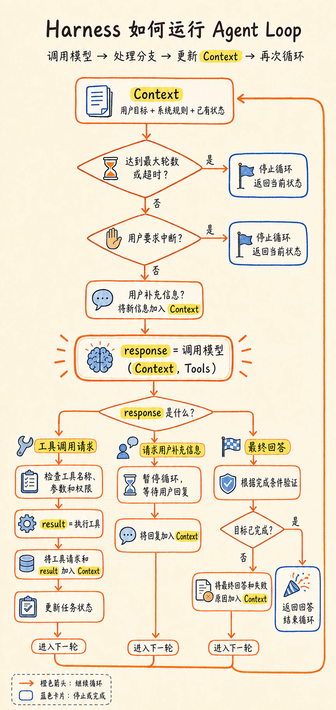

# 你不知道的大模型-Agent

\#个人文章库

> **导读**
> 
> 大模型会回答，不等于会完成任务。这篇文章从 Agent Loop 出发，逐步拆开 Tool、Planning、Memory、Workflow、MCP、Skill、Hook 和 Harness，最后把它们放回同一套 Agent 系统中。
> 
> **阅读路线**
> 
> 1. 为什么需要 Agent；

1. Agent Loop 怎样让任务持续推进；
1. Tool、Planning 和 Memory 分别补上什么；
1. Workflow、MCP、Skill 和 Hook 怎样组织这些能力；
1. Harness、权限和验证机制怎样让系统真正运行。

## 第一章：从会回答到会做事

拿这篇文章来说，如果我对大模型说：“帮我写一篇介绍 Agent 的文章。”

几秒钟后，它就能生成一篇看起来完整的正文。但生成文字，只是写文章的其中一步。生成一篇文章和真正完成一篇文章，其实是两件不同的事情：

```text
普通对话：提出要求 → 模型生成文章 → 返回回答 → 结束

真实写作：确定主题 → 阅读前文 → 查找资料 → 判断资料是否可信
          → 整理结构 → 写初稿 → 修改 → 保存 → 发布
```

在普通对话模式下，大模型已经可以参与真实写作中的很多步骤。可以让它列提纲、改句子，也可以把一份资料发给它总结。但每次交互仍然是一轮输入和输出：提出一个问题，模型生成一个回答。这一轮结束以后，是否继续、下一步做什么，仍然需要重新发起。

而真实任务不会一直按照最初设想往下进行。查资料时发现两个来源说法不一致，需要继续核实；写到一半发现一个概念前面已经讲过，需要回头调整结构；准备发布时，还要检查文件是否保存、链接能不能打开。

前一步得到的结果，会不断影响下一步。问题不在于大模型能不能完成其中某一步，而在于它能不能根据上一步的结果，参与选择下一步行动，并把整件事继续推进。

Agent 系统要补上的，正是这个过程：

```text
用户提出目标 → 模型根据当前信息选择下一步 → 外部程序执行动作 → 获得反馈
                              ↑                              ↓
                              └──── 更新信息，继续生成下一步 ────┘
```

普通对话主要围绕“生成一个回答”展开，Agent 系统则围绕“完成一个目标”展开。两者的区别，不只是模型一次能写出多少内容，而是系统能不能让模型看到行动结果，再根据新的信息继续推进任务。

> **关键结论**：大模型擅长生成下一步内容，Agent 要解决的是怎样让下一步变成行动，并根据结果继续推进。

不过，大模型本身并没有因此变成另一个物种。模型还是原来的模型，那么 Agent 到底增加了什么？

## 第二章：Agent 不是一种新模型

Agent 并不是一类更聪明的新模型。无论是普通对话还是 Agent，底层的大模型都没有改变：它仍然根据当前看到的 Context，生成接下来的 Token。

区别主要发生在模型外面。在最普通的对话模式里，模型生成一段文字，系统显示给用户，这一轮交互就结束了。

Agent 系统则让模型的输出不只用于生成文字，也可以表示对下一步行动的选择，例如搜索网页、读取文件或运行代码。外部程序执行这个行动，再把真实结果放回 Context，模型才能根据新的信息选择下一步。

如果问：“Agent 为什么能够根据反馈持续做事？”

> **工作原理视角**
> 
> Agent 的基本机制 ≈ 大模型 + Tools + Agent Loop

大模型根据当前 Context 生成对下一步行动的选择；Tools 定义它可以请求哪些外部能力；Agent Loop 则把一次次模型调用、工具行动和返回结果连接起来。这个公式解释的是 Agent 怎样工作，并不是在列一套完整的软件组件。

如果问：“真正的软件系统由什么组成？”

> **软件结构视角**
> 
> Agent 系统 ≈ 大模型 + Agent Harness

Claude Code 的官方文档使用 **Agentic harness** 这一概念，描述包在 Claude 模型外面、负责运行 Agent 的程序层，本文统一称为 **Agent Harness**。

Agent Loop 没有在第二个公式里消失，它由 Harness 运行；Tools 也没有消失，Harness 把它们提供给模型，并把 Tool Call 连接到具体的执行程序。所以，把大模型、Agent Loop、Tools 和 Harness 全部并列相加，反而会出现概念重叠。

模型通过 Tool 看到自己可以请求做什么，外部环境则是事情真正发生的地方，例如网页、文件、数据库和终端。Harness 负责把两者连接起来。这些具体职责留到第九章再展开。

这两个视角描述的是同一套系统，只是本文用来理解 Agent 的方式，不是行业统一的数学定义。

当然，这种行动能力也有边界。模型只能根据当前 Context，在系统提供的工具、权限和停止条件内发起行动请求。它不是得到一个目标以后就可以自由行动，更不是拥有了长期意志。

今天的 ChatGPT、Claude 等产品已经包含不同程度的工具和 Agent 能力，因此普通聊天与 Agent 也不是两类泾渭分明的产品。

归根结底，Agent 不是一种新模型，而是围绕大模型搭建的一套系统。那么，Harness 究竟怎样把一次模型生成，变成可以根据反馈持续推进的任务？

整套机制的中心，就是 Agent Loop。

## 第三章：Agent Loop，整套系统的中心

### 3.1 一次生成为什么会变成多轮循环

大模型的一次生成是有终点的。它收到 Context，生成一段输出，这次调用就结束了。模型不会在调用结束以后继续留在后台，等待搜索结果返回，或者自动开始下一步。

Agent Loop 改变的不是模型本身，而是模型调用结束以后，外部程序如何处理结果、更新 Context，并决定是否进入下一轮调用。一次调用结束时，模型可能直接返回最终回答，也可能输出一个工具调用请求。在很多 Agent 实现中，最基本的循环逻辑都是类似的：

如果模型返回最终回答，当前任务可以准备结束；如果模型请求使用工具，Harness 就处理请求，交给工具执行器，再把结果加入新的 Context，调用下一次模型。

假如目标是：“继续完成这篇 Agent 文章”

第一次调用模型时，Context 里包含写作目标、已有信息和可用 Tools。模型根据这些内容，选择“读取现有草稿”作为下一步 Action（一次具体行动），并输出工具调用请求。

Harness 读取到这个请求以后，调用文件工具。工具返回草稿内容，Harness 再把原来的目标、刚才的工具请求和读取结果一起放进更新后的 Context，开始第二次模型调用。

模型这次看到的信息已经不同，因此可能继续选择“查找官方资料”。

整个过程可以简化成：

```text
第一次调用模型
Context：写作目标 + 可用 Tools
输出：读取现有草稿
        ↓
Harness 协调工具执行，得到草稿内容
        ↓
第二次调用模型
Context：原目标 + 工具请求 + 草稿内容
输出：查找官方资料
        ↓
Harness 协调工具执行，得到搜索结果
        ↓
第三次调用模型
Context：原目标 + 已有过程 + 搜索结果
输出：根据新信息选择下一步 Action
```

从外面看，Agent 像是在连续工作；但从单次模型调用来看，它仍然是一次次有起点和终点的生成。

真正保持连续性的，是 Harness：它保存前面发生的信息，把工具结果带入新的 Context，并决定什么时候再次调用模型。

所以，Agent Loop 并没有让模型获得一种持续运行的思考能力。它只是把：调用模型 → 执行动作 → 更新 Context → 再次调用模型连接起来，让上一轮的结果能够影响下一轮。

不过，这张图只解释了多轮调用是怎样产生的。每一轮里面，Action、Observation、结果验证和停止条件分别发生了什么，还需要继续拆开来看。

### 3.2 Action 和 Observation 怎样推动下一轮

Claude Code 的官方文档把 Agent Loop 概括为三个交织在一起的阶段：Gather Context（收集上下文）、Take Action（采取行动）和 Verify Results（验证结果）。其中，Gather Context 不只发生在任务开始时。工具返回的新结果、用户补充的信息和任务状态的变化，都会让 Context 在循环中不断更新。

为了看清主线，可以先把这三个交织的阶段拉直。站在任务执行的角度，Agent Loop 推进一个任务的过程大致是这样：

```text
目标与当前 Context
        ↓
Gather Context
收集并更新当前信息
        ↓
模型根据 Context
选择并输出下一步 Action
        ↓
系统执行 Action
        ↓
获得 Observation
        ↓
更新 Context 与任务状态
        ↓
Verify Results
        ↓
是否达到完成条件？
   ├── 是：返回结果并停止
   └── 否：回到 Gather Context
```

这张图只是为了呈现主线，不代表系统每轮都严格走完三个阶段。Gather Context、Take Action 和 Verify Results 经常交织在一起，收集信息和验证结果时也可能继续调用工具。有些任务只需要读取信息并回答，有些任务则会在三个阶段之间往返很多次。

Action 是模型根据当前 Context 输出的下一步选择，比如读取文件、搜索网页或请求用户补充信息。它只说明“下一步准备做什么”，并不代表动作已经发生。Harness 还要检查这个请求，再交给对应的工具执行器。

工具执行以后，外部环境会返回 Observation。搜索得到的网页、读取到的文件内容、命令运行后的输出，都是 Observation；执行失败时返回的报错也是。Observation 只记录刚才发生了什么，不保证行动成功，更不表示整个任务已经完成。

Harness 把 Observation 加入 Context，并更新任务状态。下一次调用模型时，这些结果会成为新的判断依据。上一轮读文件失败了，下一轮可以改用别的路径；搜索结果不够可靠，可以继续寻找一手来源；资料已经足够，才进入写作。

不过，把 Observation 放进 Context 还不够。系统还要验证这个结果能不能支持当前目标。Observation 回答“发生了什么”，Verification（验证）回答“这个结果能不能用”，停止条件则回答“任务要不要继续”。

继续写这篇文章时，模型根据当前 Context 选择“搜索 Claude Code 如何工作”作为下一步 Action。工具返回网页内容，这是 Observation。页面来自 Claude 官方，可以确认它是一手资料；其中的内容能否支持“Harness 负责什么”这个判断，还要继续核对。当前说法有了足够证据，只代表资料核对这一步完成了，文章还要经过写作和检查。只有整个目标的完成条件都满足，任务才可以结束。

前面的图站在任务执行的角度，展示 Agent Loop 中反复发生了什么。其中“系统执行 Action”这一格，落到程序里并不是一个简单动作。Harness 还要解析模型输出、执行系统规则，并根据不同结果让循环继续、暂停或结束：



*图 1：这不是另一套 Loop，而是同一套 Agent Loop 落到程序后，Harness 需要处理的控制分支。*

验证可以由模型、测试程序、系统规则或用户完成。

用户也在这个循环里。任务运行过程中，用户可以中断当前行动、调整方向或补充信息。Harness 收到这些变化后，可以停止任务，也可以把新信息加入 Context，再让模型根据更新后的内容选择下一步。

> **Agent Loop 与 Harness**：Agent Loop 描述任务怎样在 Action、Observation 和 Verification 之间循环推进，Harness 则负责把这套循环真正运行起来。

### 3.3 Loop 怎样开始，又在什么时候停止

上面解释了 Agent Loop 内部怎样运转：Context 如何更新，模型如何选择 Action，外部环境怎样返回 Observation，系统又怎样验证结果。

但一套循环真正运行起来，还要回答两个外部问题：

> **启动与停止**：谁来启动它？什么条件下结束？

Agent Loop 内部的基本机制没有因此改变，变化的是循环外部的触发方式和停止条件。Claude Code 团队据此归纳了四种产品实践。它们不是 Agent 领域统一的标准分类，更不是四套完全不同的 Loop。

最常见的是 Turn-based Loop。用户发送一条消息，Agent 开始运行；它可以在这一轮里多次读取文件、调用工具和检查结果，最后返回回答，或者停下来向用户询问信息。下一轮通常要等用户再次输入。这也是我们平时使用 ChatGPT 或 Claude 时最熟悉的方式。

如果任务很长，每一轮都要由人回复一句“继续”就会很麻烦。这时可以提前说明完成条件，例如：

```text
修复登录问题，直到相关测试全部通过，最多尝试 10 轮。
```

系统在每轮结束后检查条件。测试没有通过，就带着失败结果继续；条件满足或达到轮数上限，就停止运行。这是 Goal-based Loop。它的内部仍然是 3.2 的循环，只是在外面增加了更明确的完成条件。Claude Code 的 `/goal` 还会使用独立评估器检查条件是否成立，而不是只听当前执行任务的模型说“已经完成”。

有些任务需要隔一段时间回来检查一次，例如每十分钟查看部署状态，或者每天早上汇总新消息。这是 Time-based Loop。等待期间模型并没有在后台持续思考，真正持续存在的是定时器或调度程序；时间到了，系统才重新启动一次 Agent 任务。

还有些任务不需要用户实时发出命令，而是由外部事件自动触发。例如新建了一条错误报告、有人提交了 Pull Request，或者某个 API 发来通知，系统就启动 Agent 进行处理。Claude Code 团队把这类长期运行、由时间或事件驱动的形式称为 Proactive Loop。长期存在的是外部调度机制，每次被触发后运行的仍然是前面讲过的 Agent Loop。

四种形式放在一起，区别主要是循环由谁触发，以及根据什么停止：


- 形式
- 谁触发
- 根据什么停止
---
- Turn-based
- 用户发送消息
- Agent 返回结果，或等待用户补充信息
---
- Goal-based
- 用户给出目标
- 完成条件满足，或达到轮数、时间等限制
---
- Time-based
- 定时器按间隔启动
- 用户取消，或需要监控的任务结束
---
- Proactive
- 时间、API 或外部事件
- 单次任务完成；长期流程由系统关闭


3.2 的流程图使用“是否达到完成条件”作为出口，所以看起来最接近 Goal-based Loop。但它真正想表达的 Context、Action、Observation 和 Verification，是这些形式都可以使用的内部机制，不是与它们并列的第五种 Loop。

所以，设计 Agent Loop 时，除了考虑怎样行动和获得反馈，还必须提前回答谁来启动、怎样证明完成，以及什么情况下必须停止。

### 3.4 小结

现在再回头看，Agent 能够连续工作，并不是因为模型的一次生成变成了永不停歇的思考。模型仍然是接收一次 Context，生成一次输出，然后结束这次调用。

真正让任务继续的，是 Harness 将模型调用、工具执行和环境反馈连接起来的过程。Harness 解析模型输出，处理 Tool Call，把执行结果作为新的 Observation 放回 Context，再次调用模型。一次次独立的模型调用由此形成 Agent Loop。

在这套循环里，模型负责根据当前 Context 选择并输出下一步 Action，工具负责读取或改变外部环境，Observation 将真实结果带回系统，Verification 判断结果是否满足目标。没有达到完成条件，系统就带着更新后的信息进入下一轮；条件满足、达到限制或需要用户介入，循环就暂停或结束。

所以，Agent Loop 不只是一条“判断 → 行动 → 反馈”的箭头。它还必须回答：

- 谁来启动循环？
- 谁来执行行动？
- 结果怎样回到模型？
- 根据什么条件停止？

> **关键结论**：Agent Loop 没有改变大模型一次生成的本质，而是把模型、工具和外部反馈连接起来，让上一轮的结果能够影响下一轮。

不过，到现在我们仍然把“执行 Action”写成了流程图里的一个方框。模型输出一句“搜索网页”以后，这句话为什么能变成一次真实的搜索？Tool、Function Calling 和 Action 之间又是什么关系？这就是下一章要拆开的部分。

## 第四章：Tool、Function Calling 与 Action

### 4.1 模型提出行动，不等于行动已经发生

上一章里，模型根据当前 Context 选择了下一步 Action：

```text
搜索 Anthropic 关于 Agent 的官方资料
```

看到这句话，我们很容易说“模型正在上网搜索”。但严格来说，此时模型还没有打开网页，也没有向任何网站发出请求。它只是生成了一段表示行动意图的输出。

要让这个 Action 真正发生，模型外部还必须具备对应的能力、执行程序和权限。系统需要能够访问网页，知道怎样发起搜索，并且允许这次操作。缺少其中任何一项，“搜索网页”都只能停留在模型的输出里。

### 4.2 Tool：模型能够看到哪些外部能力

上一节提到，要让“搜索网页”真正发生，系统必须具备相应的外部能力。但模型怎么知道自己可以搜索，而不是只能根据已有知识回答？答案是：系统需要把当前可以使用的能力介绍给模型，这些能力就是 Tools。

例如，系统可以向模型提供搜索网页、读取文件和保存文件等 Tools。模型通常看不到背后的代码，看到的是一份工具说明：

```text
名称：search_web
用途：搜索互联网上的公开资料
需要提供：搜索关键词
可能返回：相关网页的标题、链接和内容
```

这些说明要在模型选择工具前提供给它。工具不多时，系统可以直接把完整说明放入 Context；工具很多时，也可以先提供名称或简短描述，等需要时再加载完整定义。模型看到名称、用途和参数要求后，才能选择是否调用某个 Tool，并生成需要传入的参数。如果说明含糊，模型可能选错工具或填错参数。

### 4.3 Tool Calling：把行动选择变成结构化请求

假设模型已经生成了“搜索资料”这个 Action。它可以输出一句普通文字：我准备搜索 Claude Agent Loop 的官方资料。

我们能够理解这句话，但程序很难只凭自然语言，稳定判断，因此，系统会约定一种程序可以识别的输出格式：

```text
工具名称：search_web
参数：
  query：Claude Agent Loop 官方资料
```

系统通过这种约定，让模型能够输出“调用哪个工具、传入哪些参数”的结构化请求，这个过程通常称为 **Tool Calling**。

在 Claude API 中，这类输出叫 tool_use，其中包含工具名称和输入参数；不同平台的字段名称可能不同，但核心逻辑基本一致。普通文字主要用于人与模型交流，Tool Call 则是提供给程序处理的结构化请求。

Harness 可以根据这个请求找到对应工具，检查参数是否完整、权限是否满足，再决定是否交给工具执行器。需要注意的是，这里仍然只是发出了调用请求，真正的搜索、文件读取或代码执行，还需要由外部工具完成。

不同文档对这一能力有不同命名。有些平台使用 **Function Calling**，强调模型调用一个预定义函数；有些使用 **Tool Calling**，强调模型可以请求更广泛的外部能力。

它们关注的核心是一致的：让模型用程序可以识别的格式，表达要调用什么能力，以及需要传入哪些参数。

### 4.4 Harness 怎样把 Tool Call 变成真实行动

模型输出 Tool Call 以后，接下来由模型外部的系统接手。这里先只看 Harness 作为调度者的一面：

```text
模型输出 Tool Call
        ↓
Harness 检查并调度
        ↓
工具执行器操作外部环境
        ↓
Tool Result 返回
        ↓
Harness 将结果加入 Context
        ↓
Agent Loop 进入下一轮
```

继续以前面的搜索为例。模型输出：

```text
search_web
query: Claude Agent Loop 官方资料
```

这只是一次工具调用请求。Harness 会先确认：

- 这个工具是否存在；
- 参数格式是否正确；
- 当前是否允许执行该操作。

检查通过后，请求才会交给对应的工具执行器。搜索工具访问真实网页，并返回标题、链接或页面内容，这些返回结果就是 Tool Result。Harness 收到 Tool Result 后，会把它加入 Context。对于下一轮模型来说，这些内容就是 Observation。模型可以据此继续阅读、调整搜索方向，或者判断当前资料是否已经足够。

需要注意的是，工具执行完成只代表一次 Action 被执行，并不代表整个任务完成。搜索返回网页，不等于资料已经可信；文件读取成功，也不等于文章已经完成。Tool Result 回到 Context 后，Agent Loop 仍然需要继续验证结果，并决定下一步行动。

> **四者的关系**：Agent Loop 决定任务怎样继续，Tool 提供可以请求的外部能力，Tool Calling 将行动请求转换成程序可以识别的格式，Harness 再把请求连接到真实执行。

## 第五章：Planning 怎样让复杂任务一步步推进

### 5.1 Planning 怎样为任务提供方向

Agent Loop 解决的是任务怎样持续运行，但持续运行不代表方向正确。如果每一轮只围绕眼前的结果选择下一步，而没有对照整体目标和当前进度，Agent 可能反复搜索、修改无关内容，或者逐渐偏离最初目标。

这就需要 Planning：

> **Planning**：模型根据目标、当前任务状态和可用行动，安排任务推进方向的过程。

不过，Planning 不等于提前列出一份固定计划，再严格按照步骤执行。Agent 不一定要提前知道完整路线。

Planning 可以同时发生在两个粒度。一方面，Agent 保留任务的大致方向：

```text
阅读前文 → 查找资料 → 写正文 → 检查
```

另一方面，它根据当前状态选择眼前最合理的一步。比如现在还不清楚 Harness 的定义，下一步就先查官方资料，查完以后再根据结果决定具体怎么做。

整体方向回答“这件事大概要怎样完成”，眼前一步回答“现在接下来做什么”。两者可以同时存在。关键不在于计划写得多详细，而在于下一步 Action 是否仍然围绕目标和当前进度展开。

### 5.2 为什么计划需要随着结果调整

计划是根据当前任务状态做出的，但一次 Action 带回的 Observation，可能会改变这个状态。原来的计划也就不一定还适用。

```text
原计划：查资料 → 写正文

查资料后发现定义冲突
        ↓
增加核实步骤
        ↓
调整文章结构
        ↓
再继续写正文
```

如果 Agent 仍然机械执行原计划，就可能把没有确认的说法直接写进文章。更合理的做法，是先保留“完成文章”这个目标，再根据新的结果调整后续 Action。

计划太细，容易被任务开始时并不准确的判断绑住；完全没有计划，又容易只顾眼前结果，逐渐偏离目标。Planning 要做的是在两者之间保持平衡。

因此，复杂任务不只要知道最终目标，还要持续更新当前进度、尚未解决的问题和完成条件。Observation 改变了这些状态，后续计划也应该跟着调整。

这里的 Planning 不等于提示词篇讲过的 CoT。CoT 主要组织模型如何展开当前问题的推理，Planning 组织的则是 Agent 接下来准备采取哪些行动。CoT 可以帮助模型产生计划，Planning 也可以在一次模型调用中形成，再随着多轮 Observation 不断调整。两者的区别在于组织的对象，不在于是否跨越多轮。

> **关键结论**：Planning 为任务提供方向，Observation 决定计划是否需要调整。

## 第六章：Memory 怎样保存以后还会用到的信息

### 6.1 为什么不能把所有信息一直放在 Context 里

上一章提到，Planning 需要根据当前任务状态不断调整。但 Agent Loop 每运行一轮，都会产生新的信息。搜索结果、工具输出、报错、中间版本和用户补充的要求，都可能进入 Context。任务越长，需要处理的信息越多。

问题不只是 Context Window 的容量限制。即使没有达到最大长度，过期、重复或无关的信息也可能降低当前信息的有效性，让模型难以区分哪些内容真正影响下一步行动。

任务刚开始时，Harness 可以直接累加新的消息和工具结果。但长任务不能无限地把每一轮内容原样累加下去。Harness 需要保留当前目标、最新状态和关键约束，必要时压缩已经完成的过程，并把暂时无关的内容移出当前 Context。至于这些内容应该丢弃、归档还是作为 Memory 保存，下一节再继续解释。

可以把 Context 理解成当前工作的桌面。桌面空间再大，也不应该堆满已经失效、互相冲突或暂时用不到的材料。Context 管理不能保证模型一定选对下一步，但可以减少无关信息的干扰，让当前真正重要的内容更清楚。

### 6.2 Memory 到底保存什么

Memory 要解决的，不是所有旧信息放在哪里，而是哪些信息值得保留下来，并在以后需要时重新提供给模型。

先把当前任务状态分出来。任务目标、已经完成的步骤、尚未解决的问题和验证结果，通常由 Session 或任务状态管理。它们也需要保存，但不用全部算作本文所说的 Memory。

Memory 主要保存两类内容。一类是当前 Context 暂时用不到，但后面仍可能影响判断的历史信息，比如已经尝试过的方案、重要的工具结果和之前作出的决定。另一类是跨任务仍然有效的长期信息，比如用户偏好、项目规则、稳定事实和经过确认的经验。

这些内容可以保存在文件、数据库或其他外部存储中。存储位置不是关键，重要的是系统能够在以后需要时把相关信息找回来。

> **Memory**：由外部系统保存以后可能还会用到的信息，并在需要时把相关内容重新放入 Context。它不是让模型永远记住一切。

### 6.3 Memory 保存的信息怎样重新被模型使用

信息被保存下来，不代表模型当前就能使用它。Session 保存这次连续对话或任务的记录与状态，Memory 保存以后可能重新取回的信息。模型当前实际看到的只有 Context，因此，Session 或 Memory 中的信息都需要先被系统选中，再放入当前 Context。

这条链路大致是：

```text
Session 或 Memory 中保存的信息
        ↓
系统根据规则、用户要求或模型请求加载相关内容
        ↓
Harness 将它们与系统规则、最近消息和工具说明
一起组装成 Context
        ↓
模型根据当前 Context 选择下一步 Action
```

有些信息会按照固定规则自动加入 Context，例如项目规则和用户偏好；有些信息需要根据当前任务检索，或者由模型调用工具读取。加载方式可以不同，只有最终进入 Context 的内容，才会影响模型这一轮的生成。

Memory 负责保存以后可能再次使用的信息，Context 承载模型当前需要的信息，Harness 在运行过程中把二者连接起来。

但信息和任务状态准备好以后，任务接下来走哪一步，是由程序事先安排，还是要根据执行结果动态判断？这就是下一章要讨论的 Workflow 与 Agent。

## 第七章：Workflow 与 Agent：下一步由谁决定

### 7.1 Workflow 是什么

Workflow 是由程序预先安排执行步骤和分支的一套流程。比如，一段会议录音上传以后，系统按照下面的顺序处理：

```text
接收录音 → 转成文字 → 调用模型生成摘要 → 保存文件 → 发送通知
```

这条流程用到了模型，也用到了文件和通知工具，但步骤之间的连接关系已经由程序提前确定。

模型可以负责理解内容和生成摘要，但它不负责决定整条流程接下来往哪里走。即使模型发现摘要内容存在疑问，只要程序没有预先设计“查找资料”或“询问用户”的分支，这些行动就不会自动发生。

因此，一个系统即使能够连续执行多个步骤、调用大模型和多种工具，也不一定是 Agent。在 Workflow 中，模型负责完成流程中的某个环节，程序负责决定下一步执行什么。

### 7.2 Workflow 和 Agent 有什么区别

两者可以这样区分：


- 
- **Workflow**
- **Agent**
---
- 谁选择下一步
- 程序按照预设流程推进
- 模型根据当前状态动态选择
---
- 路线怎样变化
- 只能沿程序预设的条件和分支变化
- 新的 Observation 可能改变后续 Action
---
- 适合什么任务
- 步骤稳定、边界清楚
- 路径难以提前确定，需要动态判断


例如，处理会议录音的 Workflow 会按照“转写、摘要、保存、通知”的固定顺序运行。即使摘要中出现不确定信息，只要程序没有设置其他分支，流程仍会继续执行。

而在 Agent 中，模型看到新的 Observation 后，可能选择继续处理、调用其他工具、调整计划，或者向用户补充提问。下一步并不是由程序预先完全写死的。

Workflow 由程序预先安排执行路线，Agent 由模型在程序设定的边界内，根据当前状态选择下一步。

### 7.3 什么时候用 Workflow，什么时候用 Agent

选择 Workflow 还是 Agent，主要看两个问题：**任务路线能不能提前确定，结果有没有明确依据可以验证。**

路线稳定时，程序可以直接安排步骤和分支，通常没有必要让模型临场选择。路线难以提前确定，需要根据外部反馈不断调整时，Agent 才能发挥作用。

结果能否验证也很重要。验证困难并不代表更适合 Agent，反而意味着模型走错以后更难被发现。此时需要缩小 Agent 的行动范围，增加程序检查或人工判断。


- **任务特点**
- **更合适的方式**
---
- 路线稳定，结果容易验证
- Workflow
---
- 路线稳定，但结果依赖主观判断
- Workflow 执行，模型辅助，人工验收
---
- 路线难以提前确定，但结果能够验证
- Agent，并设置完成条件和行动边界
---
- 路线难以提前确定，结果也难验证
- 限制 Agent 的任务范围，增加检查点和人工判断


是否需要处理文字、图片等非结构化信息，并不是判断标准。如果一次模型调用就能完成提取、分类或摘要，把它放进 Workflow 就够了，不必为此引入 Agent Loop。

Workflow 和 Agent 也不是从低级到高级的升级关系。能够完成任务的结构越简单，运行过程通常越容易理解、测试和检查。只有固定路线无法覆盖任务变化时，才需要增加模型的动态判断。

> **选择原则**：任务路线决定是否需要动态选择，验证条件决定可以把多大范围交给 Agent。

### 7.4 Workflow 和 Agent 如何结合

Workflow 和 Agent 可以沿两个方向组合。

第一种由 Workflow 主导。程序规定整体阶段，在需要动态判断的节点调用 Agent，拿到结果后再进入验证或下一个固定阶段：

```text
固定阶段 → Agent 处理不确定问题 → 程序或用户验证 → 下一固定阶段
```

第二种由 Agent 主导。模型根据当前状态选择下一步，遇到步骤明确的任务时，调用一段固定 Workflow，拿到结果后再继续 Agent Loop：

```text
Agent 选择下一步 → 调用固定 Workflow → 获得结果 → 继续判断
```

无论由哪一层主导，分工原则都相同：能够稳定执行的步骤交给程序，无法提前写死的判断交给 Agent；测试、格式检查和权限校验仍由程序负责，发布、付款和删除等高风险动作则需要用户确认。

Workflow 负责稳定执行，Agent 负责动态判断，两者可以互相调用，而不是彼此替代。

## 第八章：MCP、Skill 与 Hook：Agent 怎样扩展连接、方法和规则

### 8.1 MCP、Skill 和 Hook 分别解决什么问题

第四章讲过，Tool 是系统提供给模型的一项可请求能力。搜索网页、读取文件和发送消息，都可以作为 Tool 提供给 Agent。

但有了 Tool，仍然有三个问题没有解决：

- 外部数据和能力怎样接入不同的 AI 应用；
- Agent 完成某类任务时，应该遵循什么方法；
- 哪些检查和动作必须在特定时机自动执行。

MCP、Skill 和 Hook 分别处理这些问题。


- **概念**
- **主要解决的问题**
---
- Tool
- 模型可以请求执行什么行动
---
- MCP
- 外部数据、提示和工具怎样通过统一协议接入 AI 应用
---
- Skill
- 一类任务的指令、流程和配套资源怎样打包并按需复用
---
- Hook
- 哪些检查或动作需要在特定事件发生时自动触发


Tool 是具体能力，MCP、Skill 和 Hook 则分别处理连接、方法和事件规则。它们解决的是不同层面的问题，不能互相替代。

### 8.2 MCP：外部信息和能力怎样标准化接入

一个 AI 应用可以自己实现网页搜索、文件读取和数据库查询等工具，再让模型通过 Tool Calling 使用它们。但当应用需要连接的外部系统越来越多时，如果每个系统都要单独编写连接和调用逻辑，接入成本就会越来越高。同一项能力换到另一个 AI 应用中，也可能需要重新开发。

MCP（Model Context Protocol）就是为减少这类重复接入工作设计的。它是一套连接 AI 应用与外部系统的开放标准，规定参与者怎样声明能力、交换信息和发起调用。

严格来说，AI 应用是 MCP Host，Host 会为每个 MCP Server 创建一个 MCP Client 来维持连接：

```text
AI 应用（MCP Host）
└── MCP Client ←── 按 MCP 通信 ──→ MCP Server
```

官方文档用 USB-C 接口来类比 MCP：设备不同，只要遵循同一套接口标准，就可以用相似的方式连接。这个类比解释的是标准化连接。[Model Context Protocol 官方文档](https://modelcontextprotocol.io/docs/getting-started/intro)

MCP Server 可以向 AI 应用提供三类核心内容：

- **Tools**：可以被调用的动作；
- **Resources**：可以读取的外部信息；
- **Prompts**：可以复用的交互模板。

因此，把 MCP 理解成“接工具的协议”并不完整。它既可以提供能够调用的 Tools，也可以提供文件、数据库记录等 Resources，还可以提供某类任务需要的 Prompt 模板。

MCP 解决的是 AI 应用与外部系统之间的标准化连接问题，并不改变 Agent Loop 本身。

> **关键结论**：MCP 让不同的外部信息和能力，可以用一套相对统一的方式接入 AI 应用。

### 8.3 Skill：把一类任务的方法和材料打包复用

Skill 是给 Agent 使用的一套可复用做事方法。它把完成某类任务需要的步骤、规则和配套材料组织在一起。

按照 Agent Skills 规范，一个 Skill 以 SKILL.md 为核心，其中写明名称、用途和任务说明，也可以附带脚本、参考资料和模板。

Tool 提供 Agent 可以调用的能力，Skill 则告诉它怎样利用这些能力完成一类任务。比如，文件工具让 Agent 能够读取和修改文档，文档排版 Skill 则可以提供排版步骤、格式要求、检查方法和模板。

### 8.4 Agent 能自己执行，为什么还需要 Hook

Agent 确实可以读取文件、修改内容、运行测试，再根据结果继续处理。但这些行动都需要模型先做出选择：模型根据当前 Context 判断下一步做什么，再输出相应的 Tool Call。这种方式适合需要灵活判断的任务，却不能保证某个步骤每次都会被执行。任务变长、Context 变复杂或模型判断发生变化时，格式检查、安全拦截和日志记录等步骤仍然可能被遗漏。

对于不希望依赖模型主动记得的步骤，可以使用 Hook。

> **Hook**：系统在某个预先约定的时机，自动触发一项处理的机制。

Hook 不是所有 Agent 共用的统一标准，而是 Harness 或具体产品提供的事件扩展机制。有些系统使用回调、中间件或策略引擎完成类似的事，不一定叫 Hook。

它主要包含两个部分：什么时候触发？触发以后做什么？

比如，系统可以规定每次修改 Markdown 文件后，自动运行标点检查：

```text
文件修改完成
        ↓
触发对应的 Hook
        ↓
自动运行标点检查
```

如果只把“修改后检查标点”写进 Prompt 或 Skill，是否执行仍然取决于模型当时有没有选择这一步。换成 Hook 后，只要文件修改事件发生，系统就会自动触发检查，不需要模型决定。

> **Agent 与 Hook**：Agent 根据任务灵活选择下一步，Hook 则让某项处理在指定时机自动发生。

### 8.5 MCP、Skill 和 Hook 怎样配合

MCP、Skill 和 Hook 不需要按照固定顺序依次运行。它们围绕 Agent Loop，分别提供外部连接、任务方法和自动检查。

以生成并发送一份周报为例。

系统可以通过 MCP 接入日历、文档和消息服务，让 Agent 读取本周安排、查找工作记录并发送消息。周报 Skill 则提供资料怎样整理、正文采用什么结构，以及发送前需要检查哪些内容。

Agent 根据当前任务和 Skill 提供的方法，在 Loop 中选择下一步：读取日历、查找文档、生成周报，再根据结果继续修改。这些步骤需要的外部信息和能力，可以通过 MCP 接入。

周报发送前，Hook 自动检查收件人和发送范围，并要求用户确认。这项检查不需要模型主动想起，确认通过后才继续发送。

管理 MCP 连接、加载 Skill、触发 Hook，并让 Agent Loop 持续运行，都需要一层程序系统统一协调。这就是下一章要讲的 Agent Harness。

## 第九章：Agent Harness：是谁让整套系统运行起来

### 9.1 Agent Harness 是什么

前面讲到的 Context、Agent Loop、Tools、Memory、Skill 和 Hook，都需要一层程序系统把它们组织起来。本文把这层系统称为 Agent Harness。

Agent Harness 是围绕大模型搭建的程序系统，负责准备 Context、运行 Agent Loop、处理 Tool Call，并管理任务状态和运行边界。

以 Claude Code 为例，接入的大模型负责理解任务并选择下一步，Claude Code 则是运行在模型外部的 Harness。它把项目文件、命令行等能力提供给模型，管理每轮模型能够看到的 Context，并接收模型生成的 Tool Call，将其转换成真正的操作。

Harness 不是模型，也不是某一个 Tool。模型根据当前 Context 选择下一步；Tool 提供一项可以调用的能力；Harness 则把模型、Tools 和外部环境连接起来，让任务能够按照下面的方式持续推进：

```text
准备 Context
      ↓
调用模型
      ↓
接收 Action 或 Tool Call
      ↓
交给工具执行器，收回结果
      ↓
更新状态和 Context
      ↓
进入下一轮
```

Agent Loop 是 Harness 的核心运行机制，但 Harness 不只负责循环。它还要管理 Context、Session、任务状态、工具调用与执行结果、权限限制和停止条件，MCP、Skill 与 Hook 等机制也需要由它加载或协调。

Agent Harness 目前并没有统一的协议或固定边界。不同产品可能采用不同的内部结构，本文所说的 Harness，指的就是**负责组织这些组件并让 Agent 持续运行的程序系统**。

> **三者的分工**：模型负责选择下一步，Tool 提供具体能力，Harness 负责把这个选择连接到真实执行，并把结果带回下一轮。

### 9.2 Harness 怎样运行一次任务

Harness 接到任务以后，会先读取当前 Session 和任务状态，再把系统规则、用户目标、相关信息和可用 Tools 组装成这一轮的 Context。Memory 和 Skill 不一定每次都加载，是否使用可以由系统规则、用户要求或模型请求触发，Harness 负责执行相应的加载和组装。

```text
接收任务
    ↓
读取 Session 与任务状态
    ↓
按需取回 Memory、加载 Skill
    ↓
组装 Context，提供可用 Tools
    ↓
调用模型
    ↓
处理模型输出
    ├── Tool Call：检查工具、参数和 Permission
    │                 ↓
    │            交给工具执行器
    │                 ↓
    │       回收结果，更新 Context 和状态
    │                 ↓
    │              进入下一轮
    │
    ├── 需要用户输入：暂停等待
    │
    └── 最终回答：进行必要的 Verification
                      ├── 通过：结束任务
                      └── 未通过：进入下一轮
```

模型负责根据 Context 选择是否请求 Tool。Harness 接收 Tool Call，检查工具、参数和 Permission，再把请求交给内置工具、MCP Server 或其他工具执行器。执行结果返回以后，Harness 更新 Context 和任务状态，并根据需要再次调用模型。

运行过程中，Harness 还会在相应事件上触发 Hook，并检查超时、最大轮数和完成条件。根据检查结果，任务可能继续下一轮、暂停等待用户，也可能返回结果并结束。

这张图展示的是 Harness 的主要职责，不表示所有 Agent 都采用完全相同的实现顺序，也不表示这些步骤会在每一轮分别发生。

### 9.3 Harness 和 Agent Loop 有什么区别

Agent Loop 和 Harness 经常一起出现，因为 Harness 负责运行 Loop。但它们描述的不是同一个层面。

Agent Loop 规定了基本逻辑：模型选择 Action，系统获得 Observation，再根据结果进入下一轮。但这套逻辑不会自己调用模型、执行工具或更新 Context。

Harness 是执行这些工作的程序。它按照 Loop 的逻辑调用模型和工具，同时处理 Session、权限、Hook、超时与结果返回。因此，Agent Loop 通常是 Harness 的核心，但 Harness 不只有 Agent Loop。

> **Agent Loop 与 Harness**：没有 Harness，Agent Loop 只是一套运行思路；没有 Agent Loop，Harness 也可能只是一个普通的对话或工具运行程序，无法根据反馈持续推进任务。

Agent Harness 可以让 Agent Loop 真正运行起来，但能够运行不等于结果可靠。工具权限怎样限制、完成条件怎样验证、什么情况下必须暂停并交还给用户，是下一章要讨论的问题。

## 第十章：为什么 Agent 仍然需要人和验证机制

### 10.1 能够执行，为什么不等于可靠

Agent Loop 让模型能够根据反馈不断选择下一步，但每一次选择仍然可能出错。模型可能误解目标、选错 Tool、填写错误参数，也可能把不完整的结果当成任务已经完成。

在多轮循环中，一次错误还可能影响后续判断，并逐渐传播和累积。搜索结果不准确，后续 Planning 可能建立在错误信息上；文件改错以后，新的内容又会作为 Observation 回到 Context，让 Agent 沿着错误状态继续处理。

这就是“能够执行”和“可靠”的区别。能够执行，只说明 Agent 可以通过 Loop 持续采取行动；可靠还要求它的行动没有偏离目标，错误能够被及时发现和纠正，最终结果也能够被检查。

### 10.2 Permission（权限）与 Sandbox（沙箱）：Agent 可以做什么

模型可以选择下一步 Action，但这项行动能不能真正执行，还要看系统允许它做什么。Permission 与 Sandbox 都在限制 Agent 的行动边界，但解决的问题不同。

> **Permission（权限）**：一套决定 Tool Call 是否可以执行的控制机制。
系统可以直接放行，也可以要求用户批准，或者拒绝执行。以 Claude Code 为例，这三类规则分别称为 Allow、Ask 和 Deny。平时在 Claude Code 中看到的“请求批准”，就是系统在执行 Tool Call 前，把决定交给用户。

Permission 由 Harness 或工具运行平台执行，不由模型自己执行。Prompt 中写着“不要删除文件”，仍然只是给模型的指令；权限规则则可以直接阻止删除操作。模型即使生成了相应的 Tool Call，系统也不会执行。

> **Sandbox（沙箱）**：一种隔离的执行环境，用来限制程序能够读写哪些文件、访问哪些网络和使用哪些系统资源。
可以把它理解为系统划定的一块运行区域。即使 Agent 获得了运行命令的权限，这条命令也只能访问沙箱允许的文件、网络和系统资源。

比如，系统允许 Agent 运行测试，但 Sandbox 可以把命令限制在当前项目中，阻止它修改其他目录或访问未经允许的网络。命令启动的其他程序，也会受到相同边界的限制。Claude Code 的沙箱就是通过操作系统级机制限制 Bash 命令及其子进程的文件和网络访问。

Permission 决定“这项行动能不能执行”，Sandbox 决定“执行以后可以影响多大范围”。

### 10.3 Verification（验证）：怎样知道任务真的完成了

Agent 返回“已经完成”，不代表目标真的已经达到。系统还需要根据实际结果进行检查。

> **Verification（验证）**：根据完成条件和可观察证据，判断任务是否真正达标的过程。

完成条件要先说明什么结果算成功，证据则用来证明这个结果已经出现。比如，修复登录问题的完成条件可以是“相关测试全部通过，并且没有破坏原有测试”，对应的证据就是测试程序返回的结果。

验证可以由不同方式完成：

- **确定性检查**：运行测试、查询数据库、比较文件或检查页面状态；
- **模型检查**：让当前模型自检，或者用一次独立的模型调用对照完成条件；
- **人工验收**：检查写作质量、设计效果和其他依赖主观判断的结果。

模型检查只能根据提供给它的信息作出判断，不能凭空知道外部环境发生了什么。如果要验证测试是否通过，系统必须真正运行测试，再把结果交给负责检查的模型。

### 10.4 Stop Condition（停止条件）：Agent 应该在什么时候停止

Agent Loop 不能只等模型自己说“做完了”才结束。系统还要提前规定，出现哪些情况时应该结束或暂停循环。

> **Stop Condition（停止条件）**：用来判断 Agent Loop 是否继续、暂停或结束的一组规则。

目标通过 Verification，是最理想的停止原因。但任务没有完成时，下面这些情况也应该让循环暂停或结束：

- 达到最大轮数、时间或预算限制；
- 工具连续失败，继续重试没有新的进展；
- 缺少必要信息，需要用户补充或作出选择；
- 即将执行高风险操作，需要用户批准；
- 用户主动中断任务。

Verification 和 Stop Condition 回答的问题不同：

```text
Verification：目标达到要求了吗？
Stop Condition：当前循环还应该继续吗？
```

比如，Agent 尝试修复问题 20 轮后，测试仍然没有通过。Verification 的结果是“尚未完成”，但最大轮数已经触发 Stop Condition，Harness 仍然应该停止循环，并返回当前进度和没有解决的问题。

### 10.5 哪些决定必须交还给用户

Agent 不需要每做一步都询问用户。读取资料、运行检查等低风险、可恢复的操作，可以在授权范围内自动完成。需要交还给用户的，是系统无法安全替用户决定的事情。

- 即将发布内容、发送消息、付款、删除数据或执行其他高风险、不可逆的操作；
- 目标存在多种合理解释，不同选择会产生明显不同的结果；
- 涉及质量、价值取舍和最终是否接受等主观判断；
- Agent 多次尝试仍然没有进展，或者下一步已经超出原来的授权范围。

“交还给用户”不是让用户接手完成整个任务，而是由 Harness 暂停 Agent Loop，说明已经完成了什么、现在需要决定什么，以及不同选择可能带来什么影响，再等待用户确认。

对于结果可以自动验证的低风险任务，系统可以按照预先规定的条件自动结束。涉及高风险操作、目标歧义或主观取舍时，目标、行动边界与最终验收仍然要交给用户。

## 第十一章：回到完整地图

前面十章拆开讲了 Agent Loop、Planning、Memory、Tools、Workflow、MCP、Skill、Hook 和 Harness。现在把它们放回同一套系统里，就能看到两层关系：Agent 系统由什么组成，以及这些部分怎样围绕一个目标运行。

### 11.1 Agent 系统由什么组成

从软件结构来看，Agent 系统内部可以先分成大模型和 Agent Harness：

```text
Agent（Agent 系统）
├── 大模型
│   └── 理解目标、分析当前信息、Planning、选择下一步 Action
│
└── Agent Harness
    ├── 组装 Context
    ├── 运行 Agent Loop
    ├── 管理 Session、Memory 与任务状态
    ├── 向模型提供可用 Tools
    ├── 接收并处理 Tool Call，交给执行器并回收结果
    ├── 加载 Skill，连接 MCP
    ├── 执行 Permission、Hook 与 Workflow
    ├── 连接或管理 Sandbox 等执行边界
    └── 组织 Verification 和 Stop Condition
            │
            │ 通过 Tools 交互
            ▼
外部环境
├── 文件、网页和数据库
├── 终端与操作系统
└── API 和其他外部服务
```

大模型负责根据当前 Context 判断下一步，并在需要时选择 Tool。Harness 不替模型作出这个选择，而是接收模型生成的 Tool Call，完成检查和调度，再回收执行结果。

外部环境不属于 Agent 系统内部。磁盘上的文件、互联网上的网页和数据库里的记录都真实存在，Agent 只能通过 Tools 读取或改变它们。Tools 是 Agent 能够请求的能力，外部环境则是行动真正发生的地方。Sandbox 不是被操作的外部对象，而是限制工具和程序能够在哪里运行、能够访问什么的执行边界。

### 11.2 一次任务怎样运行

当一个任务真正开始运行时，这些概念会按下面的关系连接起来：

```text
用户目标或其他 Trigger
        ↓
Harness 读取 Session、任务状态和相关 Memory
        ↓
按需加载 Skill，组装 Context，提供可用 Tools
        ↓
调用大模型
        ↓
模型根据当前 Context 判断任务状态，
必要时调整 Planning，并选择下一步 Action
        ↓
需要外部行动时，模型生成 Tool Call
        ↓
Harness 检查 Tool Call 与 Permission，
并交给相应的工具执行器
        ↓
工具执行器操作外部环境，返回 Observation
        ↓
Harness 更新 Context、Session 和任务状态
        ↓
系统进行必要的 Verification，并检查 Stop Condition
   ├── 未完成：进入下一轮 Agent Loop
   ├── 需要确认：暂停并交还用户
   └── 已完成：返回结果并结束
```

这张图展示的是一次任务中的总体关系，不表示每个 Agent 都按照相同的固定流水线运行，也不表示每一步都会在每轮单独发生。

Workflow 可以预先固定部分执行路线，Hook 可以在指定事件发生时自动触发检查。模型只在系统留给它的范围内，选择当前更合适的 Action。

在这套运行过程中，MCP 用来接入外部信息和能力，Skill 提供完成一类任务的方法和材料，Memory 保存以后可能再次使用的信息。它们经过系统按需加载、检索或调用后，参与当前任务。

### 11.3 把概念放回各自的位置


- **概念**
- **在系统中负责什么**
---
- Agent / Agent 系统
- 围绕目标，根据反馈持续选择行动并推进任务的整体系统
---
- 大模型
- 处理当前信息、参与 Planning，并选择下一步 Action
---
- Context
- 模型在当前这次调用中实际看到的内容
---
- Planning
- 根据目标和当前状态安排任务的推进方向
---
- Action
- Agent 当前选择并准备执行的一步
---
- Tool
- Agent 可以请求的一项外部能力
---
- Observation
- 行动执行后返回给 Agent 的结果或反馈
---
- Agent Loop
- 把模型判断、行动执行和结果反馈连接成循环
---
- Agent Harness
- 运行 Agent Loop，管理 Context、Tools、状态和边界的程序层
---
- Session
- 保存一次连续对话或任务的记录与状态
---
- Memory
- 保存以后可能还要取回的重要信息
---
- Workflow
- 由程序预先规定执行步骤和分支的流程
---
- MCP
- 让外部信息和能力通过统一协议接入 AI 应用
---
- Skill
- 把完成一类任务的方法、资料和脚本组织起来
---
- Hook
- 在指定事件发生时，自动触发预设处理
---
- Permission
- 控制一项操作能否执行，以及是否需要用户批准
---
- Sandbox
- 限制程序能够访问的文件、网络和系统资源
---
- Trigger
- 触发一次 Agent 运行开始的事件或条件
---
- Verification
- 根据完成条件和证据，检查过程或结果是否达标
---
- Stop Condition
- 判断 Agent Loop 应该继续、暂停还是结束
---
- 外部环境
- Agent 通过 Tools 观察或改变的真实对象


这些概念可以再压缩成两个视角：

> **工作原理视角**
> 
> Agent 的基本机制：大模型在 Agent Loop 中，根据目标和反馈选择下一步 Action，并在需要时请求 Tools。

> **软件结构视角**
> 
> Agent 系统的内部结构：大模型 + Agent Harness。

第一个视角解释 Agent 怎样工作，第二个视角解释这些机制在软件中由谁组织和运行。Agent Loop 由 Harness 运行，Tools 由 Harness 提供；模型选择是否请求 Tool，Harness 处理 Tool Call、协调实际执行，并把结果作为 Observation 放回 Context。

两种说法描述的是同一套系统：一套讲工作原理，一套讲软件结构。

## 结尾：从生成回答到完成任务

普通对话围绕一次回答展开：模型接收 Context，生成内容，这次调用就结束了。

Agent 系统则围绕一个目标展开。Harness 把模型、Tools 和外部反馈连接起来，让模型能够根据上一轮结果选择下一步；流程、权限和验证机制则为这套循环规定运行路径、行动范围和停止条件。模型仍然是在根据当前 Context 生成下一步内容。Agent 系统没有改变这个基本事实，只是让其中一部分输出能够变成行动，再让行动结果回到 Context，继续影响下一次生成。

大模型让机器能够判断下一步，Agent 系统则为这种判断接上工具、反馈和边界，让一句“我可以帮你”，有机会变成现实中的行动和结果。

## 参考资料

### Agent 与 Agent Loop

- [Anthropic：Building Effective Agents](https://www.anthropic.com/engineering/building-effective-agents)
- [Claude Code：How Claude Code works](https://code.claude.com/docs/en/how-claude-code-works)
- [Claude Agent SDK：How the agent loop works](https://code.claude.com/docs/en/agent-sdk/agent-loop)
- [Claude：Loop engineering，getting started with loops](https://claude.com/blog/getting-started-with-loops)
- [Claude Code：Keep Claude working toward a goal](https://code.claude.com/docs/en/goal)

### Tool、MCP 与扩展机制

- [Claude Platform：How Tool Use Works](https://platform.claude.com/docs/en/agents-and-tools/tool-use/how-tool-use-works)
- [Model Context Protocol 官方文档](https://modelcontextprotocol.io/docs/getting-started/intro)
- [Model Context Protocol：Architecture overview](https://modelcontextprotocol.io/docs/learn/architecture)
- [Agent Skills 规范](https://agentskills.io/specification)
- [Claude Code：Hooks](https://code.claude.com/docs/en/hooks)

### Context、安全与工程参考

- [Claude Code：Memory](https://code.claude.com/docs/en/memory)
- [Claude Code：Configure permissions](https://code.claude.com/docs/en/permissions)
- [Claude Code：Sandboxing](https://code.claude.com/docs/en/sandboxing)
- [CoALA：Cognitive Architectures for Language Agents](https://arxiv.org/abs/2309.02427)
- [TW93：从零构建一个 Agent](https://tw93.fun/2026-03-21/agent.html)
