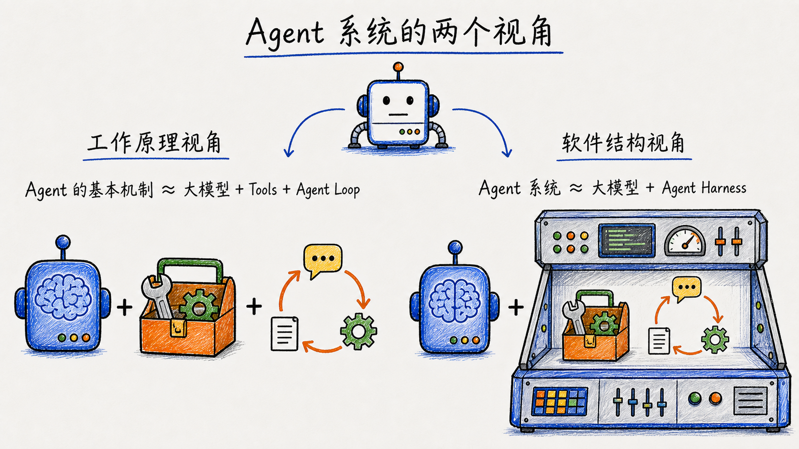
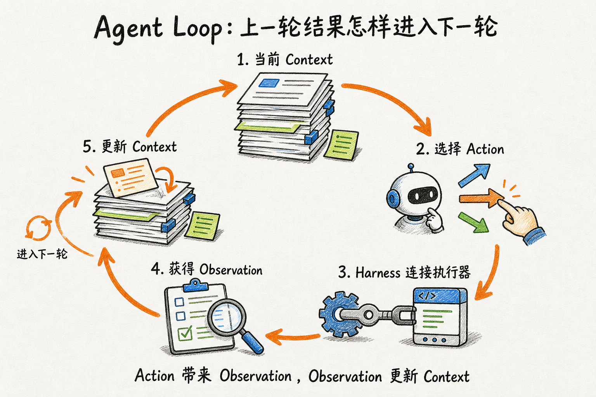
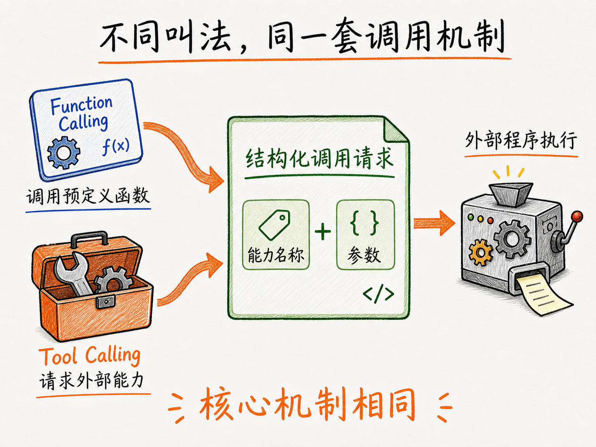
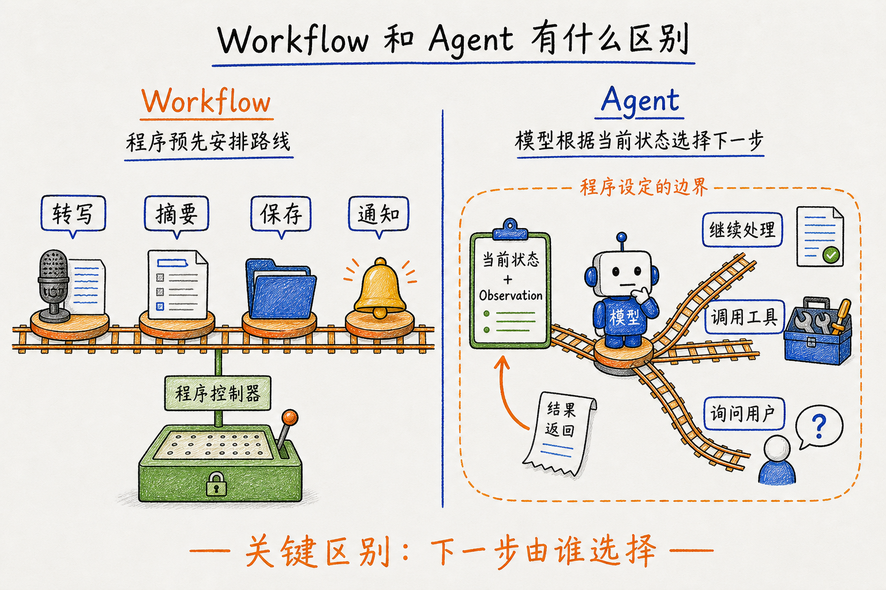
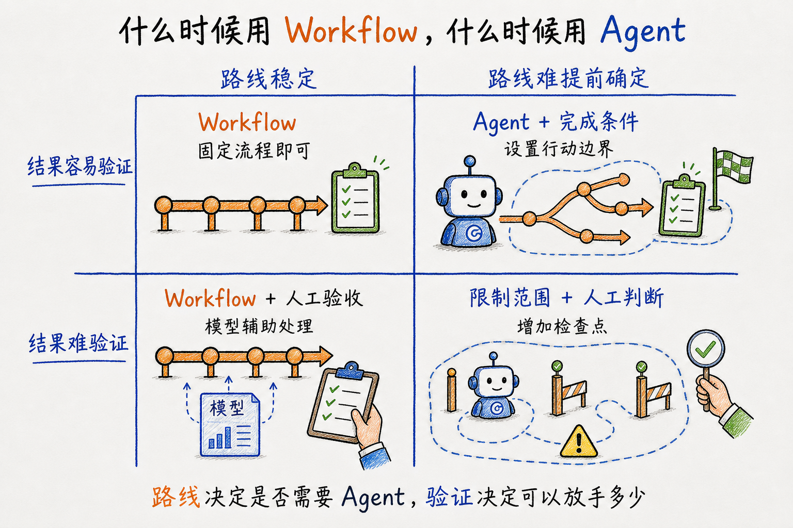
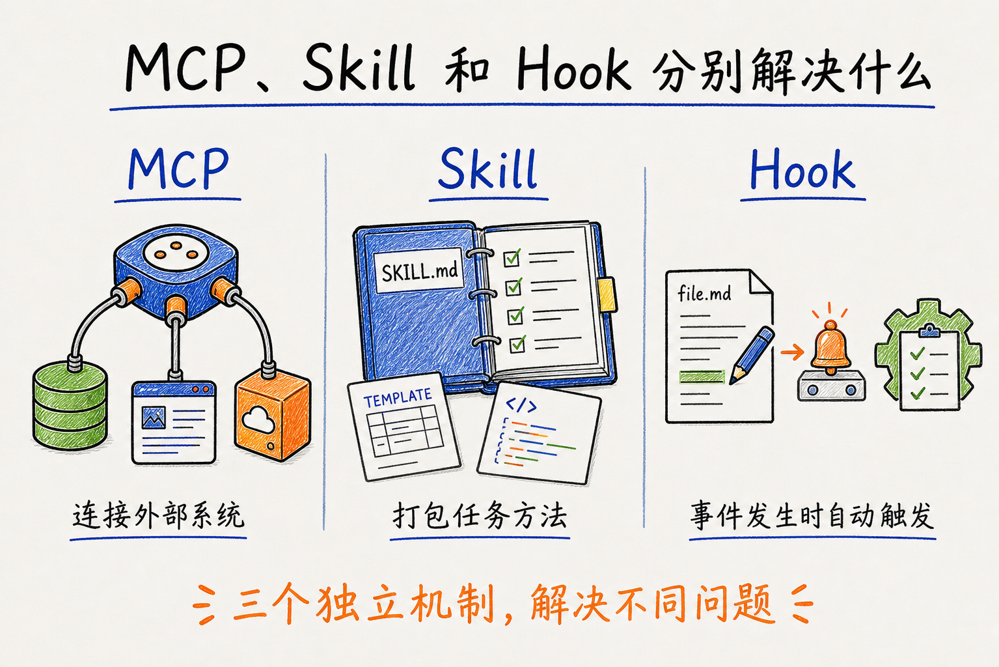
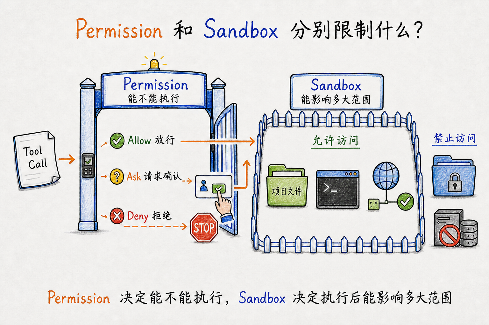
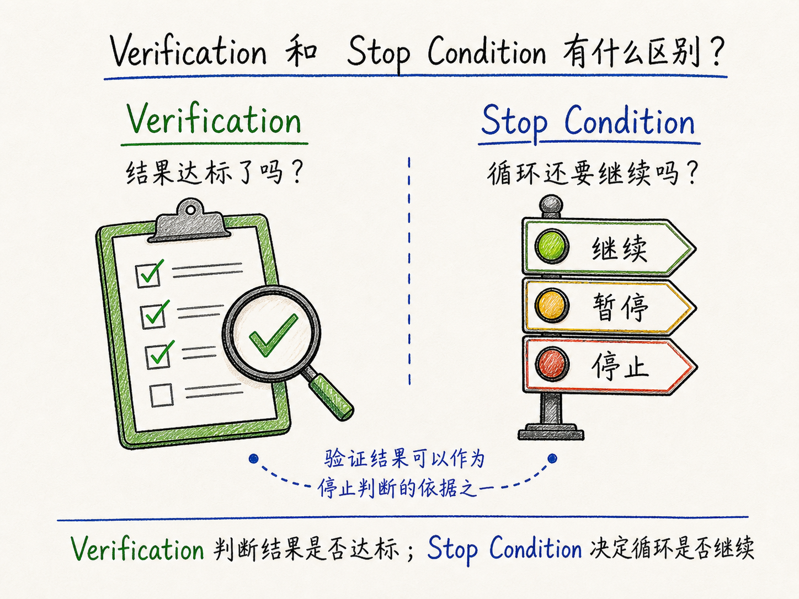
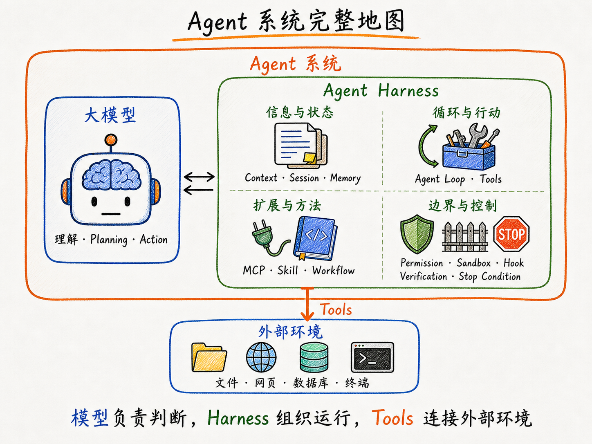

> **阅读路线**
>
> 1. 为什么需要 Agent；
> 2. Agent Loop 怎样让任务持续推进；
> 3. Tool、Planning 和 Memory 分别补上什么；
> 4. Workflow、MCP、Skill 和 Hook 怎样组织这些能力；
> 5. Harness、权限和验证机制怎样让系统真正运行。

## 第一章：从会回答到会做事

拿这篇文章来说，如果我对大模型说：“帮我写一篇介绍 Agent 的文章。”几秒钟后，它就能生成一篇看起来完整的正文。但生成文字，只是写文章的其中一步。生成一篇文章和真正完成一篇文章，其实是两件不同的事情：

```text
普通对话：提出要求 → 模型生成文章 → 返回回答 → 结束

真实写作：确定主题 → 阅读前文 → 查找资料 → 判断资料是否可信
          → 整理结构 → 写初稿 → 修改 → 保存 → 发布
```

在普通对话模式下，大模型已经可以参与真实写作中的很多步骤。可以列提纲、改句子，也可以把一份资料进行总结。但每次交互仍然是一轮输入和输出：提出一个问题，模型生成一个回答。这一轮结束以后，是否继续、下一步做什么，仍然需要重新发起。

而真实任务不会一直按照最初设想往下进行。查资料时发现两个来源说法不一致，需要继续核实；写到一半发现一个概念前面已经讲过，需要回头调整结构；准备发布时，还要检查文件是否保存、链接能不能打开。

前一步得到的结果，会不断影响下一步。问题不在于大模型能不能完成其中某一步，而在于它能不能根据上一步的结果，参与选择下一步行动，并把整件事继续推进。

Agent 系统要补上的，正是这个过程：

```text
用户提出目标 → 模型根据当前信息选择下一步 → 外部程序执行动作 → 获得反馈
                              ↑                              ↓
                              └──── 更新信息，继续生成下一步 ────┘
```

普通对话主要围绕“生成一个回答”展开，Agent 系统则围绕“完成一个目标”展开。

不过，大模型本身并没有因此变成另一个物种。模型还是原来的模型，那么 Agent 到底增加了什么？

## 第二章：Agent 不是一种新模型

Agent 并不是一类更聪明的新模型。无论是普通对话还是 Agent，底层的大模型都没有改变：它仍然根据当前看到的 Context，生成接下来的 Token。

区别主要发生在模型外面。在最普通的对话模式里，模型生成一段文字，系统显示给用户，这一轮交互就结束了。

Agent 系统则让模型的输出不只用于生成文字，也可以表示对下一步行动的选择，例如搜索网页、读取文件或运行代码。外部程序执行这个行动，再把真实结果放回 Context，模型才能根据新的信息选择下一步。

如果问：“Agent 为什么能够根据反馈持续做事？”

> **工作原理视角**
>
> Agent 的基本机制 ≈ 大模型 + Tools + Agent Loop

大模型根据当前 Context 生成对下一步行动的选择；Tools 定义它可以请求哪些外部能力；Agent Loop 则把一次次模型调用、工具行动和返回结果连接起来。这个公式解释的是 Agent 怎样工作，并不是在列一套完整的软件组件。

如果问：“真正的软件系统由什么组成？”

> **软件结构视角**
>
> Agent 系统 ≈ 大模型 + Agent Harness

第二个公式并没有排除 Agent Loop、Tools 和 Context，而是把它们放进了 Harness 负责组织的程序层。现在的 ChatGPT、Claude 等产品已经包含不同程度的工具和 Agent 能力，因此普通聊天与 Agent 之间也没有一条绝对的分界线。



Agent 作为一套系统，怎样根据反馈持续推进任务？关键就是 Agent Loop。

## 第三章：Agent Loop，整套系统的中心

### 3.1 一次生成为什么会变成多轮循环

大模型的一次生成是有终点的。它接收 Context、生成输出，这次调用便结束了，不会在后台自动等待结果或开始下一步。

从外面看，Agent 像是在连续工作；但从模型这一侧看，它经历的仍然是一次次独立调用。把这些调用连接起来的是模型外部的 Harness：一次调用结束后，Harness 处理模型输出；如果任务需要继续，再发起下一次调用。

```text
第一次模型调用 → Harness 处理输出 → 第二次模型调用 → ……
```

Agent Loop 没有让模型获得持续思考的能力，而是让外部程序能够反复调用模型。但只是重复调用还不够，下一次调用必须看到上一轮产生的新信息，任务才能继续向前推进。

这些新信息从哪里来？接下来再看 Action 和 Observation 怎样推动下一轮。

### 3.2 Action 和 Observation 怎样推动下一轮

上一节解释了模型的一次次调用怎样被连接起来。真正推动循环进入下一轮的，是 Action 执行后返回的新结果。

本文把模型根据当前 Context 选择的下一步行为称为 Action。询问用户、返回当前结果和使用工具，都可以是 Action。

只有工具类 Action 才需要 Tool Call。Harness 检查 Tool Call 并交给工具执行器，工具返回 Tool Result。Tool Result 进入 Context 后，就成为下一轮模型看到的 Observation。[Anthropic Tool Use 文档](https://platform.claude.com/docs/en/agents-and-tools/tool-use/how-tool-use-works)

合在一起看，这段 Agent Loop 是：

```text
当前 Context
      ↓
模型选择下一步 Action
   ├── 询问用户 → 回复进入 Context → 下一轮
   ├── 返回结果 → 结束本轮
   └── 使用工具 → Tool Call → Harness 检查并交给执行器
                                      ↓
                                  Tool Result
                                      ↓
                         作为 Observation 进入 Context
                                      ↓
                                    下一轮
```



这里先确定 Tool Call 和 Tool Result 在 Agent Loop 中的位置：所有 Tool Call 都表达了一项需要工具完成的 Action，但模型的每次输出并不都会包含 Tool Call。具体的工具说明、请求格式和执行过程留到第四章展开。至于循环由谁启动、又在什么条件下停止，下一节再讲。

### 3.3 Loop 怎样开始，又在什么时候停止

上面解释了 Agent Loop 内部怎样运转：模型根据 Context 选择 Action，行动带回新的 Observation，Harness 再把结果带入下一轮 Context。

但一套循环真正运行起来，还要回答两个外部问题：

> **启动与停止**：谁来启动它？什么条件下结束？

Agent Loop 内部的基本机制没有因此改变，变化的是循环外部的触发方式和停止条件。[Claude Code 文档里归纳了四种产品实践](https://claude.com/blog/getting-started-with-loops)。

四种形式的区别，可以直接看循环由谁触发，以及根据什么停止：

| 形式 | 谁触发 | 根据什么停止 |
|:---:|:---|:---|
| Turn-based | 用户发送消息 | Agent 返回结果，或等待用户补充信息 |
| Goal-based | 用户给出目标 | 完成条件满足，或达到轮数、时间等限制 |
| Time-based | 定时器按间隔启动 | 用户取消，或需要监控的任务结束 |
| Proactive | 时间、API 或外部事件 | 单次任务完成；长期流程由系统关闭 |

Turn-based Loop 最接近日常对话：用户发送一条消息，Agent 开始工作；返回结果或向用户提问后，它会停下来等待下一次输入。

Goal-based Loop 不是 Agent 自己说“完成了”就停止。以 [Claude Code 的 `/goal`](https://code.claude.com/docs/en/goal) 为例，系统会额外调用一个模型作为检查者，根据完成条件判断结果是否达标。

Time-based 和 Proactive Loop 也不是模型一直在后台思考。等待期间运行的是定时器或事件监听程序；时间到了或事件发生，系统才启动一次 Agent 任务。

### 3.4 小结

Agent Loop 没有改变大模型一次生成的本质，只是把一次次模型调用连接起来，让上一轮的结果能够影响下一轮。

现在我们已经知道 Tool Call 和 Tool Result 在 Agent Loop 中的位置，但还不知道模型怎样选择 Tool、怎样生成结构化请求，以及 Harness 怎样把请求变成真实行动。这就是下一章要拆开的工具调用链路。

## 第四章：Tool 与 Tool Calling：Action 怎样变成真实行动

### 4.1 模型提出行动，不等于行动已经发生

上一章里，模型根据当前 Context 选择了下一步 Action：

```text
搜索 Claude 关于 Agent 的官方资料
```

看到这句话，我们很容易说“模型正在上网搜索”。但严格来说，此时模型还没有打开网页，也没有向任何网站发出请求。它只是生成了一段表示行动意图的输出。

要让这个 Action 真正发生，模型外部还必须具备对应的能力、执行程序和权限。系统需要能够访问网页，知道怎样发起搜索，并且允许这次操作。缺少其中任何一项，“搜索网页”都只能停留在模型的输出里。

### 4.2 Tool：模型能够看到哪些外部能力

但模型怎么知道自己可以搜索，而不是只能根据已有知识回答？答案是：系统需要把当前可以使用的能力介绍给模型，这些能力就是 Tools。

例如，系统可以向模型提供搜索网页、读取文件和保存文件等 Tools。模型通常看不到背后的代码，看到的是一份工具说明：

```text
名称：search_web
用途：搜索互联网上的公开资料
需要提供：搜索关键词
可能返回：相关网页的标题、链接和内容
```

这些说明要在模型选择工具前提供给它。工具不多时，系统可以直接把完整说明放入 Context；工具很多时，也可以先提供名称或简短描述，等需要时再加载完整定义。模型看到名称、用途和参数要求后，才能选择是否调用某个 Tool，并生成需要传入的参数。如果说明含糊，模型可能选错工具或填错参数。

### 4.3 Tool Calling：把行动选择变成结构化请求

假设模型已经生成了“搜索资料”这个 Action。它可以输出一句普通文字：我准备搜索 Claude Agent Loop 的官方资料。

我们能够理解这句话，但程序很难只凭自然语言，稳定判断，因此，系统会约定一种程序可以识别的输出格式：

```text
工具名称：search_web
参数：
  query：Claude Agent Loop 官方资料
```

系统通过这种约定，让模型能够输出“调用哪个工具、传入哪些参数”的结构化请求，这个过程通常称为 **Tool Calling**。普通文字主要用于人与模型交流，Tool Call 则是提供给程序处理的结构化请求。

Harness 可以根据这个请求找到对应工具，检查参数是否完整、权限是否满足，再决定是否交给工具执行器。需要注意的是，这里仍然只是发出了调用请求，真正的搜索、文件读取或代码执行，还需要由外部工具完成。

不同文档对这一能力有不同命名。有些平台使用 **Function Calling**，强调模型调用一个预定义函数；有些使用 **Tool Calling**，强调模型可以请求更广泛的外部能力。它们关注的核心是一致的：让模型用程序可以识别的格式，表达要调用什么能力，以及需要传入哪些参数。



### 4.4 Harness 怎样把 Tool Call 变成真实行动

模型输出 Tool Call 以后，接下来由模型外部的系统接手。这里先只看 Harness 作为调度者的一面：

```text
模型输出 Tool Call
        ↓
Harness 检查请求并交给执行器
        ↓
工具执行器操作外部环境
        ↓
Tool Result 返回
        ↓
Harness 将结果加入 Context
        ↓
Agent Loop 进入下一轮
```

继续以前面的搜索为例。模型输出：

```text
search_web
query: Claude Agent Loop 官方资料
```

这只是一次 Tool Call，并不代表搜索已经发生。Harness 会先确认：

- 这个工具是否存在；
- 参数格式是否正确；
- 当前是否允许执行该操作。

检查通过后，请求才会交给搜索工具执行。工具返回的标题、链接或页面内容叫作 **Tool Result**。Harness 将它加入 Context 后，这份结果便成为下一轮模型看到的 Observation。模型可以据此继续阅读、调整搜索方向，或者判断资料是否已经足够。

但工具执行完成，只代表当前 Action 已经发生，不代表整个任务完成。搜索返回网页，不等于资料可信；文件读取成功，也不等于文章已经写完。结果回到 Context 后，模型和系统还要判断下一步是继续行动、进一步验证，还是返回当前结果。

## 第五章：Planning 怎样让复杂任务一步步推进

### 5.1 Planning 怎样为任务提供方向

Agent Loop 解决的是任务怎样持续运行，但持续运行不代表方向正确。如果每一轮只围绕眼前的结果选择下一步，而没有对照整体目标和当前进度，Agent 可能反复搜索、修改无关内容，或者逐渐偏离最初目标。

这就需要 Planning：

> **Planning**：模型根据目标、当前任务状态和可用行动，安排任务推进方向的过程。

不过，Planning 不等于提前列出一份固定计划，再严格按照步骤执行。Agent 不一定要提前知道完整路线。

Planning 可以同时发生在两个粒度。一方面，Agent 保留任务的大致方向：

```text
阅读前文 → 查找资料 → 写正文 → 检查
```

另一方面，它根据当前状态选择眼前最合理的一步。比如现在还不清楚 Harness 的定义，下一步就先查官方资料，查完以后再根据结果决定具体怎么做。

整体方向回答“这件事大概要怎样完成”，眼前一步回答“现在接下来做什么”。两者可以同时存在。关键不在于计划写得多详细，而在于下一步 Action 是否仍然围绕目标和当前进度展开。Observation 一旦改变任务状态，Planning 也需要随着执行结果调整。

## 第六章：Memory 怎样保存以后还会用到的信息

### 6.1 为什么不能把所有信息一直放在 Context 里

Agent Loop 每运行一轮，都会产生新的搜索结果、工具输出、报错和任务状态。如果把这些内容不断原样累加到 Context，即使还没有达到 Context Window 的容量上限，过期、重复或无关的信息也会干扰模型判断。

因此，Harness 需要保留当前目标、最新状态和关键约束，压缩已经完成的过程，并把暂时不需要的信息移出当前 Context。其中有些信息可以丢弃，有些需要归档，还有一些以后可能再次使用，这就需要 Memory。

### 6.2 Memory 到底保存什么

本文为了方便理解，把当前 Session 的记录和任务状态单独分开，只把以后可能再次取回的信息称为 Memory。

Memory 主要保存两类内容。一类是当前 Context 暂时用不到，但后面仍可能影响判断的历史信息，比如已经尝试过的方案、重要的工具结果和之前作出的决定。另一类是跨任务仍然有效的长期信息，比如用户偏好、项目规则、稳定事实和经过确认的经验。

这些内容可以保存在文件、数据库或其他外部存储中。存储位置不是关键，重要的是系统能够在以后需要时把相关信息找回来。

> **Memory**：由外部系统保存以后可能还会用到的信息，并在需要时把相关内容重新放入 Context。它不是让模型永远记住一切。

### 6.3 Memory 保存的信息怎样重新被模型使用

Session 保存这次连续对话或任务的记录与状态，Memory 保存以后可能重新取回的信息。模型当前实际看到的只有 Context，因此，Session 或 Memory 中的信息都需要先被系统选中，再放入当前 Context。

这条链路大致是：

```text
Session 或 Memory 中保存的信息
        ↓
系统根据规则、用户要求或模型请求加载相关内容
        ↓
Harness 将它们与系统规则、最近消息和工具说明
一起组装成 Context
        ↓
模型根据当前 Context 选择下一步 Action
```

有些信息会按照固定规则自动加入 Context，例如项目规则和用户偏好；有些信息需要根据当前任务检索，或者由模型调用工具读取。加载方式可以不同，只有最终进入 Context 的内容，才会影响模型这一轮的生成。

但信息和任务状态准备好以后，任务接下来走哪一步，是由程序事先安排，还是要根据执行结果动态判断？这就是下一章要讨论的 Workflow 与 Agent。

## 第七章：Workflow 与 Agent：下一步由谁决定

### 7.1 Workflow 是什么

Workflow 是由程序预先安排执行步骤和分支的一套流程。比如，一段会议录音上传以后，系统按照下面的顺序处理：

```text
接收录音 → 转成文字 → 调用模型生成摘要 → 保存文件 → 发送通知
```
这条流程用到了模型，也用到了文件和通知工具，但步骤之间的连接关系已经由程序提前确定。

模型可以负责理解内容和生成摘要，但它不负责决定整条流程接下来往哪里走。即使模型发现摘要内容存在疑问，只要程序没有预先设计“查找资料”或“询问用户”的分支，这些行动就不会自动发生。

因此，一个系统即使能够连续执行多个步骤、调用大模型和多种工具，也不一定是 Agent。在 Workflow 中，模型负责完成流程中的某个环节，程序负责决定下一步执行什么。

### 7.2 Workflow 和 Agent 有什么区别

两者可以这样区分：

|  | **Workflow** | **Agent** |
|:---:|:---|:---|
| 谁选择下一步 | 程序按照预设流程推进 | 模型根据当前状态动态选择 |
| 路线怎样变化 | 只能沿程序预设的条件和分支变化 | 新的 Observation 可能改变后续 Action |
| 适合什么任务 | 步骤稳定、边界清楚 | 路径难以提前确定，需要动态判断 |



例如，处理会议录音的 Workflow 会按照“转写、摘要、保存、通知”的固定顺序运行。即使摘要中出现不确定信息，只要程序没有设置其他分支，流程仍会继续执行。

而在 Agent 中，模型看到新的 Observation 后，可能选择继续处理、调用其他工具、调整计划，或者向用户补充提问。下一步并不是由程序预先完全写死的。

Workflow 由程序预先安排执行路线，Agent 由模型在程序设定的边界内，根据当前状态选择下一步。

### 7.3 什么时候用 Workflow，什么时候用 Agent

选择 Workflow 还是 Agent，主要看两个问题：**任务路线能不能提前确定，结果有没有明确依据可以验证。**

路线稳定时，程序可以直接安排步骤和分支，通常没有必要让模型临场选择。路线难以提前确定，需要根据外部反馈不断调整时，Agent 才能发挥作用。

结果能否验证也很重要。验证困难并不代表更适合 Agent，反而意味着模型走错以后更难被发现。此时需要缩小 Agent 的行动范围，增加程序检查或人工判断。

| **任务特点** | **更合适的方式** |
|:---|:---|
| 路线稳定，结果容易验证 | Workflow |
| 路线稳定，但结果依赖主观判断 | Workflow 执行，模型辅助，人工验收 |
| 路线难以提前确定，但结果能够验证 | Agent，并设置完成条件和行动边界 |
| 路线难以提前确定，结果也难验证 | 限制 Agent 的任务范围，增加检查点和人工判断 |



是否需要处理文字、图片等非结构化信息，并不是判断标准。如果一次模型调用就能完成提取、分类或摘要，把它放进 Workflow 就够了，不必为此引入 Agent Loop。

Workflow 和 Agent 也不是从低级到高级的升级关系。能够完成任务的结构越简单，运行过程通常越容易理解、测试和检查。只有固定路线无法覆盖任务变化时，才需要增加模型的动态判断。

> **选择原则**：任务路线决定是否需要动态选择，验证条件决定可以把多大范围交给 Agent。

### 7.4 Workflow 和 Agent 如何结合

Workflow 和 Agent 可以沿两个方向组合。

第一种由 Workflow 主导。程序规定整体阶段，在需要动态判断的节点调用 Agent，拿到结果后再进入验证或下一个固定阶段：

```text
固定阶段 → Agent 处理不确定问题 → 程序或用户验证 → 下一固定阶段
```

第二种由 Agent 主导。模型根据当前状态选择下一步，遇到步骤明确的任务时，调用一段固定 Workflow，拿到结果后再继续 Agent Loop：

```text
Agent 选择下一步 → 调用固定 Workflow → 获得结果 → 继续判断
```

无论由哪一层主导，分工原则都相同：能够稳定执行的步骤交给程序，无法提前写死的判断交给 Agent；测试、格式检查和权限校验仍由程序负责，发布、付款和删除等高风险动作则需要用户确认。

Workflow 负责稳定执行，Agent 负责动态判断，两者可以互相调用，而不是彼此替代。

## 第八章：MCP、Skill 与 Hook：Agent 怎样扩展连接、方法和规则

### 8.1 MCP、Skill 和 Hook 分别解决什么问题

第四章讲过，Tool 是系统提供给模型的一项可请求能力。搜索网页、读取文件和发送消息，都可以作为 Tool 提供给 Agent。但有了 Tool，仍然有三个问题没有解决：

- 外部数据和能力怎样接入不同的 AI 应用；
- Agent 完成某类任务时，应该遵循什么方法；
- 哪些检查和动作必须在特定时机自动执行。

MCP、Skill 和 Hook 分别处理这些问题。

| **概念** | **主要解决的问题** |
|:---:|:---|
| Tool | 模型可以请求执行什么行动 |
| MCP | 外部数据、提示和工具怎样通过统一协议接入 AI 应用 |
| Skill | 一类任务的指令、流程和配套资源怎样打包并按需复用 |
| Hook | 哪些检查或动作需要在特定事件发生时自动触发 |



Tool 是具体能力，MCP、Skill 和 Hook 则分别处理连接、方法和事件规则。它们解决的是不同层面的问题，不能互相替代。

### 8.2 MCP：外部信息和能力怎样标准化接入

一个 AI 应用可以自己实现网页搜索、文件读取和数据库查询等工具，再让模型通过 Tool Calling 使用它们。但当应用需要连接的外部系统越来越多时，如果每个系统都要单独编写连接和调用逻辑，接入成本就会越来越高。同一项能力换到另一个 AI 应用中，也可能需要重新开发。

MCP（Model Context Protocol）就是为减少这类重复接入工作设计的。它是一套连接 AI 应用与外部系统的开放标准，规定参与者怎样声明能力、交换信息和发起调用。

按照 [MCP 的官方架构](https://modelcontextprotocol.io/docs/2026-07-28/learn/architecture)，AI 应用是 MCP Host，Host 会为每个 MCP Server 创建一个 MCP Client 来维持连接：

```text
AI 应用（MCP Host）
└── MCP Client ←── 按 MCP 通信 ──→ MCP Server
```

官方文档用 USB-C 接口来类比 MCP：设备不同，只要遵循同一套接口标准，就可以用相似的方式连接。这个类比解释的是标准化连接。[Model Context Protocol 官方文档](https://modelcontextprotocol.io/docs/getting-started/intro)

MCP Server 可以向 AI 应用提供三类核心内容：

- **Tools**：可以被调用的动作；
- **Resources**：可以读取的外部信息；
- **Prompts**：可以复用的交互模板。

因此，把 MCP 理解成“接工具的协议”并不完整。它既可以提供能够调用的 Tools，也可以提供文件、数据库记录等 Resources，还可以提供某类任务需要的 Prompt 模板。MCP 解决的是 AI 应用与外部系统之间的标准化连接问题。

> **关键结论**：MCP 让不同的外部信息和能力，可以用一套相对统一的方式接入 AI 应用。

### 8.3 Skill：把一类任务的方法和材料打包复用

Skill 是给 Agent 使用的一套可复用做事方法。它把完成某类任务需要的步骤、规则和配套材料组织在一起。

按照 [Agent Skills 规范](https://agentskills.io/specification)，一个 Skill 以 SKILL.md 为核心，其中写明名称、用途和任务说明，也可以附带脚本、参考资料和模板。

Tool 提供 Agent 可以调用的能力，Skill 则告诉它怎样利用这些能力完成一类任务。比如，文件工具让 Agent 能够读取和修改文档，文档排版 Skill 则可以提供排版步骤、格式要求、检查方法和模板。

### 8.4 Agent 能自己执行，为什么还需要 Hook

Agent 确实可以读取文件、修改内容、运行测试，再根据结果继续处理。但这些行动都需要模型先做出选择：模型根据当前 Context 判断下一步做什么，再输出相应的 Tool Call。这种方式适合需要灵活判断的任务，却不能保证某个步骤每次都会被执行。任务变长、Context 变复杂或模型判断发生变化时，格式检查、安全拦截和日志记录等步骤仍然可能被遗漏。

对于不希望依赖模型主动记得的步骤，可以使用 Hook。

> **Hook**：系统在某个预先约定的时机，自动触发一项处理的机制。

Hook 不是所有 Agent 共用的统一标准，而是 Harness 或具体产品提供的事件扩展机制。有些系统使用回调、中间件或策略引擎完成类似的事，不一定叫 Hook。

它主要包含两个部分：什么时候触发？触发以后做什么？

比如，系统可以规定每次修改 Markdown 文件后，自动运行标点检查：

```text
文件修改完成
        ↓
触发对应的 Hook
        ↓
自动运行标点检查
```

如果只把“修改后检查标点”写进 Prompt 或 Skill，是否执行仍然取决于模型当时有没有选择这一步。换成 Hook 后，只要文件修改事件发生，系统就会自动触发检查，不需要模型决定。

> **Agent 与 Hook**：Agent 根据任务灵活选择下一步，Hook 则让某项处理在指定时机自动发生。

MCP、Skill 和 Hook 分别扩展 Agent 的连接方式、任务方法和事件规则。它们彼此独立，具体系统可以根据需要选择是否接入。负责把这些机制与模型、Tools 和 Agent Loop 组织起来的程序层，就是下一章要讲的 Agent Harness。

## 第九章：Agent Harness：是谁让整套系统运行起来

### 9.1 Agent Harness 是什么

前面几章所讲到的概念，都需要一层程序系统把它们组织起来。这层系统就是 Agent Harness。它是围绕大模型搭建的程序系统，负责准备 Context、运行 Agent Loop、处理 Tool Call，并管理任务状态和运行边界。

以 Claude Code 为例，接入的大模型负责理解任务并选择下一步，Claude Code 则是运行在模型外部的 Harness。它把项目文件、命令行等能力提供给模型，管理每轮模型能够看到的 Context，并接收模型生成的 Tool Call，将其转换成真正的操作。

### 9.2 Harness 怎样运行一次任务

Harness 接到任务以后，会先读取当前 Session 和任务状态，再把系统规则、用户目标、相关信息和可用 Tools 组装成这一轮的 Context。Memory 和 Skill 不一定每次都加载，是否使用可以由系统规则、用户要求或模型请求触发，Harness 负责执行相应的加载和组装。

```text
接收任务
    ↓
读取 Session 与任务状态
    ↓
按需取回 Memory、加载 Skill
    ↓
组装 Context，提供可用 Tools
    ↓
调用模型
    ↓
处理模型输出
    ├── Tool Call：检查工具、参数和权限
    │                 ↓
    │            交给工具执行器
    │                 ↓
    │       将请求和结果加入消息历史
    │       更新 Context 和任务状态
    │                 ↓
    │           再次调用模型
    │
    ├── 需要用户输入：暂停等待
    │
    └── 返回文本结果：记录当前结果
```

模型负责根据 Context 选择是否请求 Tool。Harness 接收 Tool Call，检查工具、参数和权限，再把请求交给内置工具、MCP Server 或其他工具执行器。执行结果返回以后，Harness 更新 Context 和任务状态，并根据需要再次调用模型。

除此之外，Harness 还要在运行过程中触发 Hook，并按照系统规则处理权限、结果验证和停止条件。这些机制具体怎样限制行动、检查结果和结束任务，留到下一章展开。

这张图展示的是 Harness 的主要职责，不表示所有 Agent 都采用完全相同的实现顺序，也不表示这些步骤会在每一轮分别发生。

### 9.3 Harness 和 Agent Loop 有什么区别

Agent Loop 描述任务怎样循环推进：模型选择 Action；需要使用工具时，模型生成 Tool Call；工具返回 Tool Result，这份结果进入 Context 后成为 Observation，再推动下一轮。

Harness 是让这套循环真正运行的程序。它负责调用模型、协调工具执行和更新 Context，还要处理 Session、权限、Hook、超时和结果返回。

> **两者的区别**：Agent Loop 是运行逻辑，Harness 是执行这套逻辑的程序系统。Loop 是 Harness 的核心机制，但不是 Harness 的全部。

循环能够运行起来，还不代表结果可靠。权限怎样限制、完成条件怎样验证，什么情况下必须交还给用户，是下一章要讨论的问题。

## 第十章：为什么 Agent 仍然需要人和验证机制

### 10.1 能够执行，为什么不等于可靠

Agent Loop 让模型能够根据反馈不断选择下一步，但每一次选择仍然可能出错。模型可能误解目标、选错 Tool、填写错误参数，也可能把不完整的结果当成任务已经完成。

在多轮循环中，一次错误还可能影响后续判断，并逐渐传播和累积。搜索结果不准确，后续 Planning 可能建立在错误信息上；文件改错以后，新的内容又会作为 Observation 回到 Context，让 Agent 沿着错误状态继续处理。

这就是“能够执行”和“可靠”的区别。能够执行，只说明 Agent 可以通过 Loop 持续采取行动；可靠还要求它的行动没有偏离目标，错误能够被及时发现和纠正，最终结果也能够被检查。

### 10.2 Permission（权限）与 Sandbox（沙箱）：Agent 可以做什么

模型可以选择下一步 Action。当这项 Action 需要调用工具时，它能不能真正执行，还要看系统允许 Agent 做什么。Permission 与 Sandbox 都在限制 Agent 的行动边界，但解决的问题不同。

> **Permission（权限）**：一套决定 Tool Call 是否可以执行的控制机制。

系统可以直接放行，也可以要求用户批准，或者拒绝执行。以 [Claude Code 的权限机制](https://code.claude.com/docs/en/permissions)为例，这三类规则分别称为 Allow、Ask 和 Deny。平时在 Claude Code 中看到的“请求批准”，就是系统在执行 Tool Call 前，把决定交给用户。

Permission 由 Harness 或工具运行平台执行，不由模型自己执行。Prompt 中写着“不要删除文件”，仍然只是给模型的指令；权限规则则可以直接阻止删除操作。模型即使生成了相应的 Tool Call，系统也不会执行。

> **Sandbox（沙箱）**：一种隔离的执行环境，用来限制程序能够读写哪些文件、访问哪些网络和使用哪些系统资源。

可以把它理解为系统划定的一块运行区域。即使 Agent 获得了运行命令的权限，这条命令也只能访问沙箱允许的文件、网络和系统资源。

比如，系统允许 Agent 运行测试，但 Sandbox 可以把命令限制在当前项目中，阻止它修改其他目录或访问未经允许的网络。命令启动的其他程序，也会受到相同边界的限制。

> Permission 决定“这项行动能不能执行”，Sandbox 决定“执行以后可以影响多大范围”。



### 10.3 Verification（验证）：怎样判断结果是否达标

Agent 返回“已经完成”，不代表目标真的已经达到。系统还需要根据实际结果进行检查。

> **Verification（验证）**：根据完成条件和可观察证据，判断任务是否真正达标的过程。

Verification 不是每轮 Tool Result 返回后自动执行的一个固定程序步骤。它既可以检查中间结果，也可以在任务准备结束时检查最终结果；如果验证需要运行测试、读取文件或查询外部状态，它本身还会产生新的 Action、Observation 和 Context 更新。

完成条件要先说明什么结果算成功，证据则用来证明这个结果已经出现。比如，修复登录问题的完成条件可以是“相关测试全部通过，并且没有破坏原有测试”，对应的证据就是测试程序返回的结果。

验证可以由不同方式完成：

- **确定性检查**：运行测试、查询数据库、比较文件或检查页面状态；
- **模型检查**：让当前模型自检，或者用一次独立的模型调用对照完成条件；
- **人工验收**：检查写作质量、设计效果和其他依赖主观判断的结果。

模型检查只能根据提供给它的信息作出判断，不能凭空知道外部环境发生了什么。如果要验证测试是否通过，系统必须真正运行测试，再把结果交给负责检查的模型；测试结果也会作为新的 Observation 进入后续 Context。

### 10.4 Stop Condition（停止条件）：Agent 应该在什么时候停止

Agent Loop 不能只等模型自己说“做完了”才结束。系统还要提前规定，出现哪些情况时应该结束或暂停循环。

> **Stop Condition（停止条件）**：用来判断 Agent Loop 是否继续、暂停或结束的一组规则。

Verification 表明目标满足完成条件，是最理想的停止原因。但任务没有完成时，下面这些情况也应该让循环暂停或结束：

- 达到最大轮数、时间或预算限制；
- 工具连续失败，继续重试没有新的进展；
- 缺少必要信息，需要用户补充或作出选择；
- 即将执行高风险操作，需要用户批准；
- 用户主动中断任务。

Verification 和 Stop Condition 回答的问题不同：

```text
Verification：目标达到要求了吗？
Stop Condition：当前循环还应该继续吗？
```



比如，Agent 尝试修复问题 20 轮后，测试仍然没有通过。Verification 的结果是“尚未完成”，但最大轮数已经触发 Stop Condition，Harness 仍然应该停止循环，并返回当前进度和没有解决的问题。

### 10.5 哪些决定必须交还给用户

Agent 不需要每做一步都询问用户。读取资料、运行检查等低风险、可恢复的操作，可以在授权范围内自动完成。需要交还给用户的，是系统无法安全替用户决定的事情。

- 即将发布内容、发送消息、付款、删除数据或执行其他高风险、不可逆的操作；
- 目标存在多种合理解释，不同选择会产生明显不同的结果；
- 涉及质量、价值取舍和最终是否接受等主观判断；
- Agent 多次尝试仍然没有进展，或者下一步已经超出原来的授权范围。

“交还给用户”不是让用户接手完成整个任务，而是由 Harness 暂停 Agent Loop，说明已经完成了什么、现在需要决定什么，以及不同选择可能带来什么影响，再等待用户确认。

对于结果可以自动验证的低风险任务，系统可以按照预先规定的条件自动结束。涉及高风险操作、目标歧义或主观取舍时，目标、行动边界与最终验收仍然要交给用户。

## 第十一章：回到完整地图

前面十章拆开讲了 Agent Loop、Planning、Memory、Tools、Workflow、MCP、Skill、Hook 和 Harness。现在把它们放回同一套系统里，就能看到两层关系：Agent 系统由什么组成，以及这些部分怎样围绕一个目标运行。

### 11.1 Agent 系统由什么组成

从软件结构来看，Agent 系统内部可以先分成大模型和 Agent Harness：

```text
Agent（Agent 系统）
├── 大模型
│   └── 理解目标、分析当前信息、Planning、选择下一步 Action
│
└── Agent Harness
    ├── 组装 Context
    ├── 运行 Agent Loop
    ├── 管理 Session、Memory 与任务状态
    ├── 向模型提供可用 Tools
    ├── 接收并处理 Tool Call，交给执行器并回收结果
    ├── 加载 Skill，连接 MCP
    ├── 执行 Permission 与 Hook
    ├── 配合或运行 Workflow
    ├── 连接或管理 Sandbox 等执行边界
    ├── 协调 Verification 所需的检查与证据
    └── 检查 Stop Condition
            │
            │ 通过 Tools 交互
            ▼
外部环境
├── 文件、网页和数据库
├── 终端与操作系统
└── API 和其他外部服务
```



这张图里，大模型根据当前 Context 选择 Action；Harness 检查 Tool Call、交给执行器，并把结果带回 Context；文件、网页和数据库等外部环境，则是行动真正发生的地方。Tools 是 Agent 访问这些对象的入口，Sandbox 限制操作能够影响的范围。

### 11.2 一次任务怎样运行

当一个任务真正开始运行时，这些概念会按下面的关系连接起来：

```text
用户目标或其他 Trigger
        ↓
Harness 读取 Session、任务状态和相关 Memory
        ↓
按需加载 Skill，组装 Context，提供可用 Tools
        ↓
调用大模型
        ↓
模型根据当前 Context 判断任务状态，
必要时调整 Planning，并选择下一步 Action
   ├── 需要外部行动：生成 Tool Call
   │          ↓
   │   Harness 检查请求与 Permission，
   │   再交给相应的工具执行器
   │          ↓
   │   工具操作外部环境，返回 Tool Result
   │          ↓
   │   Harness 将请求和结果加入消息历史，
   │   使其作为 Observation 进入更新后的 Context，
   │   并更新 Session 和任务状态
   │          ↓
   │       再次调用模型
   │
   ├── 需要用户补充：暂停等待，
   │   用户回复进入 Context 后再继续
   │
   └── 返回文本结果：Harness 记录当前结果
```

这条主线展示了三种去向：需要外部行动时生成 Tool Call，需要用户补充时暂停等待，当前信息已经足够时返回文本结果。Tool Call 经过执行产生 Tool Result，并作为 Observation 进入下一轮 Context。

Verification 不放在流程末尾作为固定步骤。它可以直接检查当前证据，也可以触发新的 Tool Call，通过测试、查询或其他行动获得更多证据；这些结果仍然会作为 Observation 回到 Context。

Stop Condition 则由 Harness 在适当节点检查。它既可以参考 Verification 的结果，也可以依据超时、最大轮数、用户中断等规则，决定任务继续、暂停还是结束。

### 11.3 把概念放回各自的位置

| **概念** | **在系统中负责什么** |
|:---:|:---|
| Agent / Agent 系统 | 围绕目标，根据反馈持续选择行动并推进任务的整体系统 |
| 大模型 | 处理当前信息、参与 Planning，并选择下一步 Action |
| Context | 模型在当前这次调用中实际看到的内容 |
| Planning | 根据目标和当前状态安排任务的推进方向 |
| Action | Agent 当前选择并准备执行的一步 |
| Tool | Agent 可以请求的一项外部能力 |
| Observation | 行动执行后返回给 Agent 的结果或反馈 |
| Agent Loop | 把模型判断、行动执行和结果反馈连接成循环 |
| Agent Harness | 运行 Agent Loop，管理 Context、Tools、状态和边界的程序层 |
| Session | 保存一次连续对话或任务的记录与状态 |
| Memory | 保存以后可能还要取回的重要信息 |
| Workflow | 由程序预先规定执行步骤和分支的流程 |
| MCP | 让外部信息和能力通过统一协议接入 AI 应用 |
| Skill | 把完成一类任务的方法、资料和脚本组织起来 |
| Hook | 在指定事件发生时，自动触发预设处理 |
| Permission | 控制一项操作能否执行，以及是否需要用户批准 |
| Sandbox | 限制程序能够访问的文件、网络和系统资源 |
| Trigger | 触发一次 Agent 运行开始的事件或条件 |
| Verification | 根据完成条件和可观察证据，检查当前结果或目标是否达标 |
| Stop Condition | 判断 Agent Loop 应该继续、暂停还是结束 |
| 外部环境 | Agent 通过 Tools 观察或改变的真实对象 |

## 结尾：从生成回答到完成任务

回到开头那篇 Agent 文章。让大模型生成一篇初稿并不难，真正费事的是读前文、查资料、核对说法、调整结构，再一遍遍修改，直到它真的可以保存和发布。

这也是我理解 Agent 最直接的方式：不只看它能不能给出一个漂亮的回答，还要看它能不能根据新的结果继续往下做。当一句“帮我写篇文章”不再停在生成初稿，而是能够一路走到检查和完成，Agent 的作用也就清楚了。

## 参考资料

### Agent 与 Agent Loop

- [Anthropic：Building Effective Agents](https://www.anthropic.com/engineering/building-effective-agents)
- [Claude Code：How Claude Code works](https://code.claude.com/docs/en/how-claude-code-works)
- [Claude Agent SDK：How the agent loop works](https://code.claude.com/docs/en/agent-sdk/agent-loop)
- [Claude：Loop engineering，getting started with loops](https://claude.com/blog/getting-started-with-loops)
- [Claude Code：Keep Claude working toward a goal](https://code.claude.com/docs/en/goal)

### Tool、MCP 与扩展机制

- [Claude Platform：How Tool Use Works](https://platform.claude.com/docs/en/agents-and-tools/tool-use/how-tool-use-works)
- [Model Context Protocol 官方文档](https://modelcontextprotocol.io/docs/getting-started/intro)
- [Model Context Protocol：Architecture overview](https://modelcontextprotocol.io/docs/learn/architecture)
- [Agent Skills 规范](https://agentskills.io/specification)
- [Claude Code：Hooks](https://code.claude.com/docs/en/hooks)

### Context、安全与工程参考

- [Claude Code：Memory](https://code.claude.com/docs/en/memory)
- [Claude Code：Configure permissions](https://code.claude.com/docs/en/permissions)
- [Claude Code：Sandboxing](https://code.claude.com/docs/en/sandboxing)
- [CoALA：Cognitive Architectures for Language Agents](https://arxiv.org/abs/2309.02427)
- [TW93：从零构建一个 Agent](https://tw93.fun/2026-03-21/agent.html)
