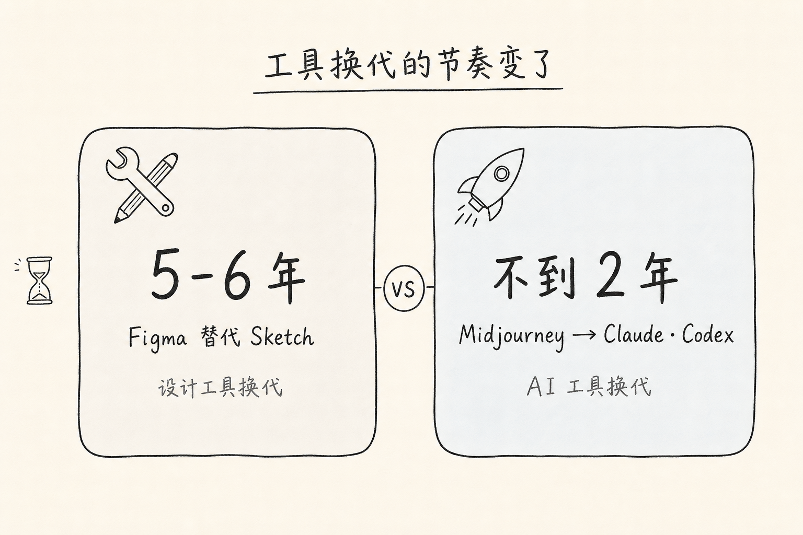
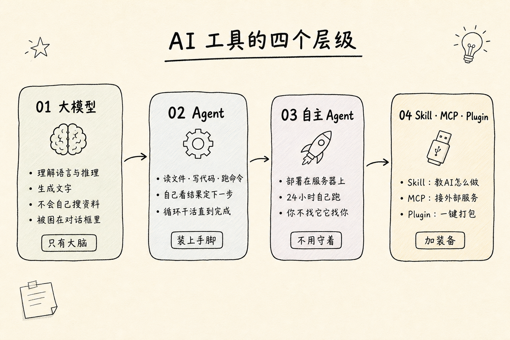
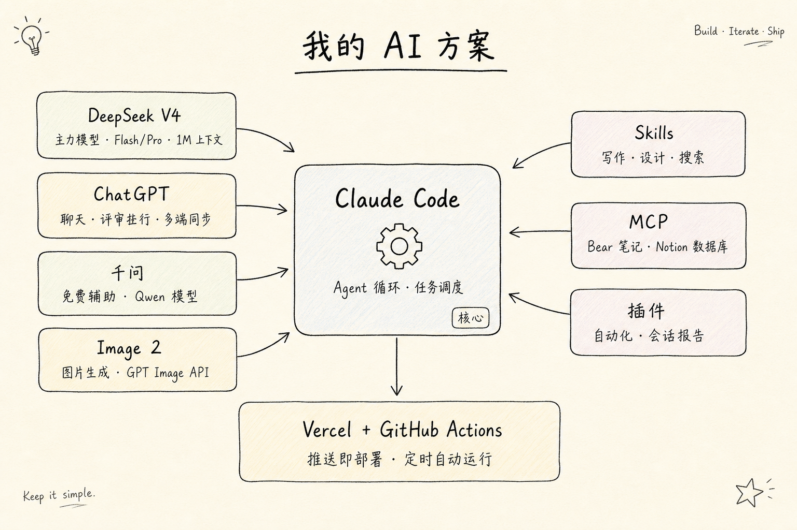
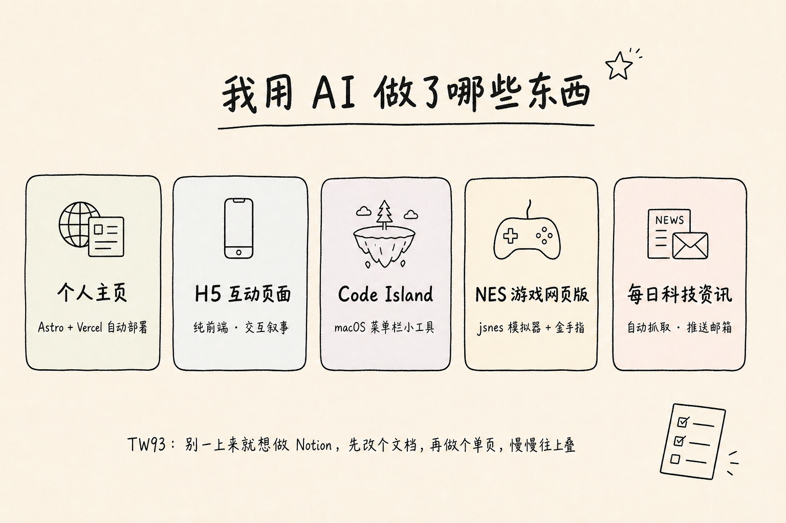

## **1. 关于变化**

很早之前我在团队内部写过一篇关于 AI 的文章，那会儿的 AI，还在研究大模型，那时候 Midjourney 还是设计圈 AI 的代名词之一，在各大网站上，牢牢占据风头。

然而不到两年时间，各大论坛霸榜的已经变成了 Claude、Codex，以及之前一阵火到不得了的 OpenClaw，就连设计论坛，也感觉像到了 AI 论坛上一样，永远是在围绕 Codex 、Claude 和 Gemini ，以及它们的衍生产品在讨论。

仅仅不到两年时间， 工具就已经大变样子了。在此之前，Figma 热度替换 Sketch ，用了整整五六年时间。在今天，AI 确实给生产带来了不一样的效率。原来个人只能单独使用一个工具做一件事儿，现在这些工具被串联起来了，并且延伸、创造，所谓【生产力】，确实被远远地提速了。

对于普通人来说， 最先受影响的是与 AI 密切关联的人，他们的工作方式已经悄然发生改变。对于部分工作场景非软件领域的人 —— 对 AI 的印象，可能还停留在问一句豆包（豆包作为一个工具集成，可以搜索、P 图、写文案、对话等），和爆火的 DeepSeek 上吧。

当然这是很客观的事情。使用 AI 或者学习任何一种新的技能，都包含主动式和被动式两面性，对于前者来说，在解决问题的时候，需要 AI 的参与去答疑。对于后者来说，对职业的危机感以及生存的危机感，逼迫他们不得不学习新知识。

## **2. 行业**

不过话说回来，个人学习是一回事，行业怎么讲 AI 的故事，又是另一回事了。

有的人用 AI 工具，而有的人用的恰恰是 AI 本身。没有什么比 AI 更能营销投资了。黄仁勋曾在采访中说过 ，OpenAI 和 Anthropic 患上了膨胀的“上帝综合征”，把自己当成了决定人类命运的先知。实话实说，这些公司为了引领占据头部、撰写行业规则外， 也确确实实需要声量来提高股价和融资。为了资本故事和监管博弈，在媒体上疯狂散播 AI 的恐慌。

以及一些人动不动，AI 改写了什么行业，——「卧槽太牛了」「AGI来了」「这个世界要变了」，配上几张截图，纯纯的情绪输出。虽然 AI 确实是引领发展的方向，但是也没必要被网上焦虑的声音裹挟，理性认识， 知道它是什么、能干什么， 根据自己的需求使用什么样的工具就可以了。

## **3. 现在的 AI 工具到底有哪些？**

上游大模型— OpenAI（GPT、Codex）、Anthropic（Opus、Sonnet、Mythos）、Google Gemini…… 国内这边，DeepSeek、GLM、Kimi、Qwen、Mimo、Minimax 等，哦对还有豆包。文心？不好意思，已经快上不了桌了。

下游就比较多了，OpenCode、Kilo、OpenClaw、Hermes……各种第三方 Agent、CLI 工具、GUI 界面、个人做的插件和 Skill，全围着这几个大模型转。下面先简单介绍下这几个组成部分吧。

### **01｜大模型：大脑**

大模型。它能干什么？理解我们说的话，推理，生成文字。大模型很聪明，但是被困在对话框里。你问什么，它答什么。

### **02｜Agent：给大脑装上手脚**

Agent 能读文件、能跑命令、能搜网页。做完一件事，自己看结果，再决定下一步。跟聊天的区别很简单。聊天是你问一句它答一句。Agent 是自己循环。

### **03｜自主 Agent：不用守着，它自己跑**

部署在服务器上，24 小时跑着。我们睡觉时候它可以整理东西。比如 OpenClaw 和 Hermes，前段时间爆火的 OpenClaw 热，事实也证明，工具的营销意义与流量，比工具本身更能引起人们的注意。

### **04｜Skill、MCP、Plugin：给 Agent 加装备**

Agent 本身很强，但还不够灵活。于是有三样东西给它扩展：

Skill（技能）——教 AI 怎么做。就是一份说明书。比如我用 Claud生成write skill，告诉 AI：「用我个人的语气和节奏写文章」。

MCP——给 AI 接外部服务。像一个 USB 接口，插什么连什么。比如 Bear MCP 让 AI 能读写我的笔记，Notion MCP 让 AI 访问数据库。

Plugin（插件）——把 Skill + MCP + 命令等等打包，一键安装全部生效。

## **4. 使用构建**

我是一个产品设计师，不懂代码的那种，然后也没有很光鲜的职场背景。就是做相对喜欢的事，研究一点新的技术。那从个人角度来讲述一下，目前使用的 AI 以及使用 AI 实现了什么。

我目前主要使用的是 Claude Code，然后接入 DeepSeek API，使用第三方接入 Image 2 API 和 Claude API， DeepSeek 作为主力模型使用，可以切换 Flash/Pro，并且可以实现 1M 上下文。也可以切换思考强度。 Image 2 作为图片生成使用，Claude API 作为高端模型偶尔使用进行兜底，解决一些比较难的问题。

GPT Plus 看情况开启，使用 ChatGPT 作为主聊天模型，好处是可以多端同步，缺点是还是挺贵的，当然，同时 Codex 作为次主力，相对来说比 API 合算一些。

千问作为辅助使用，虽然确实来说，不怎么样，但是就凭它免费、相对比较专业，并且 Qwen 模型也跟得上这一点，不说其他的了。

这个方案已经是性价比很高的了，毕竟普通人来说，并不像那些大 V ，能从 AI 中获得流量，随随便便开一个 Pro/Max ，DeepSeek 便宜大碗， 从使用和性价比综合来看，在国内就是 No.1， 并且跟顶级模型也差不太多，在这里放话了，除了 DeepSeek 其他模型都不怎么样，尝试过就知道，一个简简单单的 API 调用也做不好，性能不光比不上，并且价格没比 GPT 和 Opus 便宜多少。

## **5. 截止到现在我的 AI 之路**

最初，在 GPT 刚开始出来，我尝试做过一些 Chat 聊天，后来因为项目原因，一直在使用 Midjourney 做图像，那会儿的对话模型，并不能很好地生成画面关键词 Prompt ，为了使用，疯狂研究 Prompt 关键词。虽然到现在已经渐渐弃用，但是对于图片的描述还是给我打下了比较好的基底。

后来 DeepSeek 横空出世，震动了 AI 圈内外。和大家一样开始用 DeepSeek，也试了元宝之类的第三方接入。那段时间还折腾了千问、文心、Kimi、智谱、Gemini……挨个试了一圈，没有一个能长期用下来的，差点就放弃了。

转机是 Vibe Coding 火了之后。Anthropic 发了新的 Sonnet 和 Opus，OpenAI 也在持续更新，突然感觉这些模型能用了。先从开源 Agent 开始吧——VS Code 里装 Kilo，尝试体验了一段时间。

后来 DeepSeek V4 发布，又把 DeepSeek 接进了 Claude Code。V4 Flash 日常用，Pro 处理复杂任务，1M 上下文够装整个项目。体验下来，这就是目前最舒服的组合了——Claude Code 负责 Agent 循环，DeepSeek 出货，便宜大碗。

美中不足的是，DeepSeek 还不支持多模态，也没有到最顶尖那一档。但对我来说，它成长性够强，API 价格摆在那，已经是我的主力了。ChatGPT 和 Codex 作为补充，有时候 Claude 上规划完方案，扔给 GPT 评审和执行。

## **6. 用 AI 做了哪些东西**

- 个人主页： Astro 搭的静态站点，存放了一些文章、摄影、AI 图像实验。
- H5 互动页面，纯前端，有选择有结果有动效。
- 编程灵动岛。 macOS 菜单栏小工具，实时显示 AI Agent 状态，网上有更好的开源产品了 Code island，就没有再折腾了。
- NES 游戏网页版。 用 jsnes 模拟器内核封了一个浏览器能玩的 Rockman，满足了重玩小霸王游戏机的想法。
- 每日科技资讯。 一个自动跑的流水线——抓 RSS、生成长图卡片、写进 Notion、发邮件。cron 定时触发 + GitHub Actions 云端兜底，每天早上自动推送到邮箱上。

## **7. 定制自己的 AI**

我在 Claude Code 和 Codex 上装了很多 Skill 和插件，按用途分几类。

写作的：write 是自己生成的 Skill，告诉 AI 用自己文字风格写东西。humanizer-zh 去 AI 味，写完过一遍。

设计的：baoyu-design 做页面原型，huashu-design 做交互动画，guizang-ppt-skill 做幻灯片，guizang-social-card-skill 做小红书和公众号封面。baoyu-image-gen 接了 GPT image2，用于生成图片

搜东西的：firecrawl 和 tavily 覆盖了所有联网需求——搜网页、抓内容、深度研究。read 读链接和 PDF，learn 把资料整理成文章。

MCP 两个：Bear 读写笔记，Notion 连数据库。

排版用 kami：做 PDF、一页纸、简历、PPT 都行。

另外在 Codex 上搞了 GitHub + Vercel 一键同步，写完代码推上去，自动部署。当然还有很多其他插件，根据自己需求添加即可。

## **8. 最后**

这是个巨大的信息化社会，也是一个流量为王的社会，面对众多信息，真正沉下心来做事的人不多。对于新手来说，想推荐一些自己了解的入门方法。

首先，可以下载国内的 IDE，比如 Trae 之类的，或者直接去搜索 Kilo Code、OpenCode，使用 Agent 和免费模型帮你配置一些基础环境。

然后接入 DeepSeek API，慢慢在实践中学习，打造属于自己的 AI 助手。当然有条件，我还是建议使用 Claude Code，没有其他 Agent 有这么好的体验了。

推荐几个比较有干货的大佬，TW93、Guizang、Qiaomu，我上面安装的Skill 就是他们做的。当然也可以关注 Claude 官方的一些动态，会提出一些关于工程化的思考。

回到标题，AI 如何改变一个普通人的能力边界——它帮助普通人突破了知识的深度边界，突破了执行效率的边界，突破了想象力和创造力的边界。

但这一切的执行权都在我们自己。假设我们没有足够的艺术鉴赏能力，又如何决定什么是美和丑？假如我们没有足够的思考能力和知识框架，又如何判断 AI 返回的结果？

保持好奇心和行动力，无论身处什么岗位，选择自己需要的工具。不盲从，也不自满。也许，可以做得更好。

# 

​
