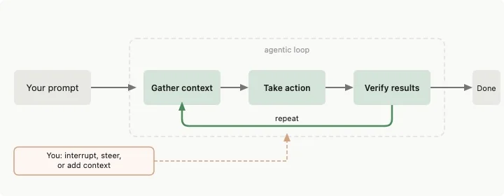
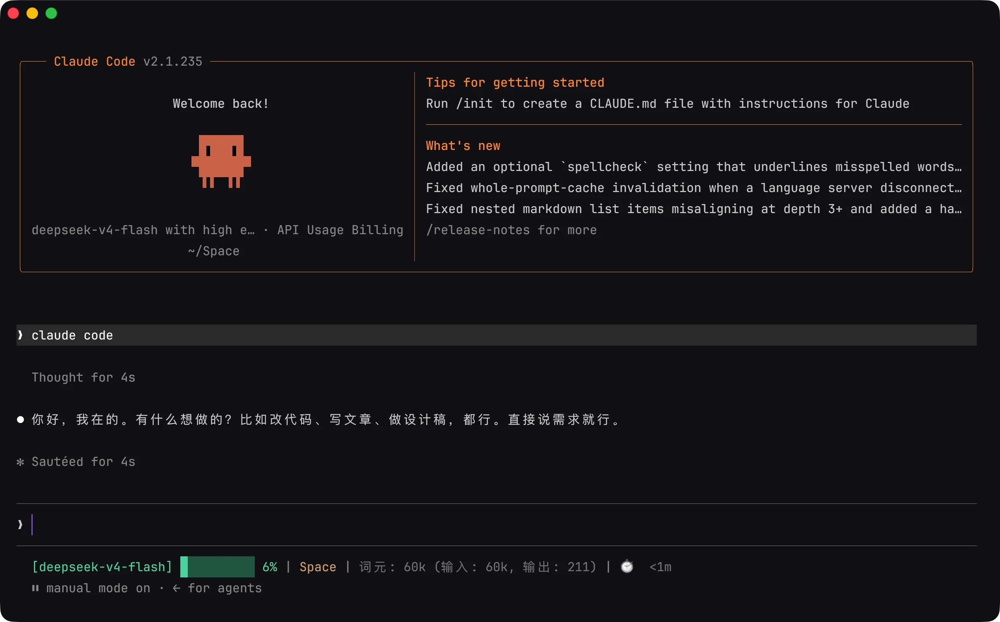
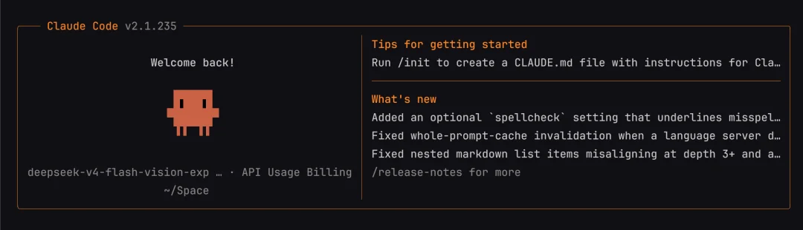
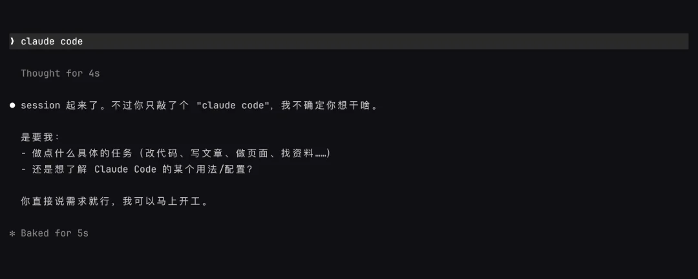
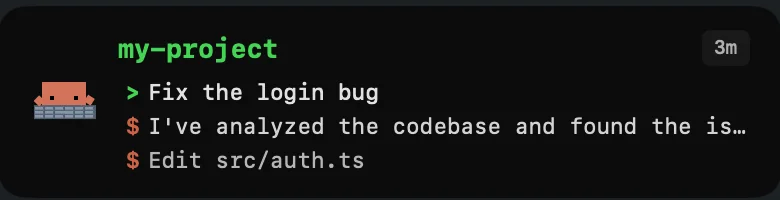
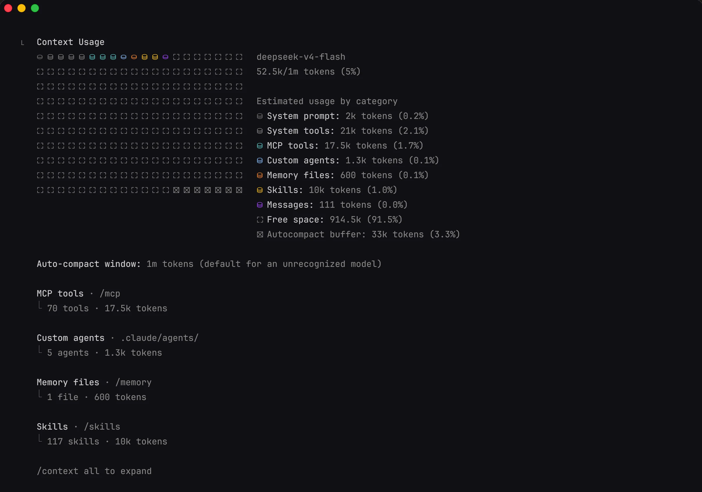
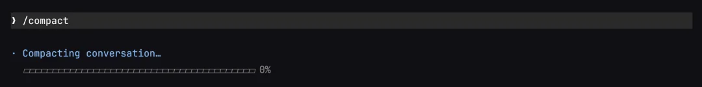
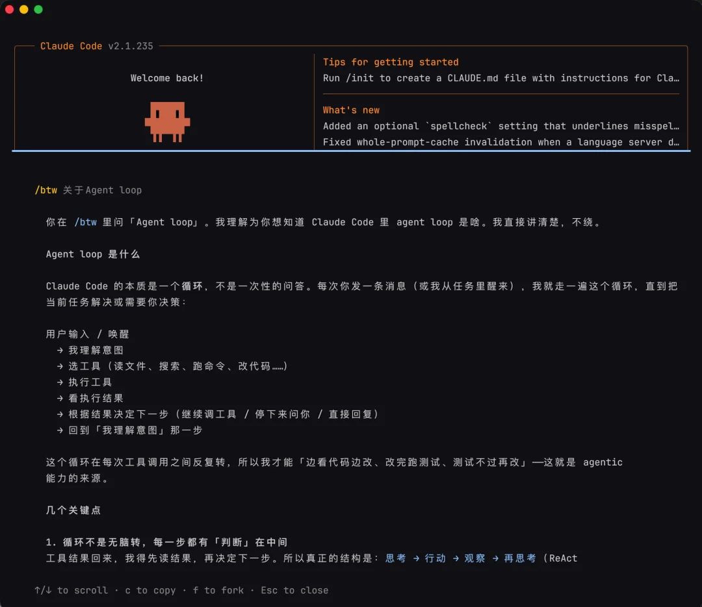
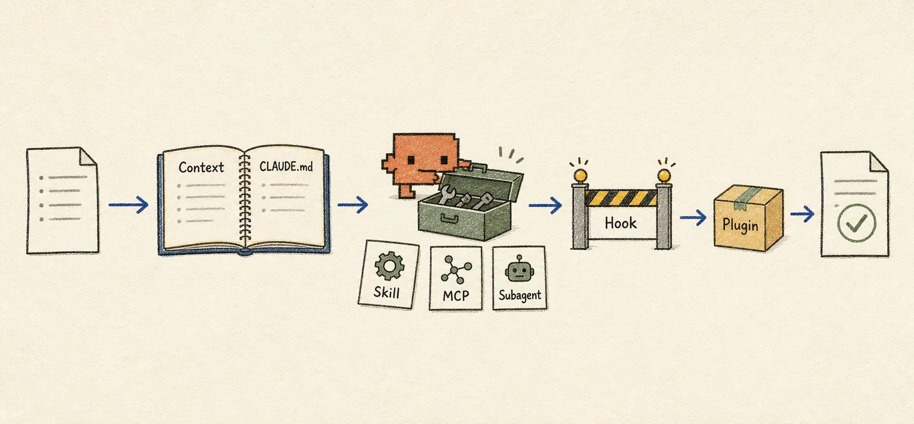

## 引子：Claude Code 不只是终端里的代码聊天框

现在，我们能接触到的 Agent 产品已经很多了。既有 Cursor、Windsurf、Kiro 这样的 Agent IDE，也有运行在 VS Code 里的各种 Agent 插件；有 Claude Code、Codex CLI、Antigravity CLI 这样的终端工具，也有 ChatGPT、Claude、WorkBuddy 等桌面或网页客户端。最近，DeepSeek 也推出了仍处于开发者预览阶段的 [DeepSeek Harness](https://www.deepseek.com/harness/en/)。

我自己也陆续用过不少。最早是在 VS Code 里接触这类工具，后来又用过 Kilo Code、Cline、OpenCode、Claude Code 和 Codex。当然，市面上还有很多产品，我没有一一体验。一路用下来，在我看来，Claude Code 是一个很适合用来理解 Agent 的代表性产品。无论是功能设计还是交互体验，它都足够清晰、好用，同时又保留了很高的操作自由度和可定制性。

所以，本文会以 Claude Code 为例，介绍它的基本操作和使用思路。其中不少方法也可以迁移到其他 Agent 产品中，希望能给大家理解和使用 Agent 带来一点帮助。

### Claude Code 的工作思路

在上一篇《你不知道的大模型：Agent》中，我们说过 Agent 的核心是 Loop。Claude Code 本质上也按照 Agent Loop 工作，下面是官方文档给出的循环过程：



## 第一章：进入 Claude Code

在终端输入 `claude` 后，界面显示如下：



这就是 Claude Code 的主界面，分为四个区域：

- **启动信息区**，显示版本、模型和工作目录；
- **对话与行动区**，显示 Claude 回复、读取文件、修改文件、运行命令的过程；
- **输入区**，可以输入自然语言、斜杠命令，也可以加入文件和图片；
- **状态区**，显示权限模式、任务状态和其他提示。

### 启动信息区



#### 版本

按照现在 AI 的发展速度，Agent 的更新频率非常快，如果默认允许 Claude Code 自动更新，那么在关闭电脑时候，可能会出现更新到一半，网络中断情况，下次启动就可能出问题。

所以最好的做法，对 Claude Code 说**停止自动更新**，然后更新的时候每次手动执行 `claude update`，并且自动验证。这样会避免许多安装、模型 API 适配问题。

当然，在前段时间，Anthropic 这家公司，偷偷往 Claude Code 中植入隐蔽识别国内用户的机制**通过读取电脑时区，再查代理域名，命中后悄悄修改系统提示词里的字符。** 不得不说，Anthropic 这家公司的价值观简直恶心，但是又有 Claude Code 这么好的产品，作为个人用户，为了工作也只是使用吧，希望国产模型能早点超越它。

#### 模型

Claude Code 默认使用 Claude 系列模型。如果第三方服务提供了兼容 Anthropic API 的接口或网关，也可以把请求转发给 DeepSeek、Kimi、Qwen 等模型。这属于第三方兼容接入，不过一般 DeepSeek V4 Flash 足够日常使用了。

#### 工作目录

工作目录是 Claude 当前打开的资料夹。启动信息中的路径就是它的位置。工作目录是我们读取、修改完成项目所在的文件夹位置，是当前任务的位置核心。

我习惯把文件夹直接拖入终端，再启动 Claude Code。有时也会直接在默认目录下打开，不过没关系，我们可以通过 `/cd 路径` 切换当前工作目录，也可以用 `/add-dir 路径` 直接给当前的 AI 会话“额外开一扇门”，让它能读取和修改其他目录下的文件。

| 命令 | 作用 |
|---|---|
| `/cd 路径` | 把当前会话切换到另一个项目 |
| `/add-dir 路径` | 让 Claude 可以访问另一个目录，但不切换当前项目 |

### 输入区

下面的输入框，就是我们输入命令的地方，输入内容后按 `Enter` 发送。需要换行时，可以使用 `Ctrl+J`。常见终端也支持 `Shift+Enter`。

- 对于一些短的命令，直接输入文字就好，截图什么的也可以直接 `Ctrl+V` 粘贴。
- 对于一些长文本内容，可以直接保存成文件，直接拖入到对话框，再让 Claude 按路径读取。
- 输入 `/` 可以打开命令菜单，看到当前可用的命令、Skills 和扩展，继续输入文字可以筛选。
- 输入 `@` 可以搜索并引用工作目录里的文件或文件夹。

Claude Code 的命令很多，下面这些入口足够应付刚开始的查找和设置：

| 入口 | 能看到什么 |
|---|---|
| `/help` | 帮助和可用命令 |
| `/powerup` | 通过互动课程和动画演示了解 Claude Code 的常用能力 |
| `/status` | 版本、模型、账号和连接状态 |
| `/config` | 常用设置界面，包括主题、模型和输出偏好 |
| `/theme` | 更换界面主题 |
| `/model` | 切换模型，并调整模型支持的思考强度 |
| `/effort` | 单独设置思考强度，使用 `auto` 恢复模型默认值 |
| `/usage` | 查看当前套餐的使用情况和限制 |
| `/doctor` | 检查安装、设置和扩展问题，确认后可以修复部分问题 |

输入 `/model` 会打开模型选择器。支持调节思考强度的模型，也可以单独输入 `/effort`，进行切换，一般有 `/low` `/medium` `/high` `/Xhigh` `/Max`，日常使用 Medium 和 High 即可，过度推理，速度慢又耗费 Token。这里调整的是 Claude 在当前任务上投入的推理强度，不是在修改模型本身的参数或权重。

### 对话与行动区



对话与行动区，是主界面中间最大的区域，Claude 的回复和它正在做的事都显示在这里。

回复文字之外，还会看到一条条类似 Read、Edit、Bash 的记录。这些是 Claude 为了完成任务调用的工具：Read 表示正在读取文件，Edit 和 Write 表示在修改或创建文件，Bash 表示在电脑上执行命令，WebSearch、WebFetch 则是搜索网络或读取网页。看到不认识的行动，可以让 Claude 先解释用途和影响，再决定是否继续。

按 `Ctrl+O` 可以展开或收起详细记录，查看工具调用的详细输出和执行记录。

### 状态区

底部状态区会显示当前的权限模式。按下 `Shift+Tab` 通常会在 Manual、Accept Edits、Plan 和 Auto 进行循环。

| 界面名称 | 普通使用时可以这样理解 | 适合的情况 |
|---|---|---|
| Manual（配置值为 `default`） | 直接读取通常不询问，其他行动一般先确认 | 第一次使用、陌生项目和敏感任务 |
| Accept Edits（`acceptEdits`） | 可以直接编辑项目内文件，并执行部分常见文件操作 | 任务范围清楚，准备在完成后统一检查修改 |
| Plan（`plan`） | 先读取、调查和提出计划，不修改源文件 | 需要先弄清项目或改动范围 |
| Auto（`auto`） | 常规操作减少询问，较高风险的操作由后台分类器判断 | 较长任务，希望少被确认窗口打断 |

刚开始使用时，Manual 便于逐项观察，Plan 适合先调查。Accept Edits 会少弹一些确认，但其中也包含部分文件操作，最好在已经知道怎样检查改动后再用。Auto 有后台检查，仍不等于所有操作都没有风险。

### `/permissions` 管理更具体的允许和拒绝

权限模式控制整体节奏，`/permissions` 用来管理具体规则：

- **Allow**，匹配的操作可以直接执行；
- **Ask**，每次匹配时都要确认；
- **Deny**，直接禁止匹配的操作。

多条规则同时匹配时，判断顺序是 Deny、Ask、Allow。

提示词和 `CLAUDE.md` 可以告诉 Claude 应该怎么做，却不能改变产品真正允许它做什么。密钥、私人资料和不希望 Claude 读取的文件，需要用 Deny 规则阻止。

## 第二章：把任务交代清楚，再决定是否先规划

以一个常见的任务为例：根据几份已有资料写一章文章。文件夹里已经有研究笔记、文章框架和旧草稿，但资料比较散，旧草稿又太长，还夹着一些不适合这篇文章的内容。

### 交代五件事就够了

如果我们输入一句“帮我写篇文章”，这个命令太简单，留下了很多没有决定的地方：主题有多大、写给谁、参考哪些资料、写多长、保存到哪里。任务信息可以按五件事检查，不必把它当成固定格式：

| 内容 | 需要说清什么 |
|---|---|
| 问题 | 现在发生了什么，在哪里可以看到 |
| 目标 | 希望最后变成什么样 |
| 材料 | 可以参考哪些文件、截图、网址或输出 |
| 边界 | 哪些内容不能修改，哪些行动不要进行 |
| 完成标准 | 根据什么判断任务已经完成 |

### 哪些任务值得先规划

改一个错别字、调整一句话或改一个明确的小标题，可以直接执行。下面几种写作任务更适合先规划：

| 任务情况 | 建议 |
|---|---|
| 修改位置明确，只改一两句话 | 可以直接执行 |
| 需要整合多份资料 | 先规划 |
| 要重写一整章或调整文章结构 | 先规划 |
| 新旧资料之间存在冲突 | 先规划 |
| 读者、重点或篇幅还没有决定 | 先让 Claude 提问，再规划 |

这个案例要对照三份材料并重写一整章，适合使用 Plan Mode。可以按 `Shift+Tab` 切换到 Plan，Claude 给出最终计划后，界面会询问怎样继续。选择继续规划会留在 Plan Mode；选择批准则会退出 Plan Mode。

## 第三章：执行过程中，观察、纠正和授权

计划确认后，Claude 会开始读取资料、修改文档，有时还会运行搜索、统计或格式检查。这时候一般不会一直盯着 Claude Code，但如果它在等待权限审批而我们没有注意到，任务就会停在那里。

如果使用 macOS，可以试试开源第三方工具 [Code Island](https://github.com/rifqiakrm/code-island)。它能把 MacBook 的灵动岛变成一个 AI 工具状态面板：Claude Code 正在做什么、有没有请求权限，都会实时显示在屏幕顶部的刘海区域，空闲时自动收起，不占地方。



它还能直接处理权限审批。平时 Claude 要跑一个命令、改一个文件，得切回终端点确认；装了 Code Island 之后，权限请求会直接出现在灵动岛上，不用来回切窗口。在写文档或者做别的事时，余光扫一眼灵动岛就知道它进展到哪了。

### 写偏时先停下来

假如 Claude 回答的内容偏离了文章要写的方向。这时继续等待只会增加后面的清理工作。按 `Esc` 中断当前行动，再指出具体偏差。

### 权限请求要看它会影响什么

Claude Code 弹出权限请求时，先看行动、目标和范围是否与当前任务一致。

| 权限请求 | 需要确认什么 |
|---|---|
| 修改正文草稿 | 文件路径是否正确 |
| 读取其他文件 | 是否真的与文章有关，会不会包含私人资料或密钥 |
| 运行搜索或篇幅统计 | 命令是只读取信息，还是还会改动文件 |
| 访问官方网页 | 域名是否可信，会向外发送哪些内容 |
| 安装新工具 | 当前任务是否真的需要，工具来自哪里 |
| 删除、覆盖或访问文件夹外的内容 | 目标是否明确，操作能否恢复，为什么不能在当前目录完成 |

还有一层边界叫沙箱：权限决定一项操作能不能开始，沙箱限制终端命令开始后可以接触哪些文件和网络。两者可以同时使用，作用不同，这个内容在 Agent 文章中已经讲过。

## 第四章：检查改动，用证据验收结果

Claude 回复“已完成”时，任务进入验收阶段。它的总结可以帮助定位结果，但文章是否写对，仍要看实际文件、检查结果和阅读感受。

### 先确认它到底改了什么

可以先让 Claude 停止编辑，只汇报当前结果：

```text
先不要继续修改。请列出这次改动涉及的文件和章节，说明删除了什么、保留了什么、增加了什么，并指出是否存在计划之外的变化。
```

这份汇报只能用来寻找检查入口，实际内容仍要回到文件里看。输入 `/diff` 查看累计改动，可以显示修改前后对照，通常会把删除和新增内容用不同颜色标出来。

### 文章仍然要由人完整读一遍

文章里如果有拿不准的内容，可以让 Claude 拿出处验证，别让它凭印象回答：

```text
请为“XXX”这句话指出具体资料位置，并说明原文支持到什么程度。
```

这么一问，Claude 就没法含糊地说「我记得是这样」，得告诉你这句话是从哪份资料来的、原文到底怎么说的。

对于比较复杂的项目，可以开一个新会话做独立审查。新会话没有参与前面的写作过程，更容易发现原会话已经习惯的结构和表达问题。

### 写坏以后怎样回到之前的版本

每次发送用户提示前，Claude Code 都会创建 Checkpoint，记录当时的文件状态。连按两次 `Esc` 或输入 `/rewind` 可以打开回退菜单，并选择恢复对话、恢复文件、恢复两者，或从某条消息开始总结对话。Checkpoint 主要跟踪 Claude 通过文件编辑工具做的修改，通过 Bash 命令、其他软件或并行会话改动的文件，不一定能用 `/rewind` 恢复。

## 第五章：管理会话、上下文和项目知识

Claude Code 把一次对话保存为会话（Session）。会话中的聊天记录、文件内容和工具结果组成上下文（Context）。一篇文章从调研做到验收，上下文里已经积累了多轮要求、搜索结果和失败尝试。信息越来越多以后，可以先看里面装了什么，再决定继续、压缩还是重新开始。

### `/context` 显示当前会话装了什么

Claude Code 的上下文并非全部可用，输入 `/context`，Claude Code 会按类别显示当前上下文的占用。里面有聊天记录、项目说明、`CLAUDE.md`、Auto Memory、扩展工具、读取过的文件、搜索结果和终端输出。



#### 上下文压缩

上下文有一个容量上限。聊天记录、文件内容和工具输出都会占空间，装得越多，Claude 能记住的就越有限，甚至可能丢三落四。所以任务做久了，与其等它自己挤满，不如主动压缩或清理。

运行 `/compact`。它会用一份结构化摘要替换较早的对话，尽量保留目标、关键决定、相关文件、遇到的问题和未完成事项。



压缩前可以补充希望保留的内容：

```text
/compact 保留文章的目标读者、资料优先级、已经确认的章节结构、修改过的文件、尚未解决的问题和验收标准。删去失败草稿与重复讨论。
```

#### 写一份 HANDOFF.md，让新会话接上进度

上下文压缩有个前提：它靠压缩算法判断「哪些内容值得保留」，判断得准不准并不一定。想要更主动、更可控地转接，还有一种做法：将当前会话的关键信息保存成一份 `HANDOFF.md`。

`HANDOFF.md` 不是 Claude Code 的内置功能，只是自己在项目中创建的一份普通 Markdown 交接文档。它把三件事写清楚：现在的进度、试过哪些方法（哪些走通了、哪些走不通）、下一步该做什么。这样新会话的 Claude 只读这一个文件，就能接着做，不依赖压缩摘要的质量。

可以直接让 Claude 写：

```text
在 `HANDOFF.md` 里写清楚现在的进展。做了什么、什么没有用，还有哪些没有做。
```

### 怎么管理一段会话

| 当前情况 | 更合适的操作 |
| --- | --- |
| 仍是同一任务，只是对话太长 | `/compact` |
| 准备开始一个无关任务 | `/clear` 或新开会话 |
| 想回到以前的任务 | `/resume` |
| 想保留当前对话，同时尝试另一种思路 | `/branch [名称]` |
| 想给当前会话取个容易辨认的名字 | `/rename [名称]` |

`/compact` 会把前面的对话整理成摘要，进行上下文压缩。

`/clear` 会清空上下文，开始一段新对话，但原来的会话仍然保存在本地。

`/resume` 用于寻找历史会话。

`/branch [名称]` 想尝试另一种思路、又不想放弃当前对话，使用它会复制当前的对话记录，创建一条新会话并自动切过去。

`/rename` 只是给当前会话改名。比如输入 `/rename AI研究`，以后就能通过 `/resume AI研究` 直接找回这段会话。

### 临时问题使用 `/btw`

想确认一个当前会话里的小问题，又不希望它进入聊天历史，可以使用 `/btw`：



`/btw` 能看到当前上下文，但不能读取新文件或运行命令。Claude 正在执行任务时也可以使用它，不会中断主任务。不带问题运行 `/btw`，可以重新打开最近的侧边问题并查看以前的回答。

### 用 `CLAUDE.md` 保存每次都需要的规则

`CLAUDE.md` 是一份写给 Claude Code 的长期项目说明，也可以理解为和 Claude 之间的协作规则。把它放在项目文件夹中，每次进入这个项目时，Claude 都会读取它，不需要反复交代相同的要求。

一个通用的 `CLAUDE.md` 可以这样写：

```markdown
# 项目说明
- 说明项目要做什么，以及重要文件放在哪里。

# 工作规则
- 修改前先阅读相关文件，了解现状再行动。
- 只修改与当前任务有关的内容，沿用已有的结构和命名。
- 遇到信息不足、风险较高或难以恢复的操作，先询问再执行。

# 完成标准
- 完成后检查结果，并说明做了什么、如何验证。
```

`CLAUDE.md` 规则要简短、具体，并定期删除已经失效的条目。第一次进入项目时，可以用 `/init` 生成初稿，用 `/memory` 查看当前会话读取了哪些规则。

## 第六章：进阶地图

### 六种扩展能力分别解决什么

| 概念 | 它解决什么问题 | 从哪里查看 |
|---|---|---|
| `CLAUDE.md` | 保存每次会话都要遵守的项目规则 | `/memory` |
| Skill | 保存一套会反复使用的方法和步骤 | `/skills` |
| MCP | 连接 Notion、Figma 等外部系统和工具 | `/mcp` |
| Hook | 在特定时机自动执行检查、提醒或阻止操作 | `/hooks` |
| Subagent | 在独立上下文中处理一项辅助任务，再返回结果 | 直接让 Claude 调用 |
| Plugin | 把 Skills、Hooks、MCP 等扩展打包安装和共享 | `/plugin` |


`CLAUDE.md` 告诉 Claude 长期要遵守什么，Skill 告诉它一类任务怎样做，MCP 增加它能访问的外部工具，Hook 负责自动执行固定动作，Subagent 提供一个独立工作的 Claude，Plugin 则是这些扩展的打包和分发方式。

比如，文章发布前总要重复检查结构、链接和遗留占位符，就可以把这套步骤做成 Skill；需要从 Bear 读取资料时使用 MCP；每次修改后都必须自动检查格式时使用 Hook；调研会产生大量中间资料时交给 Subagent。

安装别人提供的 Skill、MCP 或 Plugin 前，先确认来源、内容和权限。扩展没有正常加载时，可以先查看对应的管理命令，再用 `/doctor` 检查配置问题。

### `/goal` 和 `/loop` 都能让会话继续运行

| 命令 | 怎样继续 | 适合什么任务 |
|---|---|---|
| `/goal` | 每轮结束检查条件，没满足就自动下一轮，直到达成 | 有明确、可验证结果的任务 |
| `/loop` | 到了设定时间，再跑一遍同一提示 | 定时查看状态或重复检查 |

`/goal` 设个条件就开始自动去做，条件要写成结果能验证、能说清验证方法，可以限最大轮数。它适合有明确终点的事，不适合「写到满意」这类主观目标。提前停用 `/goal clear`。

`/loop` 像定时提醒，比如每隔五分钟看一眼长任务完没完。它只活在当前会话，运行期间电脑和 Claude Code 都得开着。

## 结尾：形成自己的 Claude Code 工作方式

Claude Code 的功能很多，但没有哪一条是“必须全部会用”的。第一次上手，不用背命令、不用装扩展，就从手边一个真实的、有点麻烦的任务开始——让它读文件、改文件、跑命令，看得懂，就放它继续；看不懂，就叫停让它解释。

用着用着，我们就形成了自己的个人工作流：哪个模式顺手、哪些规则值得写进 CLAUDE.md、什么活该交给 Subagent、什么流程可以做成 Skill。

工具没有标准答案，只有自己的答案。



## 附录：Claude Code 使用速查

### 常用命令地图

| 类别 | 常用命令 |
|---|---|
| 入门与设置 | `/powerup`、`/config`、`/model`、`/effort`、`/usage`、`/theme` |
| 会话管理 | `/clear`、`/resume`、`/branch`、`/rename` |
| 上下文管理 | `/context`、`/compact`、`/memory` |
| 权限与安全 | `/permissions`、`/sandbox` |
| 检查与恢复 | `/diff`、`/rewind`、`/doctor` |
| 进阶工作 | `/tasks`、`/background`、`/batch`、`/workflows` |
| 扩展能力 | `/skills`、`/hooks`、`/plugin`、`/reload-plugins`、`/mcp`，以及它们提供的扩展命令 |

### 常用快捷键

快捷键会因操作系统、终端和当前界面而变化，下面只保留日常使用频率较高的操作。某个快捷键没有反应时，可以使用 `/help`，或查看当前终端是否需要额外设置。

| 快捷键或输入方式 | 作用 |
|---|---|
| `Enter` | 发送当前输入 |
| `Ctrl+J` 或 `Shift+Enter` | 在输入中换行；部分终端需要先运行 `/terminal-setup` |
| `Esc` | 中断 Claude 当前的回复或操作 |
| 连按两次 `Esc` | 输入为空时打开 Rewind 菜单；有文字时清空草稿并保留到历史中 |
| `Ctrl+O` | 打开或关闭详细记录，查看工具调用和执行过程 |
| `Shift+Tab` | 循环切换当前环境中可用的权限模式 |
| 输入 `@` | 搜索并引用文件或文件夹 |
| 粘贴图片 | 把截图加入当前问题 `Cmd+V` |

### 看懂 Claude 正在调用什么工具

行动区中出现的 `Read`、`Edit` 和 `Bash` 不是需要用户输入的命令，而是 Claude 为完成任务调用的工具。看到这些名称时，可以用下面这张表判断它正在做什么。

| 工具名称 | Claude 正在做什么 |
|---|---|
| `Read` | 读取文件内容 |
| `Glob` | 按文件名或路径模式查找文件 |
| `Grep` | 在文件内容中搜索文字 |
| `Edit`、`Write` | 修改已有文件或创建新文件 |
| `Bash`、`PowerShell` | 在电脑上执行命令 |
| `WebSearch`、`WebFetch` | 搜索网络或读取网页 |
| `Agent` | 创建一个拥有独立上下文的 Subagent 处理任务 |
| `AskUserQuestion` | 暂停工作并向用户显示选择问题 |
| `Skill` | 调用一个已经安装的 Skill |
| `mcp__服务器__工具` | 调用 MCP 服务器提供的外部工具 |

### 常见术语

下面只解释本文中容易混淆的术语，需要深入了解时再查对应章节或官方文档。

| 术语 | 在 Claude Code 中的意思 |
|---|---|
| Session | 一次可以保存和恢复的会话，拥有独立的对话记录和上下文 |
| Context Window | Claude 当前能够使用的工作记忆，包括对话、文件内容、工具结果和已经加载的规则 |
| Compaction | 将较早的对话和工具结果压缩成摘要，为当前上下文释放空间 |
| Checkpoint | 每次用户提示前创建的恢复点，可以回退对话、Claude 直接进行的文件编辑或两者 |
| `CLAUDE.md` | 用户编写的长期说明，用来保存项目约定、重要背景和持续生效的规则 |
| Auto Memory | Claude 根据更正和偏好为自己记录的项目笔记 |
| Skill | 可重复使用的任务流程，可以包含说明、参考资料和脚本 |
| Hook | 在会话或工具调用的固定时机自动执行的处理程序 |
| MCP | 让 Claude Code 连接外部数据、工具和服务的开放协议 |
| Plugin | 可以安装和分享的扩展包，能够同时包含 Skills、Hooks、Subagents 和 MCP Servers 等组件 |
| Subagent | 在独立上下文中处理辅助任务，完成后把结果返回给主会话的 Claude 会话 |
| Permission Mode | 当前会话的整体批准方式，决定哪些操作需要先询问 |
| Sandbox | 限制终端命令可以访问哪些文件和网络的系统级边界，与权限提示是不同的控制层 |

## 参考资料

以下是本文用到的官方文档，按主题归类：

### 交互与命令

- [Claude Code Interactive Mode](https://code.claude.com/docs/en/interactive-mode)
- [Claude Code Commands](https://code.claude.com/docs/en/commands)
- [Claude Code Permission Modes](https://code.claude.com/docs/en/permission-modes)

### 提示词与最佳实践

- [Claude Code Best Practices](https://code.claude.com/docs/en/best-practices)
- [Claude Code Prompt Library](https://code.claude.com/docs/en/prompt-library)

### 权限与沙箱

- [Claude Code Permissions](https://code.claude.com/docs/en/permissions)
- [Claude Code Sandboxing](https://code.claude.com/docs/en/sandboxing)

### 会话与上下文

- [Claude Code Checkpointing](https://code.claude.com/docs/en/checkpointing)
- [Explore the Claude Code Context Window](https://code.claude.com/docs/en/context-window)
- [Claude Code Sessions](https://code.claude.com/docs/en/sessions)
- [How Claude Remembers Your Project](https://code.claude.com/docs/en/memory)
- [Debug Your Claude Code Configuration](https://code.claude.com/docs/en/debug-your-config)

### 扩展与进阶

- [Extend Claude Code](https://code.claude.com/docs/en/features-overview)
- [Extend Claude with Skills](https://code.claude.com/docs/en/skills)
- [Keep Claude Working Toward a Goal](https://code.claude.com/docs/en/goal)
- [Run Agents in Parallel](https://code.claude.com/docs/en/agents)
- [Orchestrate Dynamic Workflows](https://code.claude.com/docs/en/workflows)
