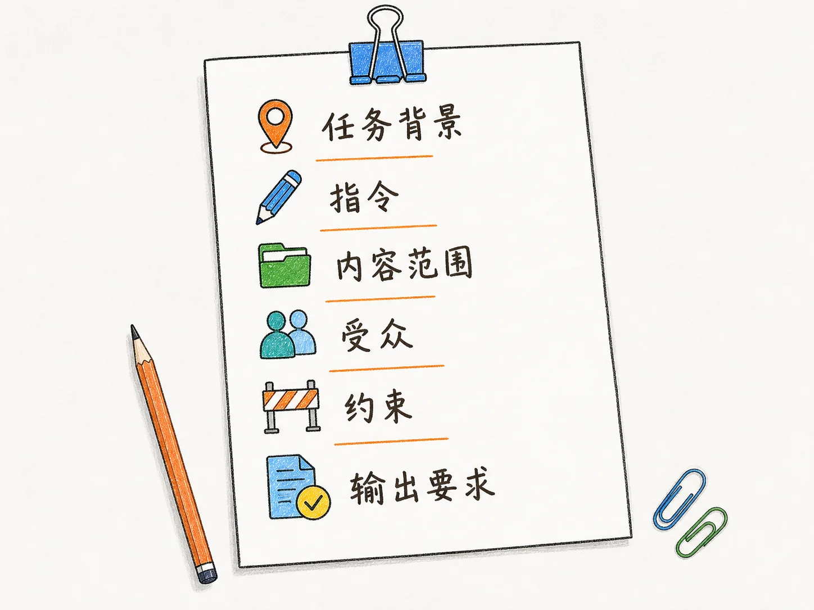
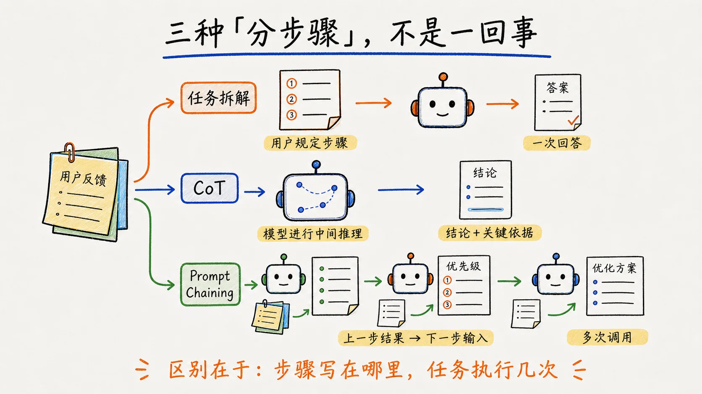
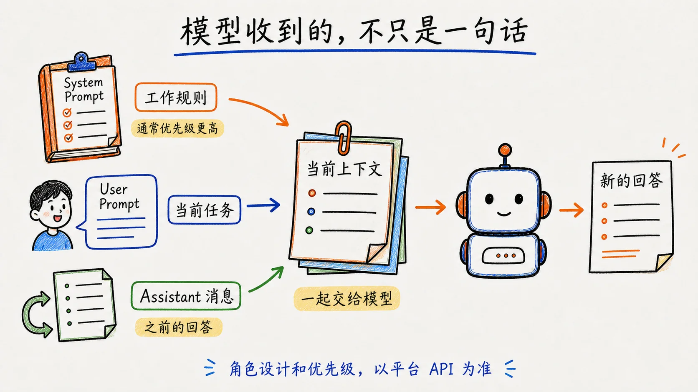
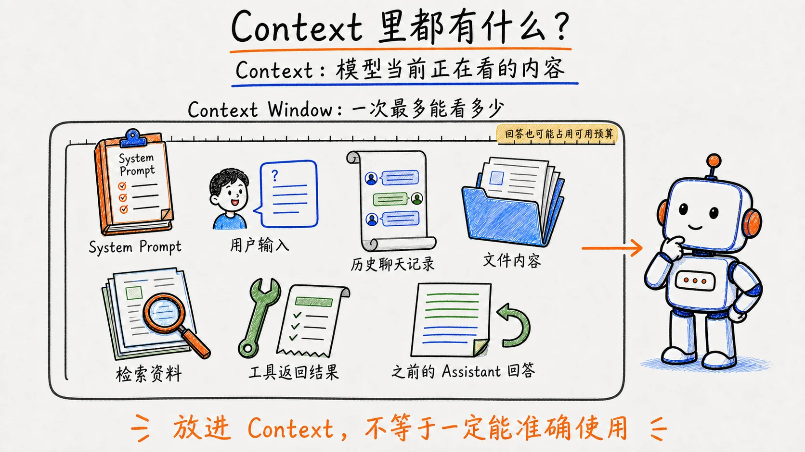

## 写在前面：Prompt 不是咒语

曾经网上有很多 ChatGPT“神级咒语”，好像只要我们参考这些“咒语”，就能得到想要的结果。模型发展到现在，对提示词的要求好像变得没有那么严格了。当然还是会有一些人，在不遗余力地教人「如何用 Prompt」。

但如果我们不懂 prompt 的底层原理，那么无论 LLM 和 Agent 如何进步，我们也很难在这纷乱的教程里，搞清楚什么才是真正有效的。与其这样漫无目的，不如好好认识下 prompt 到底是什么，自己去构建。

## 第一章：Prompt 到底是什么？

### 1.1 从 Midjourney 的关键词，到语言模型的 Prompt

我最早接触 prompt，是在用 Midjourney 的时候。那时候经常去网上找关键词库，当然也写过一份关于 Midjourney 的关键词文章。我当时理解的公式大概是：

> [主体 + 细节] → [环境 / 场景] → [风格 / 情绪] → [光影 / 技术] → [参数]

> 一个年轻的中国男性坐在椅子上弹吉他，阳光透过窗户照在他脸上 [主体 + 细节]，身后是杂乱昏暗的起居空间，胸像特写 [环境 / 场景]，富士胶片拍摄，柯达相纸冲印，强烈的电影颗粒感，传达这个时代年轻人复杂的情感 [风格 / 情绪] --ar 4:3 --v 5.2 [参数]


输入一组关键词，就能生成一张奇妙的画面。我曾以为，这就是 prompt 的全部。再后来开始更多地用大语言模型处理文档和辅助工作，在使用中对 prompt 的概念逐渐弱化，把对话式 AI 想成电脑对面坐着一个无所不知的人，觉得措辞够讨喜，它就会愿意好好干。

直到真正学习了大模型底层知识，才知道虽然它们都叫 Prompt，但承担的作用并不完全一样。图像生成里，关键词更多是在描述希望出现什么画面；语言模型里，Prompt 更像是在提供一次生成所需要的上下文和条件。

### 1.2 Prompt 如何改变模型的输出

从最基础的生成机制看，大语言模型会根据当前上下文，逐个预测接下来最可能出现的 Token。我们输入的每个字，都会改变后续内容出现的概率。那么它是如何影响模型输出的呢，举个例子：

例如，让 AI 写一篇关于人工智能的科普文章：

> 帮我写一篇介绍人工智能的文章。

如果没有更多信息，模型只能根据大量常见文章模式，生成一篇比较通用的介绍：

> 人工智能是一项利用计算机模拟人类智能的技术，已经广泛应用于医疗、教育、交通等领域……

内容没有错，但可能比较像百科介绍。

如果修改 Prompt：

> 写一篇面向普通读者的人工智能科普文章，解释大模型为什么能够和人聊天，不要使用复杂术语，多用生活中的例子。

模型会更倾向于先提出一个普通人的疑问，用类比解释技术，减少专业词汇，再按照科普文章的结构展开。

为什么会出现这种情况？因为在训练数据中，“科普文章”“普通读者”“技术解释”等信息，经常和某些表达方式一起出现。当模型接收到这些条件时，后续内容的概率分布会发生变化，更容易生成与这个场景相符的文本。

Prompt 并不是像程序一样给模型增加一条确定规则，而是在输入中增加条件，让模型更倾向于生成某一类结果。本质，就是用文字改变模型接下来会生成什么。

## 第二章：一条完整的 Prompt 包含什么？

上一章我们看到，一句话 Prompt 和补充了背景、目标、限制后的 Prompt，最终得到的结果会有明显区别。那么，一条 Prompt 中到底包含了哪些信息？


以上面的例子为例：

> 请写一篇面向普通读者的人工智能科普文章，解释大模型为什么能够和人聊天，不要使用复杂术语，多用生活中的例子。

为了方便理解，本文先把一条 Prompt 拆成四类信息：**指令 + 任务背景 + 输入材料 + 输出要求**。这不是一条必须照抄的标准公式，只是一种比较实用的检查方法。

其中：

* **指令**：写一篇人工智能科普文章；
* **任务背景**：帮助普通读者理解大模型为什么能够和人聊天；
* **输出要求**：使用生活化表达，避免复杂术语。

这条 Prompt 没有提供输入材料。“大模型为什么能够聊天”只是文章主题，不是交给模型处理的资料。如果希望文章严格依据某篇论文、某份文档或一组数据来写，还需要把这些内容一起提供给模型。

任务复杂时，还可以补充：

* **角色**：你是一名科技科普作者；
* **受众**：没有技术背景的普通读者；
* **约束**：控制篇幅、避免编造信息。

但这不是一张必须填满的表格。简单任务可能只需要一句指令：

> 把下面这句话翻译成英文。

复杂任务，例如写文章、制定方案、分析问题，就需要提供更多背景和限制，让模型更准确理解需求。

### 2.1 指令：希望模型做什么

指令是 Prompt 的起点。它首先回答一个问题： 需要完成什么任务？

比如：

> 帮我处理一下这段内容。

看似提出了需求，但“处理”并不是一个明确任务。它可能意味着：

* 总结；
* 翻译；
* 改写；
* 分类；
* 提取信息；
* 检查错误。

这些任务虽然都可以叫“处理”，但最终交付的结果完全不同。

如果改成：

> 请把下面这段技术资料改写成一篇适合公众号发布的科普文章。

模型就能明确：

* 动作：改写；
* 对象：技术资料；
* 目标结果：公众号科普文章。

所以，好的指令不一定很长，但需要让模型明确：要完成什么任务，以及最终需要得到什么结果。
常见任务动词包括：总结、翻译、改写、分类、提取、比较、分析、生成。不同动词对应不同任务。

### 2.2 任务背景：这件事为什么要做

同一个任务，放在不同背景下，结果可能完全不同。比如：

> 请写一篇关于人工智能的文章。

这句话虽然明确了主题，但模型并不知道：

* 这篇文章为什么写；
* 给谁看；
* 用在什么场景。

它可能写成：

* 人工智能的发展历史；
* AI 技术的百科介绍；
* 一篇行业分析文章；
* 一篇面向投资人的趋势报告。

如果补充背景：

> 我们正在制作一个面向普通用户的 AI 科普专栏，希望通过这篇文章帮助没有技术背景的人理解“大模型为什么能够和人聊天”。文章将发布在公众号上，作为系列文章的第一篇。

模型就知道：
这篇文章的目的不是介绍 AI 行业，也不是写技术论文，而是帮助普通读者建立基础认知。因此它会更倾向于从读者熟悉的问题切入，减少专业术语，使用生活化例子解释概念，并按照科普文章的方式组织内容。

任务背景回答的是：为什么要做这件事？这个结果最终用于什么场景？面向什么人？

### 2.3 输入材料：模型应该基于什么来做

任务背景说明为什么做，输入材料说明模型具体需要处理什么内容。

比如：

> 请根据下面提供的资料，写一篇介绍大模型为什么能够和人聊天的科普文章。

这里真正需要模型处理的，不是“人工智能”这个宽泛主题，而是提供的具体资料。例如输入材料可以包括：

* 一篇关于大语言模型原理的技术介绍；
* 一份产品说明文档；
* 一组实验数据；
* 几段访谈记录；
* 一张信息图表。

模型会基于这些材料组织内容。没有材料时，它主要依赖参数中已有的知识和当前上下文生成；有了材料，回答才有了更明确的依据。

如果任务涉及事实信息，最好明确材料的使用边界：

> 请只根据提供的资料进行总结。材料中没有提到的信息，请明确说明“资料中未提及”，不要自行补充。

这是因为语言模型非常擅长根据已有信息继续生成合理的内容。如果你提供的资料只介绍了大模型的训练方式，没有提到具体发布时间或公司信息，模型可能会根据训练数据中的相关知识补充一个看似合理的答案。但这个答案不一定来自你的材料。提前限定信息范围，可以减少模型编造不存在内容的情况。

输入材料决定模型“基于什么回答”。如果任务需要处理特定资料，明确提供依据，比让模型自由发挥更可靠。

### 2.4 输出要求：最后要交付什么

即使模型知道要完成什么任务，如果没有说明交付形式，它仍然需要自己判断：文章应该多长？采用什么结构？输出多少内容？是否需要解释？

例如：

> 请写一篇介绍大模型为什么能够和人聊天的科普文章。

这个指令已经明确了任务。但如果没有进一步说明，模型可能生成：

* 一篇几百字的简单介绍；
* 一篇完整科普长文；
* 一篇类似论文的技术说明。

如果补充：

> 请输出一篇 1500 字左右的文章，分为 4 个小标题，每部分围绕一个核心问题展开，加入 2 个生活中的例子，结尾总结全文。

模型就知道交付标准：

* 长度；
* 结构；
* 内容数量；
* 表达形式。

输出要求解决的是：模型生成的结果，是否符合实际使用需要。

### 2.5 按需补充：角色、受众和约束

前面的四个部分已经可以覆盖大多数简单任务。但对于复杂任务，还可以进一步补充角色、受众和约束，让模型更准确理解任务要求。

**角色**决定模型应该以什么视角处理任务。

例如：

> 你是一名科技科普作者，向没有技术背景的普通用户解释大模型为什么能够和人聊天。

“科技科普作者”会影响模型的表达方式：它会更倾向于使用通俗的语言、生活化的例子，而不是直接堆砌技术概念。不过，角色并不是越厉害越好。很多人喜欢写：

> 你是一名拥有二十年经验的顶级专家。

但如果任务本身已经明确，这种身份未必能带来帮助。真正有效的是与任务相关的角色，以及这个角色对应的工作标准。

**受众**决定内容最终是给谁看的。同样解释“大模型为什么能够聊天”，面向 AI 研究人员和普通用户，写法会完全不同。前者可以讨论模型架构、训练过程等专业内容；后者则需要降低术语密度，通过类比和案例帮助理解。补充受众信息，可以帮助模型调整内容深度、表达难度、专业术语数量和举例方式。

**约束**则是在告诉模型，结果不能越过哪些边界。例如：不使用复杂术语，只引用提供材料中的信息，不确定的内容请明确说明。约束可以限制：

* 信息来源；
* 字数长度；
* 语言风格；
* 输出数量；
* 遇到不确定信息时的处理方式。

### 2.6 把 Prompt 当成一份任务说明书

把前面的内容放在一起，一条完整的 Prompt 可以这样写：

> **任务背景**
>
> 我们正在制作一个面向普通用户的 AI 科普系列，希望帮助没有技术背景的人理解人工智能的发展和基本原理。第一篇文章计划介绍“大模型为什么能够和人聊天”。
>
> **指令**
>
> 请撰写一篇人工智能科普文章，解释大模型能够进行对话的基本原理。
>
> **输入材料**
>
> 请参考下面提供的资料，文章需要覆盖以下内容：
>
> * 大模型通过大量文本学习语言规律；
> * 模型根据上下文预测后续内容；
> * ChatGPT 等产品如何利用大模型生成回答。
>
> **受众**
>
> 读者没有计算机专业背景，希望通过这篇文章建立对人工智能的基本理解。
>
> **约束**
>
> 不使用未经解释的专业术语；多使用生活中的类比帮助理解；不编造未提供的数据和案例；保持客观，不夸大人工智能能力。
>
> **输出要求**
>
> * 输出一篇完整文章；
> * 包含标题和 3～5 个小标题；
> * 字数控制在 1500 字左右；
> * 文章结构按照“提出问题 → 解释原理 → 举例说明 → 总结”展开。

当然，不是每条 Prompt 都要写成这样。把这句话翻译成英文。这条 Prompt 已经足够明确，不需要再补充角色、背景和复杂约束。Prompt 写作的目标不是尽可能写长，而是把真正会影响结果的信息说清楚。基础信息已经完整，结果仍然不稳定时，才需要示例、任务拆解等增强方法。

## 第三章：Prompt 增强，示例和分步处理

### 3.1 Few-shot：用示例告诉模型“什么样才算好”

在基础 Prompt 中，我们通常通过文字告诉模型：要做什么、达到什么要求。但有些要求很难用语言准确描述。例如：写得更自然一点、风格高级一点、更有网感一些、像大厂产品文案。

这些描述看起来明确，但不同人理解可能完全不同。“自然”到底是什么？“高级”是更专业，还是更简洁？“有网感”是更年轻，还是更有传播力？模型也只能根据已有经验猜测。

这时候，与其继续增加形容词，不如直接给模型一个你认可的例子。例如，让 AI 写产品宣传文案，只说：

> 写一段智能手表新品介绍，要高级一点。

模型可能生成：

> 探索未来科技，开启智能生活新篇章……

这种表达并没有错误，但比较泛。

如果补充：

> 参考下面的风格。
>
> 普通文案：智能手表帮助你记录运动数据，关注健康状态。
>
> 优化后：每一次心跳、每一步距离，都被准确记录，让健康管理成为日常习惯。

然后要求：

> 请按照类似风格生成 3 条新品介绍。

模型就获得了一个更具体的参考标准：

* 语言节奏；
* 信息密度；
* 表达方式；
* 情绪风格。

这种通过提供示例，让模型理解任务要求的方法，就叫 Few-shot（少样本）。其中：

* Zero-shot：不给示例，直接要求模型完成任务；
* One-shot：提供一个示例；
* Few-shot：提供多个示例。

不过，Few-shot 并不是简单地“多给几个例子”。示例本身的质量非常重要。如果示例：和目标任务不一致；风格前后矛盾；存在错误信息。模型可能会学习到错误方向。同时，示例数量也不是越多越好。过多的示例会占用上下文空间，让模型需要处理更多无关信息。

Few-shot 的关键不在示例数量，而在示例是否清晰、一致，并且贴近当前任务。当一个要求很难用语言描述时，与其继续堆“自然”“高级”之类的形容词，不如直接给模型看你认为什么样才算好。

### 3.2 任务拆解、CoT 和 Prompt Chaining

面对复杂任务，可以用三种不同的方式处理。它们看起来都在“分步骤”，但不是一回事。以分析用户反馈这个任务举例：

> 分析这份用户反馈，判断产品主要问题，并给出优化建议。

**任务拆解：一次完成，但提前规定步骤**

我们可以在一条 Prompt 里告诉模型：

> 先整理反馈，再判断问题优先级，最后提出优化建议。

模型仍然只回答一次，只是按照我们安排的顺序完成任务。这就是任务拆解，关注的是我们如何提前安排处理流程。

**CoT：模型先推理，再给出答案**

CoT 关注的是模型如何从已有信息一步步推到答案。我们不必把每个操作步骤都规定死，而是让模型先分析其中的关系，再给出结论和依据。例如：

> 请判断这些问题的优先级，并说明判断依据。

现在很多推理模型会自行完成中间推理，通常没必要再要求它展示完整的思考过程。让模型给出结论和关键依据，既能帮助它处理复杂任务，也方便我们检查最后的判断从哪里来。

**Prompt Chaining：拆成多次对话或调用**

如果任务再复杂一些，可以把它真的拆开执行：

```text
第一次：整理用户反馈
          ↓
第二次：根据整理结果判断优先级
          ↓
第三次：根据优先级提出优化方案
```

上一步的结果会成为下一步的输入。这就是 Prompt Chaining（提示链）。每一步都可以单独检查，发现问题时，也只需要重新执行其中一步。

三者的区别可以这样看：

| 方法 | 谁来拆 | 执行次数 |
|---|---|---:|
| 任务拆解 | 用户提前规定处理步骤 | 一次 |
| CoT | 模型进行中间推理 | 通常一次 |
| Prompt Chaining | 用户或程序把任务拆成多个阶段 | 多次 |


### 3.3 什么时候需要增强 Prompt

Few-shot、任务拆解、CoT 和 Prompt Chaining，都可以在基础 Prompt 之外，让模型更稳定地完成复杂任务。但它们并不是每次都需要使用。

对于“把下面这句话翻译成英文”这样的简单任务，目标已经很明确，不需要额外增加示例或处理步骤。对于“总结这篇文章的三个核心观点”这样要求清楚的任务，说明任务和输出要求通常就够了。

当结果标准很难用语言描述时，可以补充 Few-shot 示例；任务包含多个处理环节时，可以提前拆解步骤；每一步都需要单独检查，或者上一步的结果要交给下一步继续处理时，可以使用 Prompt Chaining。

CoT 更适合需要推理、判断和计算的任务。现在很多推理模型会自行完成中间推理，通常没必要强行要求它“展示完整的思考过程”，让它给出结论和关键依据就够了。

Prompt 优化不是不断增加内容。可以先从最简单的 Prompt 开始，结果不稳定时，再看模型缺少的是信息、示例，还是清晰的处理步骤。

## 第四章：一条 Prompt 之外

### 4.1 System Prompt：谁在规定模型怎么工作

我们平时说 Prompt，通常指用户输入给 AI 的内容。例如：请帮我写一篇人工智能科普文章。这属于 **User Prompt（用户提示词）**，它描述的是当前这一轮希望模型完成的任务。

但模型实际接收到的信息不只有用户输入。在很多聊天式大模型 API 中，应用还会在用户消息之外提供一层优先级更高的规则，用来规定模型应该如何工作，这就是 **System Prompt（系统提示词）**。例如：

> **System Prompt**
>
> 你是一名科技科普作者，回答需要通俗易懂，不使用未经解释的专业术语。
>
> **User Prompt**
>
> 请介绍一下大模型为什么能够和人聊天。

模型最终生成内容时，会同时参考：

* System Prompt 规定的工作方式；
* User Prompt 提出的具体任务。

不同平台对消息角色的设计并不完全一样。有的平台还会提供 Developer 等角色，但思路差不多：一部分消息规定长期规则，一部分消息承载当前任务。

对话中还会出现 Assistant 消息。它不是一个专门“保存答案”的仓库，而是把模型之前的回答也放回当前对话，让模型知道前面说过什么。


System Prompt 的优先级通常高于 User Prompt，但它也不是一道绝对保险。具体有哪些角色、它们如何排序，仍然要看所用平台的 API 设计；平台本身的安全规则，也不是一条 System Prompt 就能改掉的。

### 4.2 Context：模型这一轮到底看到了什么

#### Context 是模型当前拿到的信息

和 AI 对话时，容易产生一个误解：输入的一句话，就是模型看到的全部内容。但实际上，模型生成回答时，参考的信息并不只有当前这一句话。

**Context（上下文）指的是模型在生成当前回答时，被提供并且当前可用的信息。**这些信息共同决定了模型如何理解任务。

例如，当你问：

> 帮我修改这段代码。

模型实际接收到的可能包括：

* **System Prompt**：应用提前设定的规则，例如回答方式、行为限制；
* **User Prompt**：当前提出的具体任务；
* **历史对话**：之前和模型讨论过的内容；
* **上传文件**：当前对话中提供的文档、图片、代码等；
* **RAG 检索内容**：从外部知识库中找到的相关资料；

* **工具返回结果**：搜索、计算、数据库查询等产生的信息。

这些内容只有被应用真正放进当前请求，或者通过检索、工具调用等方式返回给模型，才会成为当前 Context。把文件存在电脑里、放在某个知识库里，并不等于模型自动看得到它。

Context 并不是模型永久记住的信息。例如，当上传一份 PDF 后，模型并不是“学习”了这份 PDF，而是在当前任务中读取了其中的内容，并将它作为回答时可以参考的信息。

所以，模型知道什么，不只取决于它训练时学到了什么，也取决于当前 Context 中提供了什么信息。

#### Context Window 决定模型能看到多少信息

如果 Context 是模型当前能够访问的信息集合，那么 **Context Window（上下文窗口）** 就决定了这个集合最多能够容纳多少内容。

Context 是“模型正在看的内容”，Context Window 是“模型最多能看多少内容”。

例如，一个模型支持 **128K Context Window**，意味着它一次最多可以处理大约 128K 个 Token 的上下文信息。
这些 Token 包括：

* System Prompt；
* 用户输入；
* 历史聊天记录；
* 文件内容；
* 检索资料；
* 工具返回结果；
* 之前的 Assistant 回答。

当前这次准备生成的回答，也可能需要占用可用的 Token 预算。不同模型和 API 对输入、输出的计算方式不完全一样，不能只看一个“128K”就默认所有空间都能用来塞资料。

当信息量没有超过窗口限制时，模型可以综合这些内容回答问题；但当内容越来越多，超过模型能够处理的范围时，前面的信息可能被截断、压缩，无法继续参与生成。

这也是为什么长对话中有时会出现：“之前明明说过，为什么现在不知道？”有时是那段内容已经不在当前上下文里；有时它还在，只是上下文太长、位置不显眼，模型没有有效利用。放进 Context，不等于模型一定能准确找到并使用。

因此，在处理长对话或复杂任务时，需要主动管理 Context：

* 提炼重要信息；
* 总结之前的讨论；
* 保留关键背景；
* 删除无关内容。

到这里也就能看出，Prompt 不是孤零零的一句话。User Prompt 负责当前要做什么，System Prompt 放着更长期的规则，它们和历史对话、文件、检索结果一起组成 Context。很多时候，不是某句“咒语”失效了，而是该给的信息根本没有进入模型这一轮能看到的内容里。

## 参考资料

- [Prompt Engineering Guide](https://www.promptingguide.ai/zh)
- [Best practices for prompt engineering](https://claude.com/blog/best-practices-for-prompt-engineering)
- [Chain-of-Thought Prompting Elicits Reasoning in Large Language Models](https://arxiv.org/abs/2201.11903)
- [提示工程学习笔记](https://www.aneasystone.com/archives/2024/01/prompt-engineering-notes.html)
- [AI 通识课 · 为中文学习者设计的 AI 入门课](https://aipath.buynao.com/#/lesson/16-prompt-engineering)

