用了很长时间的 AI，我却一直不明白大模型到底是什么。它对我来说像一个黑盒子，我知道怎么输入问题，也能看到它给出答案，却不知道文字进入模型以后发生了什么。

AI 用得越多，越发现自己的局限性。热点做什么，我就做什么，不清楚这样做的原理，久而久之没有太大进步。这段时间，我重新读了一些大模型的资料，决定将这些问题进行一步步拆解，在自己学习的同时，也能做一个 AI 认知介绍。

## 什么是大模型

### 什么是模型

在理解大模型之前，我们先理解什么是模型。模型本质其实就是一个函数，y = f(x)，输入一个 x，输出一个 y，这是我们学过最简单的一个函数，也叫做模型。比如，x 是体重和身高，y 是 BMI，叫模型。x 是今天的所有气象数据，y 是明天会不会下雨，所谓模型，本质上就是一种输入到输出的映射关系。

在计算机里，最简单的模型是什么？其实就是 if 语句。定好 if 条件后，输入条件，输出结果，这种模型的特点是：规则是人定的。程序里有多少条规则，你就写多少条代码。每条规则都能看懂，每个结果都知道为什么出现。

但如果规则多到人写不完呢？如果规则本身是模糊的呢？这时候就需要另一种模型，不是人定规则，而是机器从数据里自己找规律。

### 什么是大语言模型

大语言模型（Large Language Model，LLM）是一种基于[人工神经网络](https://zh.wikipedia.org/wiki/%E4%BA%BA%E5%B7%A5%E7%A5%9E%E7%BB%8F%E7%BD%91%E7%BB%9C)的[语言模型](https://zh.wikipedia.org/wiki/%E8%AF%AD%E8%A8%80%E6%A8%A1%E5%9E%8B)，通过在海量文本数据上训练，学会理解和生成人类语言。它的“大”体现在三个方面：参数量大、训练数据量大、计算量大。

但是，与模型不同的是，大模型并不是按照固定规则输出结果，它的本质是一个超级概率预测引擎。它并不真正“理解”世界，而是通过阅读海量文本，学习了人类语言的统计规律。它真正在做的事情，就是不断预测“下一个最可能出现的词（Token）是什么”。

好了，说到这里，我们还是很难理解大模型到底是什么。接下来，让我们一起去构建一个大模型。在这个过程中，我们会接触许多概念，理解每一步的变化，以及每一步存在的意义，从而最终重新认识这个黑匣子内部。

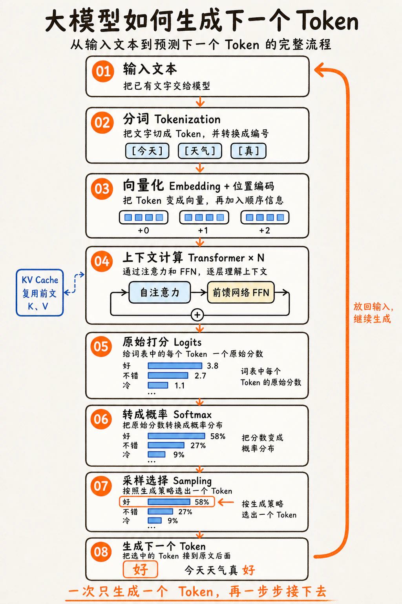

## 1.数据来源与文本整理

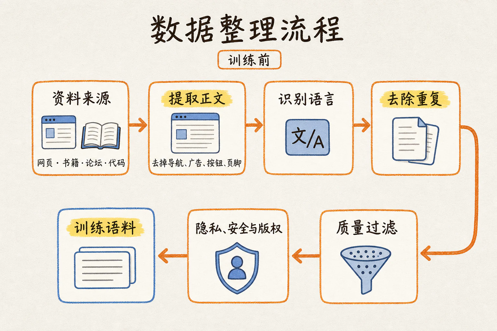

现在，我们需要通过各种方式，去搜集海量文本。那么这些内容去哪里搜集呢？

第一个是 Common Crawl：一个非营利组织，大约每月发布一次网页抓取数据，每批通常包含数十亿个网页。Common Crawl 及其衍生语料，是许多大模型训练数据的重要来源之一。其次，爬虫也会访问各种公开资源，新闻机构、维基百科、论坛社区、公共书籍库、以及代码仓库（如 GitHub）等。

爬虫抓取回来的原始数据通常是 HTML 代码，里面混杂了大量对模型训练无用的“噪声”，因此我们需通过启发式算法来判断哪些是“内容”，哪些是“装饰元素”。去除导航、标签等内容。

其次，我们也要对语言进行过滤，如果想训练一个以中文为主的模型，那就需要设定一个阈值，比如中文内容占比 51% 以上的网页进行保留，否则就删除。因此会把大量英文、日文、韩文、阿拉伯文等其他语言的页面给过滤掉。如果对于多语言模型，则需要按照预设比例保留各语种的数据。

下一步就是去重，我们在网上经常能看到内容被转载过来，转载过去，因此，对搜集的语料，需要进行去重，来节省算力。去重有很多方法，使用哈希值进行精确和近似去重，也可以使用 URL 进行去重等。

去重后，内容还有大量低质量文本，比如一些机器生成的内容，营销号内容、垃圾页面等。高质量内容对模型质量非常重要，因此，有一种做法，训练一个小模型，对内容质量进行打分，先人工标注高质量、低质量，作为训练数据让机器去学习，然后对这个文本库进行扫描筛选。

最后，互联网内容里包含大量个人信息，以及暴力、仇恨言论等违法内容。这些进入训练数据会有法律风险和伦理问题。因此需要对这些隐私内容进行脱敏，对有害信息进行过滤，并且对于涉及到版权的内容进行处理。

经过以上步骤，我们终于将原始数据，筛选出高质量文本内容。内容涵盖人类知识的方方面面，可以称为超级百科全书了。

## 2.Tokenization（分词）

我们都听过 Token 这个词，现在官方定义为“词元”。并且，我们在使用 AI 时，经常看到消耗了多少 Token，那它到底是什么呢？模型是不认识文字的，它只认识数字。所以拿到文本内容之后，第一件事就是把文本转成一串数字。这个转换过程叫分词，切出来的每个小块叫 Token。

一个 Token（词元）可以是完整的字、组合字、单词、单词的一部分、标点符号、空格，甚至是一些特殊的东西，比如代码、表情符号或名称等。 它是大语言模型处理文本的基本单位。为什么 Token要切成这个样子呢，这个其实是无奈的选择。

如果按字切的话，一个Token 是一个文字，这种切法优点是：词表很小（中文字典也就几万个），不会有「没见过」的情况。缺点是：同样的信息量需要更长的序列来表达。一个词「苹果」变成两个字「苹」「果」，模型要跨两个 token 才能理解一个完整语义。序列越长，计算量越大。这种方法像用米粒砌墙：什么都能砌，就是太慢太贵。

如果按词切的话，一个 Token 是一个词， 这种切法的优点：一个词就是一个语义单元，表达效率最高。缺点：世界上的词几乎数不完，并且随着时代发展，新词不断在产生，无穷无尽。词表不可能装下所有词，总有「没见过」的词。遇到生词只能标记为 <UNK>，信息直接丢失。这种方法就像只用预制房间盖楼：图纸上没有的户型就盖不了。

所以实际用的是折中方案：子词分词（Subword Tokenization）。这里面有个核心概念，叫做 BPE（Byte Pair Encoding），它是GPT系列大模型使用的核心算法，思路是，从最基本的单元（字符/字节）开始，反复把最常一起出现的相邻 pair 合并成一个新 token。

对英文来说：

1. 起点：把所有训练文本拆成单个字符（或字节），每个字符就是一个 token。比如 "flower" 切成 f l o w e r；
2. 统计：查遍整个语料，找出出现次数最多的相邻 token 对。比如 e 和 r 经常挨着出现；
3. 合并： 把最高频的那对合并成一个新 token，比如 e 和 r → er，加入词表。"flower" 变成f l o w er；
4. 重复：继续统计、合并。下一轮可能是 l 和 o 合并成 lo，也可能是 er 和某个符号合并；
5. 停止：重复几万次后；，停止合并。

结果： 词表里同时有 flo、er、wer。常见的词会被完整保留（the、is、fower），不常见的词会被拆成子词（unsurprisingly → un + surprising + ly）。

对中文来说：
1. 起点：中文的起点是每个字是一个Token。比如「我喜欢吃苹果」切成 我 / 喜 / 欢 / 吃 / 苹 / 果；
2. 统计：查遍整个语料，找出出现次数最多的相邻 token 对。比如「苹」和「果」在语料里总是挨着出现，频率极高；「我」和「们」也是；
3. 合并：把最高频的那对合并成一个新 token，加入词表，比如「苹 v+「果」→「苹果」，于是「我喜欢吃苹果」从 6 个 token 变成 我 / 喜 / 欢 / 吃 / 苹果（5 个 token）；
4. 重复：继续统计、合并。上一步合并后产生了新的相邻关系——「吃」和「苹果」现在挨着了。如果「吃苹果」在整个语料里也高频，下一轮可能就合并成「吃苹果」，同时，「喜欢」大概率也很高频，也会在某一轮被合并。
5. 停止：重复几万次后；，停止合并。

结果： 最终词表里同时有：我、们、我们、喜、欢、喜欢、吃、苹、果、苹果、吃苹果……高频词组被整块保留，低频组合保持单字。同一个「果」字，在「苹果」里是一个 token 的一部分，在「果实」里可能是独立的——取决于「果实」在语料里的频率够不够高。

每合并一次，词表就多一个 token。词表大小是人为设定的超参数（hyperparameters），训练前拍板，训练中不改——太小则语义密度低，太大则浪费参数在低频 token 上。

经过分词后，“我喜欢吃苹果”可能被转换成类似下面的结果：

> 我 / 喜欢 / 吃 / 苹果 → [2769, 18526, 3221, 99814]

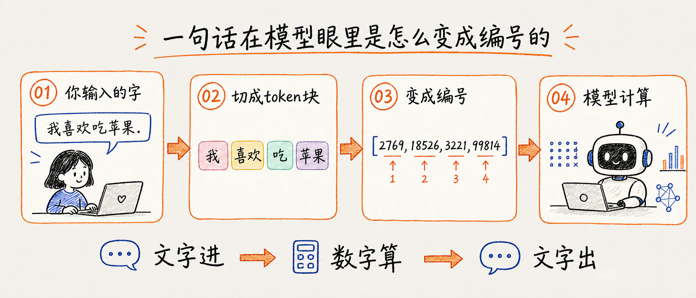

反之，也成立， 模型每算完一个新编号，系统就立刻把它翻译成文字发到屏幕上 —— 这就是 ChatGPT、Claude 回答时字一小段一小段往外“蹦”的原因。蹦出来的最小单位是 token 块，不是字，所以偶尔会先蹦出半个词，下一拍才补全。

负责「文字」「编号」来回翻译的程序叫分词器（tokenizer），它就像站在模型门口的翻译官。不同的模型使用不同的分词器，而同一个句子在不同的模型下可能会被分成不同数量的词元。

## 3.Embedding（向量嵌入）

分词之后，“我喜欢吃苹果”变成了 `[2769, 18526, 3221, 99814]`。但是这些数字本身没有语义关系，只是标签，没有任何含义。假设大模型的词库里：苹果 的 ID 是 1234；香蕉 的 ID 是 567；汽车 的 ID 是 8902。在计算机的数学计算里，567 和 8902 的距离，跟 1234 和 567 的距离，没有任何语义上的区别。计算机根本不知道“苹果”和“香蕉”都是水果，而“汽车”是交通工具。如果直接拿这些 ID 去训练模型，模型学到的只会是毫无意义的数字大小关系。

所以下一步是嵌入（Embedding），把这些 token ID 映射到高维向量空间，让语义接近的词在数学上也接近。 高维向量空间不是一个物理上的空房间，只是一个数学结构。在这里，「高维」并不指向我们能在现实中感知的一维、二维、三维空间——它只是事物属性的叠加。一个 token 用 4096 个数字来表示，意思就是这个 token 有 4096 种属性。类比一下：用 3 个数字描述一个人——身高、体重、年龄——这个人的特征向量就是 3 维的。想描述得更细，多加指标——收入、学历、城市坐标、每天睡眠时长——每加一个指标就多一维。4096 个数字，就是用 4096 种指标来刻画一个 token。但跟身高体重不一样——这些「指标」没有标签。你永远不知道第 7 个数字代表什么，第 389 个代表什么。所有维度合在一起才产生意义，单独拎一个出来无法解释。

这个向量空间在模型里的实现形式，就是嵌入矩阵——一个巨大的二维表格。行数是词表大小，列数是维度数。词表 100,000 个 token、维度 4096，矩阵就是 100000 行 × 4096 列。矩阵的每一行，就是一个 token 的向量。

技术上，Embedding 就是一个查表操作。token ID 1234 进来，去矩阵里取第 1234 行，得到一个 4096 维的浮点数数组。这一步不涉及任何计算，就是索引取值。

但概念上，这是整个流程里最重要的转折点。在此之前，token 是离散的标签——两个 token 之间要么相同，要么不同，没有中间状态。在此之后，每个 token 是一个高维坐标点——可以被比较远近、被加减运算。训练刚开始时，嵌入矩阵里的数字是随机初始化的。拿到的向量只是一串乱数：

> 苹果 = [0.7292, -0.3786, 0.1065, 0.3674, 0.1902, -0.7881, ...]

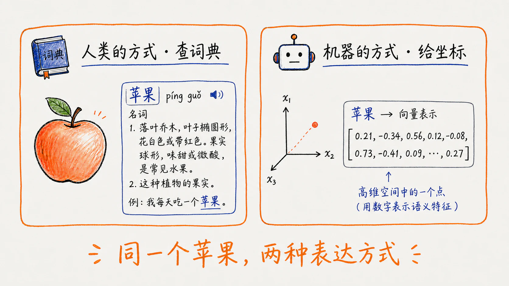

此时「苹果」和「香蕉」谁离谁近，完全看运气。但随着模型在海量文本上反复训练，这些数字会不断被调整——最终，出现在相似上下文中的 token，向量逐渐被拉到相近的位置。「苹果」和「香蕉」靠近，「苹果」和「汽车」远离。这种语义结构不是人规定的，是统计规律在训练中自动浮现的。

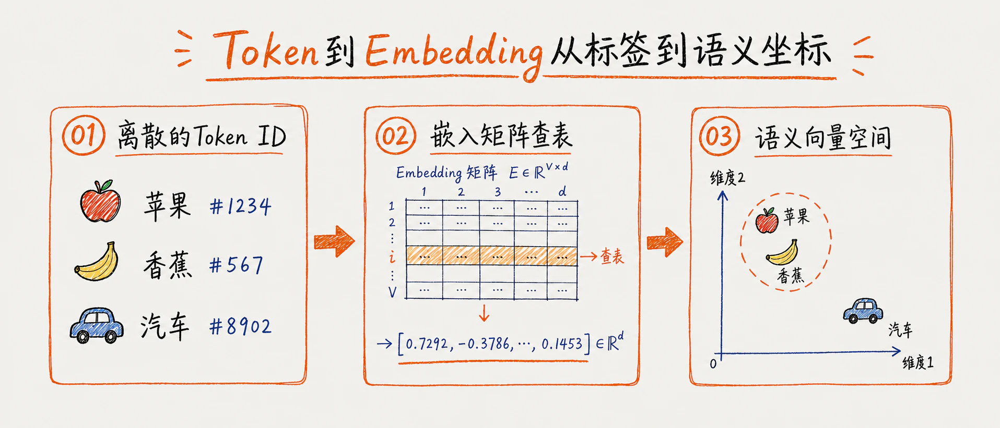

嵌入向量准备好之后，还有一个问题要解决：这些向量没有位置信息。「我喜欢吃苹果」和「苹果喜欢吃我」，四个 token 的向量一模一样——同一个词在任何位置的嵌入都是一样的。注意力机制同时看所有 token，它分不清谁先谁后。

所以在进入 Transformer 之前，每个 token 的嵌入向量会加上一个位置编码（Positional Encodings）——一个同样维度的向量，编码了「这是第几个词」的信息。

位置编码有不同做法。现在最主流的是 RoPE——直接把位置信息编码进注意力计算里，不往 embedding 上加东西。这里以经典的正弦位置编码为例——做法很简单：给每个位置编一个独一无二的向量，直接加到 embedding 上。位置 0 有一个向量 p₀，位置 1 有一个 p₁，位置 2 有一个 p₂……相邻位置的向量更接近，远距离的差距更大——p₃ 和 p₄ 的距离，比 p₃ 和 p₃₀₀ 的距离小得多。

这些位置向量是提前算好的，训练过程中不变。细节不重要，只需要知道结果：每个位置有了独一无二的「位置指纹」。把指纹往 embedding 上一加，同一个「苹果」在第 3 位和第 10 位就有了不同的向量——语义还是「苹果」，但带上了位置信息。

至此，每个 token 知道自己在哪了。但它还不知道自己跟谁在一起——位置编码只管「第几个」，不管「旁边是谁」。这个问题，只有注意力机制能解决。

## 4.Attention（注意力）

现在每个 token 有了语义身份，也有了位置标签。但还有两个关键问题没解决。

第一，同一个「果」在「苹果」和「果然」里，向量完全一样。位置编码帮不上忙——它只管位置，不管「果」前面是「苹」还是「然」。这个 token 还不知道自己身处什么语境。第二，所有 token 彼此孤立。「吃」不知道前面是「我喜欢」，后面是「苹果」。每个 token 还活在自己的格子里。接下来要做的，就是让这些向量互相看见，让上下文信息在它们之间流动。这就是注意力机制。

比如这句话：

> 我昨天在图书馆看了一本书，它非常有趣。

我们读这句话很容易——「它」指的是「书」，不是「图书馆」。但这个判断需要回头看前面的词，比较、筛选，然后把注意力放在正确的地方。模型也需要同样的能力。当它处理「它」这个词时，需要扫一遍前面所有的词——「我」「昨天」「在」「图书馆」「看了」「一本」「书」——然后决定：谁和「它」最相关？答案是「书」。

所以「书」应该获得最高的注意力权重，「图书馆」次之，「昨天」几乎不需要关注。这就是注意力机制在做的事：每处理一个词，就看一遍前面所有词，给每个词打分，然后按分数高低提取信息。具体如何打分呢，注意力机制主要通过三个步骤：

第一步：给每个Token 准备三个档案：模型用三个权重矩阵（训练中学出来的）分别乘以它的向量，生成三个新向量，分别是Q（Query提问单）、K （Key索引标签）、V(Value内容)。

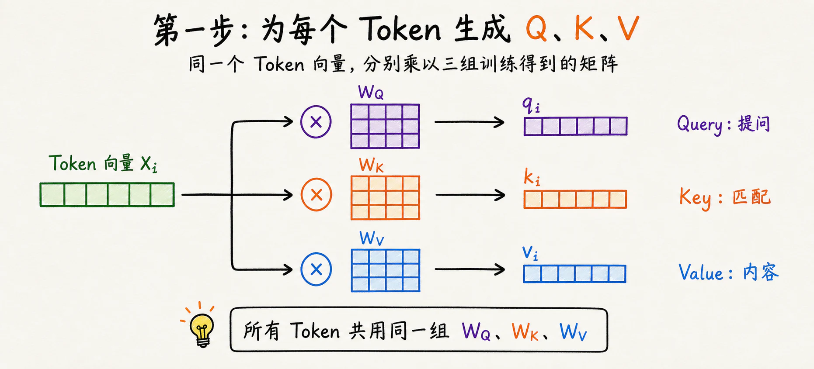

Q（Query）可以暂时理解为“这个位置正在找什么”；K（Key）表示“这个位置可以怎样被匹配”；V（Value）则是匹配成功后参与汇总的内容。把它们类比成搜索词、索引和正文有助于建立直觉，但它们本质上都是训练得到的向量，没有人直接给某一维写上“代词”或“名词”的标签。

第二步：用 Q 去扫描所有 K，打分
「它」拿着自己的 Q，跟前面每一个词的 K 做点积运算（对应位置相乘再求和）。算出来的数字就是注意力分数——分数越高，说明那个位置跟「它」越相关。对「书」的分数很高，对「图书馆」中等，对「昨天」很低。

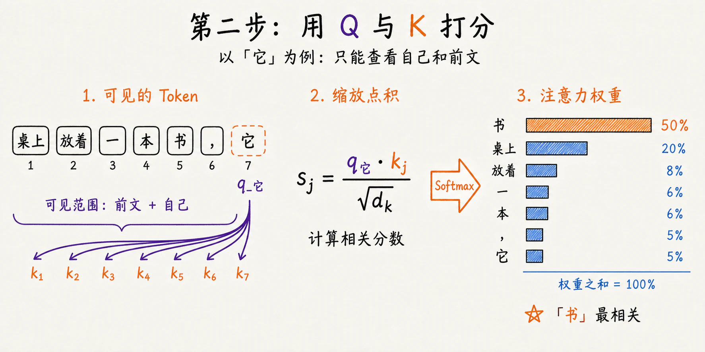

这里有一条关键规则：Masked Self-Attention（掩码注意力）。 模型在预测下一个词时，不能偷看后面的词。所以所有「未来位置」的分数被强制设为负无穷——经过下一步之后，这些位置的权重直接变成 0。当前词只能看到自己及之前的词。然后所有分数过一遍 Softmax，变成一组 0 到 1 之间的权重，加起来等于 1。这组权重就是「注意力分布」。

第三步：按分数加权，汇总 Value
拿到每个词的权重之后，把权重乘到对应的 V 上，然后全部加起来。

「书」权重最高，它的 V 被大量提取。「昨天」权重接近 0，它的 V 几乎被忽略。加完得到一个新向量——这就是「它」经过注意力之后的输出。这个输出不再是孤立的「它」，而是融合了「书」的信息、「图书馆」的信息、以及少量其他词信息的混合表示。换句话说，「它」已经知道自己在指什么了。

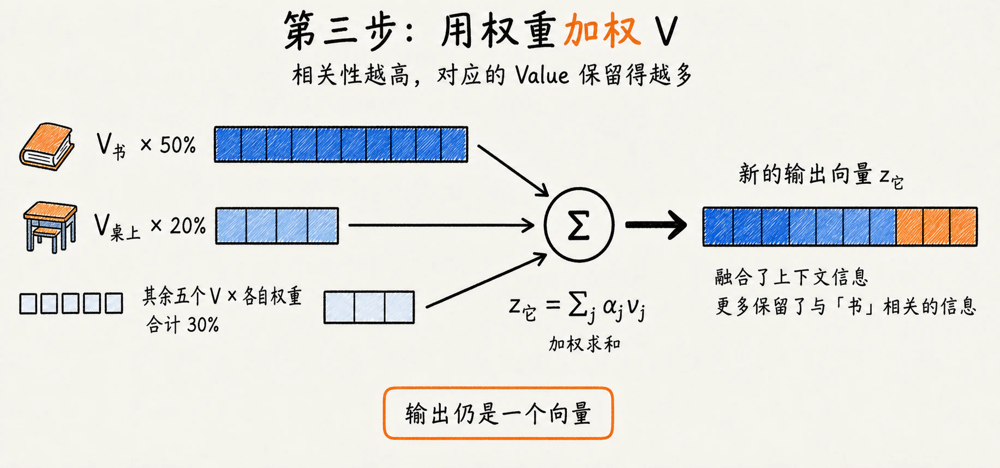

序列里的每个 token 都在同时走这三步。一轮注意力下来，每个词都变成了融合上下文之后的自己。不再有孤立的向量。当然，刚开始训练时，那三个权重矩阵全是随机的。Q/K/V 什么都查不到，注意力分数毫无意义。模型能学会「它应该关注书而不是图书馆」，是海量训练中反复试错调出来的。

回到本节开头那两件事：「果」在「苹果」里和「果然」里向量不一样了吗？一轮注意力之后，是的。因为「果」关注了「苹」，从「苹」的 V 里提取了信息，混合后的向量自然不同于关注了「然」的那个「果」。语境问题解决了。「吃」还孤立吗？不孤立了。它关注了「我」「喜欢」，也被「苹果」关注。每个 token 都带了别人的影子。孤立问题也解决了。一轮注意力，就是一轮互相看。互相看完，每个人都不一样了。

### 多头注意力

上面讲的是一组注意力——一个 token 生成一组 Q/K/V，跑一轮，得出一个融合了上下文的新向量。

但语言里的依赖关系不止一种。比如「它」这个词，同时牵涉好几件事：指代关系（指「书」）、语法搭配（后面要接谓语）、语义关联（跟「图书馆」天然相关）、位置感知（在句末）。一组 Q/K/V 不是做不到，而是所有信号挤进同一个矩阵，训练时梯度混在一起，模型倾向于和稀泥——每种关系都会一点，哪种都不精。

多头的想法很简单：既然一组容易和稀泥，那就拆成多组，每组在自己的小空间里独立算。具体做法：以 GPT-3 175B 为例，12288 维的输入分别经过 Q、K、V 线性投影，再重排为 96 个头，每个头的维度为 128。各个头分别计算注意力，最后再将结果拼接起来。

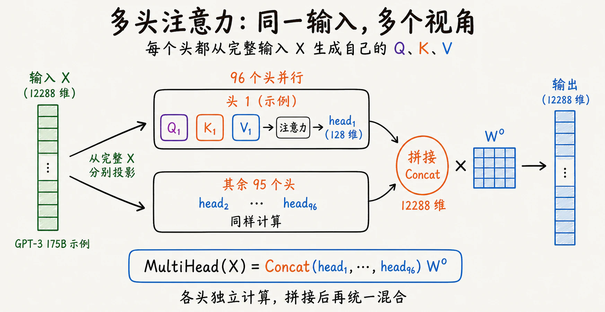

这里有一个关键点：没有人事先规定「头 1 管指代、头 2 管语法、头 3 管位置」。设计者只决定了「拆成 96 组」这个结构，没分配具体任务。每组权重矩阵从不同的随机起点出发，训练中接收不同的梯度信号，自然走向不同的方向——有的擅长语法，有的擅长指代，有的擅长语义。分化是训练中自己发生的，不是人安排的。

96 个头算完，得到 96 个 128 维的输出。最后一步：全部拼回去，恢复成 12288 维，过一个线性投影（乘一个矩阵），把各头的信息混合一下——头 1 发现了指代，头 3 发现了语法，投影这一步让它们互相渗透。拆开不是为了省参数——总参数量完全一样。真正的收益不在参数上，在决策机制上。单头注意力只有一个 Softmax，只能给出一组权重。指代、语法、语义全挤在这组权重里，互相妥协。多头的 96 个 Softmax 各自独立决策——一组专注指代，一组专注语法，一组专注位置——最后拼起来。

## 5.FFN（前馈神经网络）

我们上面算完了注意力，以它为例，「它」的向量 = 书的 V × 50% + 图书馆的 V × 20% + 昨天的 V × 2%，这个本质上是一个「加权求和」。但是，加权求和只是单纯搬运概念，无法发现新的东西。

它知道了自己指代书，但是，它现在知道下一句该接什么吗？按我们人类的理解，既然「它=书」，那后面可以接「很有趣」「很厚」「讲的是 AI」——这些都合理。但「它=书」这个事实，跟「后面可以接什么」之间，还差了一步推理。这步推理需要的不是从别处抄信息，而是把当前信息跟自己脑子里存的知识做匹配。

所以接下来还需要做一件事：把「书」的信息跟「自己」的信息整合、转换、提纯——生成一个真正新的、属于「它」自己的表示。这就需要前馈神经网络 Feed-Forward Network 去做。在讲前馈神经网络FFN 之前，我们先讲神经元概念。

### 神经元

我们都在高中生物学过神经元，就是我们大脑和神经系统中最基本的“信息处理单元”，但是计算机概念中的神经元只是借用了这个名字的简单函数。它并非真正的“人造脑细胞”。一个神经元做的事很简单：接收一串数字，各自乘一个权重，加总，加一个偏置，然后过一个激活函数。用公式写就是：

> y = φ(w₁x₁ + w₂x₂ + … + wₙxₙ + b)

W 权重和偏置 B 是训练中学出来的，激活函数是人为选的。
1. 权重 W （weight） ：每个输入的重要性。正权重加分、负权重减分，绝对值越大影响越大。关键在于：训练完成后的权重，主要是机器从数据里学出来的 —— 所谓“训练”，调的就是它；
2. 偏置 B （bias）：决定门槛高低。偏置高，神经元轻易触发；偏置低，得攒够很多正分才触发;
3. 激活函数（activation function）：把分数 z 转成最终输出的最后一道工序。sigmoid（常见 S 型激活函数）把任何分数压进 0~1，像一个“可能性”；ReLU（rectified linear unit）更干脆：负分一律归零，正分原样放行。为什么要激活函数？如果没有它，不管叠多少层，本质上还是在做线性变换——可以把整个网络压缩成一层，白叠了。激活函数加了一个「弯」，让网络能表达曲线、边界、条件——非线性，这就是深度学习的力量。

比如以决定今天要不要出门跑步为例，看一个神经元的工作内容：
▎ 输入：天气好不好、有没有空、昨晚睡没睡好、空气差不差
▎ 权重：天气最重要（0.8），有没有空次之（0.5），睡没睡好（0.3），空气（-0.5，差了就扣分）
▎ 偏置：-0.1（这个人天生就不太爱动）

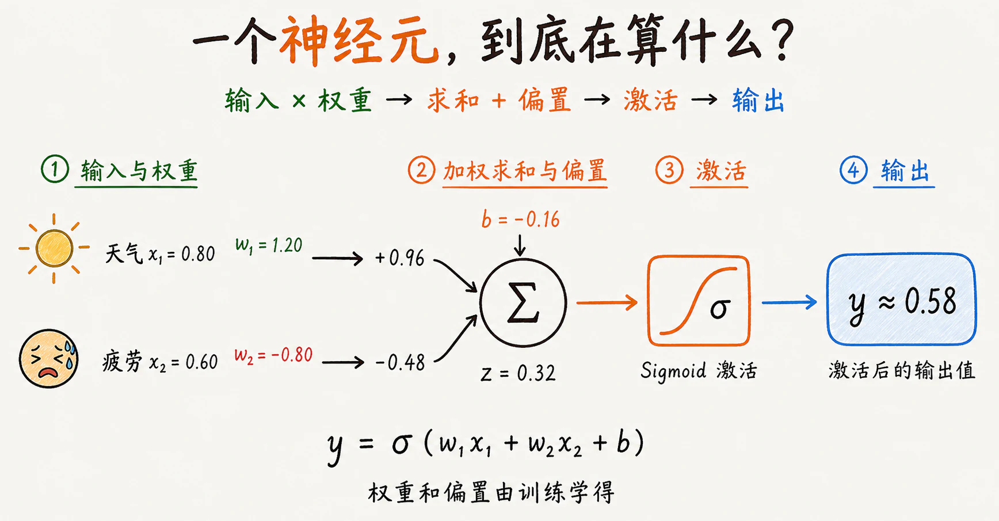

但是一个神经元对于复杂计算来说是远远不够的，现实中是几百几千个神经元排成一层，各自独立计算，就是一层前馈网络（Feed-Forward Network，FFN）。「前馈」是什么意思呢，就是信息单向流动，输入从第一层进去，算完传给第二层，算完输出。不会把结果传回给上一层，也不会在同一层里循环。

它是怎么工作的，以 GPT-3 和经典 Transformer 的 FFN 为例：输入向量 → 第一层全连接（升维到 4 倍）→ GELU 激活 → 第二层全连接（降回原维度）→ 输出。假设输入一个 4096 维的向量。
1. 第一层（升维）：把 4096 维放大到 16384 维（通常是 4 倍）。可以这样理解：注意力收集回来的信息是混合的——指代、语法、语义全挤在同一个向量里。升维就像把词扔到显微镜下，原本挤在一起的各个特征被展开到更高维的空间里，有了各自的「跑道」。
2. 激活函数（GELU）：夹在两层之间。把重要的特征放行，把不重要的压下去。激活函数不是开关一样非开即关——GELU 是平滑过渡的，负值不会被清零，而是被压到接近零的小数。梯度流动更顺畅，训练更稳定。
3. 第二层（降维）：把 16384 维压回 4096 维。经过升维展开和激活筛选之后，留下的重要特征被重新打包，浓缩成和输入同样大小的向量。

升了又降，不是多此一举。注意力收集回来的信息是混合的——指代、语法、语义全挤在一个向量里。升维给这些特征腾出空间，该增强的增强，该抑制的抑制。处理完压回来，尺寸不变，交给下一层。

到这里，可以看清两种运算方式的区别：
注意力是横向的（跨 token）。每个 token 的结果依赖其他 token——「苹果」的新向量里，包含了从「吃」「我」拉过来的信息。它打破了词与词之间的物理距离，信息横向流动。
FFN 是纵向的（单 token 深入）。 「苹果」进 FFN，出来一个新的自己。这个过程中不碰其他任何 token。它做的是向下挖掘——把当前向量里的信息一层层拆开、筛选、重组。

大模型之所以强大，在于它同时拥有横向的广度和纵向的深度。

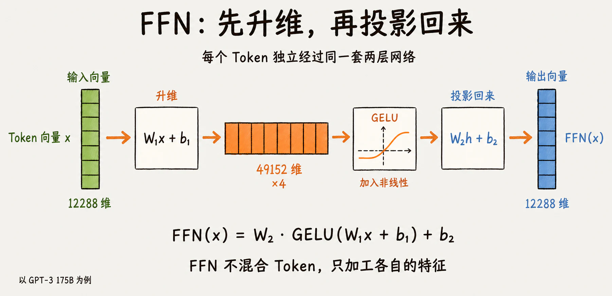

## 6.Transformer Block：把这些零件组合起来

注意力让 token 互相交流，FFN 让每个 token 独立消化。但只有这两个零件，几十层堆不起来。还需要两个辅件：RMSNorm 和残差连接。

1. RMSNorm（均方根归一化） Root Mean Square Layer Normalization
站在注意力前面一次，FFN 前面一次。功能是把向量里的数值重新缩放到稳定范围。没有它，向量经过几十层加工，数值会逐层放大或缩小，最终训练崩溃。归一化放在子模块之前，而非之后。

2. 残差连接
注意力层和 FFN 层的输出，各自加上该层的原始输入。每个子模块不管算出什么，原始输入原样保留。两层作用：第一，原始信息不会被任何一层「弄丢」，哪怕这一层什么都没学到，向量原样通过。第二，反向传播时梯度多了一条直通浅层的路径，衰减问题大幅缓解——几十上百层深度网络因此才能训练。

至此，经过输入→「RMSNorm → 注意力 → +残差」 →「RMSNorm → FFN → +残差」→输出，一个 Transformer Block 就形成了，然后在此基础上反复堆叠几十上百次。底层可能只是在抓相邻词的关系和简单词性，中层开始理清短语结构和语义角色，高层已经能跨段落做逻辑推理。到最后一层时，每个 token 的向量已经和最初那个嵌入向量完全不同——它既吃透了整句话的上下文，又经过了反复的独立加工。

GPT-3 堆了 96 个 Transformer Block，串在一起。

> 输入 → Block₁ → Block₂ → Block₃ → …… → Block₉₆ → 输出

层内并行（96 个头同时跑），层间串行（第 2 层必须等第 1 层算完）。每层都在上一层的输出基础上继续加工。不同层自然分化出不同职责。发现大致规律是：浅层（靠近输入）学局部语法——相邻词的搭配、词性关系。中层学句法结构——主谓宾、从句嵌套。深层（靠近输出）学语义和指代——远距离的关联。不是人安排的，是堆了 96 层之后训练中自然涌现的。

一层一层往上走，向量里的信息越来越抽象、越来越融合了全局语境。96 层跑完，最后一个 token 的向量已经不是一个词，而是一个携带了整句话理解的压缩表示。

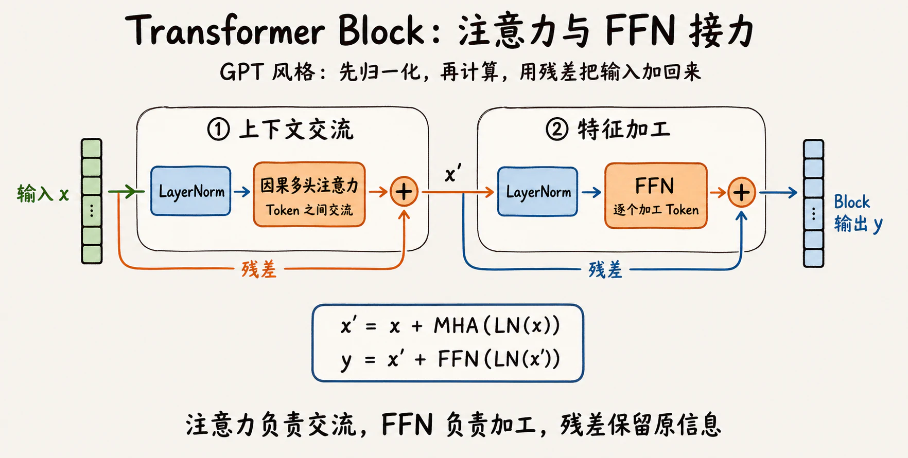

## 7.Logits：词表中每个 Token 的原始分数

把这个向量映射到词表。做法是乘一个投影矩阵：比如 4096 维 → 100000 维（词表大小）。比如当前 Token 是4096维度（X1、X2、…X4096），词表的每个 Token 也是 4096维度（W1、W2、…W4096），因此需要计算 Logits=（X1W1+X2W2+…X4096W4096），如果词表中有 100000 个 Token，模型就会得到 100000 个 Logit，每个候选 Token 对应一个原始分数。

Logits就像我们考试一样，得多少分—不同的是这个可能有正有负。一个 token 的 Logit 越高，模型越倾向于认为它适合出现在这个位置。但这个「高」还没有概率含义。

## 8.Softmax：把分数变成概率分布

Softmax 会把所有 Logit 转换成一组 0 到 1 之间、总和为 1 的数：

> P(tokenᵢ) = e^(zᵢ/T) / Σⱼ e^(zⱼ/T)

这里的 zᵢ 是第 i 个 Token 的 Logit，T 是 Temperature（温度）。得到的概率表示：在模型已经看到当前上下文的条件下，每个 Token 作为下一项的相对可能性。比如「书」：87%　　「本」：9%　　「图书馆」：3%　，大部分 token 的概率低到可以忽略。

### Temperature：改变分布的形状

Softmax 有一个参数，温度T。用来调节概率分布的尖锐或平滑程度。温度T有三种情况：

- T = 1（默认，不缩放）， 保持模型原始的概率分布，高概率词容易出头，低概率词也有机会。
- T < 1（低温，比如 0.3）：概率分布更尖锐， 高概率词的概率更高，低概率词的概率更低。模型变得更“确定”、“保守”，倾向选最安全的词，输出通常更加稳定、一致，但并不意味着事实或推理一定更正确。
- T > 1（高温，比如 1.5）：概率分布变得平缓， 原本小概率的词获得相对更高的概率，大概率词的优势被削弱。模型变得更“冒险”、“有创造力”，输出更多样，但也可能不合逻辑、天马行空。

极端情况：T → 0：相当于“谁分数高就选谁”，变成贪婪解码，几乎完全确定。T → ∞：分布趋近均匀，等于在所有词里瞎蒙，输出毫无意义。

## 9.Sampling：怎样从概率分布中选一个 Token

Temperature 只能改变概率分布的“形状”（让长尾变胖或变瘦），但它永远无法把长尾“切掉”。这会出现一种问题：比如「我喜欢吃苹果，苹果是一种水果，很好吃……行星」。在真实概率表上，一个 Token 后面还排着十几万个词，每一个的概率都微乎其微，可十几万个“微乎其微”加在一起，常常凑出好几个百分点。

一篇长文连续抽几百次甚至上千次，总有可能抽到偏离原来内容的 Token。更糟的是，错误会滚雪球，抽中的怪词会立刻成为上下文的一部分，后面所有抽签都建立在它之上：

所以，实际生成时通常会在 Softmax 得到概率分布后，再用 Top-k 或 Top-p 截断候选范围，重新归一化，然后从保留下来的 Token 中采样。

Sampling 的三种主流策略

| **采样策略**                 | **核心逻辑**                          | **适用场景**     | **缺点**                |
|--------------------------|-----------------------------------|--------------|-----------------------|
| Greedy (贪心)              | 永远只选概率 Top 1 的词                   | 代码生成、数学推理、翻译 | 呆板、易重复、无创造性           |
| Top-k Sampling           | 只保留概率最高的 k 个词，其余全部清零              | 通用对话、故事创作    | k 是固定值，可能截断合理词或包含不合理词 |
| Top-p (Nucleus) Sampling | 从第一名往下累加概率，刚凑够 p（比如 90%）就停，圈外全部清零 | 创意写作、开放式问答   | 计算稍复杂，但效果通常优于 Top-k   |

虽然计算稍复杂，但效果通常优于 Top-k ，这也是top-p 后来居上、成为多数系统默认的原因：它不数人头，而是看把握 —— 模型有把握时收紧候选，没把握时放宽候选。实际系统里，温度和 top-p 几乎总是搭着用，完整流水线四步：调形状（温度）→ 剪长尾（top-p）→ 幸存的词重新归一化 → 抽签。两颗旋钮分管两件事：温度管“敢不敢冒险”，top-p 管“底线在哪”。

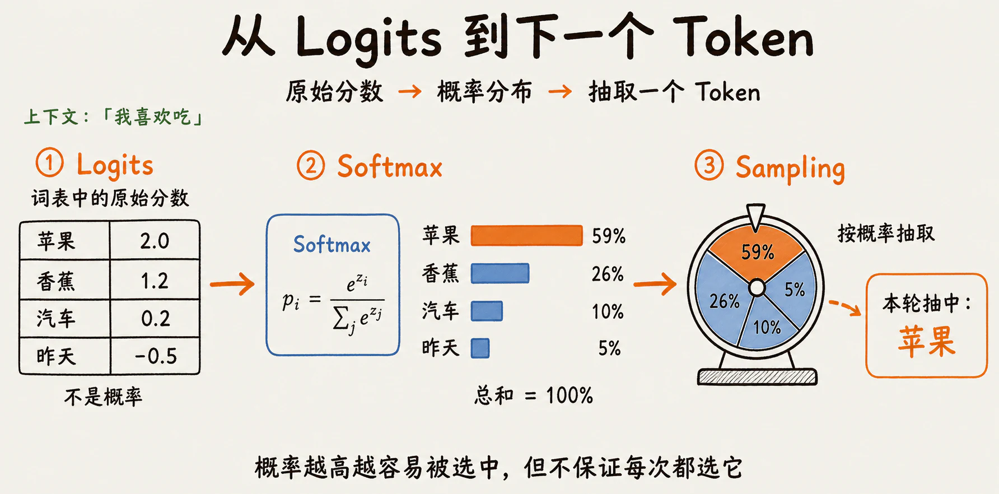

## 10.自回归：一轮接一轮

第一个 Token 选出来后，会被追加到原来的序列末尾，模型再根据更新后的上下文预测下一个：

> “我喜欢吃苹果” → 选出“很”  
> “我喜欢吃苹果很” → 选出“好”  
> “我喜欢吃苹果很好” → 选出“吃”

每一轮都是：当前序列进模型 → 模型 Transformer 所有层跑一遍 → Softmax → 采样 → 吐出一个新 token → 拼回去。再来一轮。这个词叫「自回归」——自己的输出变成自己的输入。

什么时候停？两种情况：一是模型吐出了 EOS（End of Sequence，结束符），表示它认为这句话说完了。二是程序设了最大长度，到了就截断。

现在回头看文章开头那句「大模型就是不断预测下一个词」，不再是抽象描述了。它真的就是这样干的，一个 Token 一个 Token 往后生成，接了几十上百轮，就有了你看到的整段回答。

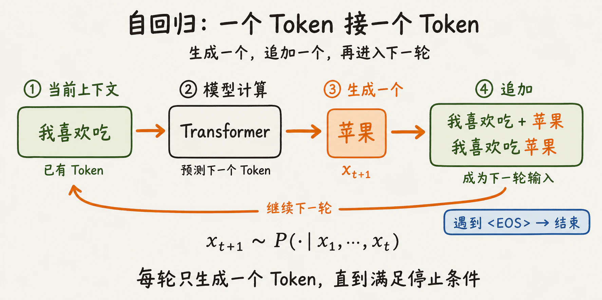

## 11.KV Cache：避免重复计算前文

自回归的过程里藏着一个明显的浪费。第一轮，「我喜欢吃苹果」4 个 token，每个都老老实实算了 Q/K/V。第二轮，「我喜欢吃苹果很」5 个 token——前面 4 个的 K 和 V，跟第一轮算出来的**一模一样**，但还是重算了一遍。第三轮，前面 5 个又重算一遍。生成 100 个 token，第 100 轮要把前面 99 个的 K 和 V 全部重新算一轮。

存起来不就完了？这就是 KV Cache。代价是缓存会占用显存，并且通常随上下文长度增长。

KV Cache 会为每一层保存已经计算过的 K 和 V。下一轮生成时，新 Token 仍然要通过所有 Transformer 层，并计算自己的 Q、K、V；前面 Token 的 K 和 V 可以直接从缓存中读取。新 Token 的 Q 再与“所有旧 K 加上自己的 K”计算注意力，并对对应的 V 做加权汇总。

Q 通常不需要为旧 Token 保留，因为下一步只需要为最新位置提出新的查询。K 和 V 则要继续留着，供后续 Token 查询。

至此，一次生成过程就完整了：文字经过 Tokenization 变成编号，Embedding 把编号变成向量，位置信息和多层 Transformer 让表示结合上下文，输出层再把最后一个位置映射成词表概率，采样得到一个 Token，然后通过自回归继续下一轮。

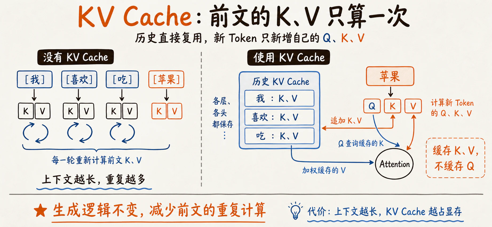

## 参考资料

- [Common Crawl: About](https://commoncrawl.org/about)
- [The FineWeb Datasets](https://arxiv.org/abs/2406.17557)
- [Attention Is All You Need](https://papers.neurips.cc/paper/7181-attention-is-all-you-need.pdf)
- [Language Models are Few-Shot Learners](https://arxiv.org/abs/2005.14165)
- [RoFormer: Enhanced Transformer with Rotary Position Embedding](https://arxiv.org/abs/2104.09864)
- [OpenAI tiktoken](https://github.com/openai/tiktoken)
- [Hugging Face: Cache explanation](https://huggingface.co/docs/transformers/cache_explanation)
- [3Blue1Brown: Transformers, the tech behind LLMs](https://www.3blue1brown.com/lessons/gpt/)
- [The Illustrated GPT-2](https://jalammar.github.io/illustrated-gpt2/)
