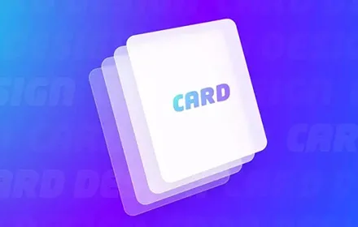

## 1. 什么是卡片

通常来说,通栏卡片一般空间利用率更高,沉浸感更强。但非通栏卡片视觉识别性更好

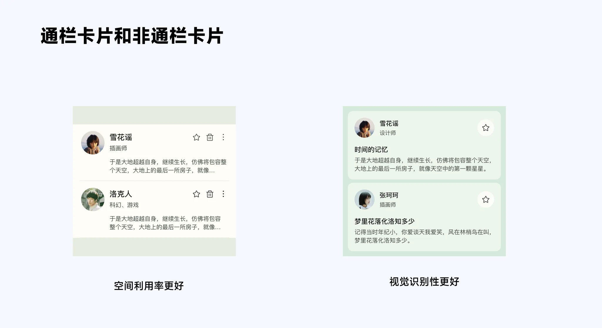

## 2. 卡片结构

卡片可以包括图片、标题、内容、按钮和图标以及标签等,将模块进行整合

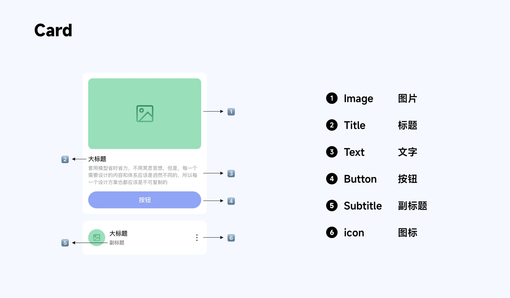

## 3. 使用场景

### 3.1 信息流

信息流主要包括图片、文字等内容,通过卡片聚合,很好地将信息进行整合

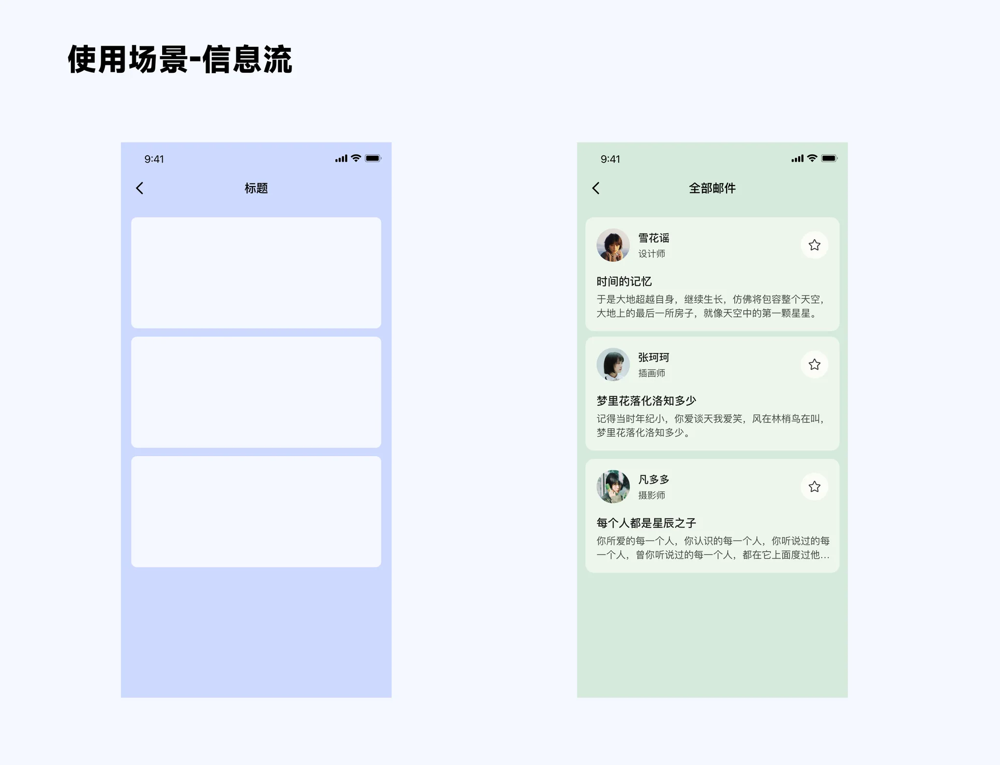

### 3.2 瀑布流

瀑布流中图片在卡片中占比较大,一般花瓣、Pinterest、小红书等产品使用

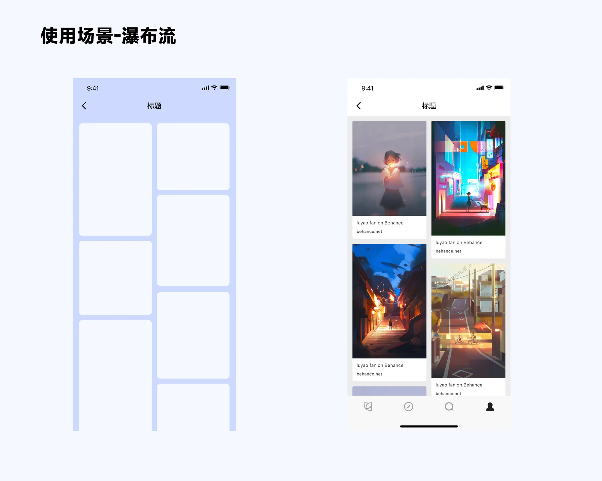

### 3.3 横向滑动

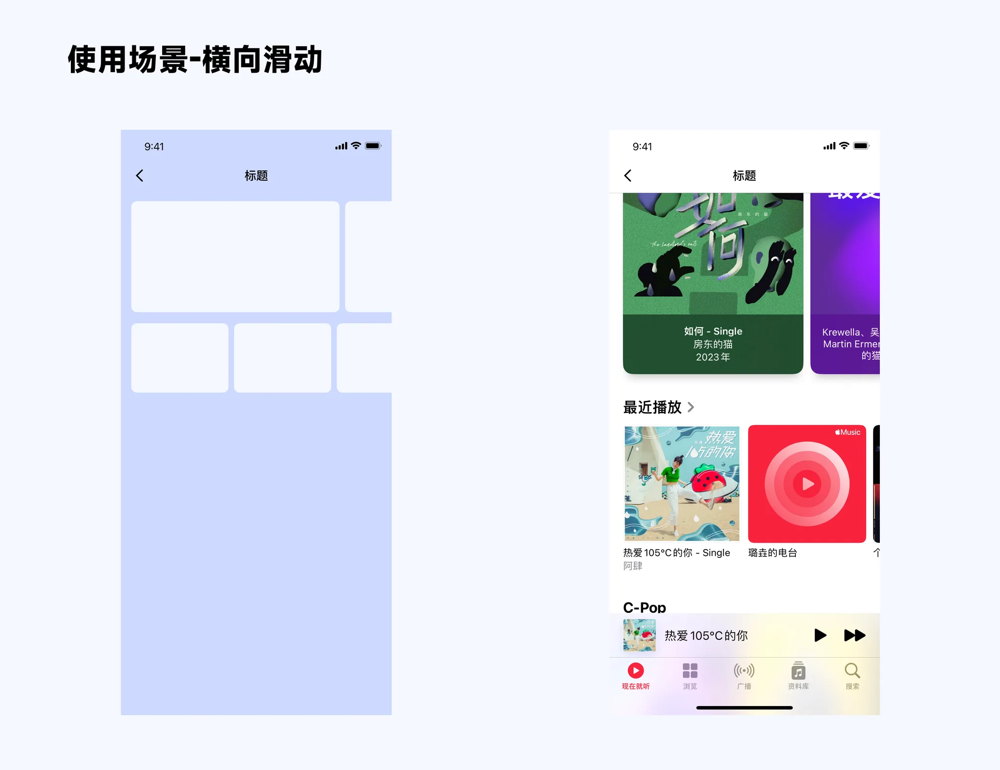

### 3.4 内容集合

页面首页的金刚区集合,订单页面的模块内容集合等

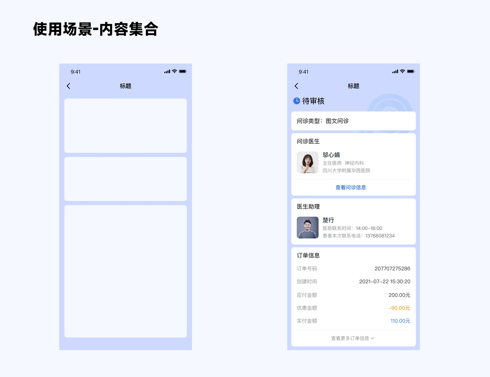

### 3.5 卡券类设计

卡券类是对现实物理世界的二维化表现

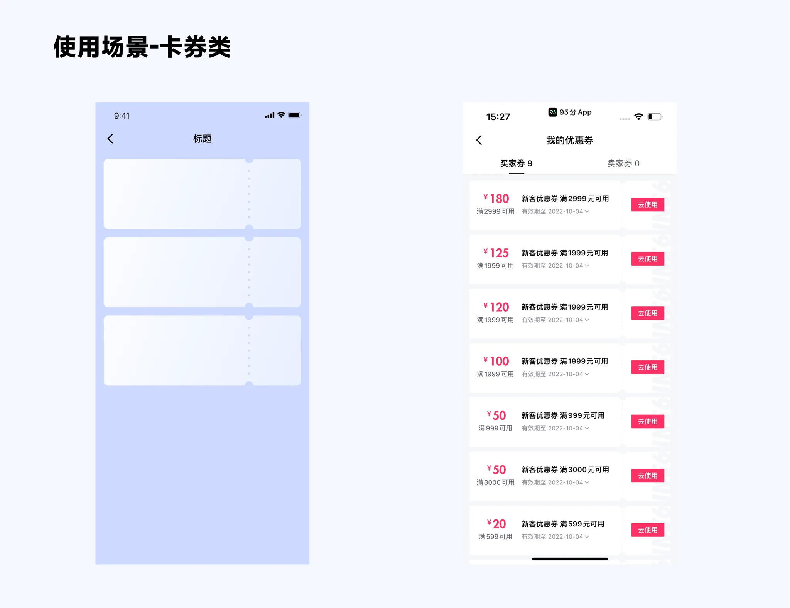

## 4. 卡片设计规则

### 4.1 容器尺寸

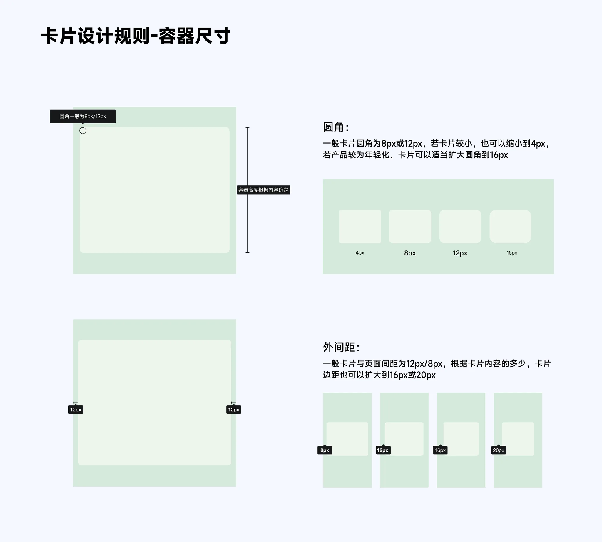

### 4.2 卡片内布局

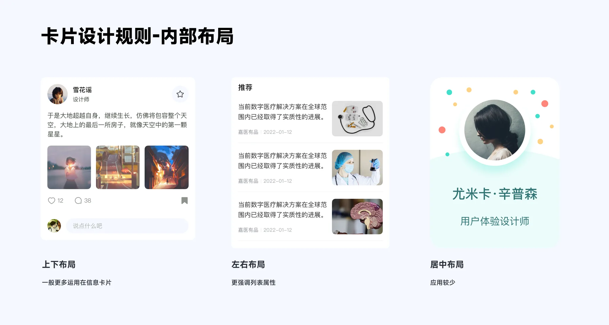

### 4.3 标题

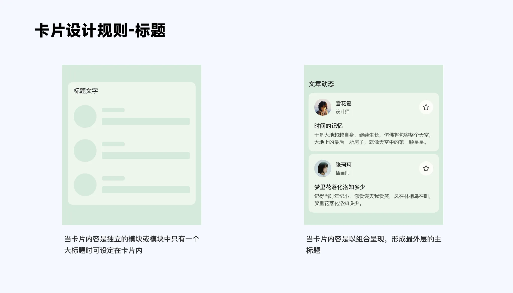

### 4.4 内间距

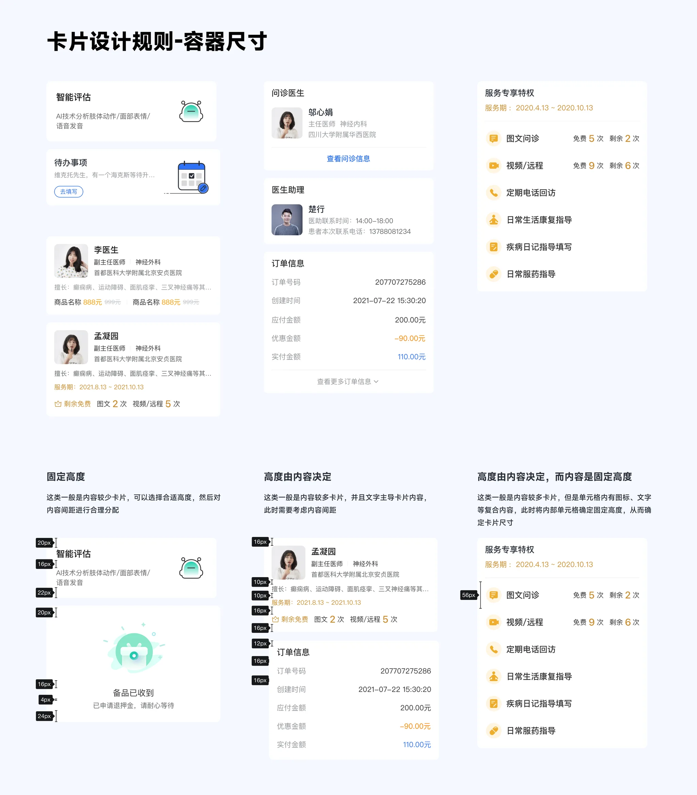

### 4.5 信息层级

## 5. 优点与注意事项

### 5.1 优点

#### 5.1.1 模块化设计

卡片式设计可以有效直接的形成区域分隔,从视觉感知上就对内容进行了分隔,提升用户的…

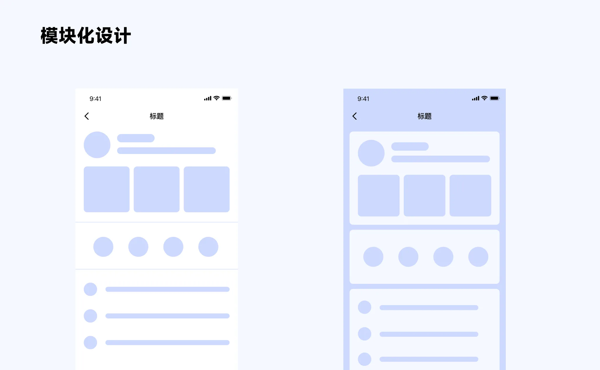

#### 5.1.2 空间化设计

卡片设计增加了页面的立体感,增强了视觉的表现力

### 5.2 注意事项

不要滥用卡片,导致页面破碎

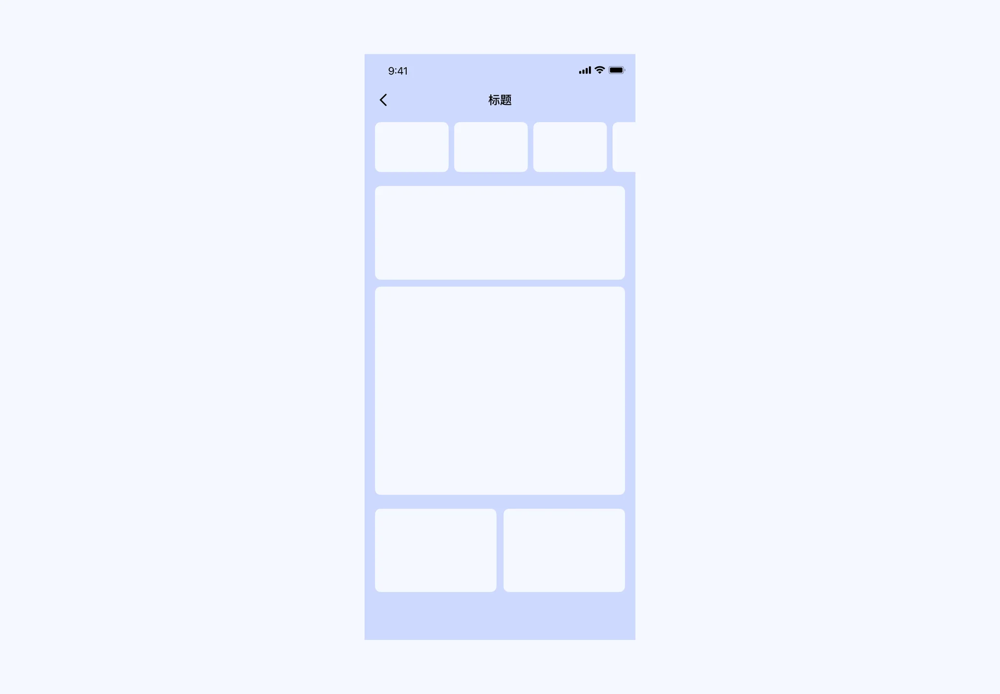
