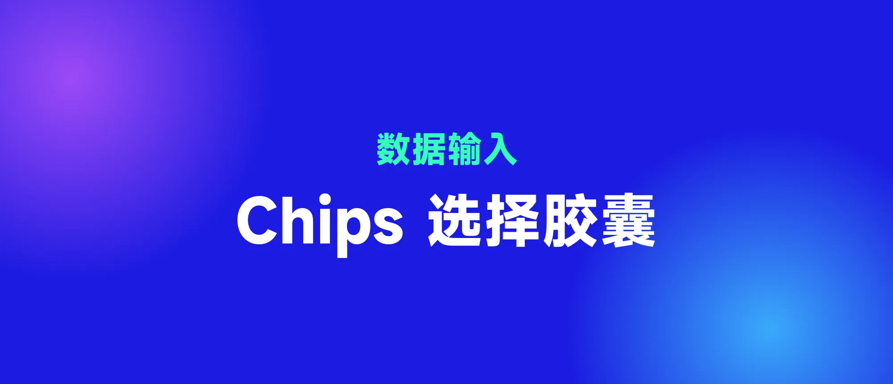
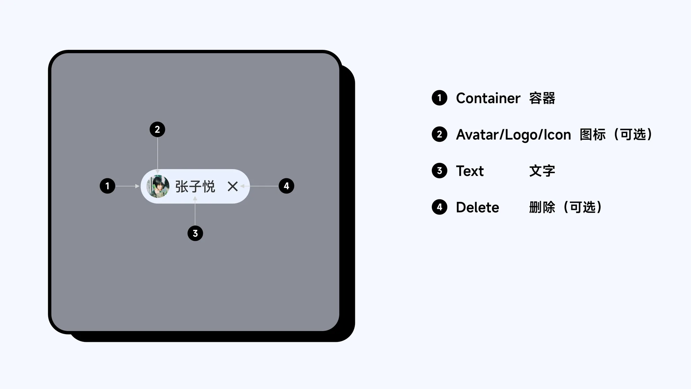
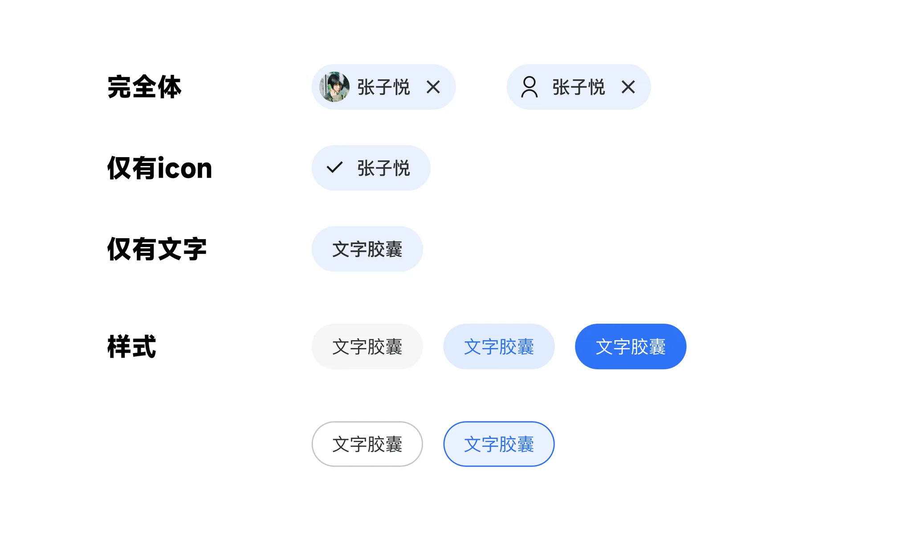
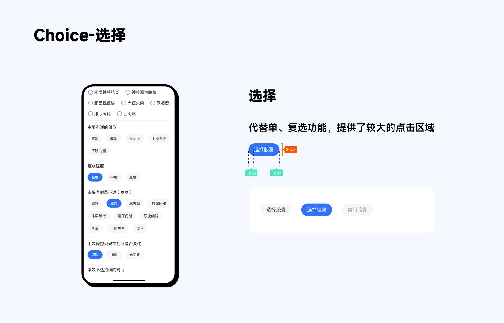
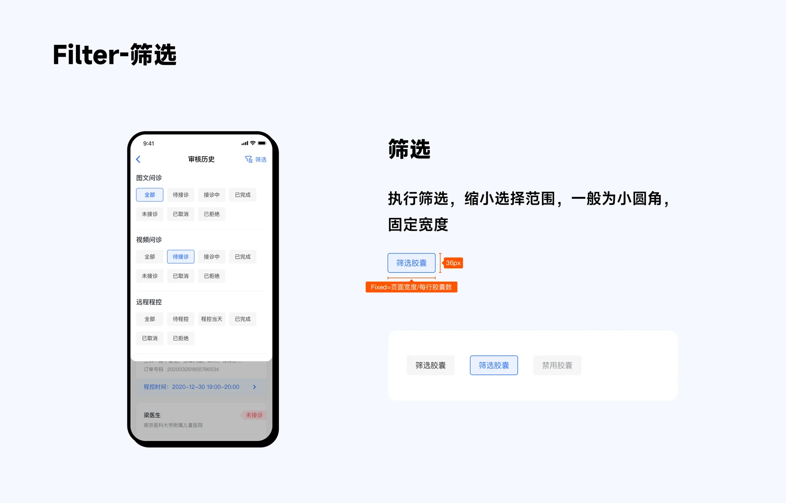
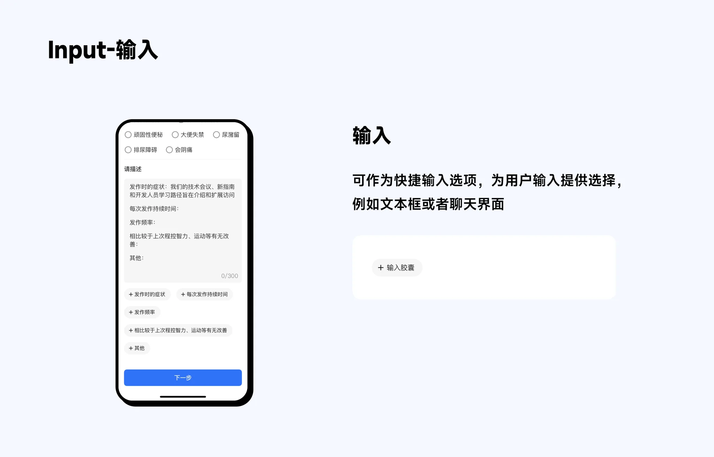
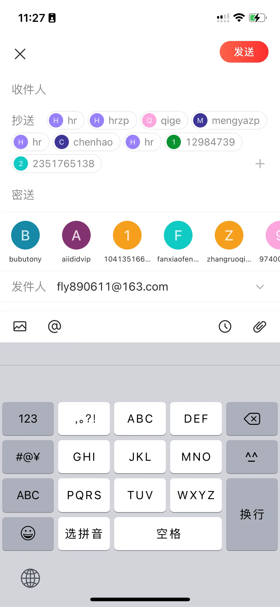
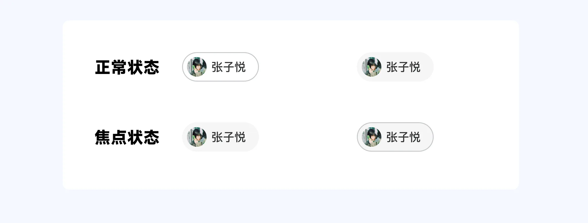
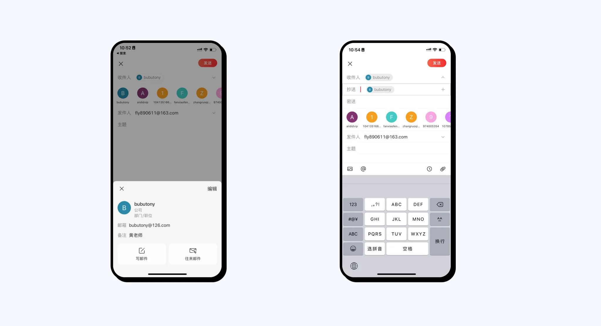
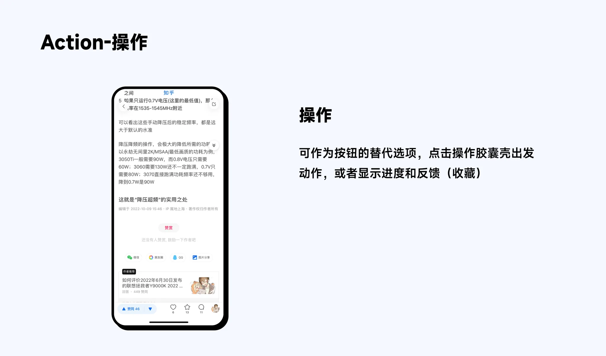

## 1. Chips 解构

Chips 完全体由 4 部分组成,分别是容器、图标、文本和删除,其中图标可以…

## 2. Chips 功能

### 2.1 Choice 选择

参考 MD2 和 MD3 结合实践,Chips 常用的功能分别为【Choice】【Filter】【Input】和【Action】

### 2.2 Filter 筛选

### 2.3 Input 输入

#### 2.3.1 堆叠样式

输入胶囊可以横向滑动或者垂直堆叠,根据需要进行交互样式选择

#### 2.3.2 交互样式

或者点击【胶囊】进入焦点状态,再次点击进入详情,若长按则进入移动状态

### 2.4 Action 操作

操作芯片提供与主要内容相关的操作,一般是按钮的替代品(按钮一般一行最多显示两个)

