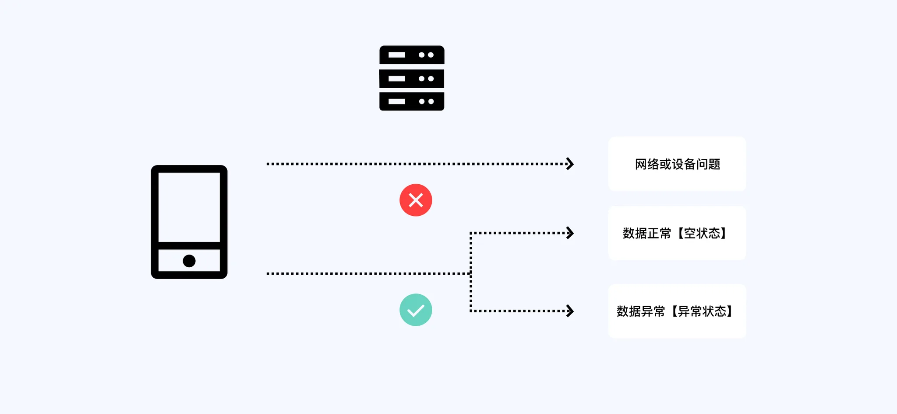
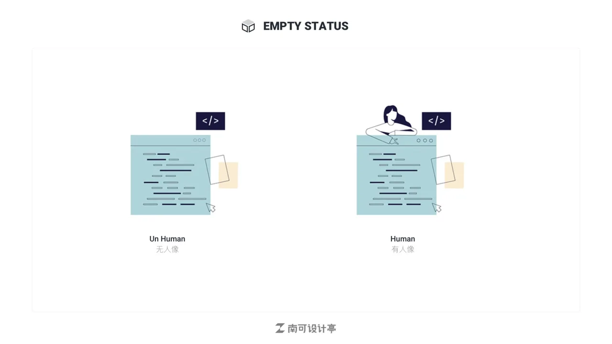

## 定义

在设备进行数据加载的过程中,首先需要请求服务器数据,若数据请求失败,则为缺省状态…

## 缺省页组成

一般来说,缺省页有三种组成方式,第一种是纯提示;第二种是在提示基础上加入引导…

## 缺省页样式

### 3.1 插画样式分类

2.5D 和 3D 属于较新潮的风格,尤其是近几年新兴的 3D 设计,他们的共同点是拥…

### 3.2 按照配色风格分类

所以,遇事不决,量子力学,中庸之道。选择灰色系与彩色点缀的方式未尝不是一个…

### 3.3 是否有人像插画

## 缺省页设计原则

优先解决用户面临的问题(通过阐述当前状态、原因、及提供解决方案),其次考虑如…

参考:

- [缺省页设计(优设网)](https://www.uisdc.com/the-default-design)
