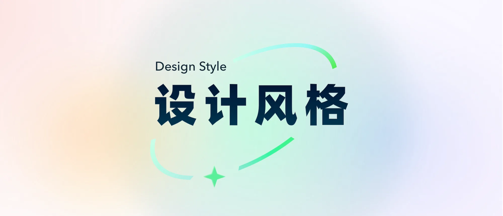
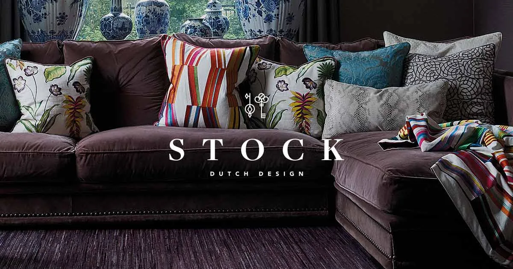
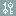
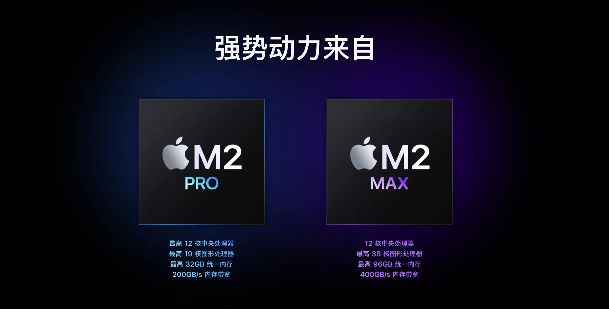

像素时代 → 拟物化时代 → 扁平时代

### 1. Motion design 动效设计

动效在 UI 设计中已经变得越来越重要,并且随处可见。从微交互到复杂动画,UI 不再是静态的,用户期望它具有生命力。

比如 TikTok 类的短视频产品的出现,人们注意力的持续时间越来越低。为了保持用户的好奇心和参与度,需要使用动效,在静态屏幕上添加一点动感,让界面可以更加有趣。

视差(parallax)效果在经典视频游戏中已经存在多年了,并最终成为网页设计领域的一种趋势。现在,这种炫酷效果通常被视为网页滚动功能的一部分。它使用多种背景,以不同的速度移动,从而产生深度感(创建 3D 错觉)。

### 2. Minimal design 简约设计

多年来设计风格不断发展,最终都走向了简约设计,对每个设计师来说,一个干净的极简设计是永远不会出错的。

设计并不需遵循每一个新的设计趋势来创建数字产品,首先要学习基础知识(组件和设计基础),然后将各种设计风格融入。(和我之前说的类似)

### 3. Multicolor Soft Gradients 多色柔和渐变

Aurora gradients 极光渐变,abstract gradient shapes 抽象形状渐变,卡片按钮上渐变,或者在背景使用色彩并带有视差效果,现在广泛流行并被使用。

或者也可以在文本上使用渐变,以突出某个词语。

### 4. High Contrast / Monochrome 单色高对比度设计

比如 Uber,单色高对比度设计一般是直角,一种商业冷酷风格。

### 5. Dark futuristic/cosmic UI 暗色未来宇宙

这是指一种在大面积暗色背景下,使用渐变、模糊、动态流光、极细描边、微噪点、外发光以及无衬线字体,外加流畅克制的微动效来组织和修饰界面元素的网页设计风格。从而创造了一种未来主义甚至宇宙氛围风格。

### 6. Real-life materials imitation 现实生活材料模仿

从 20 年以来,流行的材料风格有【新拟态】【玻璃拟态】,此外还有许多其他质感材料,比如金属、水晶等等,这种对现实生活材料的模仿,是将虚拟界面融入现实世界的感知。

### 7. Gigantic typography 大字体

大标题字体,达到一种极简、粗野的风格

### 8. Sentimental Design 感性设计

复古主义的集合,是 80-90 年代风格,海报和杂志风格,他们统称为干性设计,虽然它们能引起人们一定程度的注意,但是总体来说是形式大于功能。除了少数类似 Figma 和 Gumroad 这样的产品成功…

可以肯定地说,当涉及到数字产品时,功能和视觉之间的平衡是关键。

参考:

- [为什么 UI 风格会出现从拟物化到扁平化的变化?(知乎)](https://www.zhihu.com/question/46418418)
- [30 个出色的视差滚动网站(优设网)](https://www.uisdc.com/parallax-scrolling-website-examples)
