在讲述 Constraints 和 Auto layout 之前,先理解 Figma 中的【Frame】概念。

在前端设计中都有 Frame 框架的概念,页面是由许多框架嵌套组成的,而每个框架就是一个个堆栈起来的盒子。一般被称为 Box 模型,在 box 模型中,页面上的每一个元素,无论是文本、图像,都被认为是独立的盒子,如下图:

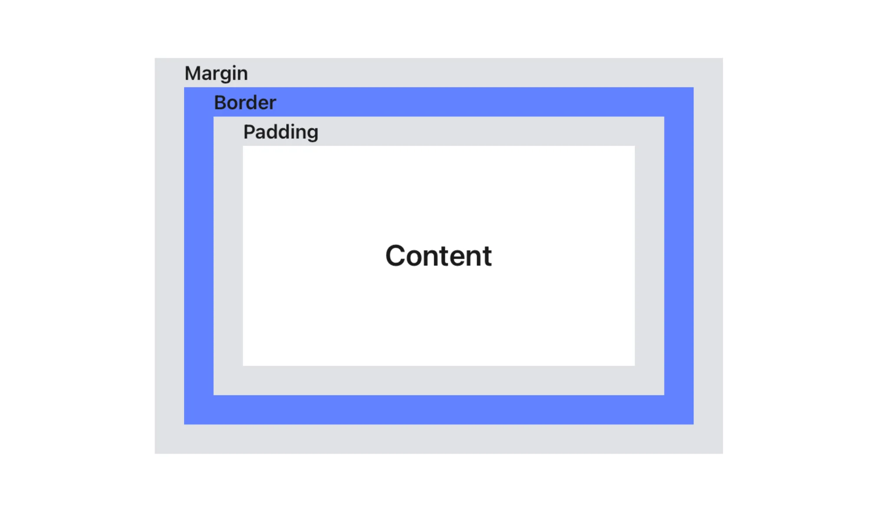

- Content 内容,盒子的内容,显示文本、图像、图标等元素
- Padding 内边距,内容与盒子边框的距离
- Border 边框,顾名思义,边框的宽度
- Margin 外边距,边框与盒子边缘的间距

在 Sketch 中,仅有【画板】的概念,而在 Figma 中,是有类似 Box 的概念的,在 Figma 中叫做 Frame。而加入 Auto layout 的 Frame 是一种特殊的 Frame,在此简称为 Auto layout

可以这样类比,在 Figma 中使用的基础 Frame 用作页面画板,使用 Auto Layout Frame 用作页面画板里的框架～

### 1. 基础 Frame 的约束

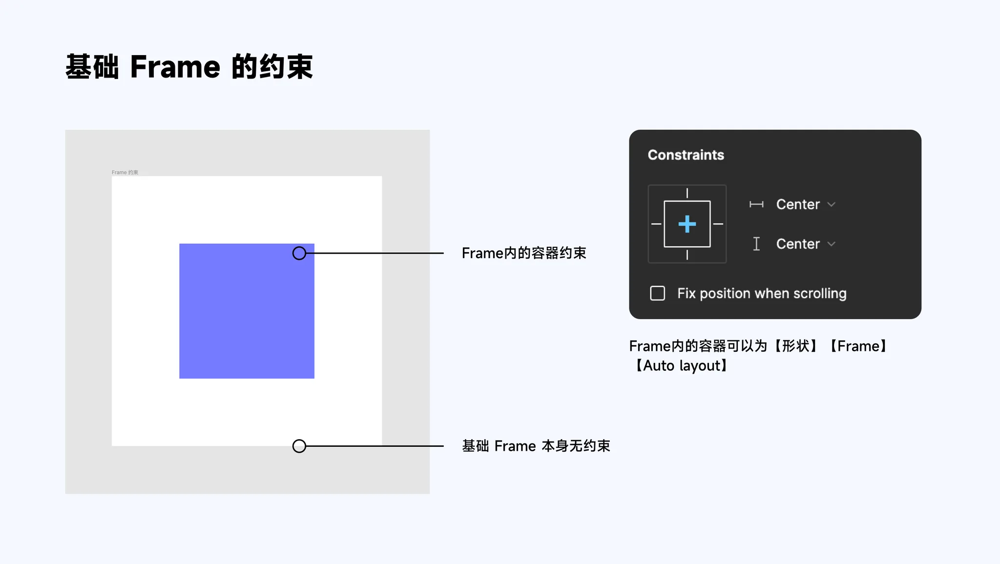

### 2. Auto Layout 的约束

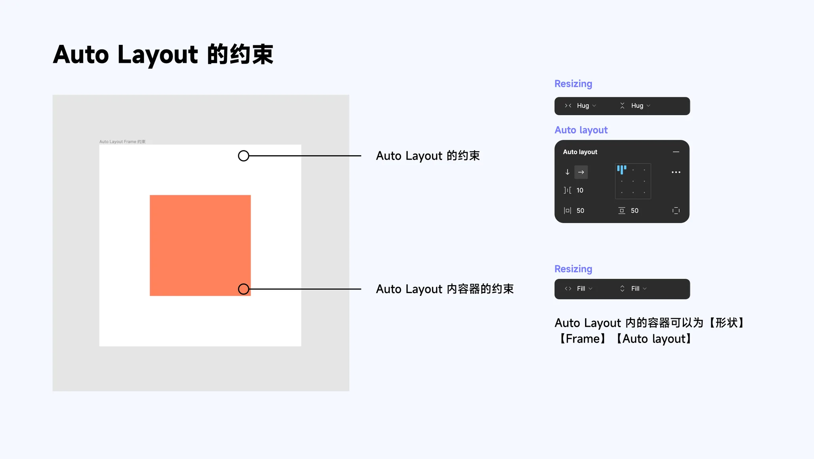

### 3. 单个元素加入 Auto Layout

元素 Shift + A 变成 Auto Layout 之后,就在其外面加了一个父层级外框。并且自动加入了 10px 的 Padding 值。

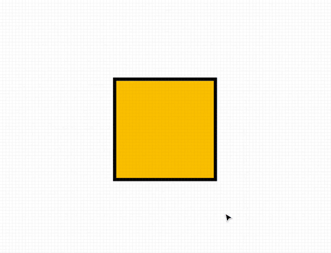

### 4. Auto Layout 详解

#### Direction 方向

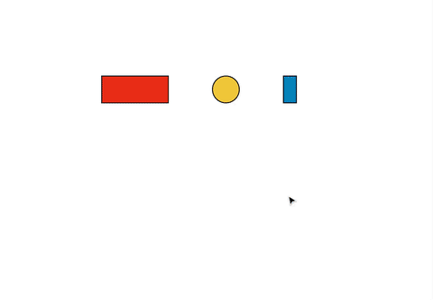

#### Spacing between items 间距

#### Padding 填充

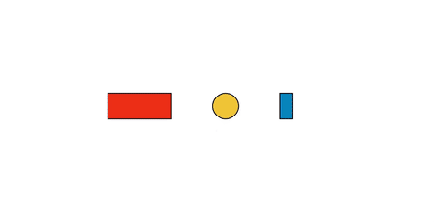

#### Alignment 校准

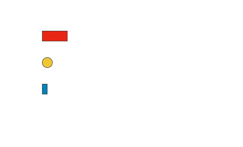

#### Spacing mode 分布方式

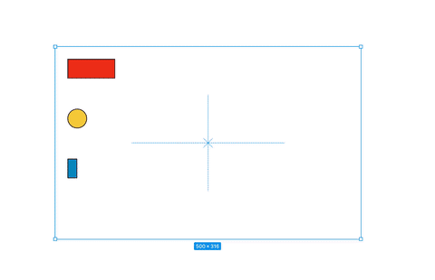

#### Strokes 画笔

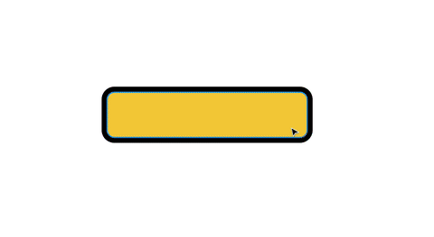

#### Canvas stacking 画板堆叠

#### Text baseline alignment 文本基线对齐

### 5. Resizing

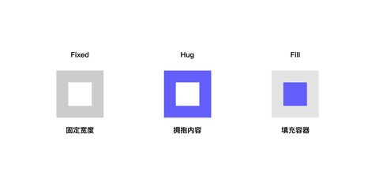

如果嵌套多层级

且最小层级为图形,则最大层级可选 Hug 和 Fixed;最小层级可选 Fixed 和 Fill,中间层级可选 Hug / Fill / Fixed,并且 Hug 和 Fill 不可相邻。

最小层级为文本,则最大层级可选 Hug 和 Fixed;最小层级可选 Fixed 和 Fill 以及 Hug,中间层级可选 Hug / Fill / Fixed,并且 Hug 和 Fill 不可相邻。

### 6. Constraints

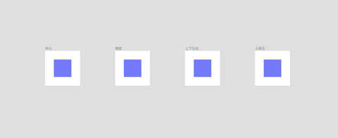

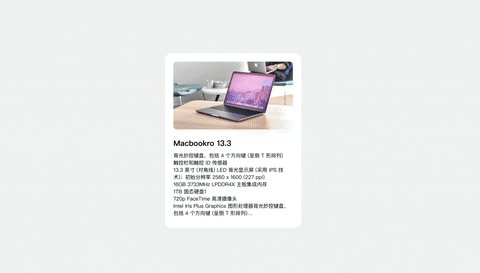

#### Absolute position

正常来说,在 Auto layout 布局中,是不能使用 Constraints 的。但是与 CSS 中的绝对位置类似。当某个对象被赋予绝对位置后,其父层级由 Auto layout Frame 变为 Frame,此时可以应用 Constraints 为其定位。

参考:

- [Mastering Constraints & Auto Layout](https://www.figma.com/community/plugin/1153083036662812636)
- [Figma 自动布局赋能 B 端设计(UICN)](https://www.ui.cn/detail/616035)
