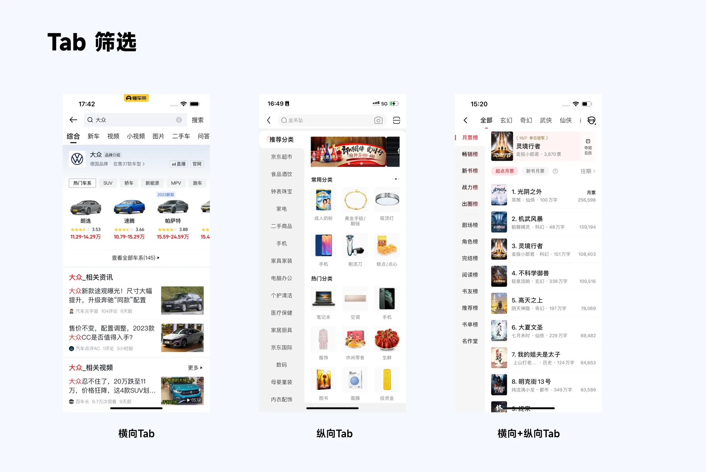
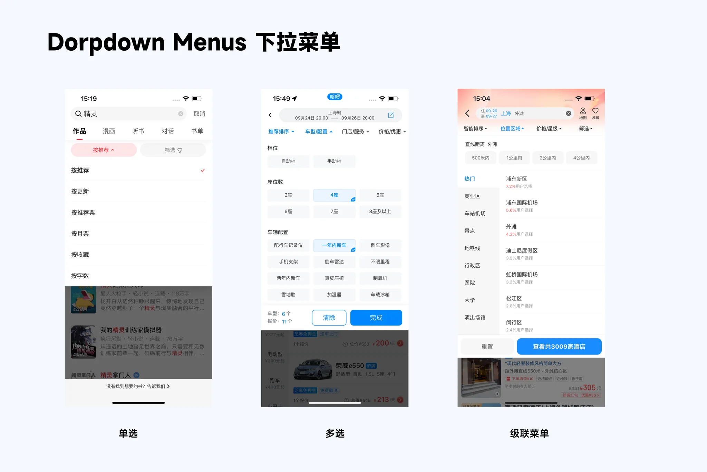
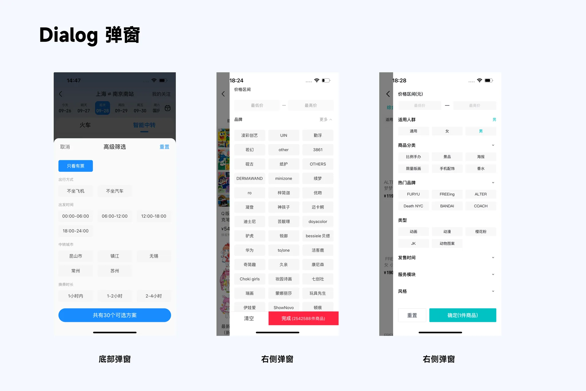
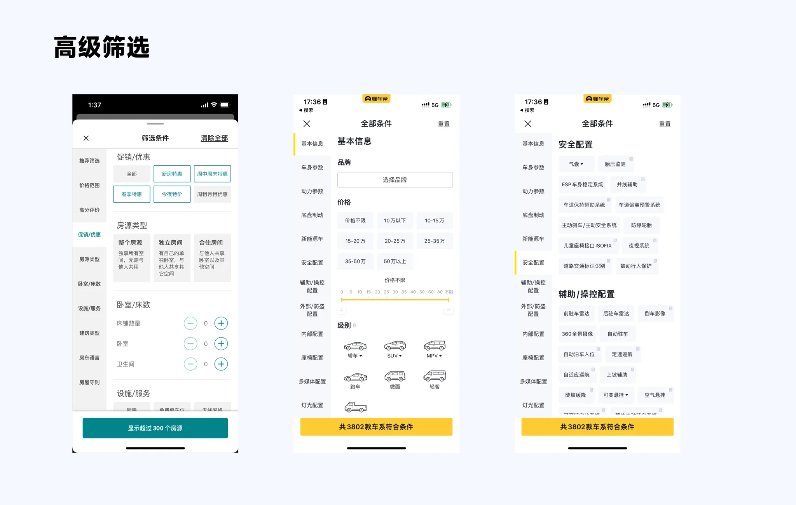

## 筛选样式

### 1.1 Tab 筛选

这是最基础的筛选方式,一般有横向 Tab 和纵向 Tab 两种,Tab 类型主要…

### 1.2 下拉菜单筛选

下拉菜单是较为常用的筛选样式,包括单选下拉菜单,多选下拉菜单和级联菜单筛选

### 1.3 弹窗筛选

在 Dialog 那期讲过,弹出层可以上下左右弹出,其实下拉菜单也可以归类到向下弹出的弹窗,而弹窗筛选则更复杂一些

### 1.4 高级筛选

基于自定义筛选条件过多,为满足用户个性化需求,相比前面提到的 Tab、弹窗更为复杂

