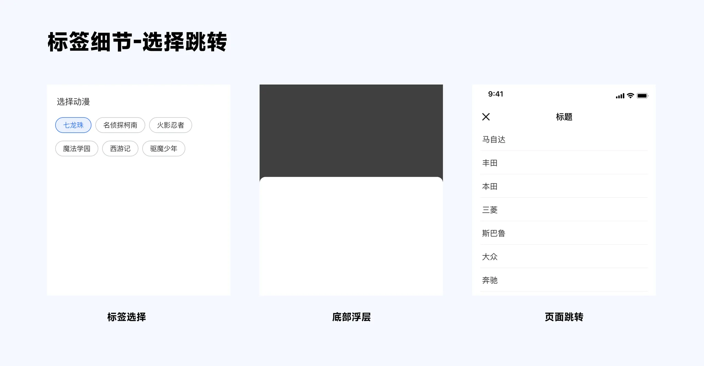

## 1. 表单构成

## 2. 表单结构

### 2.1 标签布局

#### 2.1.1 左右布局

缺点:若输入内容过长则无法完全展示

#### 2.1.2 上下布局

上下布局优点是横向空间充足,对标签长度和填写内容包容度较大。缺点是占用页面空间。

#### 2.1.3 浮动布局

### 2.2 按钮

#### 2.2.1 按钮位置

页面底部:适用于长表单

#### 2.2.2 按钮交互

2、表单内容较多,此时按钮常亮,在用户点击时候给予反馈,告知错误原因

### 2.3 单步录入还是分步录入

进度条导航:步骤较多,使用进度条百分比显示进度

## 3. 表单细节

### 3.1 必填与选填

当表单里面必填项较多时候,可以忽略使用 \* 号提示,采用暗提示方式;但是更建议…

### 3.2 默认选项

在复杂表单中,对于如证件类型、手机区号、国籍等较为通用的选项,为用户提供默认选择

### 3.3 号码规律组合

如电话号码、银行卡号这类有数字组合规律的号码字段,我们可以沿用它们在线下的数字组合规律,进行分段显示

### 3.4 页面跳转

表单选择时候,若选项内容较少,则可以以 chips 方式直接显示选择;若选择项较多…

### 3.5 智能录入

## 4. 表单总结

