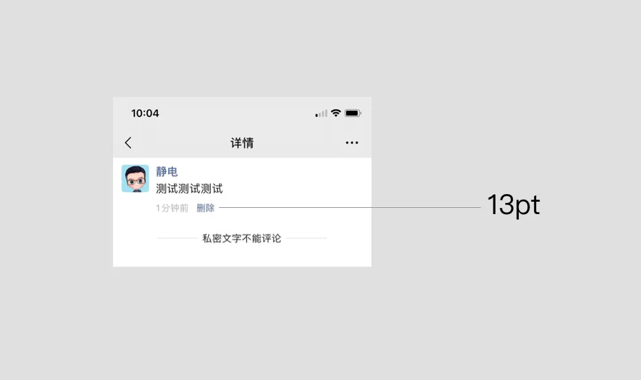
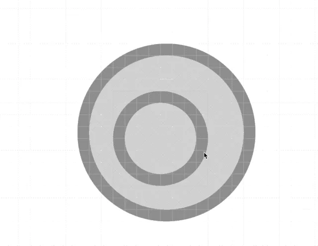
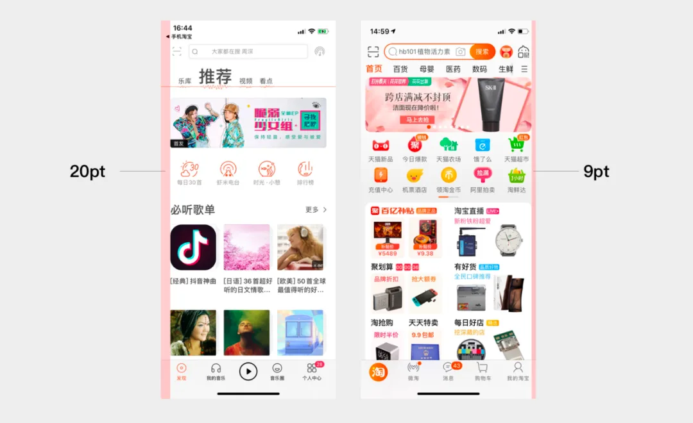
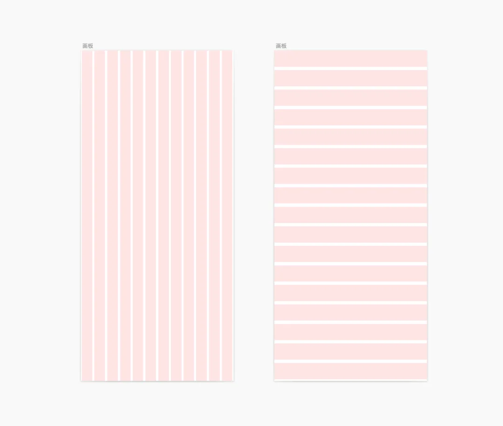
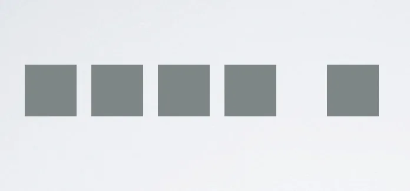

#### Q:字号一定要是 2 的倍数吗?

A:关于 2 的倍数这一问题,大部分情况下是一种约定俗成的结论。在使用 PS 做设计的时代,由于我们做的 UI 设计稿都是 2 倍图或者 3 倍图,所以使用 2 的倍数会更方便于开发工程师换算,比如你在 2 倍图下设定一个字体大小为 24px,开发工程师…

但是随着 sketch 等矢量 UI 工具的普及,大家普遍开始使用 1 倍图来进行设计,那么此时,不管你设置多大的字号,开发工程师最终设置的代码也是一样的。字体为 12px,那么开发就写 12pt,整个换算是 1:1 进行的。所以此时你不管…

其实我们仔细观察会发现,在 UI 设计过程中,用多少号字号的都有,不少应用从 9pt,11pt,12pt,13pt 一直往后都会用到。无非是看设计师有没有这个心理洁癖一定要用偶数了。

一方面是约定俗成,一方面是实际情况,大家要根据实际情况来使用字号,切不可生搬硬套公式。

#### Q:图形尺寸最好为偶数且为整数吗?

A:是的。这就涉及到一个问题,就是对齐了。比如你设置一个直径为 105 的正圆形,然后在里边嵌套一个 60 的圆,此时你发现这两个圆无法居中对齐了(在像素进度为 1 的情况下)。如下图。

此种情况下,建议大家用偶数尺寸,会更好的进行对齐操作。当然,如果你对小数点不敏感的话,也可以尝试有小数点的数值,最终也会对齐。但是,如果此时你要导出为位图的话,那么位图边缘可能就有点模糊,不太锐利了。所以,涉及到图标等内…

#### Q:UI 中的字体要加字间距吗?

A:没有特别的情况下,强烈不建议在字体中加入字间距属性,一般情况下保持默认即可。特别是列表等等区域,加入过大的字间距会导致模块比较散,不太美观。如下图,右侧为加入字间距的模块,左侧为未加入行间距和字间距的模块。右侧明显过…

#### Q:成段文本要特别设置行间距吗?

A:无特殊情况下,不建议。一般保持系统默认即可。这里有个经验数值,行间距从 1.2 到 2 倍都是比较理想的。但是要根据设计风格具体处理。过高的行间距同样会让模块难以辨认。

#### Q:模块之间一般要用 4 的倍数吗?

A:嗯?并没有听说过这些规则。模块之间的间距要根据具体设计风格来定,当然,如果你用偶数的话,做算式题的时候会更好对齐一些。特别是横向排列的模块。但是纵向排列的模块则没有这个要求。如何解决?请参照本文下方的设计心理学知识。

#### Q:手机界面左右留白有规定值吗?

A:没有。这个只是大家的一个经验值,一般来说,页面左右留出一定间距会让页面有呼吸感,不至于太挤。这个经验值,我个人的经验值,最小留白为 8-10,最大随意,跟随设计风格走。如下图所示,虾米音乐强调个性,留白偏大,达到了 20…

#### 栅格化布局是万能药吗?

其实很多同学问到的问题都源于之前的一个理论,那就是栅格化布局。所谓栅格化布局,其实是一种设计方法,将页面等分为 N 个不同的横竖模块,每个模块占用 N 个单位,从而让设计更加规整。

但是这种栅格化布局在比较窄的移动端上有点捉襟见肘(之前主要是为网页设计而准备的),很多时候严格按照栅格化布局做出来的设计也存在诸多的视觉问题。静电之前曾翻译过一篇在移动端 UI 上使用栅格化设计的文章,最终作者做出的设计已经…

#### 感性 VS 理性,正确选择

那么,又回到了这个问题。对于初学者,真的没有规律可循了吗?真的没有所谓的"公式",让我们去死记硬背吗?

请记住,设计是感性和理性相交融的产物,特别是对于 UI 设计而言。除了上文说的经验值,我们不妨多从设计心理学角度来去理解设计,多看多做。切勿完全照搬公式,这样才能更快的成长。我自己的做法,先感性再理性,设计前期和设计中期感性…

转回文章开头有同学问到的问题,模块之间的间距有多少合适呢?我认为可以用设计心理学中的格式塔原理-邻近性原理来考量:接近的东西会被看成是一组,如下图:

参考:

- [勿套"公式"!谈谈 UI 设计中的字号,间距,大小等规律(腾讯云开发者社区)](https://cloud.tencent.com/developer/article/1649745)
