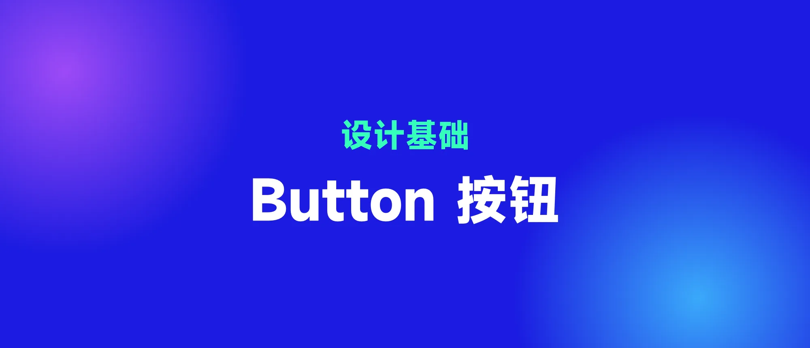

## 1. 按钮的定义

### 1.1 按钮的定义

在 Material 中,对按钮进行如下定义:

按钮允许用户通过一次点击【进行操作】或者【做出选择】

从这个定义可以看出,按钮的主要功能有两个,第一个 Action,作为命令控件;第二个 Select,作为选择控件。

### 1.2 按钮的解构

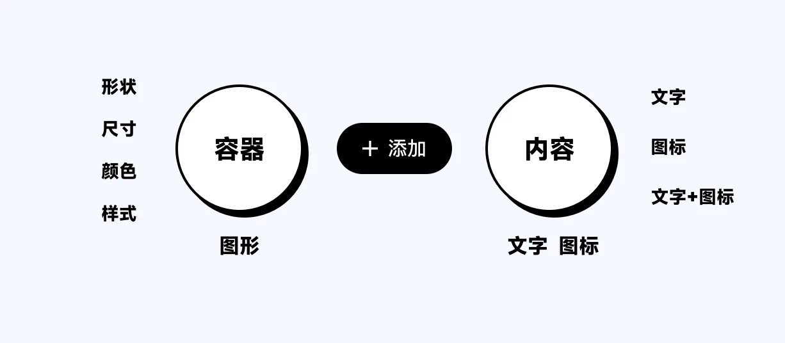

按钮通常由【容器】和【内容】两大模块组成,而【容器】包括形状、尺寸、颜色、样式等要素,而内容一般是文字、图标或者文字加图标。

#### 1.2.1 容器的形状

由于 UX 来源于工业设计,虚拟按钮来自于实体按钮的产物,在现实世界中,按钮大多数采用方形,圆形,很少多用三角形或者其他异形,因此,移动端常见的按钮形状为矩形和圆形。

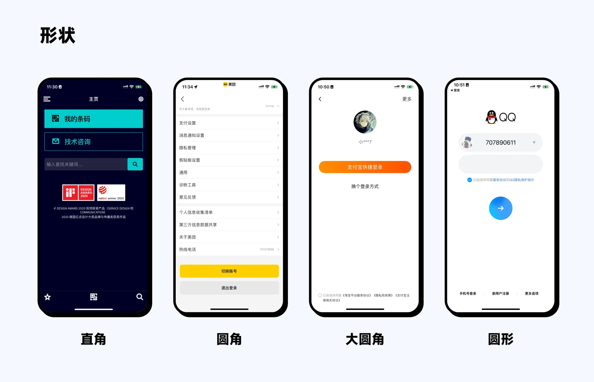

#### 1.2.2 容器的尺寸

一般常用按钮尺寸可以分为三个档位:L、M、S。

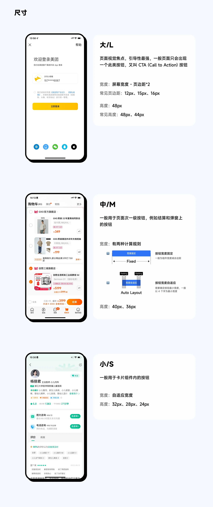

#### 1.2.3 容器的颜色

按钮容器一般有三种颜色,高饱和度颜色,一般用于主按钮和高优先级按钮;低饱和度颜色,一般用于次要级按钮,此外灰度(无彩色系)按钮,一般用于优先级较低状态或者选择按钮中的默认状态。最后是无填充按钮,即轮廓按钮,优先级最低。

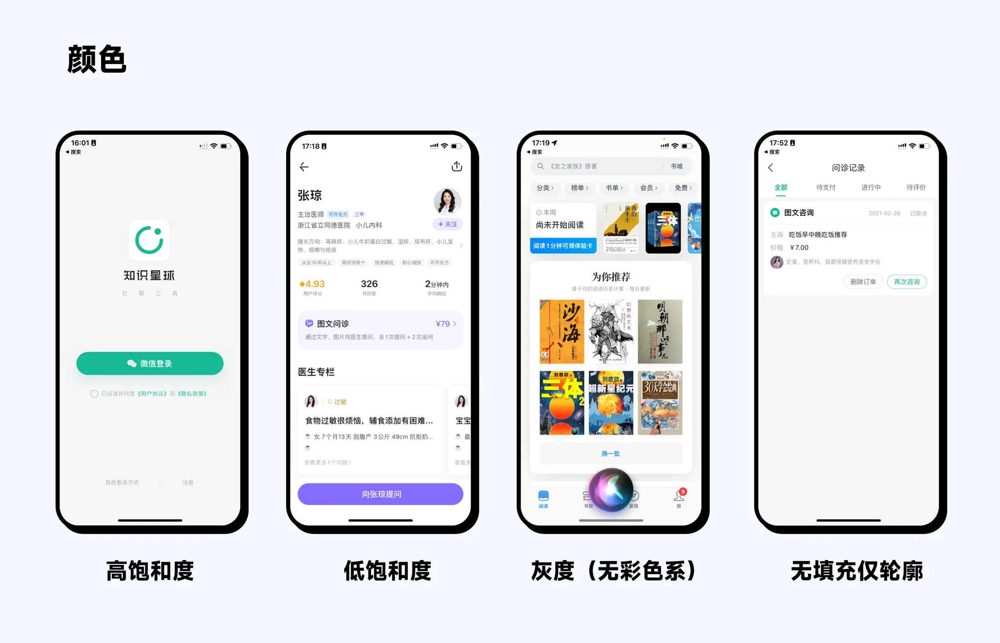

#### 1.2.4 容器的样式

按钮容器样式一般以渐变、内阴影和阴影三个维度进行变化。

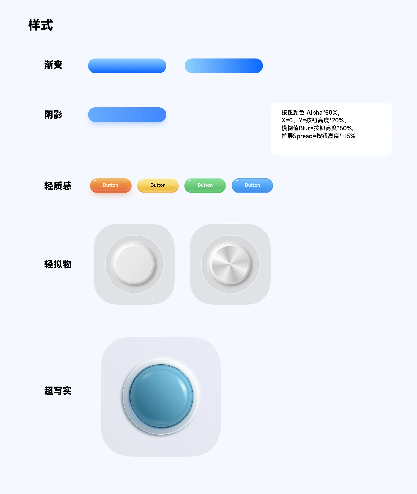

#### 1.2.5 文字和图标

内容可以有文字、图标、文字加图标

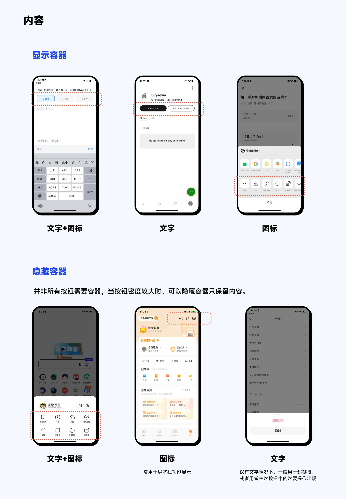

#### 1.2.6 组合按钮

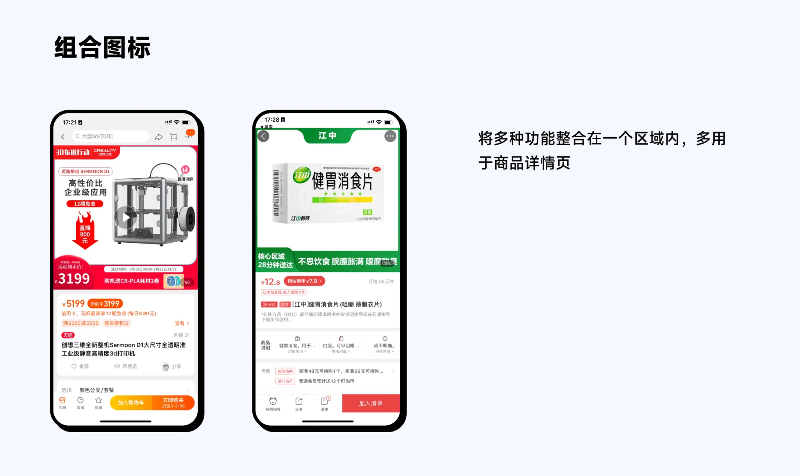

#### 1.2.7 FAB 按钮

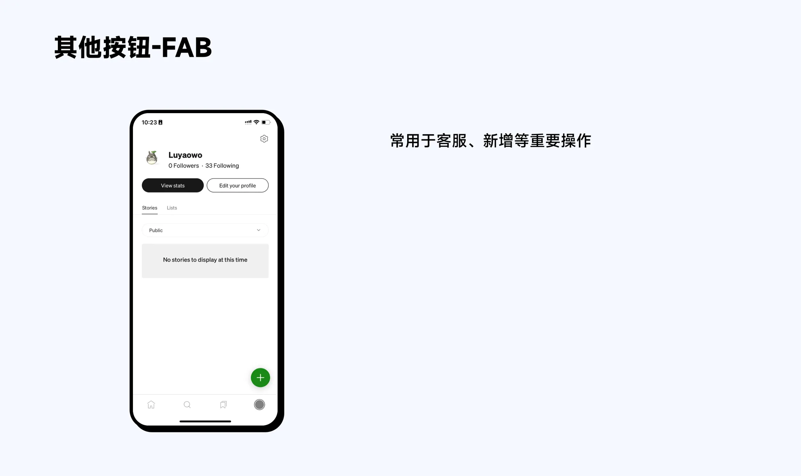

## 2. 按钮的优先级

上面我们对按钮进行了拆解,下面对其进行梳理

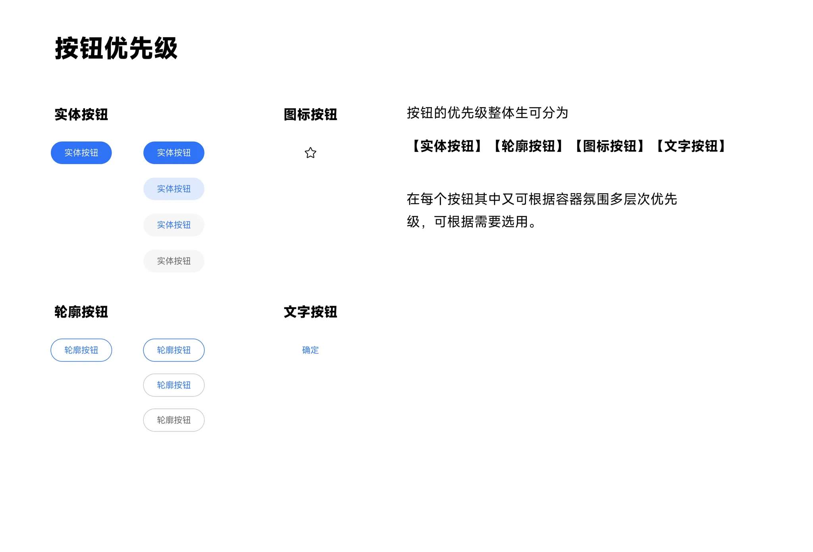

轮廓按钮的好处是可以融合到背景中,因此作为特殊背景上的按钮

## 3. 按钮的状态

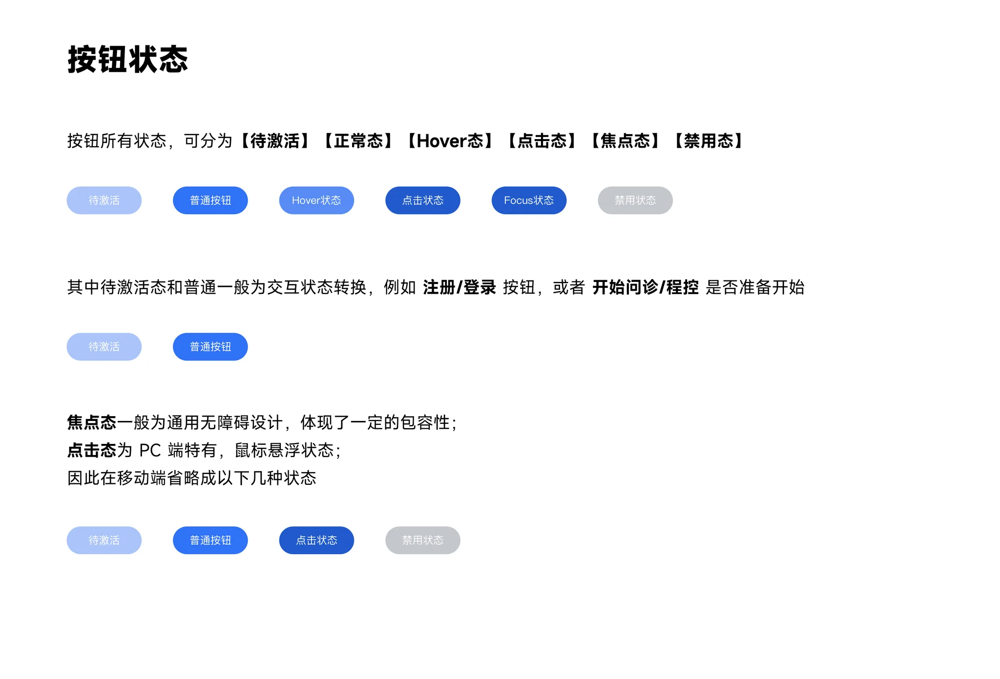

## 4. 按钮的使用场景和贴图

### 4.1 大按钮

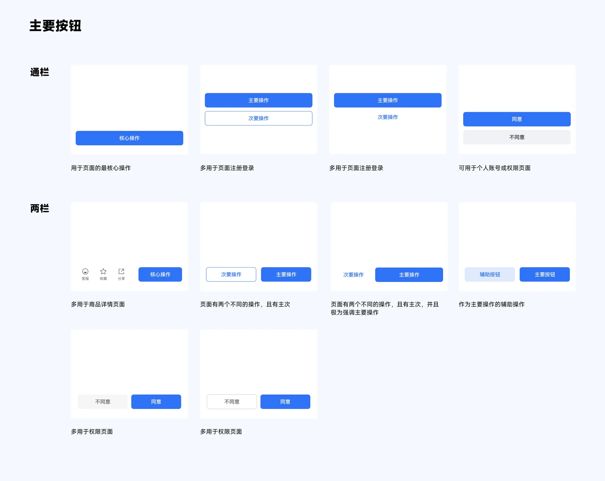

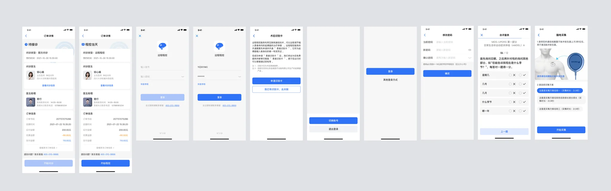

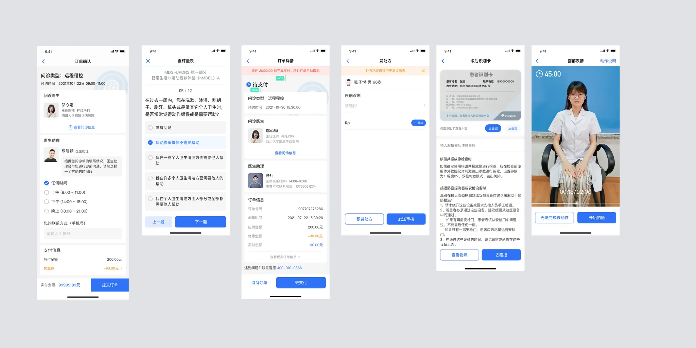

### 4.2 中等按钮

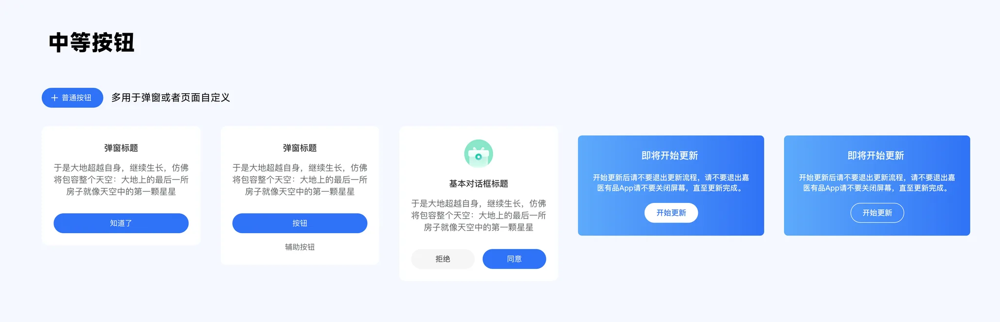

### 4.3 小按钮

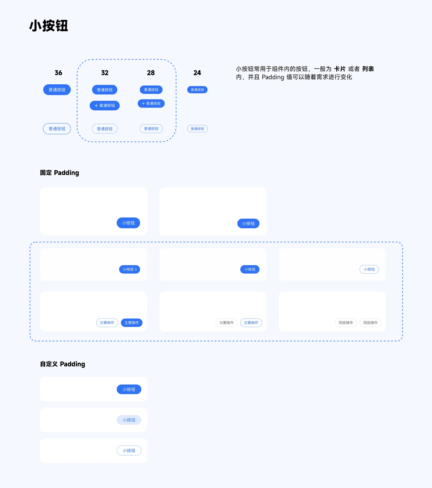

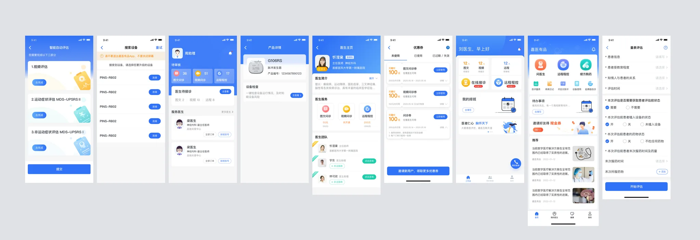

## 5. Toggle 按钮

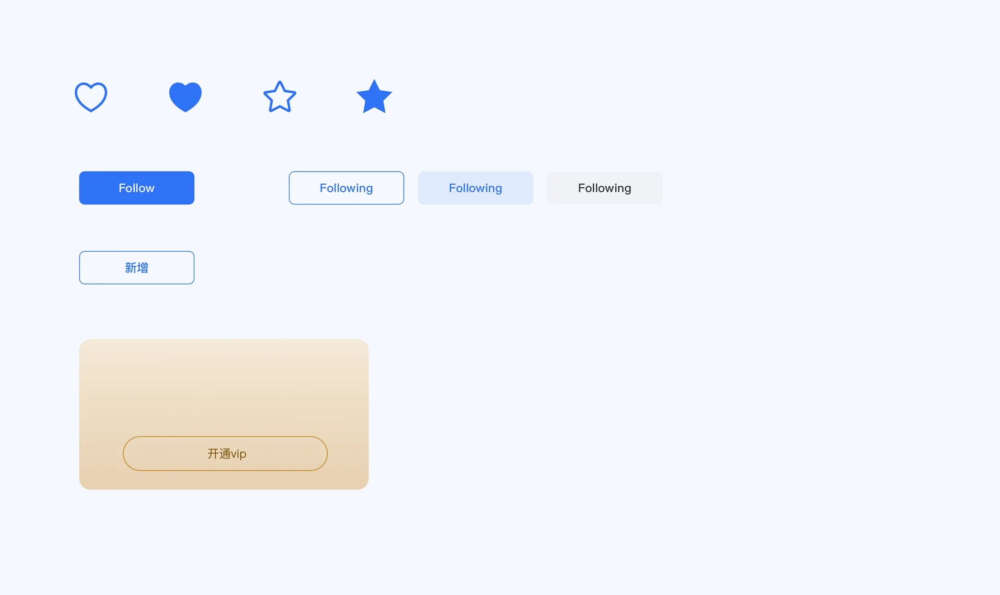

参考:

- [保姆级按钮解拆教程,看这一篇就够了!](https://www.uisdc.com/button-application)
- [搜狐:按钮的细节与应用](https://it.sohu.com/a/544021090_114819)
