说好的周更,又变成月更了……

主要是新设计规范配色和之前的对色彩理解不一样,一开始是想弄清楚 MD 中与色彩有关的陌生词的意思,但是到色彩的内容越查越多,后面就停不下来了,都追溯到光的波粒二象性了……打住!不过,既然这次全面地搜集了一些关于颜色的资料,那么顺便就做个整理,当成理解 MD 新规范色彩部分的储备知识了。

## 1. 颜色的本质-光

我们在高中时候都学过光,并且知道光既是一种电磁波,又是光子组成的粒子流,因此光具有波粒二象性。

光携带的能量由频率决定:**E = h\*f**

h 是普朗克常量,f 是频率,而光速固定,因此波长越长的光,频率越低,能量越低;波长越短的光,频率越高,能量越高。

为什么人眼能看到一定能量范围的光,因为一定波长范围内的光波中光子含有的能量与视网膜细胞相互作用,以电子形式释放能量,产生电脉冲,与大脑交流产生视觉。这段波长或频率的光叫做可见光,在光谱中的位置如下图。

频率过低,如红外线的光子能量不足以引起人类视网膜视觉分子的变化,因此不能感知。频率过高,如紫外线,被角膜和晶状体吸收,并且视杆细胞和视锥细胞无法通过光子形式感知紫外线。因此,只有在一定频率内的光,才能引起我们的感知而生成色彩。图示可见光区域,是我们的太阳这颗恒星发出光辐射占比最大部分,点亮了世间万物和无穷无尽的多彩世界。

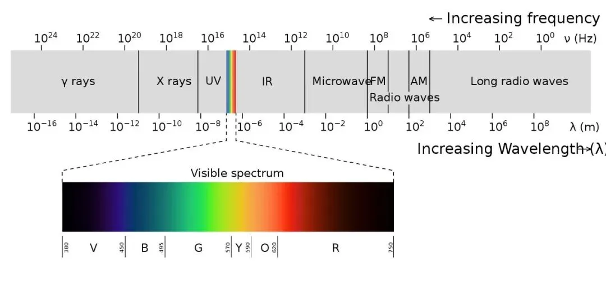

## 2. 人眼对色彩的感知

人眼的视觉感知细胞分为三种,其对颜色的波长识别峰值分为三种,长波 L 型,中波 M 型,短波 S 型,其分别接近红色、绿色和蓝色。人类对色彩的感知是线性的(格拉斯曼定律),对于不同光谱所组成的色光,只要对这三种锥状细胞产生的刺激相同,就可以形成一样的色彩感觉,这使得几乎所有的颜色都可以由三种基本颜色混合而成。

此外,人眼有一个视杆细胞,其对于色彩亮度有感应

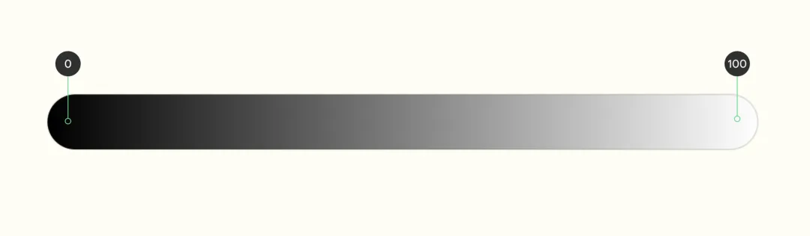

因此从上面可以得出:

**颜色由知觉三个维度决定,色调、饱和度和亮度。**

波长决定了第一个维度,就是色相,可见光谱显示人眼能看见的色相范围;

第二个知觉维度是亮度,对应光强度上的变化;

第三个知觉维度,饱和度(色度),光的相对纯度,当一束光照射过来,其所有光的波长相同,此时饱和度最高,颜色最纯(当电磁波含有所有可见光波长时,只能看到白色)。

## 3. 人眼看到色彩范围

由国际照明委员会提出的 CIE 1931 色彩空间,是在电磁可见光谱中的波长分布和人类色觉中的生理感知颜色之间定义的定量联系,其包括平均视力的人可以看到的所有色彩,作为定义其他色彩空间的标准参考。

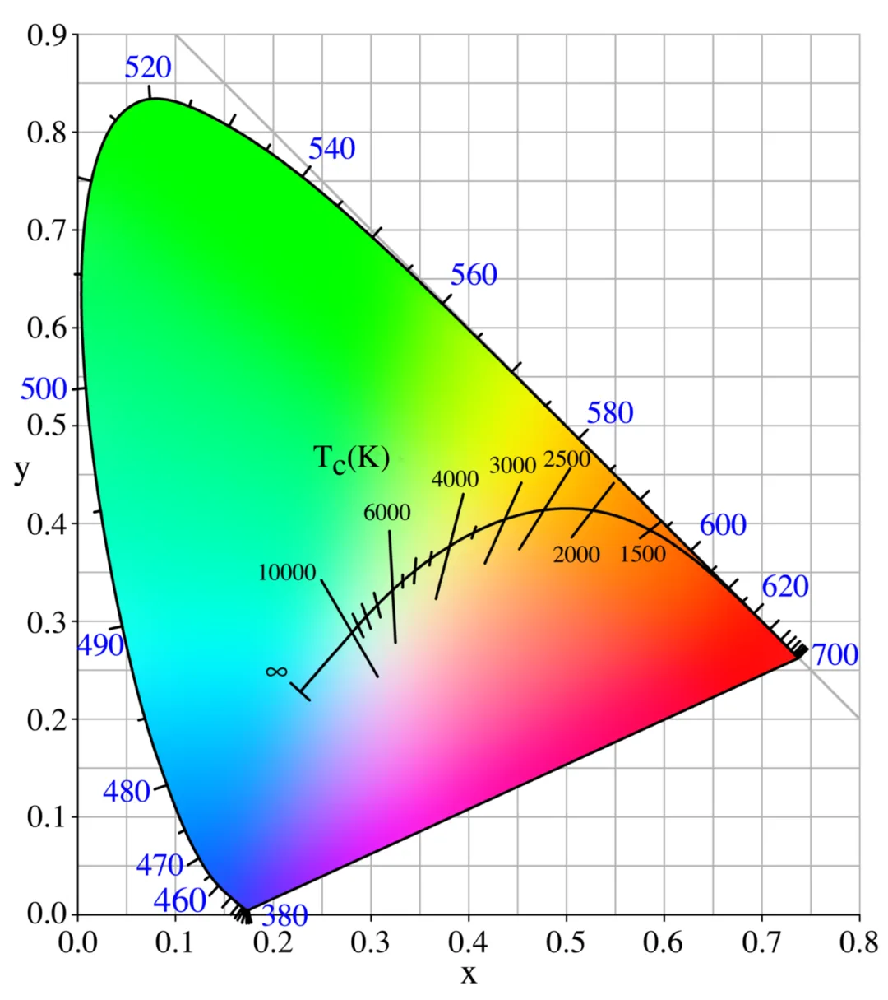

这个图被称为色度图,具体详解如下:

- 此色度图包含了普通人可见色所有色度,该区域为人类视觉色域。
- 图像上每一个点唯一对应一个颜色,自然界每一个颜色唯一对应图像上一个点。
- 图像上轮廓曲线部分可以由单频光得到,对应色谱可见光部分,其他位置必须由两种或以上单频光相加得到。
- 图像中间曲线是色温线,(根据黑体辐射理论,任何温度物体都有辐射电磁波的能力,温度越高,辐射的电磁波频率也越高,然后就产生可见光,这些电磁波均为多频,复合光)
- 图像中心白点 E,位置是固定的,其决定了三原色配比和白平衡,其色温为 6500K,接近自然光的色温。如果将色温的中心点 E' 低于 6500K,则白色偏黄,色温中心点 E' 高于 6500K,则白色偏蓝。我们的太阳表面温度大概在 6000K,所以它的颜色看起来也就是白色偏黄色;如果是天狼星 A,表面温度高达 10000K,看起来是蓝色恒星,也更刺眼和炽热。
- 在图像上选取三个点组成的三角形,就是色域,我们常见的 sRGB,Adobe RGB 等等。选取的点不同,在当前色域下的三原色也不同。

## 4. 色彩模型、色彩空间、色域

上面我们知道了人眼能看到的色彩范围,那总归需要一种方法来描述这些颜色,所以这里面就涉及到色彩模型、色彩空间和色域这几个名词。

### 色彩模型

描述色彩的方式,比如以光叠加的 RGB 模型,以及它的变种 HSL / HSV / HSI,以印刷油墨(物体的光反射)CMYK 颜色模型,美术中常见的 RYB 颜色模型,以亮度感知为基础的 Lab 模型。

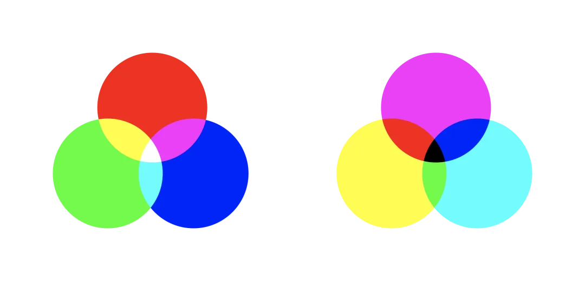

### 色彩空间

给定的颜色模型添加特定的映射函数,即生成颜色空间,如 RGB 有 CIEXYZ、AdobeRGB、sRGB。其对应一定的物理设备,比如 sRGB 对应大多数显示器,AdobeRGB 对应高端显示器,CIEXYZ 对应人眼(究极物理设备)……

CMYK 的颜色空间有 US web Coated 等

Lab 的颜色空间有 CIE 1976

### 色域

色域表示此色彩空间所能表示的颜色范围,相当于色度图,不包括亮度,如果加入亮度,色域就成了色彩空间。

## 5. 色相、色度、明度、色调

单论色彩空间和色域是没有意义的,因为是针对设备来说的。我们需要研究的就是颜色模型,在此,我们会讲述许和辨析许多专业名词。由于它们定义是确定的,不随颜色模型变化而变化,因此先确定好各个专业名词的定义,有助于理解颜色模型。

**Hue 色相**

**Hue 是不添加任何黑色、白色、灰色的纯色 pure color。即在色环上取值 0-360 度的颜色**

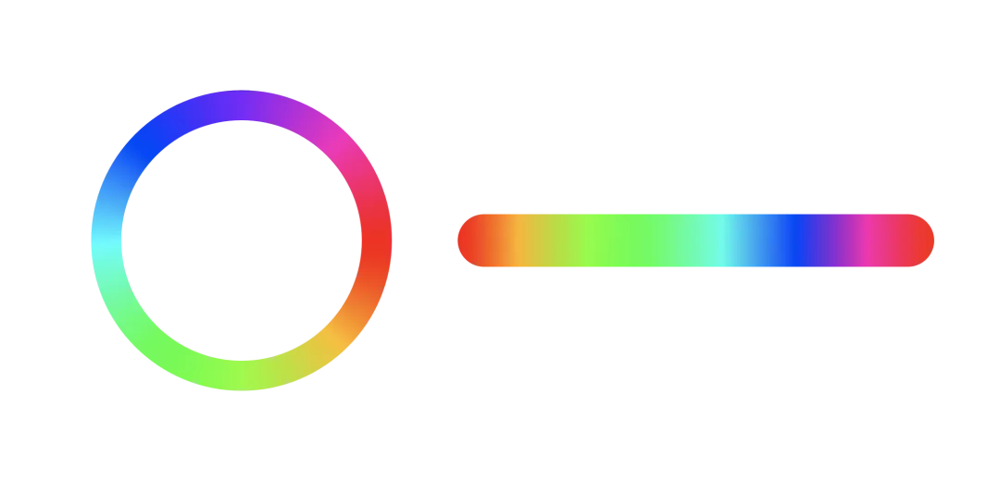

**Chroma 色度**

**颜色由亮度和色度表示,色度反映的是颜色的色调饱和程度**

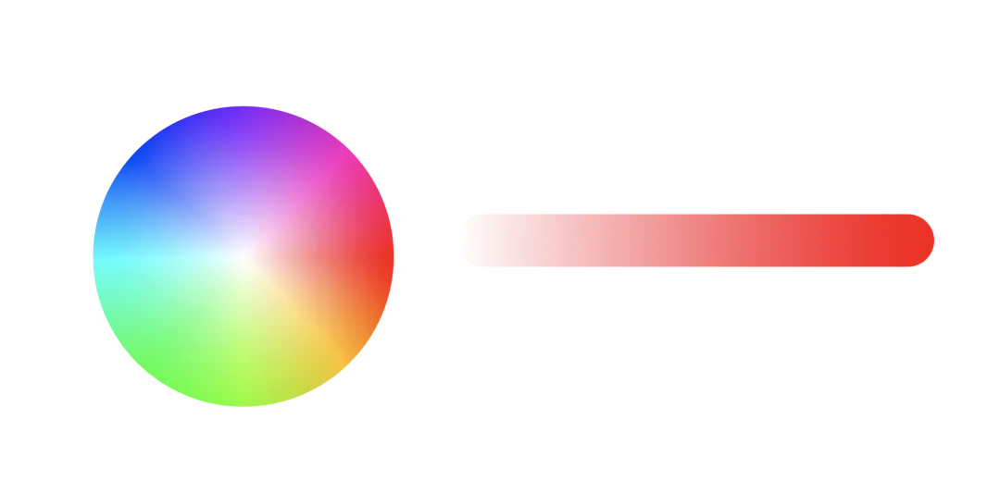

**lightness 明度**

**lightness 表示颜色的明亮程度**

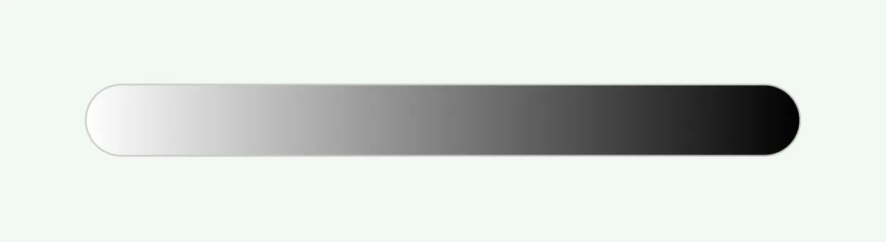

**Tint, Shade & Tone 色调**

Tint 即在 Hue 色相中加入白色;Tone 在 Hue 色相中加入灰色;Shade 在 Hue 色相中加入黑色(如下图)

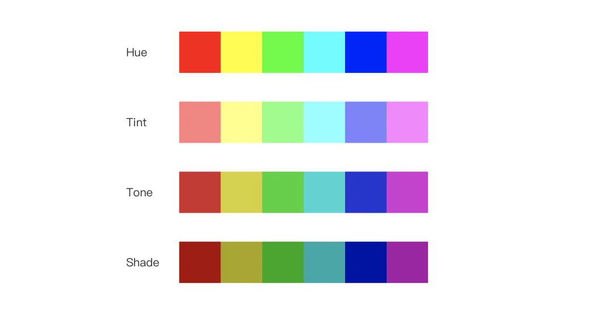

## 6. 色彩模型

我们知道色彩模型主要有三种

比如以光叠加的 RGB 模型

以印刷油墨(物体的光反射)CMYK 颜色模型,美术中常见的 RYB 颜色模型

以亮度感知为基础的 Lab 模型

其中,RGB 模型是在电子设备上应用的模型,所以着重分析此模型。

我们知道电子颜色显示模式为 RGB(r、g、b)模式,RGB 即是代表红、绿、蓝三个通道的颜色,以下即为 RGB 颜色模型,红、绿、蓝三个颜色通道每种色各分为 256 阶亮度,在空间中以 (0,0,0) 黑色作为原点,沿坐标轴扩展,每个直到 (256,256,256) 白色顶点。

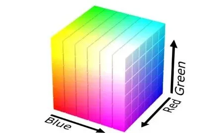

但是 RGB 模型缺点是不够直观,并且不符合人的心理模型。(不能表现色度、明度概念)因此,就根据 RGB 模型变形出了 **HSL / HSV / HSI** 色彩模型。

将 RGB 颜色模型方块放置垂直于中性轴的色度平面上,如下图,将得到倾斜的方块,此时垂直做投影,得到正六边形,每个拐角点为红色、黄色、绿色、青色、蓝色、洋红,这个也是基本的六个色相。而此时模型样式就是 RGB 的变种之一 HSI 模型。

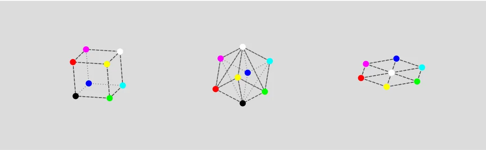

将 HSI 模型的三原色和次要颜色放入白色平面,此时色相明度被定义为最大值,形成倒棱锥。将此模型的黑色原点扩展形成六棱柱,此时模型即为 HSB 模型。由于此结构不方便使用计算,因此将六棱柱进一步变换为圆柱体,此时模型即为 HSB 色彩模型。

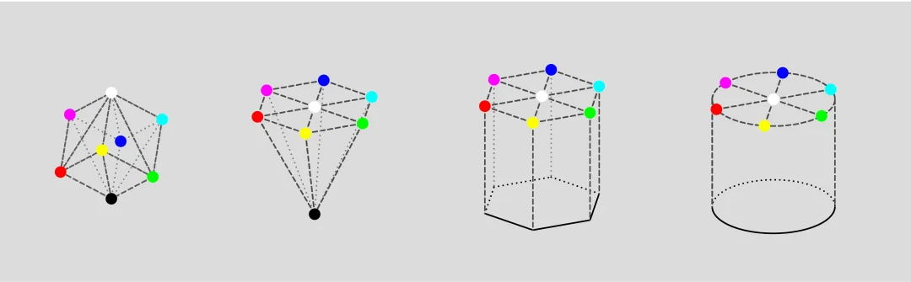

将 HSI 模型的三原色和次要颜色放入明度的中点平面,此时色相明度被定义为最大值和最小值的平均值,形成双锥体。将此模型的黑色原点扩展形成六棱柱,此时模型即为 HSL 模型。由于此结构不方便使用计算,因此将六棱柱进一步变换为圆柱体,此时模型即为 HSL 色彩模型。

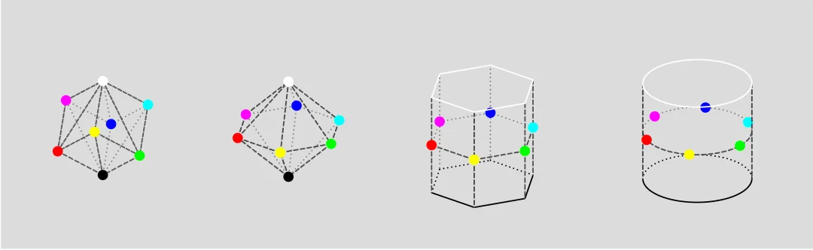

**那么这三个模型到底有什么区别呢?**

**RGB 颜色模型是面向硬件的,但是不符合人们心理模型,由此变换出 HSB 和 HSL 模型,我们从 PS/Figma 中可以找到这两个颜色模型的样式,可以看到 HSB 中饱和度最高的色彩在右侧顶点,而 HSL 中在右侧中点处。这是因为**

HSL 模拟不同颜料混合在一起在现实世界产生颜色的方式,Lightness 表示颜色和不同比例的黑色或白色混合在一起的值,例如纯红色和 90 的白混合在一起,则 90 表示 L 的值。

HSB/HSV 模拟颜色在光线下的显示方式,Brightness 表示的是光的量。例如,将白光打到红色物体上,物体颜色会看起来更亮。HSL 和 HSB 的区别是,HSL 的亮度最高颜色为纯白色,而 HSB 亮度最高为纯色。

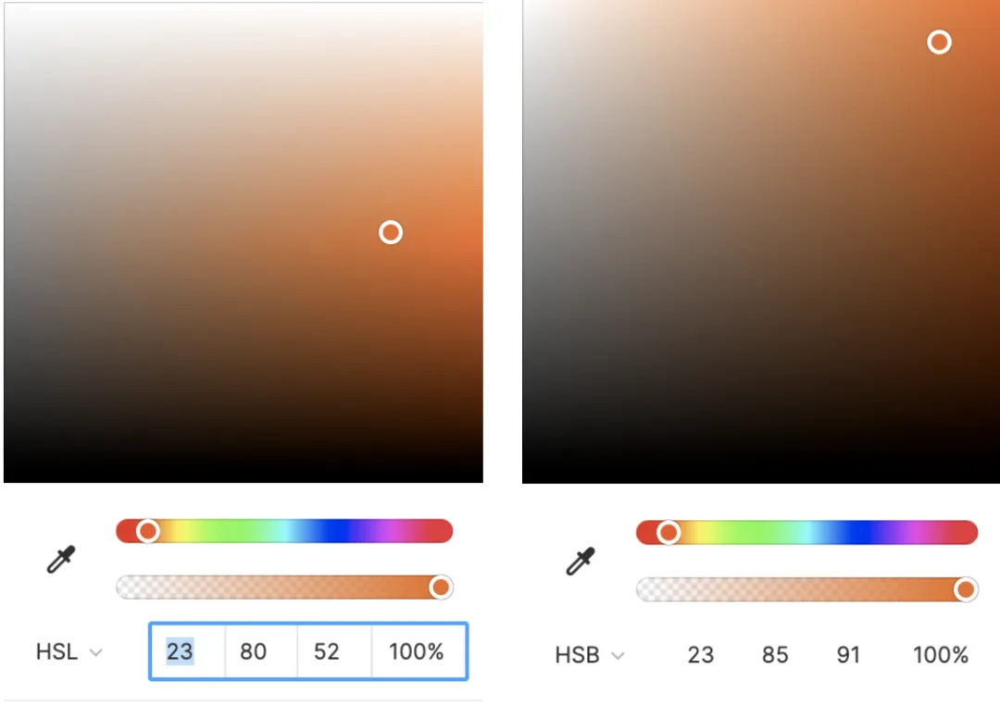

而 HSI 模型反映了人的视觉系统感知色彩方式,Intensity 表示的是颜色的明亮程度,即人眼对颜色感知的明度。也就是第一章内容提到的 **色调、饱和度和亮度**,在计算机视觉和图像处理中广泛应用。

虽然 Brightness、Lightness、Intensity 都翻译成明度,但是它们的意思是不同的。如下图所示,两个颜色,红色和青色,它们的明度在各自模型中是相等的。HSB 是在 100% 光的照射下颜色;HSL 是在 30% 白色的混合下的颜色;HSI 是人眼感知的亮度相等情况下的颜色

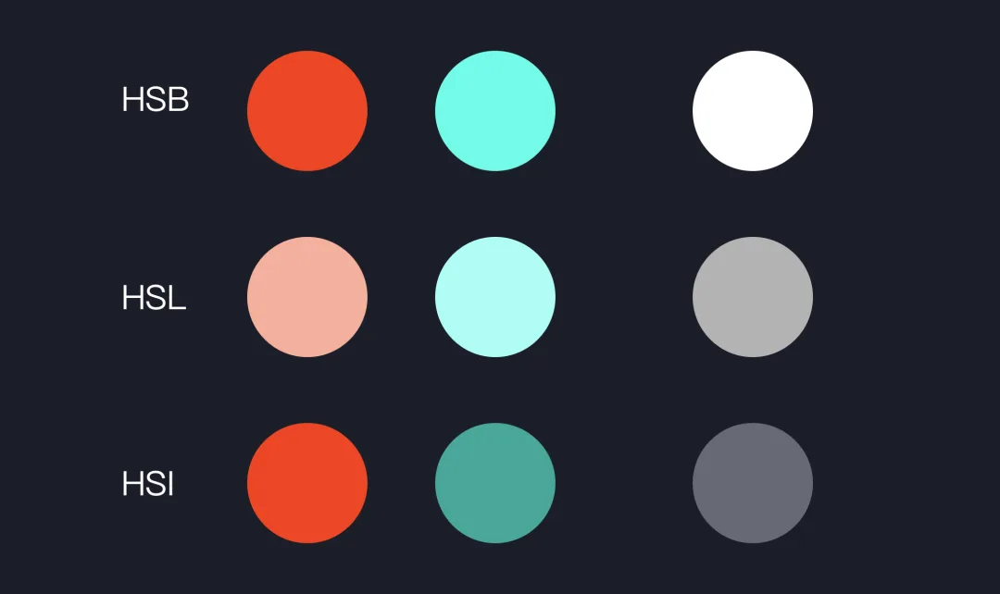

那么对于饱和度 Saturation 又有什么区别呢?

其实颜色的饱和程度一般称为色度 Chroma,而饱和度 Saturation 是被创造出来的一个名词。前面我们已经讲到 HSB 和 HSL 模型一个是倒棱锥,一个是双锥体,如果垂直切开模型,如下图左侧,则横向是色度,纵轴是明度。在我们进一步的模型变幻中,Chroma 色度转换成了 Saturation 饱和度。

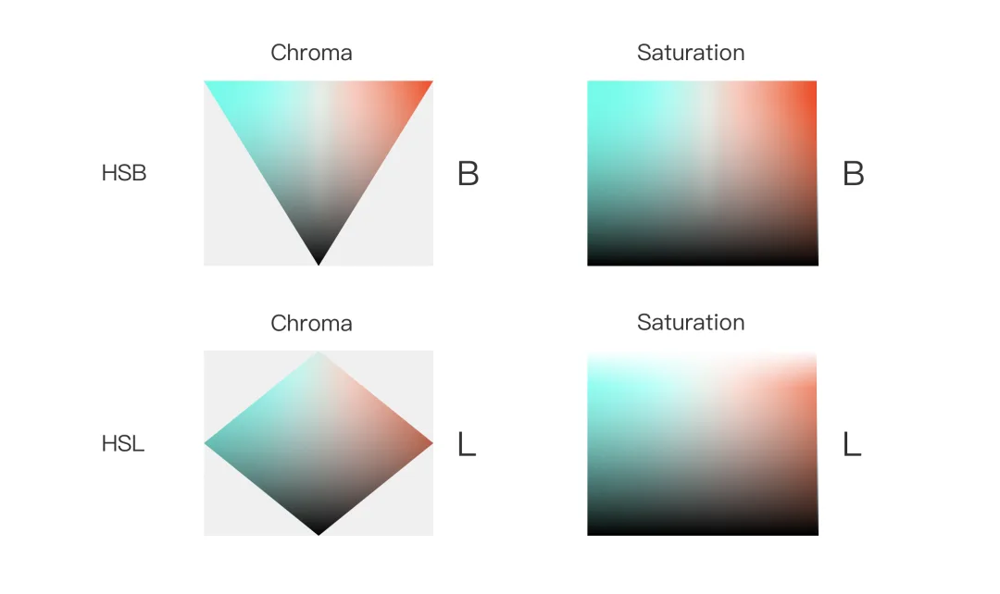

**当然,大部分设计软件都是使用 HSB 色彩模型的,因为我们对于饱和度更倾向于颜色纯度,明度更倾向于颜色深浅。**

对于 HSB 和 HSL 色彩进行调色时候,除了对比色互补色的选择外,还要进行适当的色彩明度校正。因为本身色彩的明度是不同的,而 HSB 和 HSL 色彩模型为了便于计算,强制将它们放置于一个平面上,例如下图色彩的 S/B 值相同,但是感官明度(即表现为黑白亮度)是不同的。

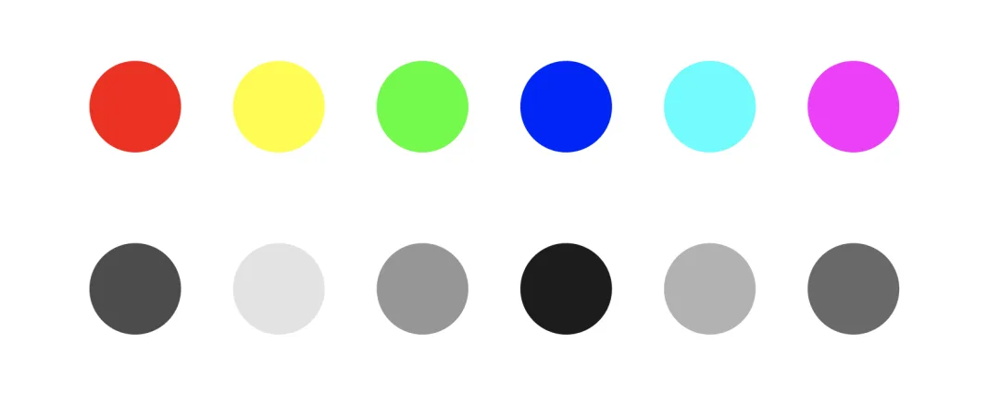

## 7. 色彩和谐

在描述配色之前,我们先要简单讲述一下 RYB 颜色模型。

我记得在小学时候就学过色彩的三原色是 **红黄蓝**,光的三原色是 **红绿蓝**,多年以来一直分不清两者的区别。

RYB 模型是传统的色彩理论模型,支撑并影响了包豪斯和乌尔姆设计学院以及众多艺术和设计学校的色彩课程,RYB 属于减色模型,由红黄蓝三种原色以混合创建其他色彩,并被人们广泛接受。

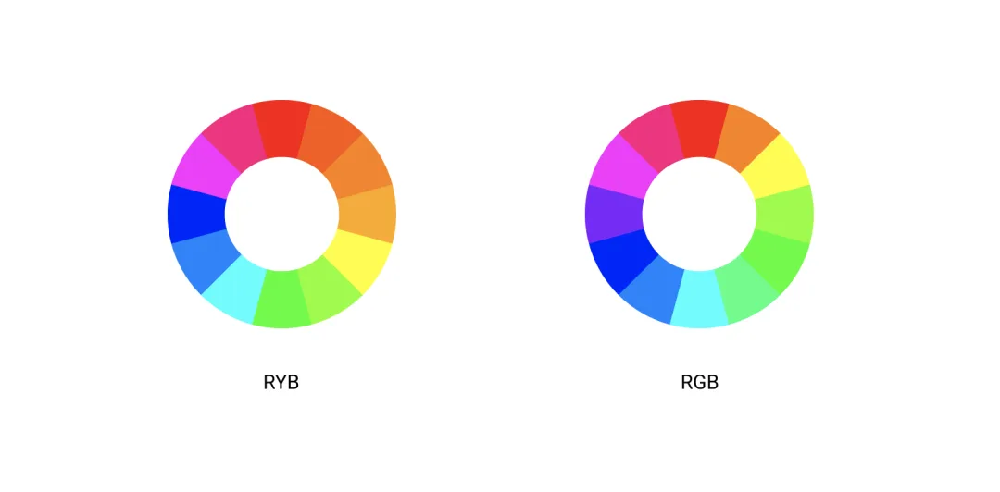

我们可以对比一下 RGB 和 RYB 颜色模型,可以看到

RGB 中的蓝色,偏向紫蓝色,而 RYB 中的蓝色,是传统意义上的蓝色;

RGB 中冷暖色分布不均匀,而 RYB 中,冷暖色基本是对半分布的;

RGB 中颜色不是严格意义上对称的,互补色存在一定的偏差。

所以,在使用 RGB 色环配色时候,除了进行感官明度校正外,也要对颜色色相进行修正。而 RYB 色环就能方便地解决色环误差。所以在 Adobe color 上也采用的是 RYB 色度图。其实在设计软件中很少有 RYB 色环,大部分都是 RGB,只是通过了解他们的差异,给自己配色时候提供更好的调整。

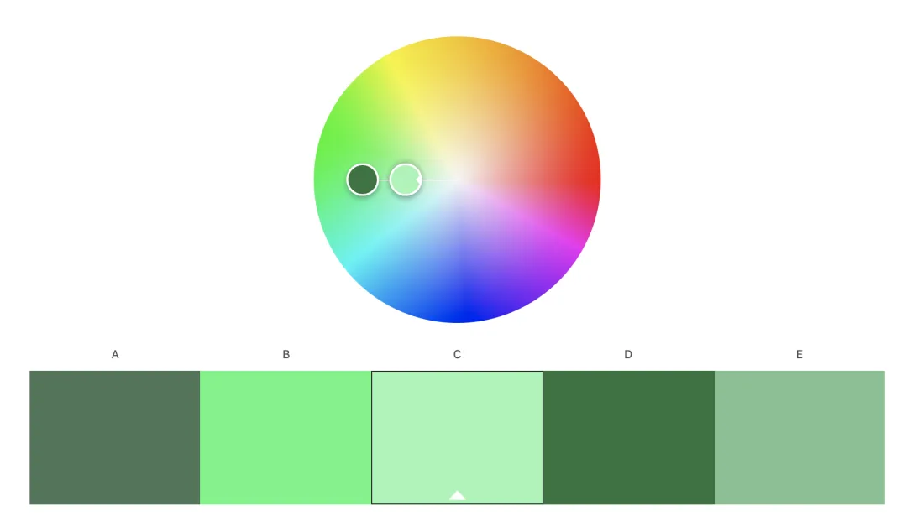

## 8. 配色

讲配色前,再来讲述几个概念。

**冷色和暖色**

**冷暖色一般是人心理上对色彩的反应,一般以红、橙、黄为暖色,绿、蓝、紫色为冷色。**

**同类色:** 在其左右 15 度的颜色为同类色

**类似色:** 在其左右 30 度的颜色为类似色

**邻近色:** 在其左右 60 度的颜色为同类色

**中差色:** 在其左右 90 度的颜色为中差色

**对比色:** 在其左右 120 度的颜色为对比色

**互补色:** 在其左右 180 度的颜色为互补色

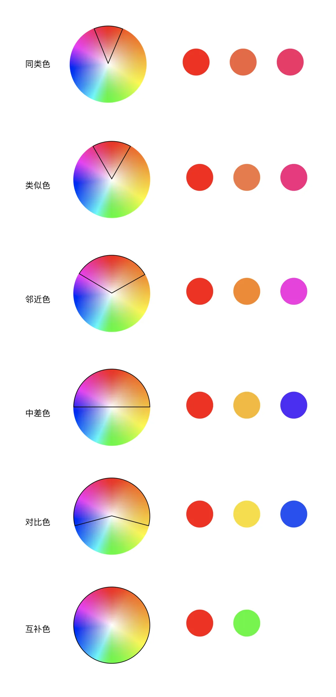

前段时间冬奥会开幕式节气倒计时视频大气又不失淡雅,温润充满活力,那么我们就以此视频的场景截图来分析。

**1、单色**

**在配色中采用单一色调,对其进行饱和度和明度进行变化,使画面整体更统一**

**2、类似色**

**一般是采用三种颜色,具有和单色相近的效果,需要注意是,三种颜色必须是同冷色或者暖色。画面具有多种类似颜色但仍保持统一可以使用此配色。**

**3、互补色**

**常见的对比色有:蓝色和橙色,红色和绿色,黄色和紫色,对比色一般增强画面的对比度和视觉强度,突出重点。呈现两个对比鲜明元素或者在背景中突出元素,可以使用此配色方案。**

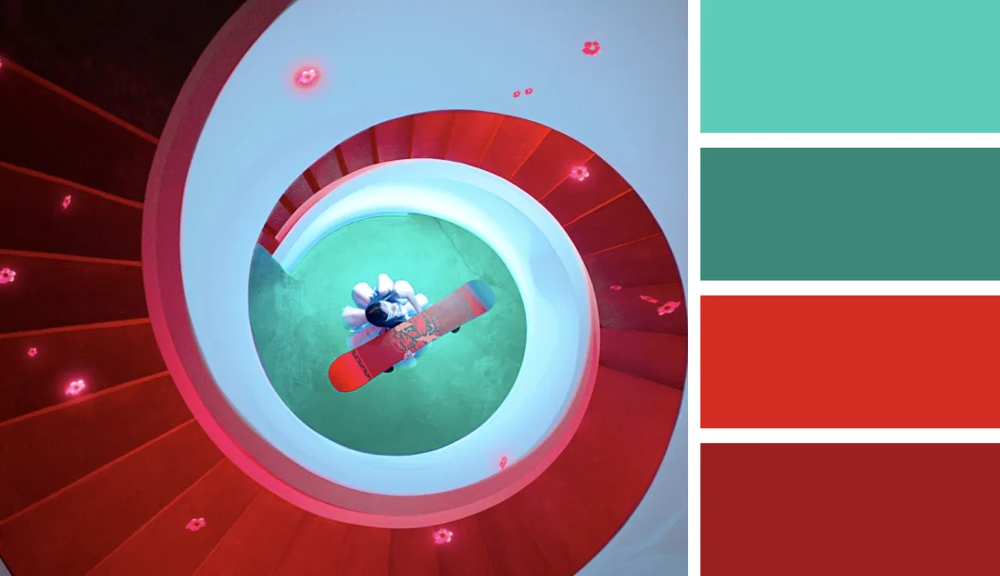

**4、三元色**

**通常由三种颜色组成,在色轮上形成等边三角形。画面内容较丰富,充满活力和张力。**

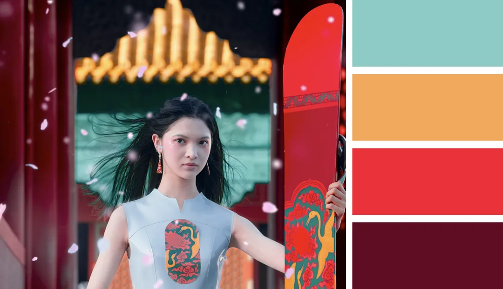

**5、拆分互补色**

**拆分互补色和互补色配色类似,但不同的是,为互补色的类似色,画面更为相融,对比性没那么突出。**

**6、双元互补色**

**和互补配色类似,但是有两组互补色,用于画面内容较丰富,在背景中突出多个前景元素。**

这个在视频中没有找到,在 unsplash 中找一张图片举例。

除了上面色彩搭配,通常我们还要理解颜色的心理模型,例如

红色是情感强烈的;橙色是温暖的;黄色是欢快明亮的;绿色是生命的;蓝色是宁静的;紫色是神秘的;粉色是浪漫的。

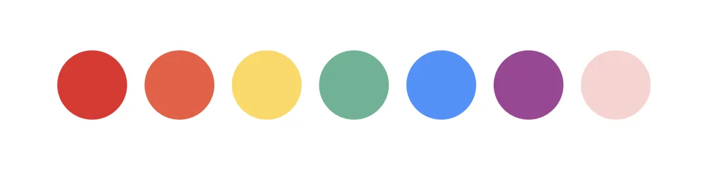

总的来说,不管是哪种配色方式,都有一个主色,然后搭配辅助色;其次,通过上面的图片可以看到,高级色通常都会适当地降低色调饱和度。

经过前面这么多分析,现在我们可以很明白地了解经常在美术中说的"色调"这个词的含义了。

汉语中的色调是指一幅绘画作品整体颜色倾向的描述,包括色相、明度、饱和度这三个维度。比如一幅画,色相整体偏绿色,那就可以说是绿色调;画面明度偏高,可以说是高明度色调;画面颜色偏淡,可以说是低纯度色调。那么整体是绿色,我们可以说它是冷色调。总之,色调可以描述画面在某个维度内的颜色倾向。当然,这种描述是相对的。

## 总结

本篇文章首先讲述了颜色的本质——光,然后又讲了人眼对色彩的感知和范围,接着讲述了色彩空间、色域和最重要的色彩模型,其中最主要的是电子设备使用的 RGB 色彩模型以及转换成 HSB、HSL 的由来,和模型缺点。在对比完 RGB 和 RYB 后,又讲述了色彩和谐的使用,以冬奥开幕式节气短视频举例,展现高级色的配色方式。

这篇文章是去年 12 月底陆续写的,虽然是我们常见的色彩知识,但是还是涉及到了很多之前没接触过的内容,去谷歌和维基百科、知乎上搜了很多资料理解、整理并完善,总算把所有关于色彩的基本知识整理完了。

感叹一年一年又过去了,自己还是一事无成,难免会有些焦虑。总之,还是要加油吧～

关于开幕式截图和视频链接放在下面,需要的话可以收藏一下,还是很好看的

链接: https://pan.baidu.com/s/1rVf-jf88TH12IANVlZgbpw

提取码: mhrw
