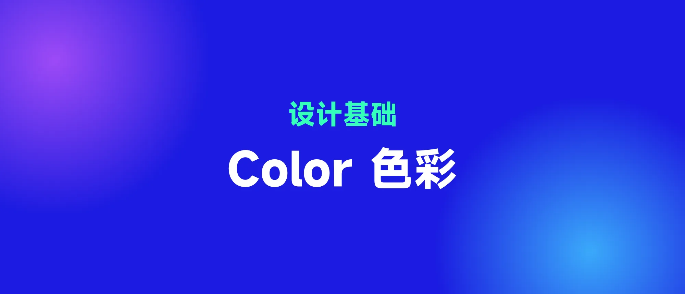

上篇文章讲了关于色彩知识,这篇文章就讲 MD3 颜色的具体应用～

由于 MD3 中采取了 Dynamic color 动态色彩系统,而色彩变化涉及到色彩的逻辑关系以及色相和色度的变化。

首先我们看一下 MD3 的色调调色板

MD 色调调色板由 13 种颜色组成,色值为 0 的时候是纯黑色,色值为 100 的时候是纯白色,MD 把这种数值称为**色彩中存在的光的量**。

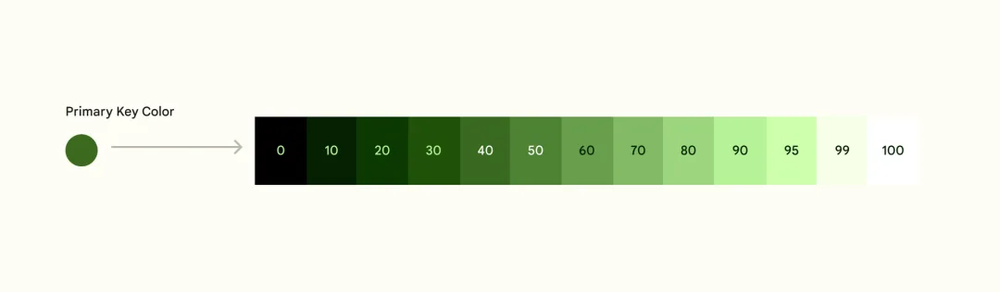

这种配色方式意味着什么呢,就是类似于上篇文章讲述的 HSL 和 HSI 模型,相比于 HSL,其实更接近于 HSI 模型。比如当值为 40 的时候,表示存在光的量是 40,这时所有的颜色值的感官明度是接近相等的。

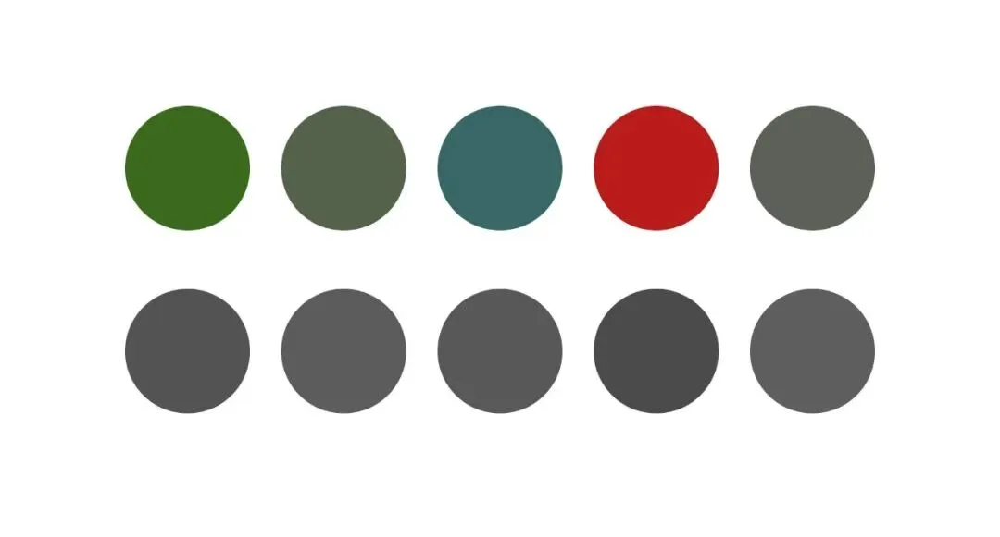

MD 3 中将颜色分成两个大类,关键色(**Key color**)和其他色(**Additional colors**),**关键色是构成页面的主要颜色,包括主色、辅助色和中性色。其他色是相当于不列入我们常规色彩体系的颜色**

在 MD 3 中,关键色(**Key color**)被分成两小类,分别是强调色(Accent colors)和中性色(Neutral colors),这囊括了页面所需要的大部分颜色。对于简化版 App 来说,其实只需要下图中的 Primary Key Color 和 Neutral Key Color 两种,而剩下的其他列别,就是 MD 的精细化分了。

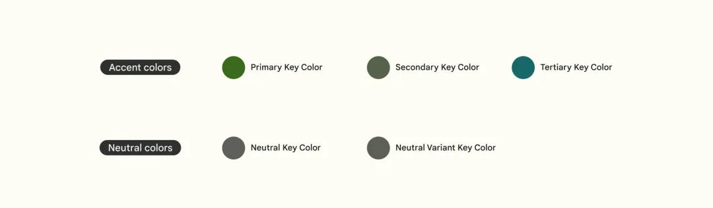

其他颜色,就是常用的警示、提示性颜色,当然也包括 icon 用的多色彩。

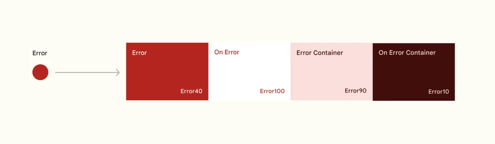

上面讲述了 MD 3 的颜色来源和两大类别,下面就来讲述它是怎么应用颜色的。MD 3 的颜色框架如下图所示。

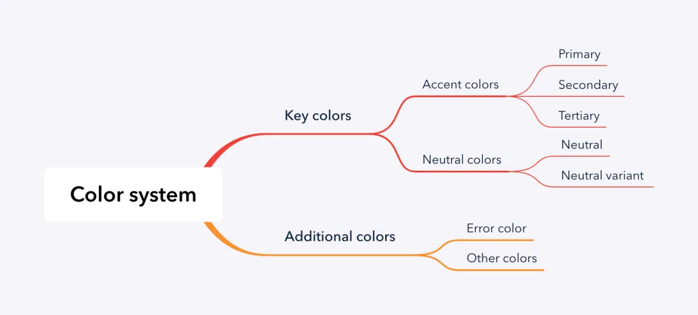

**关键色**

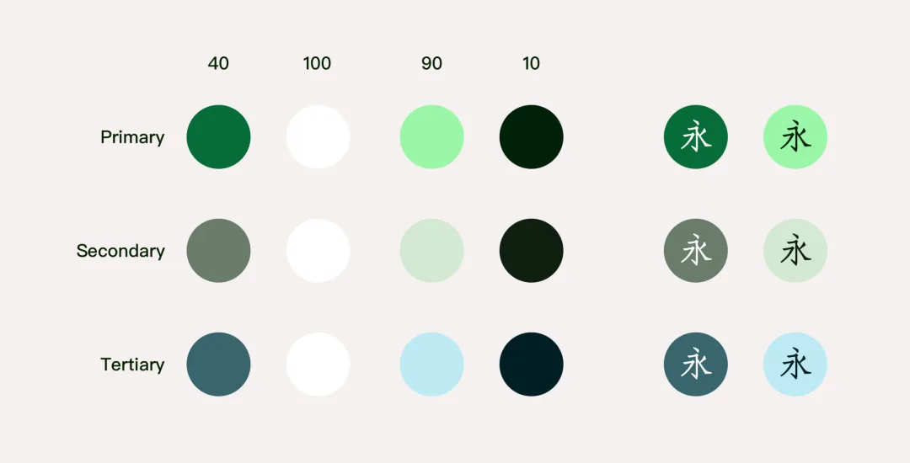

题外话,为了表现 container 和 on container 的色彩组概念,我后面的字体和颜色组合以显示这种特性。

MD 3 将强调色分为三类,包括主色、辅助色、次要色。并选取特定的数值进行分组,分别为容器(Container)和容器内(On container),MD3 还强调了每种颜色使用场景,由于其颜色复杂性,因此最好是放在具体案例中讲述。

在中性色,MD3 选取中性色(Neutral)作为 background 和 surface 颜色,其中,surface 又分为五个等级,分别运用在组件背景中(也可以运用在页面整体背景,视情况而定)

**中性色**

而中性色变体(Neutral Variant)中为特殊应用,99 值应用在组件内,充当组件填充,融入于背景的组件,例如分割线,输入框,进度条背景。30 的值应用于辅助字体颜色,最后的用于 outline 组件轮廓颜色。

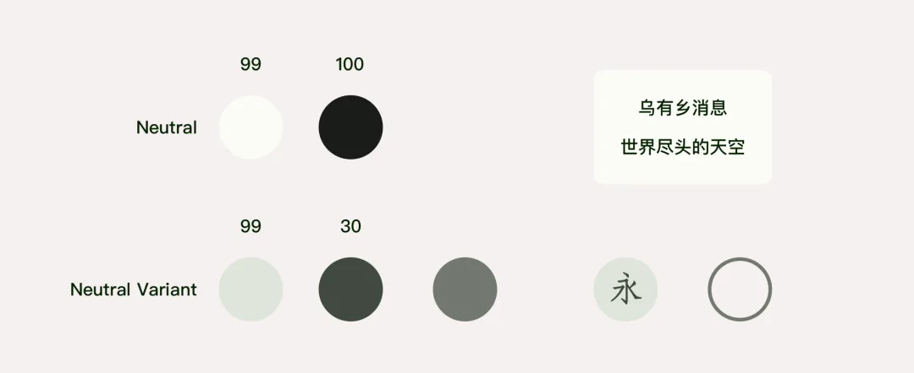

**最最最重要的,就是颜色对于界面层次的帮助。在 MD 2 时代就确定了页面模块的相对高度**

**确定高程,需要满足三个条件**

- 表面与环境形成对比,处于焦点状态
- 与其他曲面重叠(包括静止和运动状态)
- 与其他表面的距离

确定高程的表现形式,当时 MD2 提出了三个方案,分别采用阴影、颜色和不透明度来表现不同层次,当然 MD2 时期是以阴影为主作为区分的主要方案。

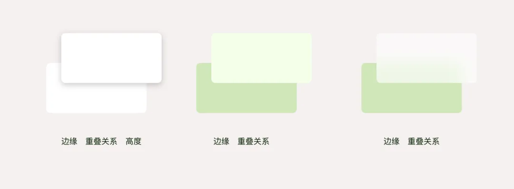

由于阴影能表现出相对高度这个概念,因此 MD 2 规定了页面组件的 10 个层级,运用不同程度阴影来表现相对距离。

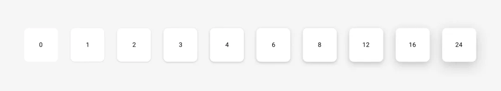

在 MD 3 中采用了通过颜色深浅变化替代曾经的阴影,其规定了 6 个程度不同高度样式。分别用背景色和不同程度主色的叠加来表示。

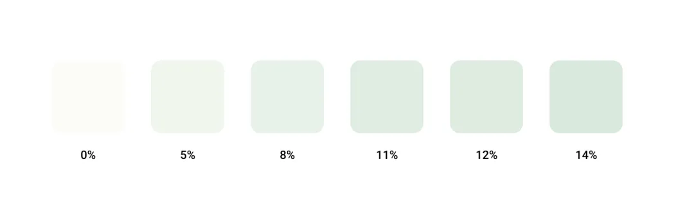

但是,这样的颜色深浅表示高程的方式,并不能运用到所有组件上,由于 app 习惯上更倾向于深色背景配浅色内容,因此相比于左边单纯按照高程颜色,右面更符合大部分人习惯。

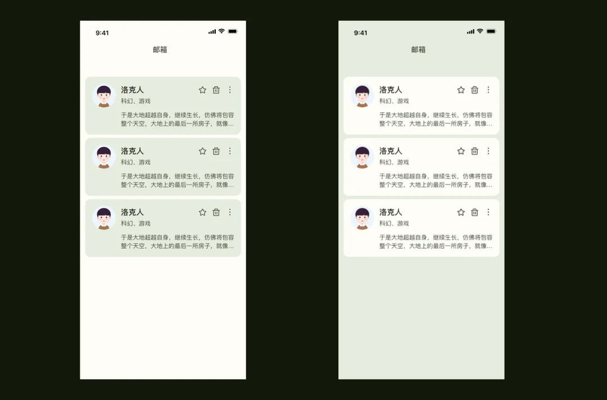

由于习惯上我们对于 APP 以白色视觉为主,主色和辅助色做点缀,所以,上述 MD 3 的 surface elevate 除了反过来应用表现背景和内容层的对比外,还可以按照正序来表现焦点组件的层次(Nav bar、Tab bar……)例如下图中的中间和右图(左图作为对比显示)。

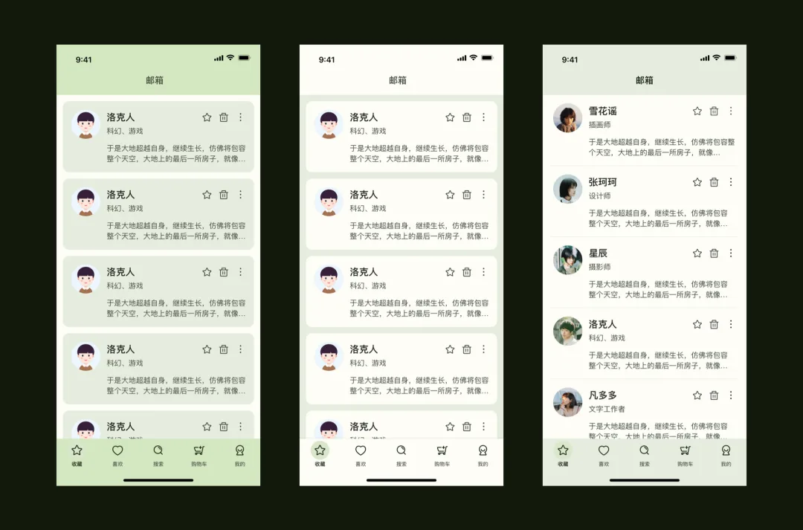

由于 MD3 是非常规体系化色彩应用,对于设计来说,较难完全匹配所有色彩应用,但是通过对 MD 3 组件库和 figma 社区相关页面分析,我们可以得出关于 MD 3 最常用的配色方式,从此构建 Material You 风格的色彩界面,具体如下

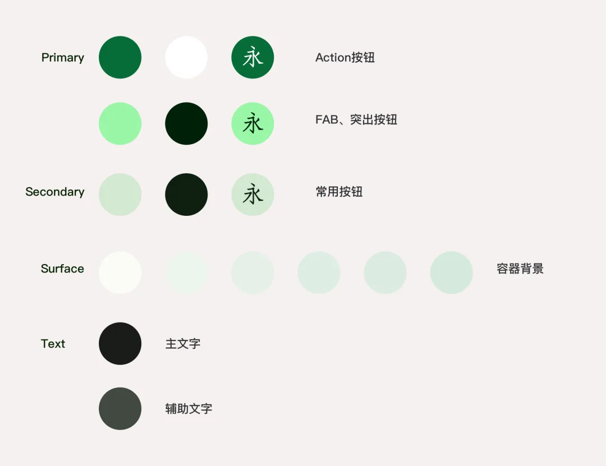

参考上面配色,我做了几个 Material You 风格界面

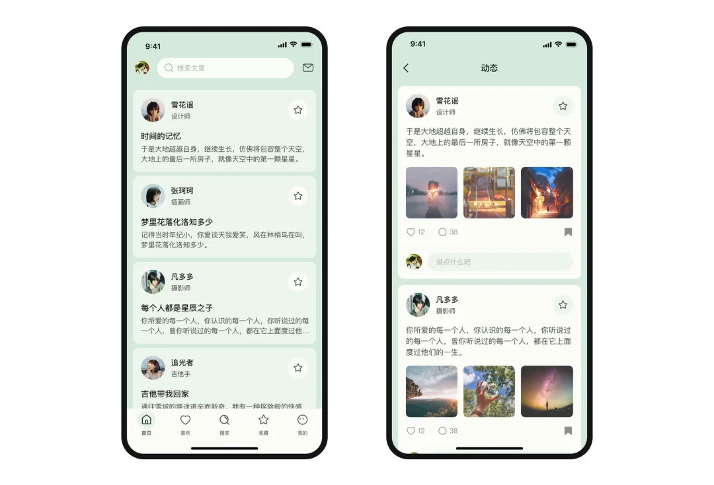

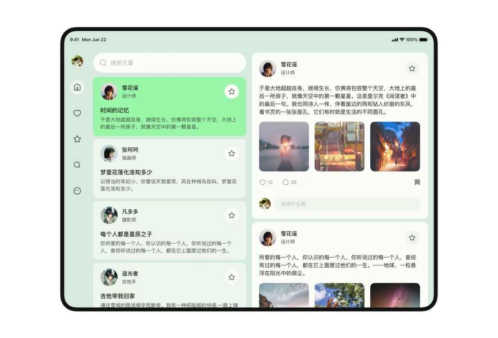

虽然完全照搬到我们实际应用项目不太适用,但是就 MD 配色系统、以及 Dynamic color 的思维以及个性化设计来说,还是很有参考借鉴意义的。

由于手机限制,无法体会到原汁原味的 Android 12,Pixel 手机个人预算有限,那就画个模型哈哈哈,以下用 Sketch 绘制,Figma 其实更好做,作为自己绘制样机的参考。导航栏没有用安卓,偷偷用了 iOS,有点出戏,哈哈哈～

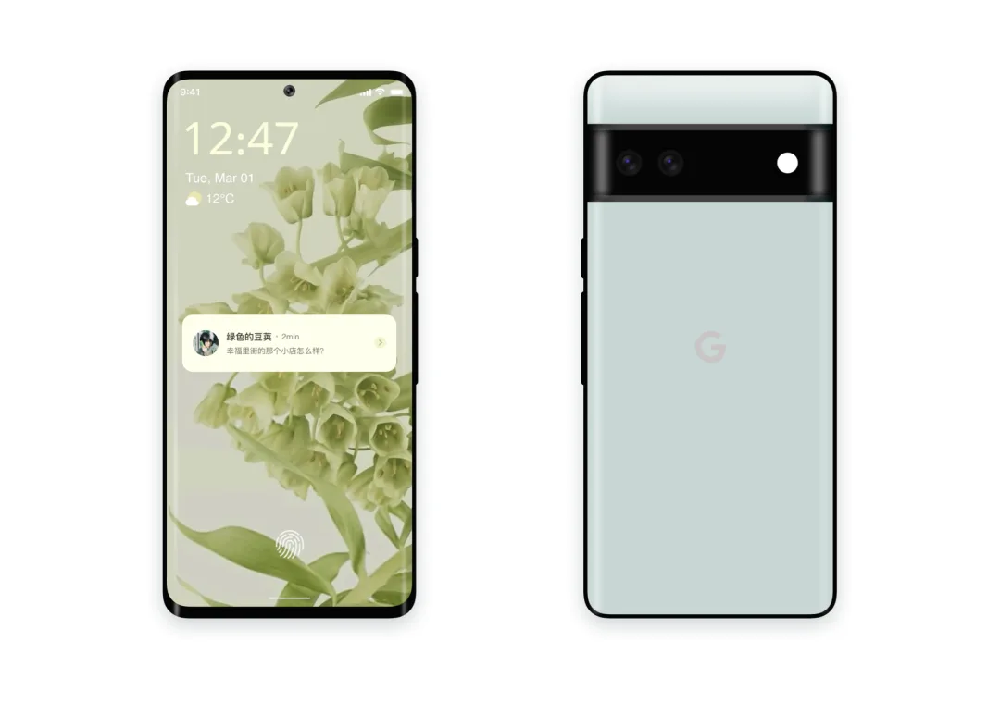
