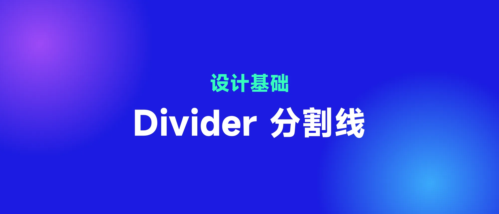
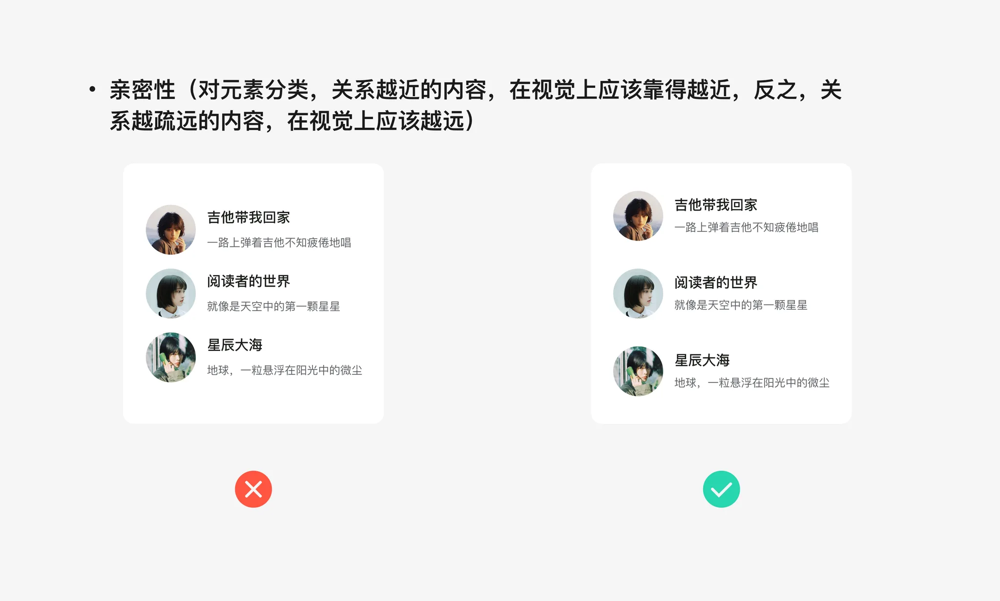
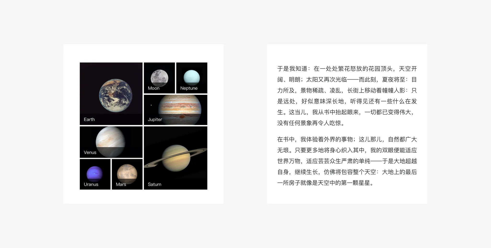
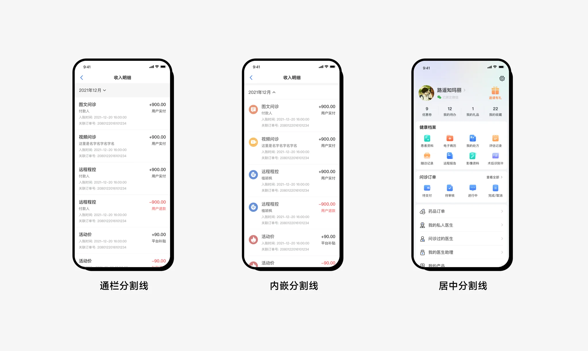
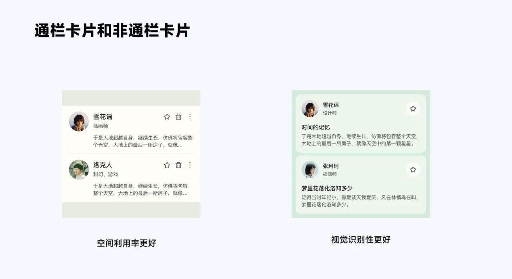
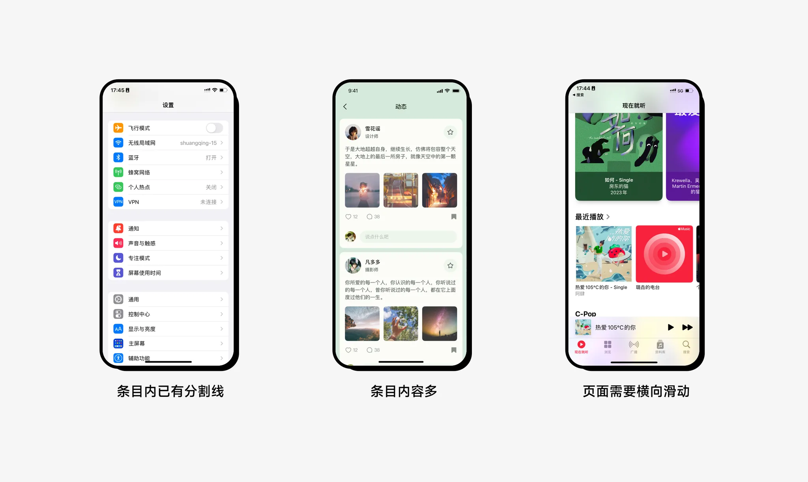

## 1. 分割布局

APP 中分割布局是产品对界面信息架构功能点梳理、分类之后形成的视觉排版产物,将视觉上或者内容上需要区分的内容用不同的分割形式,造就了视觉上对于一款 app 页面信息的整体和独立感,能够帮助用户了解页面的层次结构,赋予页面内容以组织性。

## 2. 页面分割方式

页面分割的方式有三种:留白分割、线性分割和卡片分割

### 2.1 留白分割

留白分割利用了格式塔原理,人的大脑会倾向于把彼此靠近的元素视为一组

同类元素之间默认采用留白分割,比如照片或者段落中的文字,随着元素增多,多个元素按照特定的信息组合形成信息组块,组块与组块之间进行区隔时,就需要引入留白/线性和卡片的分割方式～

### 2.2 线性分割

线性分割在移动端常用的高度是 0.5px,而非 Material design 的 1px,因为 1px 在实际开发中视觉显示太重。

分割线分为三种类型:通栏分割线,内嵌分割线、中间分割线

- 通栏分割线:一般用于分隔彼此完全独立的内容
- 内嵌分割线:用于分隔有锚点(头像或图标)的相关内容
- 中间分割线:用于分隔无锚点(头像或图标)的相关内容

### 2.3 卡片分割

卡片可分为【通栏卡片】和【非通栏卡片】

何时使用卡片分割?

1、当这个主题内部的内容已经有分割线时,建议采用卡片分割,以让主题信息层次更清晰。

2、当单个主题内部的内容类型较多,上下所占空间较大(比如 ≥1/2 屏),建议采用卡片分割,以更好的圈定该主题的内容范围,给用户明确的内容边界感。

3、当需要扩展页面的横向空间时,暗示页面可以横向滑动时,需要采用非通栏卡片,利用横向内容连续性原则,帮助用户建立可以横向滑动的意识。

## 分割选择优先级

当信息条目复杂度较低时,优先采用留白分隔,视觉清爽无干扰。

当信息条目复杂度增加,只利用留白分割效果不明显时,建议引入线性分割,让信息层次更清晰且屏效高。

当信息条目复杂度进一步提升,(比如已经有了线性分割,或者有更多操作),需要进一步强化信息条目本身的边界感,建议引入卡片,以强化条目信息的视觉层次和可操作性。

参考:

- [界面设计中的分割方式(人人都是产品经理)](https://www.woshipm.com/pd/5315849.html)
- [留白分割、线性分割、卡片分割,一张图扫清你的选择困惑!(人人都是产品经理)](https://www.woshipm.com/pd/5229052.html)
