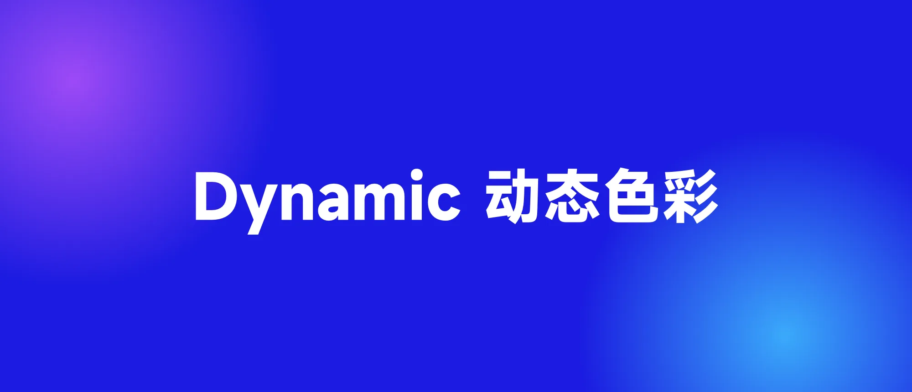

早在今年五月份,谷歌 io 大会就提出了 Material You 的介绍短片,当时 MD 官网上写着将于今年秋天正式推出 Guideline,前段时间打开 MD 官网竟然发现更新了!!!从 2014 年推出第一代 Material design,到 2018 年推出第二代 Material design,再到今年推出的第三代 Material design,每次更新,谷歌总能给我们带来些新的东西。Material design 3 又被称为 Material You,此次新增了新的视觉风格和一些组件的更新,分为 **动态色彩**、**design tokens**、**折叠屏设计规范** 这几个模块。

### 动态色彩

利用自定义配色方案获得个性化用户体验

### 设计令牌

通过一种类似代码的方式,简化工作流程,提高产品一致性

### 大屏幕引导

从 mobile 到 tablet 到 desktop 屏幕尺寸的无缝过渡,并特别针对可折叠屏幕进行了相关设计规范制定

首先 M3 讲述了代码库的迁移,包括颜色、暗色主题、形状样式、排版、布局、以及动效等,主要是安卓层面的代码,这里不多赘述。

MD 此次更新,增加了许多新的名词,在 **Foundations 中,MD** 专门介绍了这些名词,这些名词如果不联系相关内容看很容易一头雾水,所以接下来还是一起去看一下主要的新增概念。

### 动态色彩

此次更新非常重要的内容就是新增了 **Dynamic color(动态色彩)** 概念,通过这个方式,用户可以采用喜欢的颜色来生成界面配色方案,更好地满足了设备的个性化和产品的品牌化。

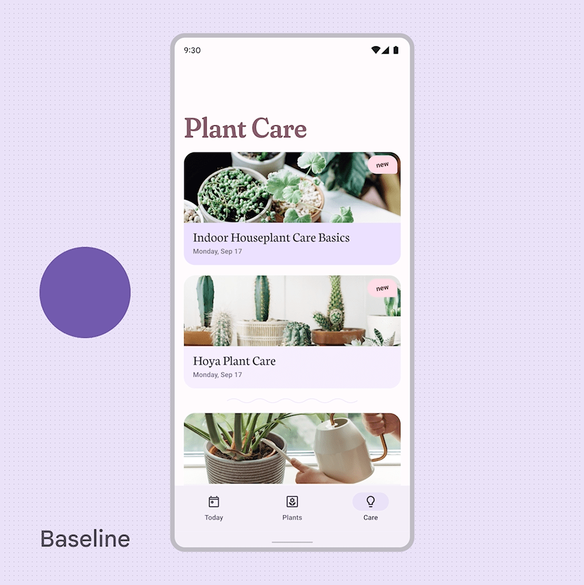

那么如何构建这些动态配色方案呢?此次更新,MD 在 Figma 中开发了一款名为 **Material Theme Builder** 的颜色生成器插件,通过此插件,可以基于 MD 的颜色框架生成自定义配色。

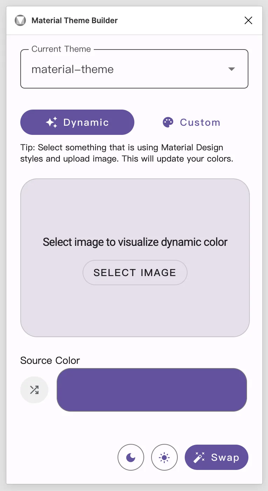

比如,你可以通过上传图片或获取主色,从而生成一套配色;

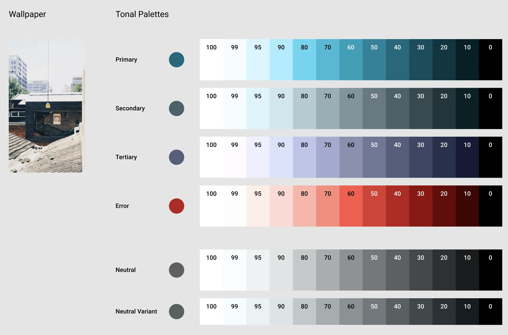

或者,可以直接设置颜色代码值,根据 source color 生成一套配色;

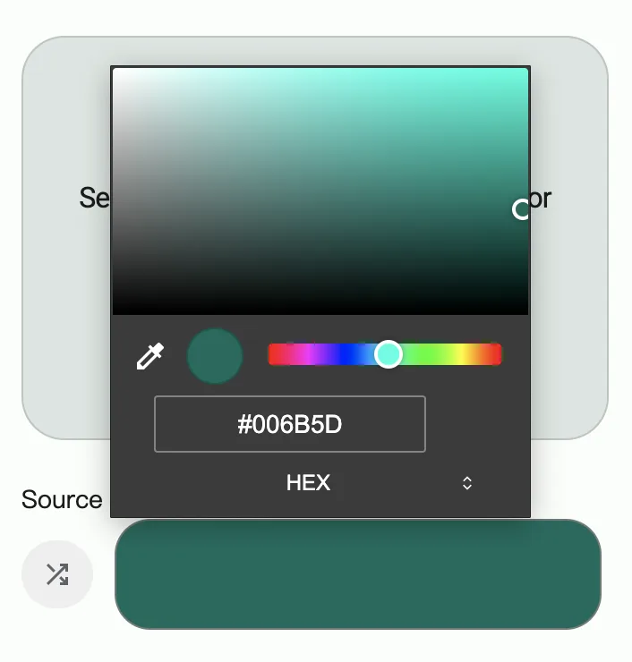

或者可以自定义颜色,然后生成一套配色方案;

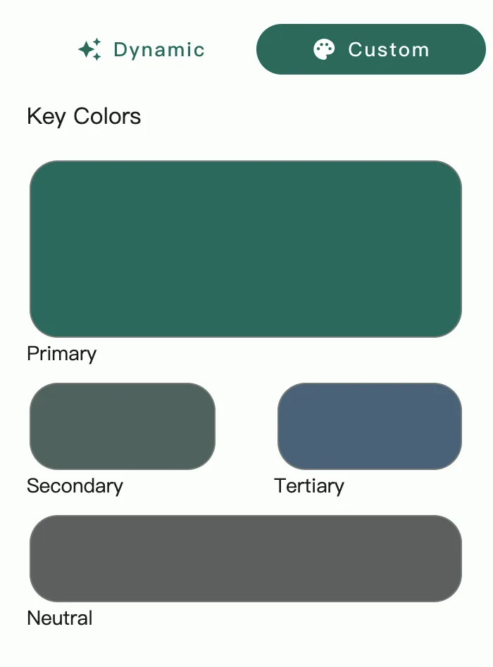

### Design Tokens 设计令牌

设计的一致性一直以来是一个永远需要被关注的问题,因为从设计到开发两个平台多名人员的相互协作,设计稿样式转换成代码的读取和更新之间产生的问题,总会最大程度影响着设计一致性。从过去来说,设计规范即保证设计师的组件和样式,保证设计图的一致,然后设计图经过中间方式(例如蓝湖、zeplin 等),开发人员获取相应平台的代码值进行开发。但是由于设计样式不断更新,开发难以及时获取更改的内容代码,另一方面,在 Sketch 中简单的改动,在开发过程可能造成较大的工作量,因此 Design tokens 应运而生。

Design tokens 起源于 Salesforce,Adobe 的 Spectrum 也较早地提出了 design tokens,并将其定义为如下:

> Design tokens 是构建和维护设计系统所需要的所有值,包括(间距、颜色、排班、样式、动画等等),并将它们数据化。Design tokens 可以定义任何内容,例如颜色 RGB 值、不透明度、动画的缓动……他们代替真正的代码从而保持平台的灵活性和统一性。

其实看过这个定义后,Design tokens 的定义还是非常模糊,下面,我们根据实际工作场景来说明什么是 design tokens。

UI 设计师无不熟悉原子设计理论,把设计类比为化学中物质构成元素很好的解释了界面的层层构成。比如下面卡片样式:

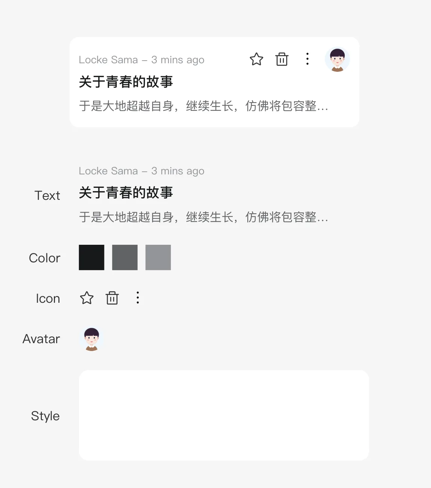

其中按照原子理论可以分解为 Text、Color、icon、Avatar、layer style,然后这些元素合理地布局形成分子-组件,然后分子组件组合成模块到页面。

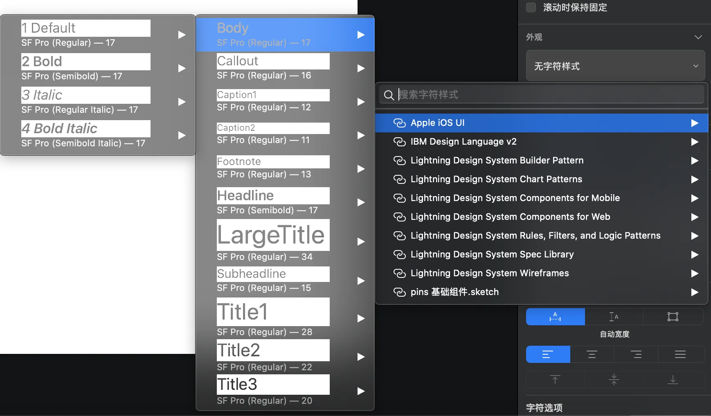

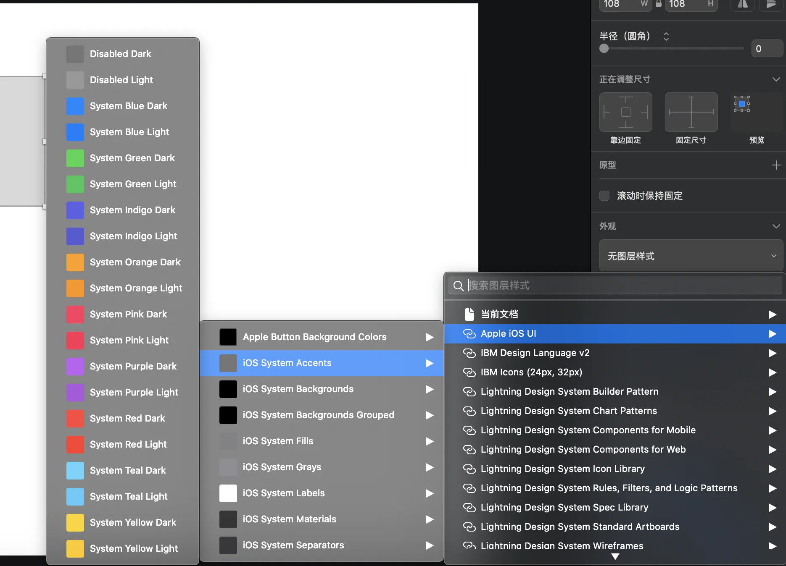

然后我们在 Sketch 中,给每种原子定下样式,例如 Text,定下 H1、H2、H3、H4、H5 字体和所有属性字体全部建立一遍样式,然后选用。或者 layer style,我们定义下所有情况所用的图层样式,例如 normal、hover、press 等等,然后再组成组件选取所需样式。

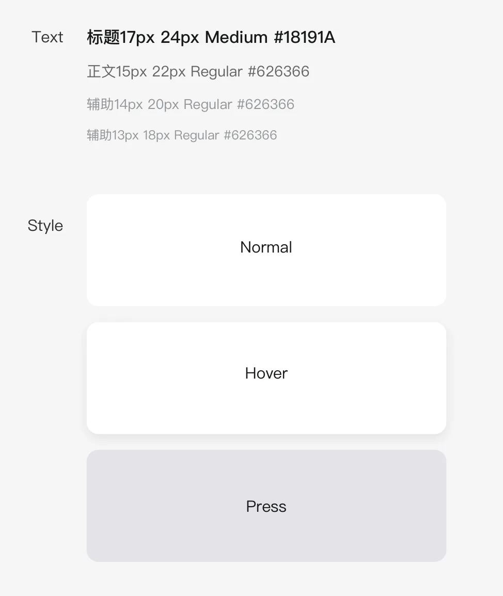

但是这样产生了一个问题,我先把上面定义的样式仔细拆分开来:

在文本样式中,我所定义的每一个文本样式,其实上都包含了很多属性,如果以网页代码化来看标题文字包含的属性包括:字族、字体样式、字体重量、字体大小、字体行高、对齐方式、颜色

```css
font-family: PinFang SC;
font-style: normal;
font-weight: 500;
font-size: 17px;
line-height: 24px;
text-align: left;
color: #18191A;
```

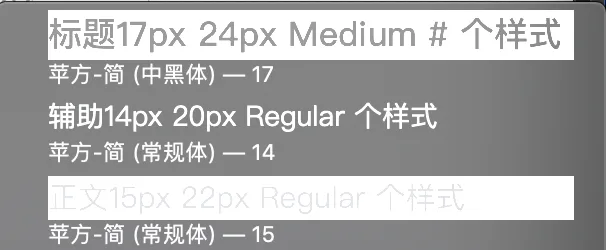

每个模块文字有这么多属性,当产生了一个新的文字应用场景,这时候需要新增样式,然后不管是字重、对齐方式等属性怎样变化,相应的就要建立一个新的样式。

在图层样式中,以 Hover 状态为例,包含了三个属性:颜色、阴影、圆角

```css
background: #ffffff;
box-shadow: 0px 4px 12px rgba(0, 0, 0, 0.08);
border-radius: 12px;
```

每个图层样式对应不同的属性,当产生了新的样式图层,此时就需要建立一个新的样式,随着卡片的种类不断增加,图层样式也不断新增。

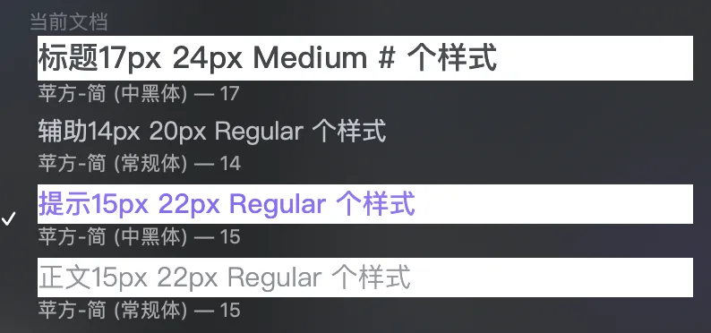

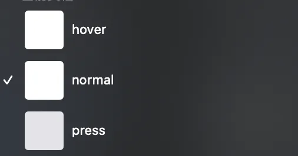

**☆ 总结一下**

传统的做法是物体 A,每个种类的 A,都新建一个 A 的样式,到最后,A 的样式不断增加越来越多。

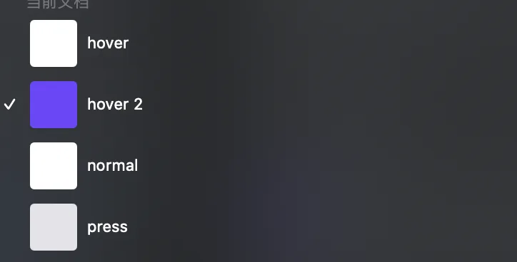

而 Design tokens 的做法是,提取 A 的所有属性,然后只需要每当建立新的样式,只需要选择相应属性修改即可。

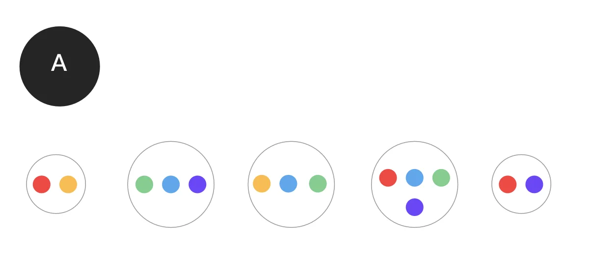

那么属性一共有哪些呢,从设计角度看,界面构成可以简化为(形、色、字、质、构、动),即形状、颜色、字体、图层样式、间距、动效。因此 design tokens 属性可以从这些类型中提取。

> Abdul Wahid 做的有关于 Figma 的 design tokens 的畅想方案

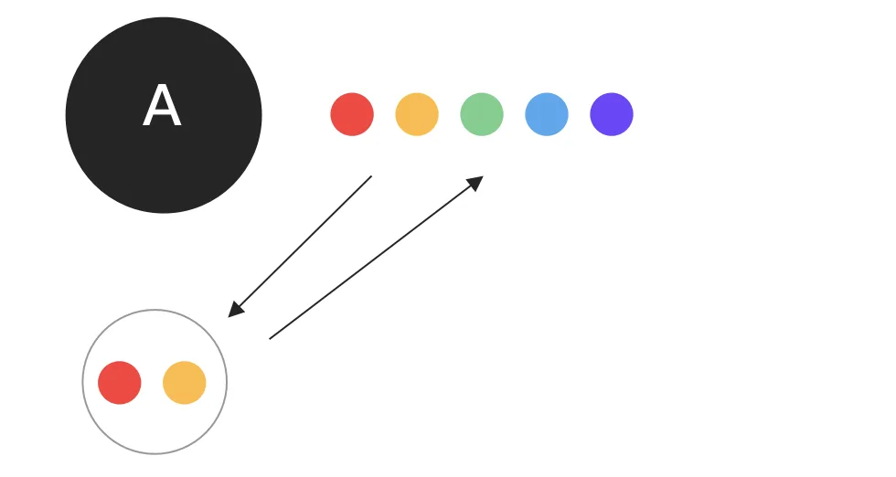

到这里基本对 design tokens 的由来有了一定的理解,那么到底 design tokens 怎么命名?

**salesforce 定义了 design tokens:**

> 设计令牌是设计系统的可视化设计原子——具体来说,它们是存储可视化设计属性的命名实体。我们使用它们来代替硬编码值(例如颜色的十六进制值或用于间距的像素值),以便为 UI 开发维护可扩展且一致的视觉系统。

我们从中分析可以得出

- **design tokens 是一种自定义命名**
- **design tokens 不受平台影响**,并将各个平台保持统一(web、android、ios)

我们拆开来看

**一、design tokens 命名**

design tokens 命名是名称 + 属性

例如:

名称:`colors.primary.100`;关联值 `#3072f6`

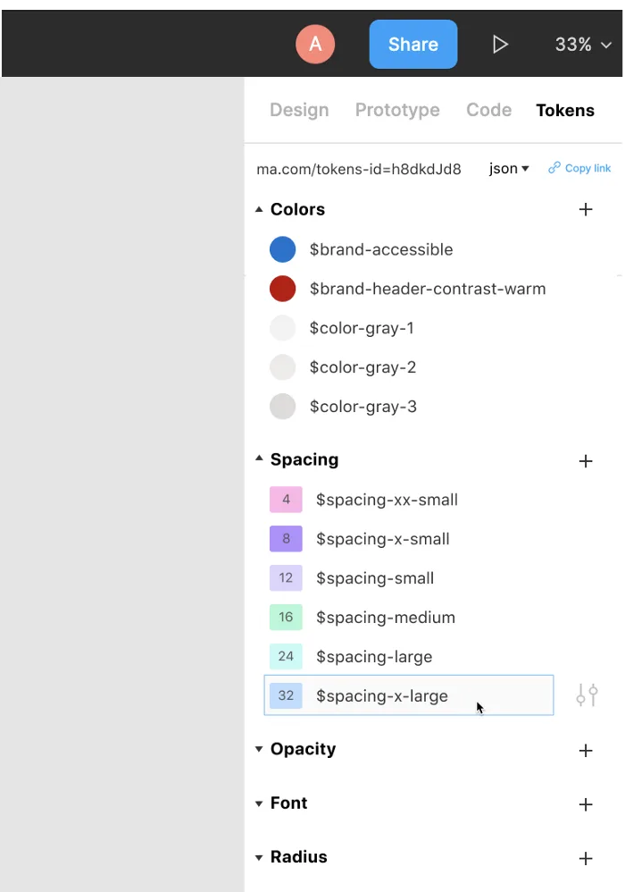

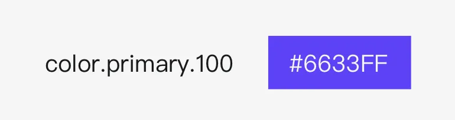

例如以 FAB 为例,之前的主色为 `#6633ff`,之后主色换成绿色 `#4cd9c6`,那么将 `$color.primary.100` 的对应编码值进行替换,则所有涉及到 `color.primary.100` 的颜色都将会被替换,需要说明的是,采用 design tokens,开发不需要重新修改代码,只需要重新发布新的 tokens 即可。

在 Adobe Spectrum 中,其将 design tokens 分成了三种类别 Global tokens、Alias tokens、Component-specific tokens。其实和 MD 3 中的命名本质是一样的,在 MD 3 中,将 design tokens 分为了三种类型,分别为:

1. reference tokens
2. system tokens
3. component tokens

下面逐一来分析

**1.1 reference tokens**

为了方便,简称 ref。个人觉得它就和我们平常命名间距的 XS / S / M / L / XL 差不多,代表(4px / 8px / 12px / 16px / 24px),相当于元素的角色,ref 包括设计系统中可用的所有样式的选项,通常连接一个数值。例如 `md.ref.palette.primary.100 = #4CD9C`

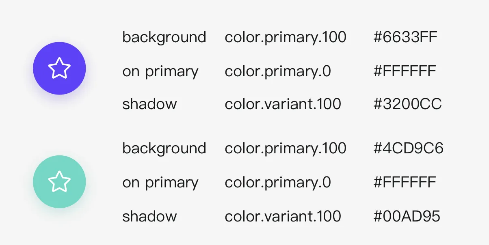

**1.2 system tokens**

以下简称 sys。相当于引用令牌,一般来说,sys 一般指向 ref 令牌而不直接表述所有值。sys 其实就是说明 ref 的设计属性,是作为 container?还是 background?还是 shadow?例如 `md.sys.color.primary-container`

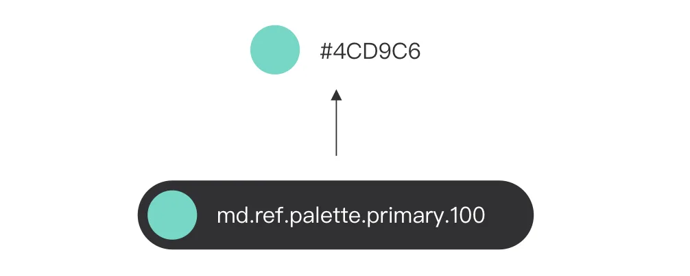

注(分清楚 element、design attribute、role、state)——元素、设计属性、角色、状态

- 元素就是组件的构成元素,例如卡片中包括(icon、text、avatar 等)
- 设计属性就是样式(颜色、边框、阴影、圆角、大小、文字)
- 角色就是(S、M、L),即某一属性的所有内容的编号代称
- 状态就是 normal / hover / press 等交互状态

**1.3 component tokens**

以下简称 comp。相当于组件令牌,就是表述设计属性的所属元素(container、text、icon、state……),`md.comp.fab.container.color`

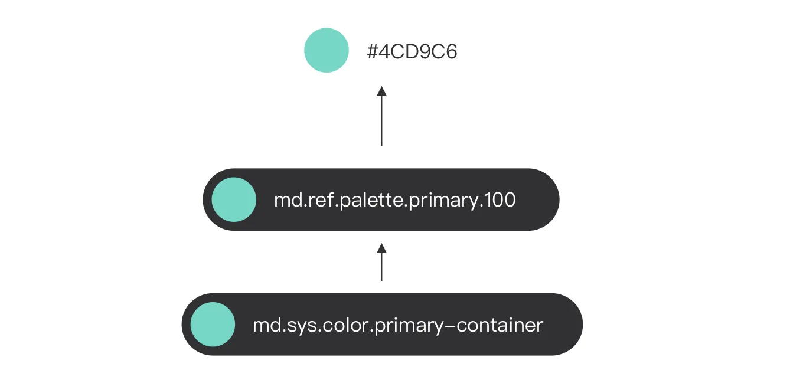

**二、design tokens 不受平台影响**

design tokens 实际就相当于方程中的 X,只是一种变量,X 本身的属性是不改变的,但是赋予的值却可以各种各样,而这种值表现在代码中就是各个平台的表述方式。

就正如苹果,英语叫 apple、汉语叫苹果,都是苹果,只是用各自平台的语言表述罢了。这就避免了设计师常用的 #AAAAAA 进制式颜色表述方式之间的色值转换误差。

所以建立好 design tokens 后,应用在哪个平台,就翻译成哪个平台的语言,这样,就保证了各个终端产品的统一性。

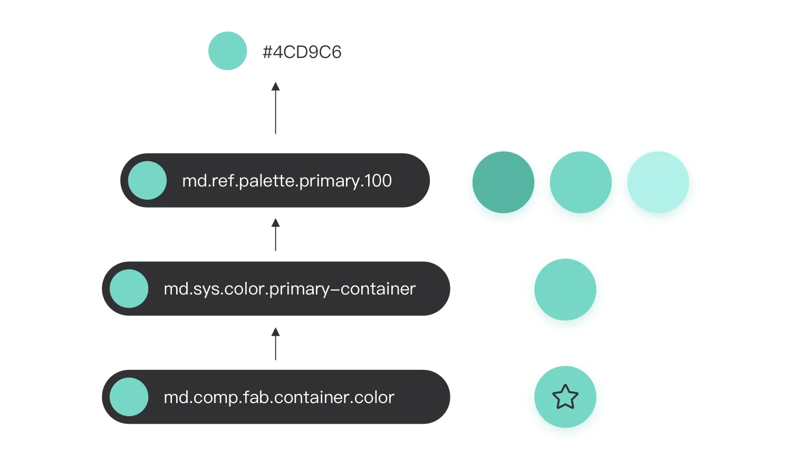

## 适应性设计

此次,material you 更新了关于折叠屏的设计指南。从18年到现在,折叠屏发布了华为的 MateX 系列、Samsung 的 Galaxy Z 系列、Microsoft 的 Surface Duo,小米也发布了 MiX Fold,折叠屏日渐走入人们生活,不过说实话,现在折叠屏还是贵,需求程度还不是很高,不过未来随着技术的增长,折叠屏,或者屏幕载体会走向什么样式呢,谁也不知道。

此次,MD 在 breakpoints 进行了部分改动,新加入了 foldable 端,并且规定之前的移动端 margin 为 16px,随着移动端信息密集程度不断增高,此次更新建议了最小边距为 8px,折叠手机和小平板为 12px,大屏幕为 32px。

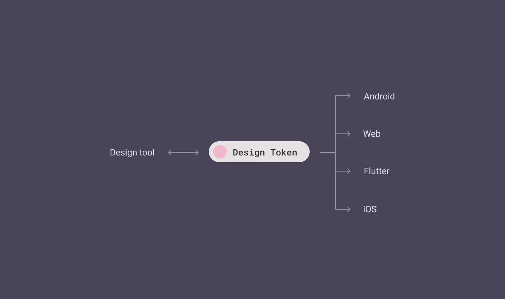

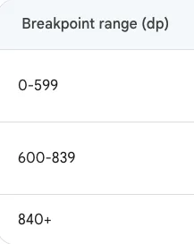

此外,material 举例了一些屏幕布局适配方法。

**1、组件缩放**

比如说在屏幕尺寸变化的情况下,组件为了适应屏幕,会出现缩放,以移动端和平板端为例

当父容器缩放时,内部元素可以锚定在左侧,右侧,或者中心

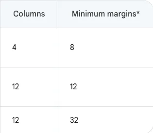

例如上图组件,随着父容器缩放,黄色区域内元素保持左侧锚定,紫色区域内元素保持右侧锚定,绿色区域内元素保持左侧和右侧锚定,整体随屏幕自适应。

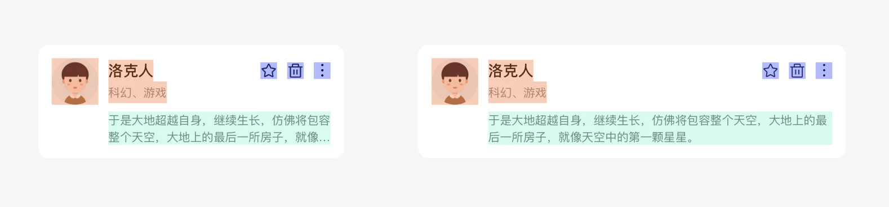

例如按钮,保持元素锚定,位置固定,按钮容器进行缩放。

**2、Visual presentation,翻译过来是视觉呈现,我姑且称之为视觉调整**

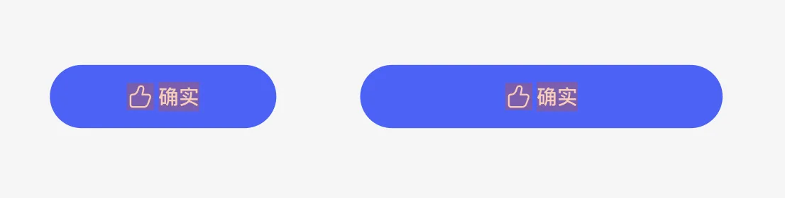

其实就是我们常见的(默认,宽松,紧凑)的布局,调整这些元素内容大小和比例以及位置关系

**3、组件交换**

由于屏幕尺寸不同,对应的交互方式和组件的选取方式也各有差异。常见的移动端选择是底部弹窗,而在 pc 端就是下拉菜单。

如下图,移动端 Bottom navigation,到平板端的 Navigation rail,到 pc 端的 Navigation drawer;MD 总结了一些组件的转换,主要是导航和弹窗。

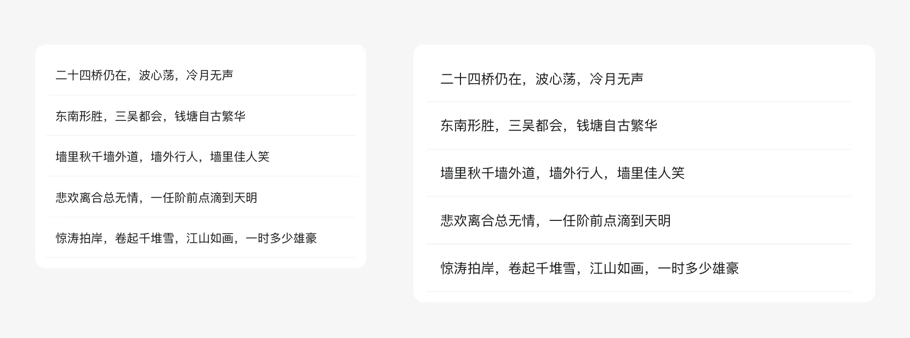

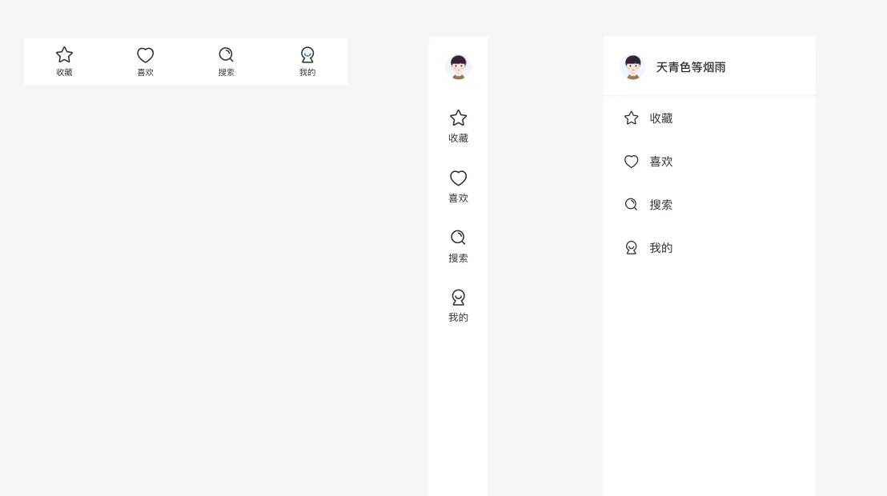

4、Reveal,我翻译成显示或隐藏更好理解一些

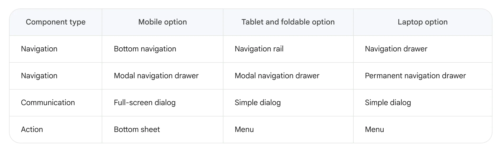

在移动端,nav drawer 是隐藏的,在平板或者更大的屏幕上,nav drawer 是展开的。

5、Reposition,重新定位

组件随着屏幕的变化可以重新定位

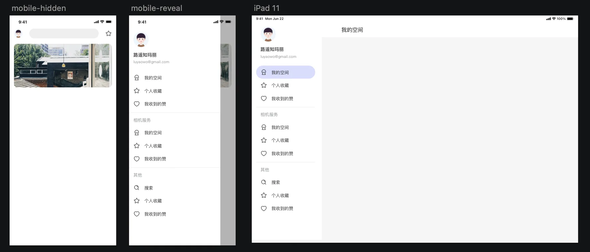

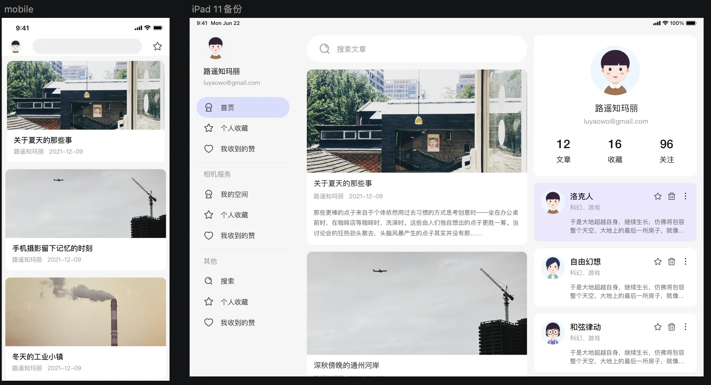

这种其实是最常见的自适应了,在做移动端时候,考虑到不同平台的屏幕尺寸差异,这时候需要说明组件内元素锚定方式,以及最大尺寸。

好了,以上就是本期内容所讲的 MD 更新的内容。主要讲述了三个模块

第一是 Dynamic color,主要说了什么是动态颜色,以及 MD 给出的动态色彩配色方案的实现方式,MD 此次更新用到的资源库基本都放置在了 Figma 上,包括组件库和插件。的确,Figma 的云端协作、社区等功能,在这个时代已经凸显了巨大的优势,已经让国外越来越多大公司采用了这个平台。看来以后要多学习学习 Figma 了。

第二是 Design tokens,从个人的思考方式说了 design tokens 是什么,以及参考 Adobe 和 Google MD 对 Design tokens 的命名以及优点。的确,Design tokens 对开发和设计来说有着相当大的优点,但是,需要考虑一点,如果你看了 Salesforce 和 MD 官网就会发现,系统的完成一个 Design tokens 内容实在是太多了,而且 MD 目前还只作了 Color 和 Text 的 design tokens,对于小公司来说,需要耗费比较大的资源,难以完成。不过,Figma 上已经有了 Design tokens 第三方插件,我试了一下,对于样式修改非常迅速,但是对于命名还是比较麻烦。不过,随着设计的系统化,开发和设计的逐渐融合,Design tokens 会发挥出更好的作用。

第三是适应性设计,这里主要讲了一些组件的自适应,后续还有折叠屏一大部分内容。

本期就讲这么些吧!

**参考文章**

[Material Design 3](https://m3.material.io/)

https://docs.tokens.studio/

https://zhuanlan.zhihu.com/p/32548767

http://www.woshipm.com/pd/4539006.html

https://blog.prototypr.io/making-design-tokens-a-single-source-of-truth-for-figma-tool-76618abdeb88

https://www.zcool.com.cn/article/ZMTIwODgzNg==.html
