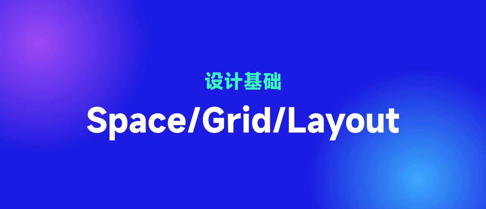

## 1. 概念的历史

最初的网格概念来源于字体设计,在 1629 年,法国国王路易十四不满于当时的印刷水平,成立了管理印刷的皇家特别委员会,委员会提出新建议:以[罗马体](https://zh.m.wikipedia.org/wiki/%E7%BE%85%E9%A6%AC%E9%AB%94)为基础,采用方格为设计依据,每个字体方格分为 64 个基本方格单位,每个方格单位再分成 36 小格,这样,一个印刷版面就由 2304 个小格组成。这是世上最早对字体和版面进行科学实验的活动。也是栅格系统的雏形。

后来到 20 世纪初,随着工业化的不断发展,现代主义设计应运而生。在受到荷兰【风格派】和俄国【构成主义】的影响下,位于德国魏玛的包豪斯学院发展出了高度理性的、功能化、减少主义的平面设计风格。随之在二战后,网格系统在瑞士平面设计的宣传下影响了世界,因此被称为【瑞士平面设计风格】。由于这种风格简单明确,传达功能准确,因而很快得到世界范围内的普遍认可,成为战后影响最大的一种平面设计风格,也是国际最流行的风格,因此又被称为【国际主义平面设计风格】

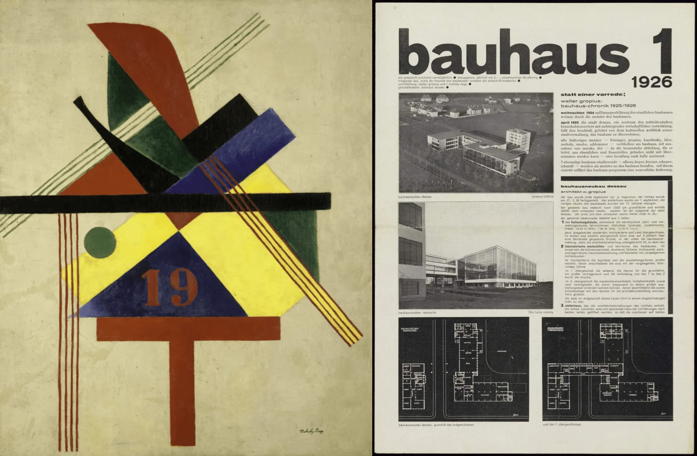

而后随着计算机发展,网页时代的来临,万维网提出了基于网页的网格系统,这其实是现代 UI 响应式设计的基础,例如 Bootstrap 的 CSS 网格。

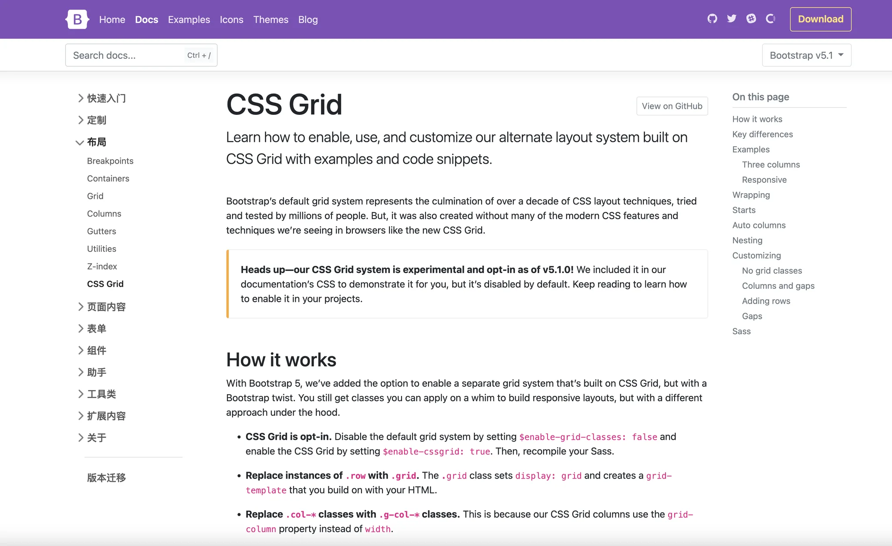

## 2. Space 间距

设计是每天都会做出关于按钮等组件尺寸或者组件间距的决策,空间系统是一种规则,用于测量元素的大小和间距。

我们知道最小整数间距为 1px,但是做设计时,我们不会以 1px 为基础单位,因为此时就可以出现任意间距数值,不利于设计和开发,因此,为了方便,我们就取某个数为基数,常见的有 4px、5px、8px、10px 增量的网格。

我们知道 【8px】网格已经被人广泛使用,但是其实我们有时候在一些页面也会看到 【5px】的基数网格。为什么不推荐采用 5px 网格呢?

【5px】网格在面对 1.5 倍分辨率设备的情况下,会呈现小数像素,影响计算和界面视觉清晰度

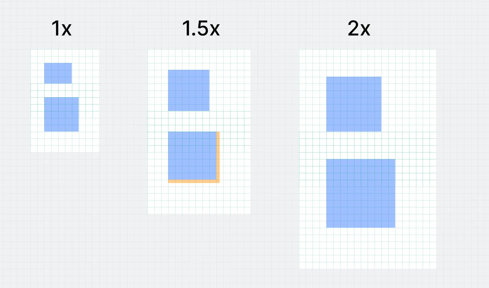

已知的屏幕尺寸从移动端 360px / 375px / 390px 到平板 768px / 1024px 到桌面端 1366px / 1440px / 1920px,可以看出大部分屏幕尺寸都是偶数

UI 设计的目的就是规律性,使用 8px 可以向下兼容,形成良好的设计规则

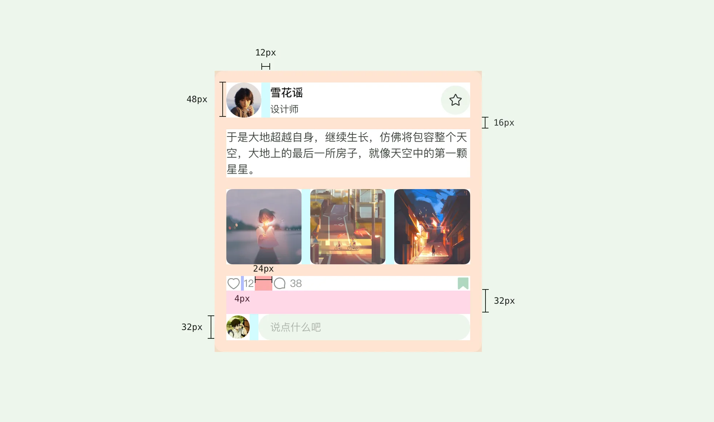

但是单纯 8px 的阶数太大了,对于尤其移动端不足 390px 的尺寸来说,因此,在以 8px 网格基础上,扩展出 4px 网格,从而达成向下兼容。因此在实际设计中,组件的尺寸和间距基本都以最小单位 4px 甚至是 2px 进行设计。

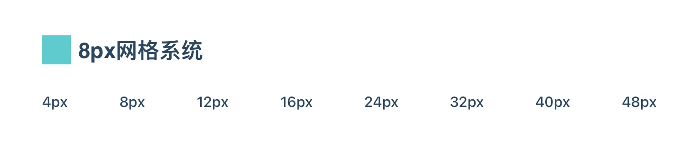

### 2.1 Soft grid & Hard grid

硬网格和软网格的区别是:硬网格将元素固定到网格区域内,软网格定义元素之间的间距,如下图

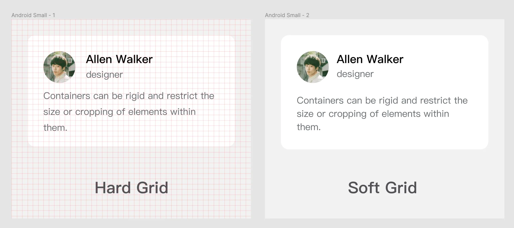

我们可以看到,左侧 Hard grid 内容都置于网格内,但是在实际测量时候,间距会出现各种数值;在右侧 Soft grid,其间距会符合网格基数。

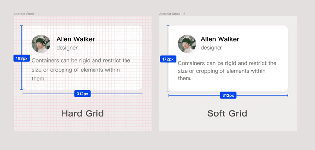

导致硬网格和软网格的变数就是文本,在传统印刷设计中,多采用硬网格设计,因为由设计师产出最终样式;而到了数字时代,设计师的产出必须由开发实现,由于文本行高的影响,单纯的硬网格难以满足设计和开发的沟通和协调,因此软网格被广泛接受使用。

### 2.2 【元素优先】和【内容优先】

一般来说,页面组成的基本元素由【文字】和【形状】构成,形状比如 icon,一般是尺寸固定,并其一般符合 4px 的原则,然而对于文字来说,由于文字行高是不固定的,并且随着内容自适应,因此组件的尺寸就产生变化。

所以就产生了两种间距的测量方式,一种是【元素优先】,一种是【内容优先】

对于【元素优先】的组件,其尺寸 Dimension 固定,并且符合网格基数,此时 Dimension 占据主导因素,Padding 为次要因素。

对于【内容优先】的组件,此时其组件是自适应的,具有内容不确定性,因此其 Padding 占据主导因素,Dimension 为次要因素。

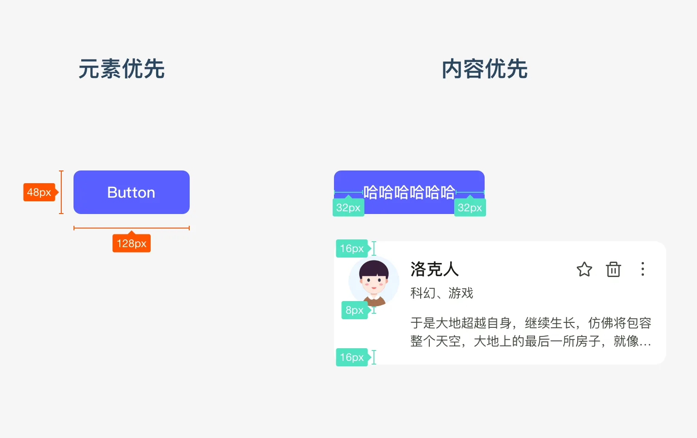

所以我们在做组件的时候,要先考虑到组件是固定尺寸还是自适应,从而选相应的间距规则。

有了 Space 的概念,那我们就有了定义组件的组件间距的能力。但是,设计不是元素的平铺拼合,我们并非按照间距规则将元素随意放置在页面内。我们常说一个平面设计是美的,是因为这些尺寸间距存在一些数理美,比如黄金分割,矩阵阵列等等,而这就需要规则的阵列来辅助元素布局,而这个规则就是网格。

## 3. 网格系统

### 3.1 什么是网格系统?(以规则的网格阵列来指导页面布局)

网格系统就是一种结构,用于辅助设计中视觉元素的放置。在传统平面设计中,使用网格使元素对齐更加容易的同时,使画面更加平衡和统一,随着网页时代的兴起,网格作为重要的设计基础指导网页的界面布局,随着今天移动时代的崛起,网格作为辅助布局设计,在设计底层也发挥着一定作用。

平面设计中的网格和 UI 设计中的栅格的区别?

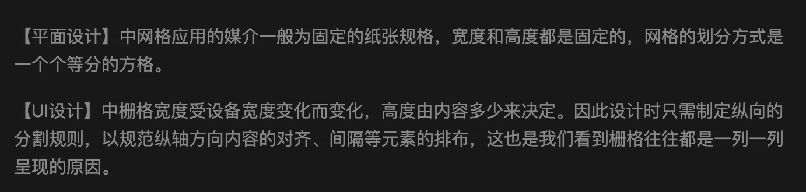

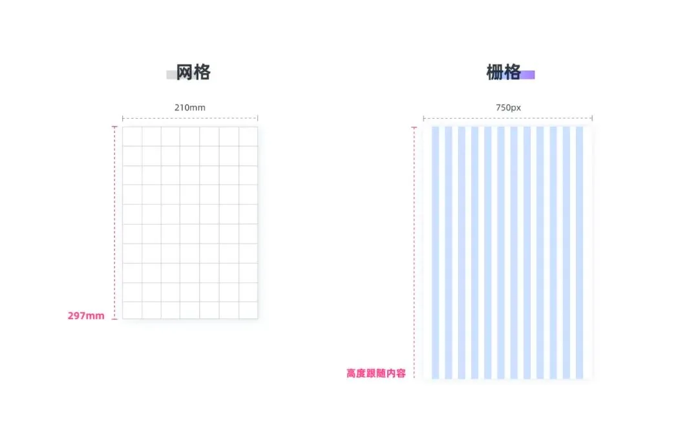

为什么使用栅格?

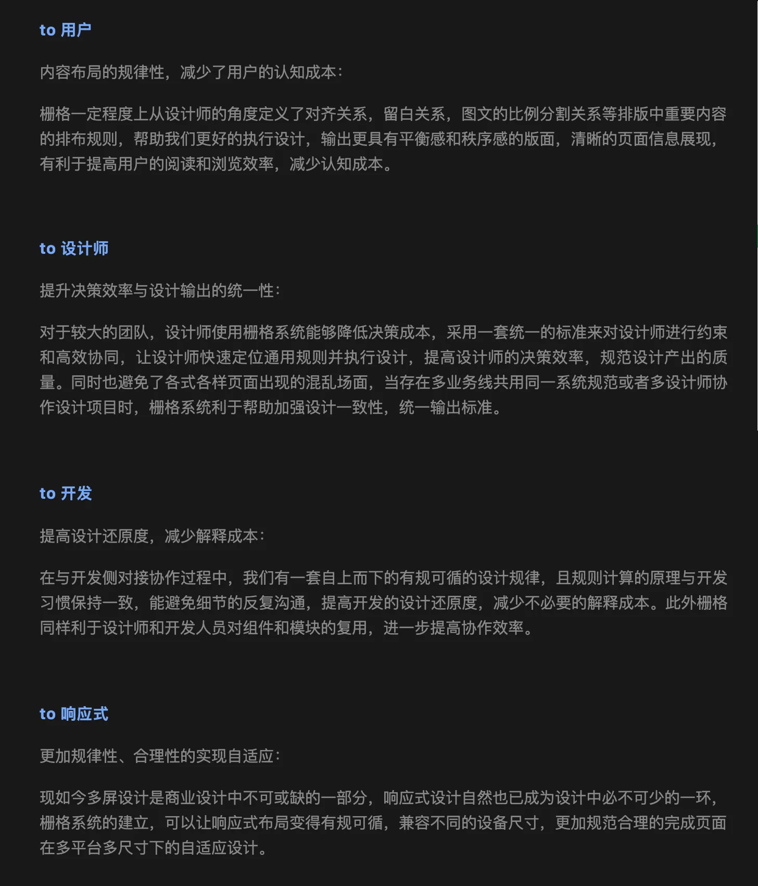

### 3.2 栅格构成要素

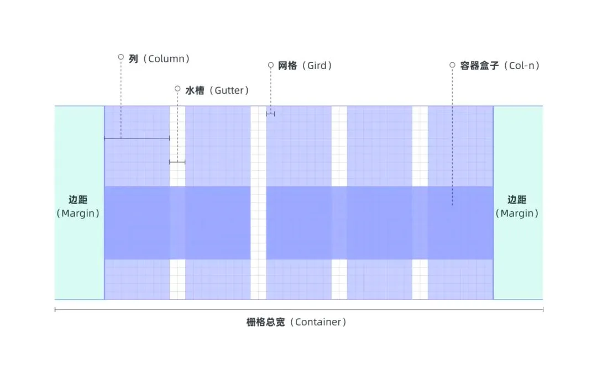

Column 列:一般页面元素越多,列数量也就越多。一般常用的有 12 列、16 列、24 列等等

Gutter 水槽:列与列之间的间距

Margin 边距:设计内容距离屏幕边缘的安全间距

## 4. Layout 布局

布局是页面的版面布局和信息分布方式,以及在不同平台和不同尺寸屏幕下的变化逻辑

### 4.1 元素在空间上的分布方式

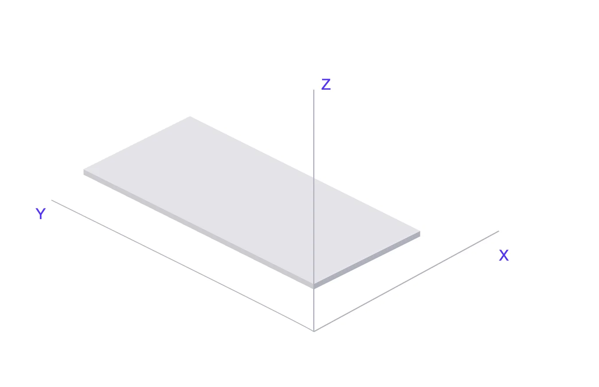

UI 界面与物理三维世界是对应的,有横向的 X 轴,纵向的 Y 轴,以及组件的高度 Z 轴。那么信息分布的方式也参考了这三维空间进行排版。在 Z 轴上,根据组件的优先级分成了背景、导航、内容和弹出层,在内容上,有根据 X,Y 轴对内容进行分布。需要注意的是,栅格并非应用于全局,而是应用于内容模块。

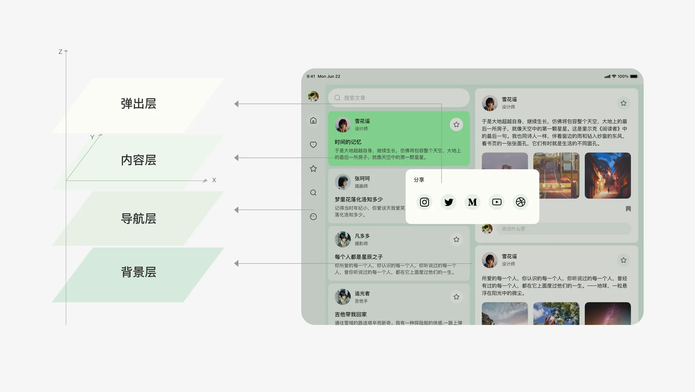

### 4.2 布局样式

#### 4.2.1 静态布局

在早期网页设计上,由于屏幕尺寸比较单一,所以网页采用静态布局(如图,苹果的网页),这种布局的优点是只需要一稿就可以了,不需要考虑响应等复杂样式;缺点是在页面利用率低,页面缩放出现滚动条不适合查看。

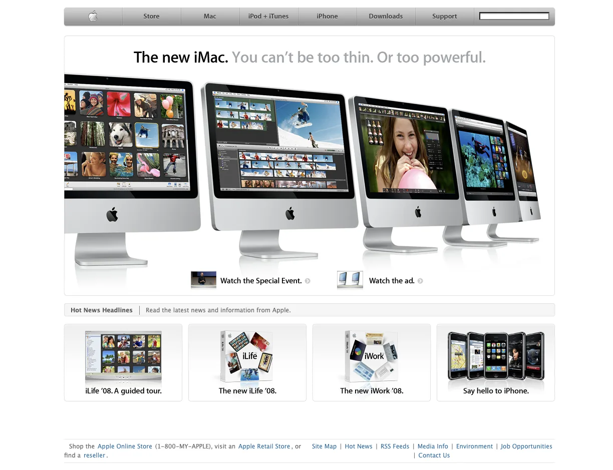

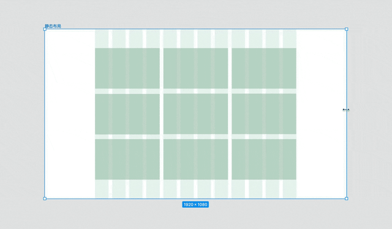

#### 4.2.2 Liquid layout 流式布局

屏幕分辨率变化时,页面里元素的大小会变化而但布局不变。但缺点是因为宽度使用 % 百分比定义,但是高度和文字大小等大都是用 px 来固定,在极端情况下页面比例会非常不协调

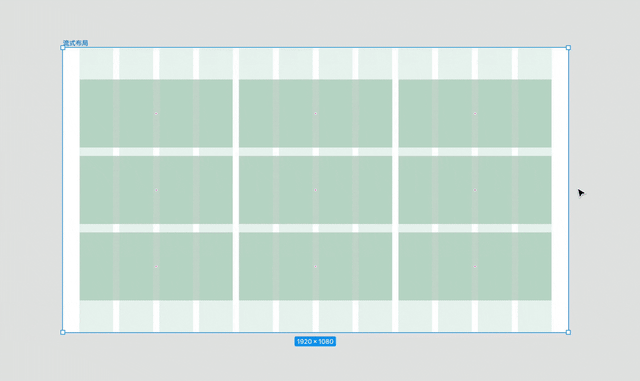

"媒体查询"

当媒体查询出现在 CSS 后,网页布局就变的更加灵活,简单来说就是断点,定义了元素在当前屏幕尺寸下内容的布局样式。

#### 4.2.3 Adaptive layout 自适应布局(断点+静态布局)

分别为不同的屏幕分辨率定义布局,即创建多个静态布局,每个静态布局对应一个屏幕分辨率范围,例如苹果官网就是采用自适应布局

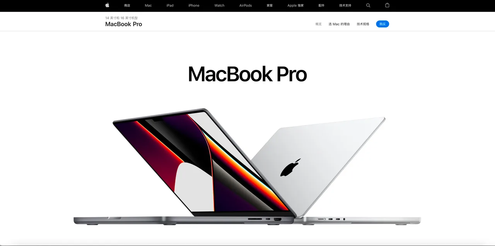

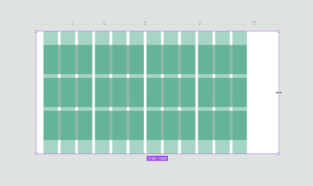

#### 4.2.4 Responsive layout 响应式布局(断点+流式布局)

根据不同的屏幕分辨率定义布局,同时,在每个布局中,应用流式布局的理念,即页面元素宽度随着窗口调整而自动适配

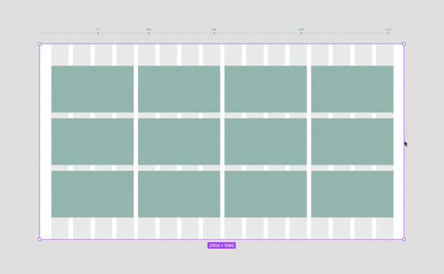

#### 4.2.5 Tips 注意事项

日常设计时候所有布局也并非只采用上述单个样式,日常使用还是更多以混合布局进行使用的

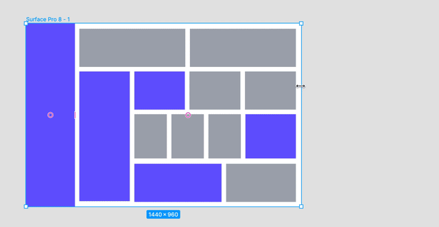

此外,并非所有的设计场景需要使用栅格系统,其只是为了更好地辅助【排版】和【页面响应】,特别强调跨平台属性。
