字体其实是一门比较深的学问,在这里,我们不讲述字体设计(因为我也不会),在 UI 设计中,主要是关于字体排版。

## 一、字体五维度

**Ant design 中提到定义字体有五个维度**

- 字体家族
- 主字体
- 字阶和行高
- 字重
- 字体颜色

下面我们就根据这五个维度一一分析

### 1.1 Font family / Typeface(字体家族 / 字体)

这里引用维基百科原话:

> A font family is a collection of fonts that share particular design features within a specific style of typeface. Typeface refers to a complete set of characters that are unified by a common design ethos. Fonts are actually subsections of typefaces that refer to the size, weight, and style of the specific typeface you're using. A font's characters or glyphs will maintain a consistent style to match its font family.

这句话很好的解释了这几个词语的概念,翻译过来就是:

> Font family 是在特定字体(font)样式中共享特定设计特征的字体(typeface)集合。
>
> Typeface 是指由一种共同的设计理念统一起来的一整套字符。
>
> Font 实际上是 Typeface 的一部分,指的是你正在使用的特定字体的大小、重量和样式。字体的字符或字形将保持一致的样式以匹配其字体系列。

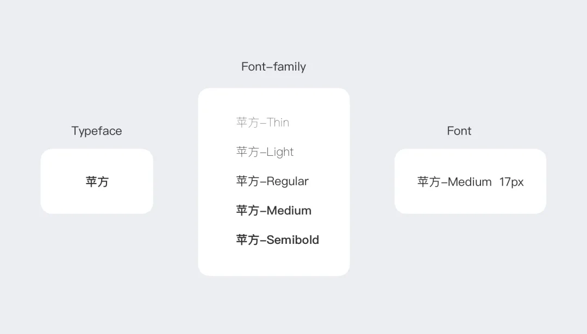

### 1.2 主字体

主字体即为一个产品的主要字体,例如移动端 App 常用主字体为 14px,后来随着移动端屏幕变大,主字体变为 15px 或 16px 或 17px。PC 端产品常用主字体为 14px

### 1.3 字阶和行高

**——行高**

行高相对于其他是一个特别复杂的概念,因为行高影响着间距,进而影响着页面整个布局。了解行高首先需要来剖析字体

★在传统排版中,行高被定义为从下基线到上基线的距离

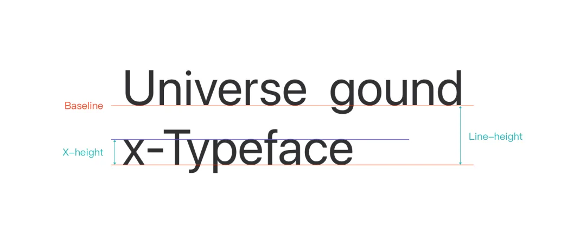

\* 基线 Baseline:是字母的基准线,西文字体设计与排版的理念,主体底部对齐

\* X-height:小写字母 x 的高度,代表了一个字体的设计因素

\* Line height:文本中基线的间距

★但是在数字设计的行高中,行高不是显示为基线的距离

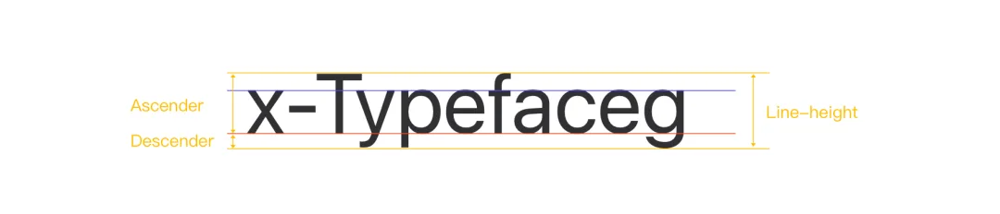

\* Ascender:字体可绘制区域的向上最大值

\* Descender:字体可绘制区域的向下最大值

\* Line height:Acender + Descender 的距离

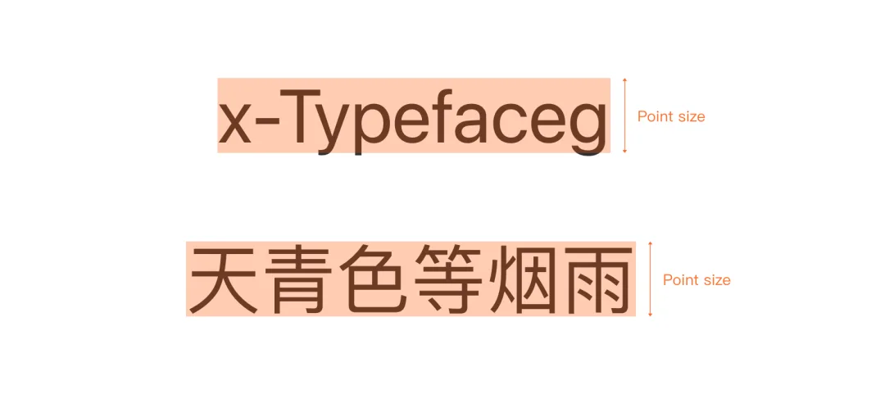

我们常使用的字号大小,准确来说是 Point size,例如上图显示,其没有直接的意义,不对应字符的某个值

在字体设计中,准确来说 line-height 是 Ascender + Descender 的值,实际上是比 Ascender + Descender 的距离要更大一些的,因此上图 SF 字体 50px 的默认行高是 60px。通常,**西文字符 SF 的默认 line-height = Point size×1.2;中文苹方字符默认 line-height = Point size×1.4**

上面,我们讲了传统印刷排版的 line-height 和数字排版的 line-height,Baseline(基线),X-height(字高),Ascender 和 Descender,以及 Point size

**★ 下面,讲述 line-spacing 的概念**

在 Sketch 等设计软件中,对于文字而言,是只有 **line-height、letter spacing、Paragraph spacing** 这几个概念的,而没有 **Line-spacing** 这个概念,这就意味着:

对于设计而言,我们在设置多行文本时候,只需要改变行高,内容间距就可以得到改变。

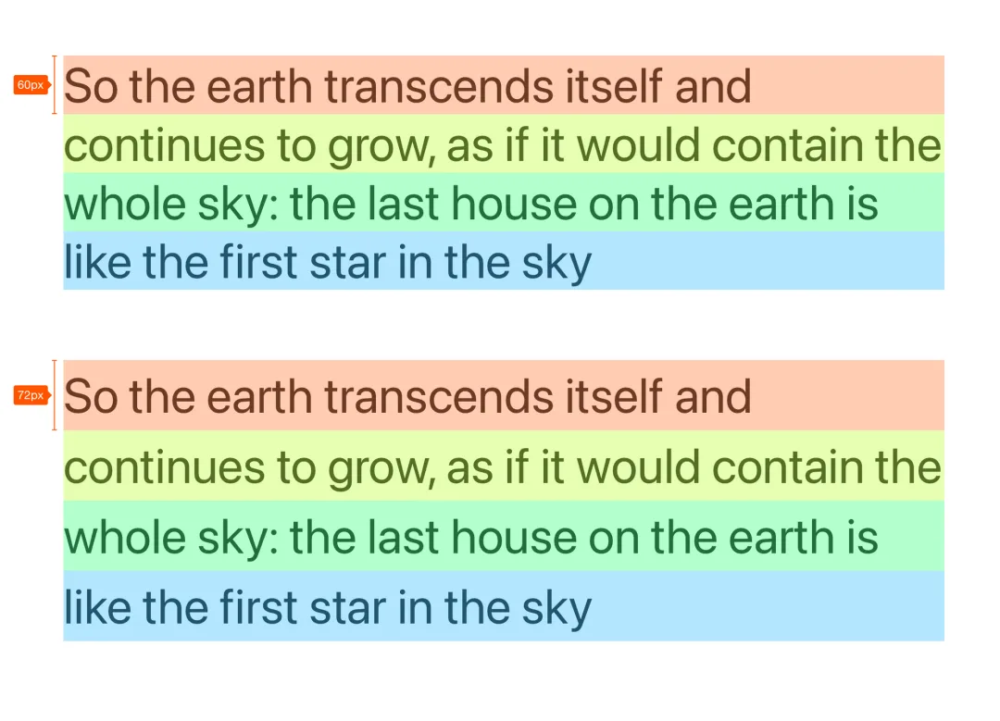

但是,对于开发来说就不是这样了

对于单行文字来说,行高=固定行高或者默认行高

多行是有行间距概念的,多行就是默认行高加上行间距=固定行高

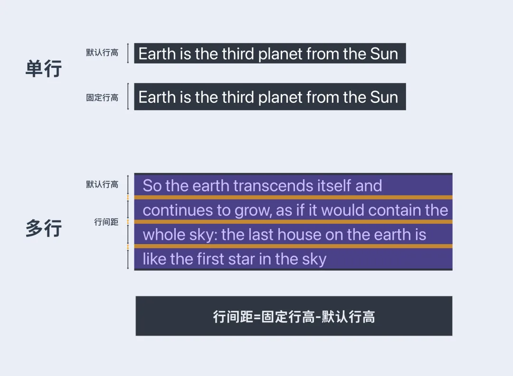

**但这就造成了设计和开发的偏差**

以 15px 字体为例,在 Sketch 中,我们行高制定成为 22px,离卡片上下间距分别为 16px 和 20px,如图左侧。在开发中,开发计算行间距 4px = 行高 22px — 系统默认行高 18px,而设计和开发的差距就体现在文字上下间距上。

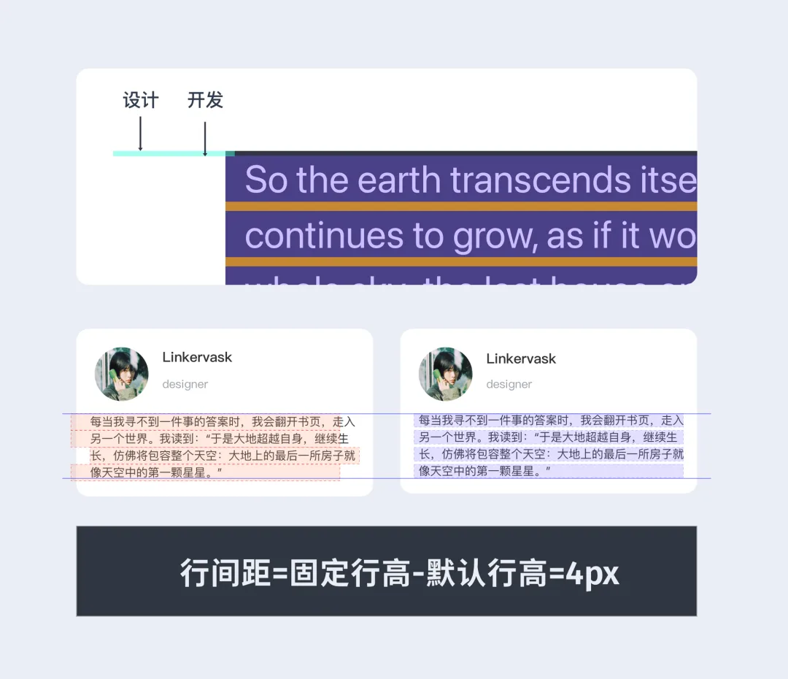

**Tips:我们在设计排版时候都需要考虑文字行高对排版的影响,例如下图,在卡片设计中,对于标题一般是左侧和顶部视觉距离看起来是接近的,但是由于有行高的存在,我们就要减去这部分距离。**

如 17px 行高 24px,则空白上间距为 (24-17)/2=3.5px,16-3.5=12.5,考虑设计偶数习惯,取值 12px,则最终结果 17px 行高 24px 字体具体卡片边缘 12px 距离。

既然会产生差异,那么对于设计怎么在高保真图阶段解决这个问题呢?

那么就需要我们知道 iOS 默认字体行高,iOS 默认系统行高是有一个计算公式

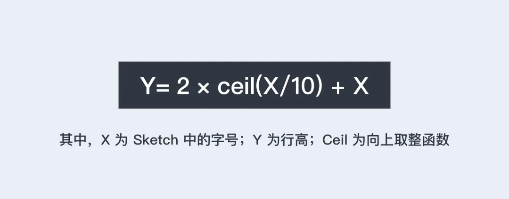

可以由上面公式计算出 15px 和 17px iOS 的默认行高。根据相关资料,在 Sketch 中 iOS 的默认行高为字号的 1.2 倍,Sketch 的默认行高为字号的 1.4 倍

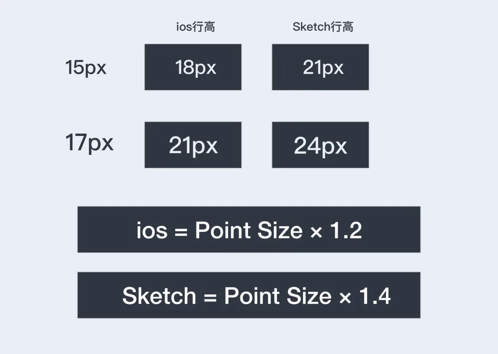

那么我们以后在计算间距的时候,如果按照我们设计所想的间距,那可相应推导出 iOS 的默认行高,比如 15px 字体,我们以设计制定的行高 22px - 18px,计算出 4px,那么我们的设计稿上间距就要相应多加上 2px(当然也可以让开发在上下另加入 2px 间距)

**——字阶**

字阶就对应我们式中的从大到小字号,PC 端使用的最小字体为 12px,主字体为 14px,根据多个组件库总结而来,PC 端字体行高一般为字体尺寸加上 8px

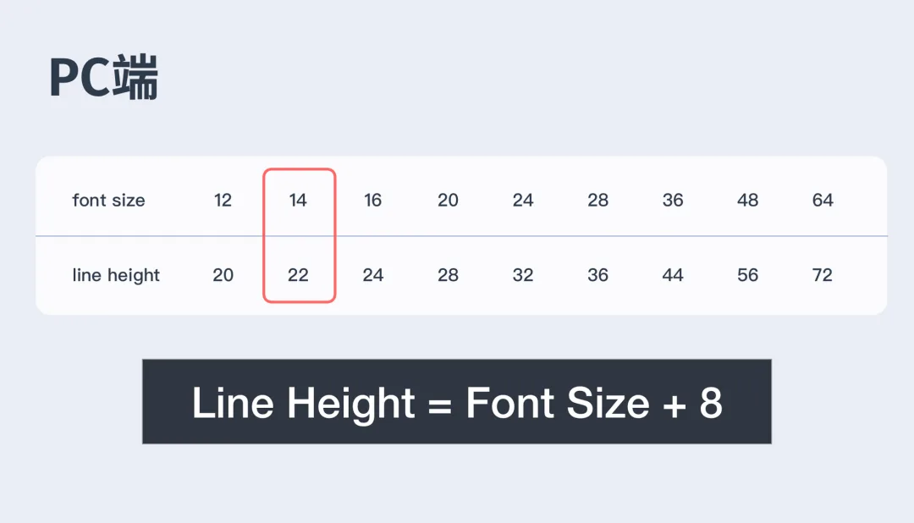

在移动端,字体有两种情况,一种是按照类似 PC 端的偶数法则,并且行高为字号+8px,另一种为阶梯状,其字体行高也在 Sketch 默认行高上进行了修正

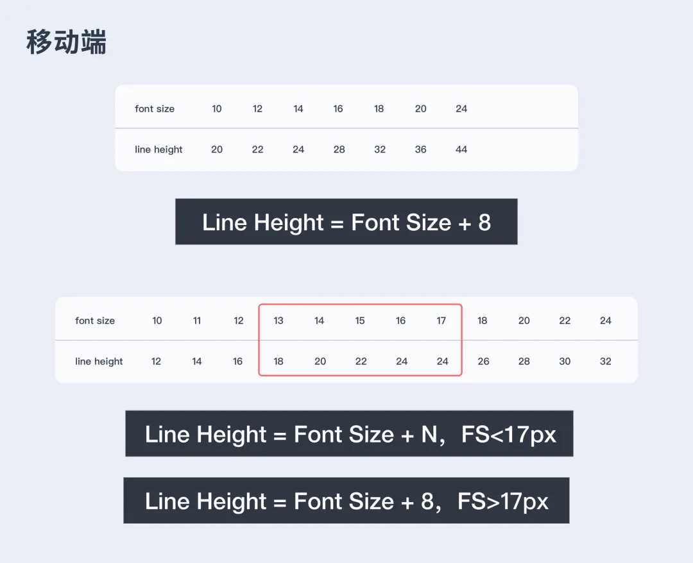

### 1.4 字重

在 Sketch 中,字体一般用 Regular、Medium、Semibold 来表示字重,那么对应代码中,是指大概是 400、500、600,一般对于大部分界面设计来说这三个字重足够使用了

### 1.5 字体颜色

字体颜色从看过的设计规范来说,大致有以下几种情况

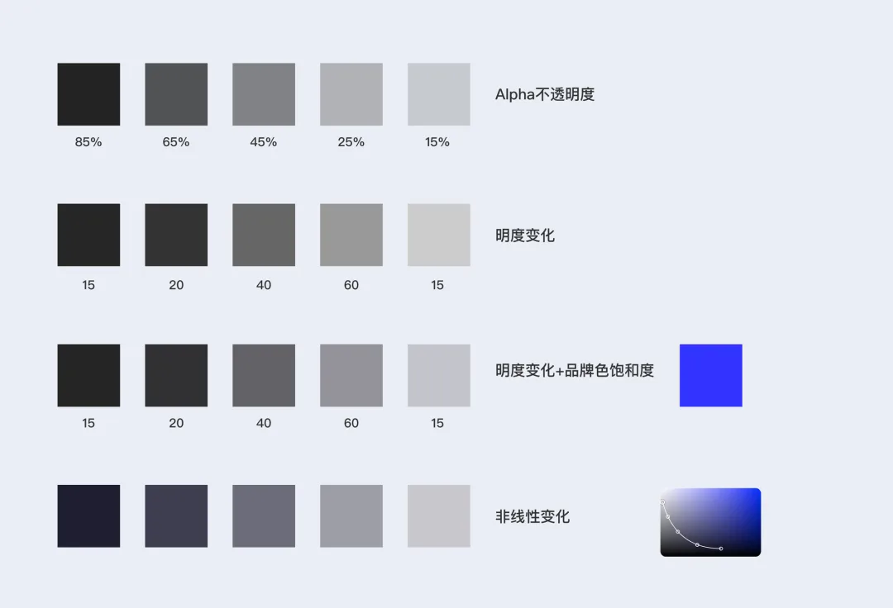

1. 以透明度 alpha 为层级进行字体颜色区分,参考 Ant design
2. 以明度为层级,最常见的就是 20、40、60、80 这几个层级
3. 以明度为层级变化,加上品牌色的一定饱和度,参考 Element design
4. 非线性变化,参考 Arco design

具体到【透明度】和【明度】两者的差异是什么?

- 如果在白色背景中,两者之间是没有差异性的
- 如果在非白色的背景中,【透明度】可以更好地兼容背景颜色,而【明度】则始终保持原有颜色的样式,如下图所示

这种两种视情况使用即可

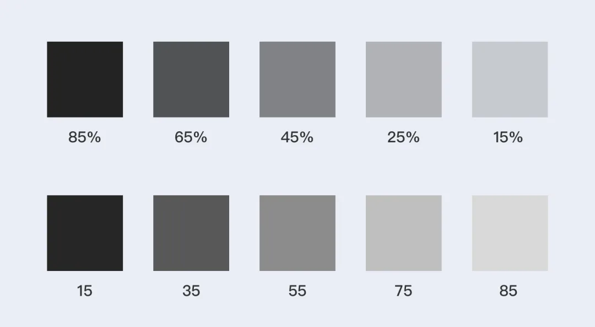

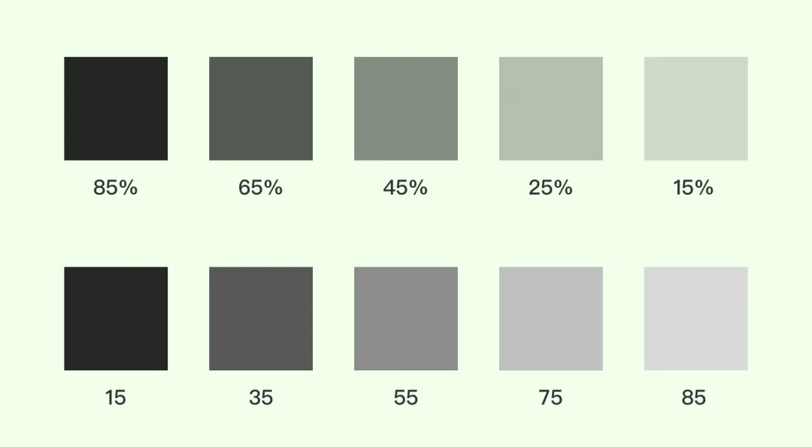

## 二、排版

上面,我们简述了文字在 UI 设计中规则,那么在具体的排版中规则是什么呢

### 2.1 文字排版

一般来说,在文章阅读中,中文行高通常为字号的 1.5-2 倍之间,英文行高通常在 1.2-1.5 倍之间

**行高**

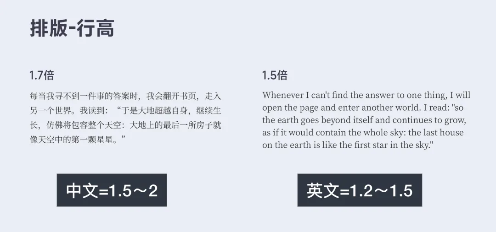

**行长**

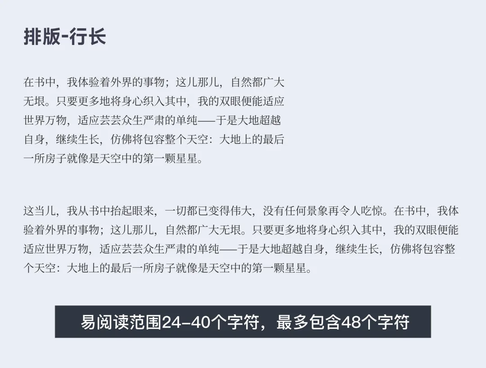

**段落**

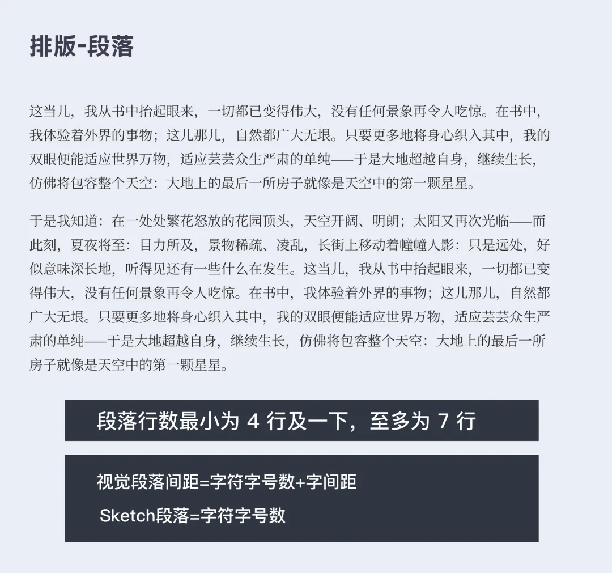

**中西文混排**

如果不是偶然看到,那也许我也会不在意这件事,从小到大,我们在语文中使用中文符号,在英文中使用西文符号,但是当中西文混排时候呢,很少有人会专门注意这个点。

1、中文字符和英文字符之间,需要有半角空格

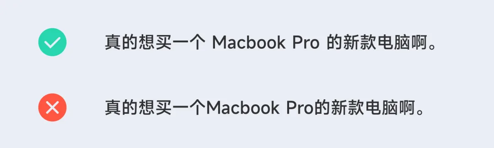

2、中文字符和数字之间,有无半角空格都可,但要保证统一

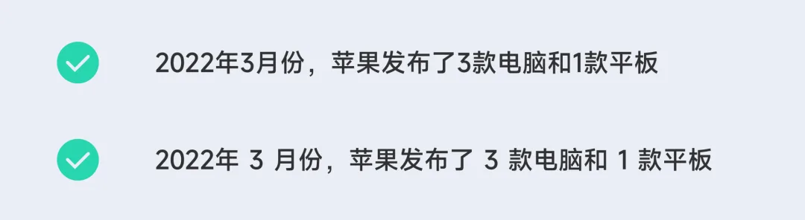

3、数字和 % 之间不加空格

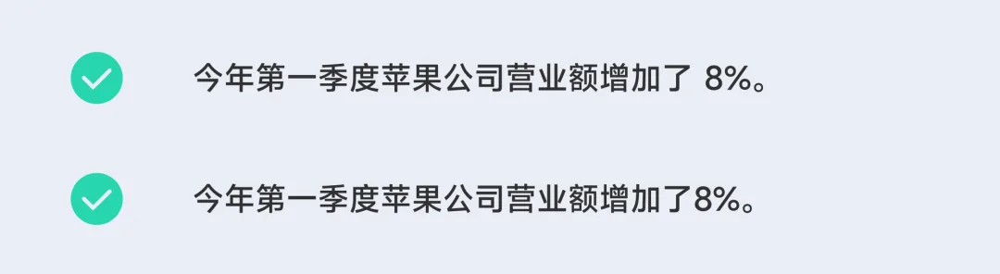

4、中文标点和西文字符之间不加空格

5、数字和单位之间不加空格(度/百分比),其他的个人觉得也不需要加空格

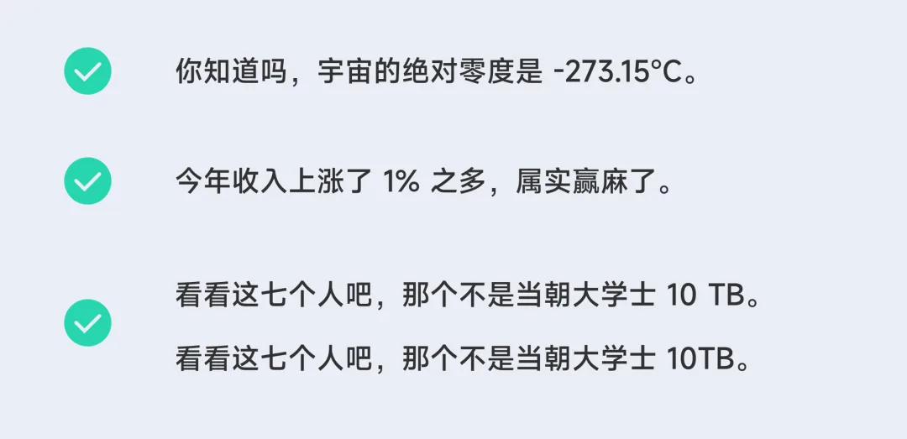

6、中文使用全角标点,完整的英文引用,内部使用半角标点

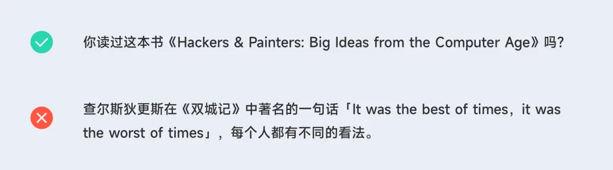

### 2.2 排版原则

在平面设计中,文字排版有四大原则:**对比、重复、对齐、亲密性**

1、对比(通过改变字体大小、颜色用以区分元素内容)

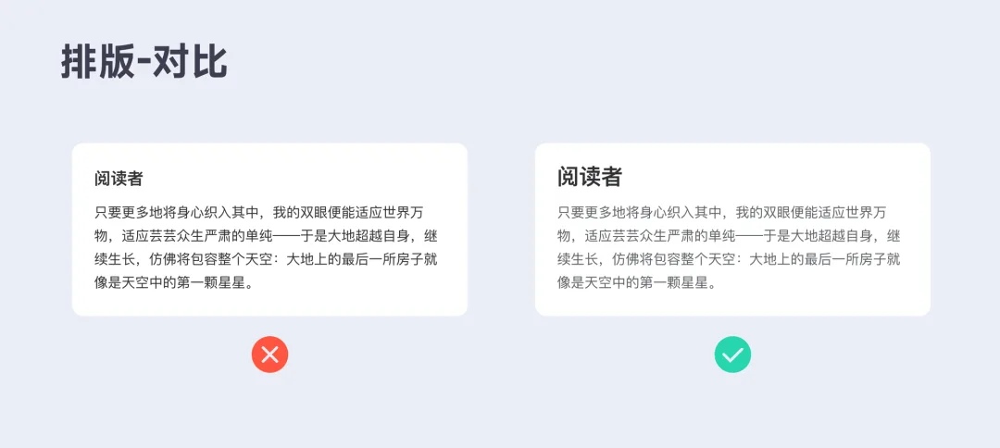

2、重复(如果元素处于同一种逻辑关系,则应尽量统一字体、色号、颜色)

3、对齐(将元素整理成一条线串联起来)

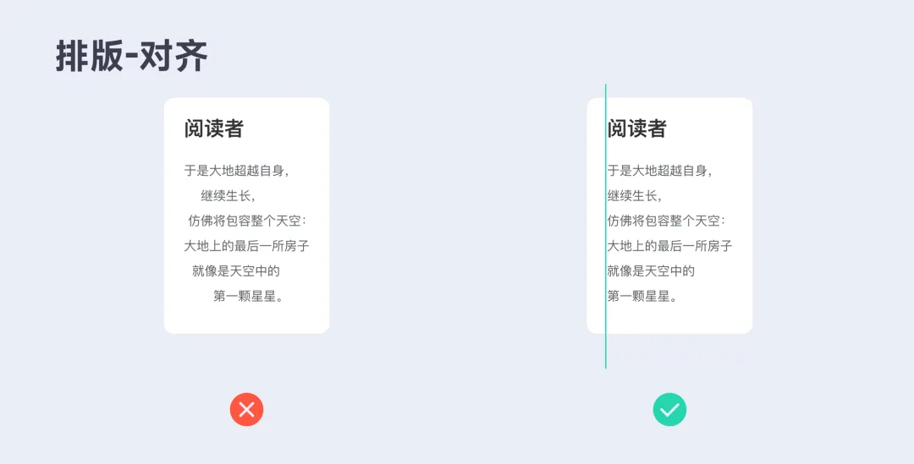

4、亲密性(对元素分类,关系越近的内容,在视觉上应该靠得越近,反之,关系越疏远的内容,在视觉上应该越远)

## 三、MD3 更新内容

### 3.1 系统字体

在安卓中,英文系统字体默认是 Roboto,其他语言默认字体是 Noto Sans,单指中文来说又称思源黑体。

在 iOS 中,英文系统字体默认是 SF,中文默认字体是苹方

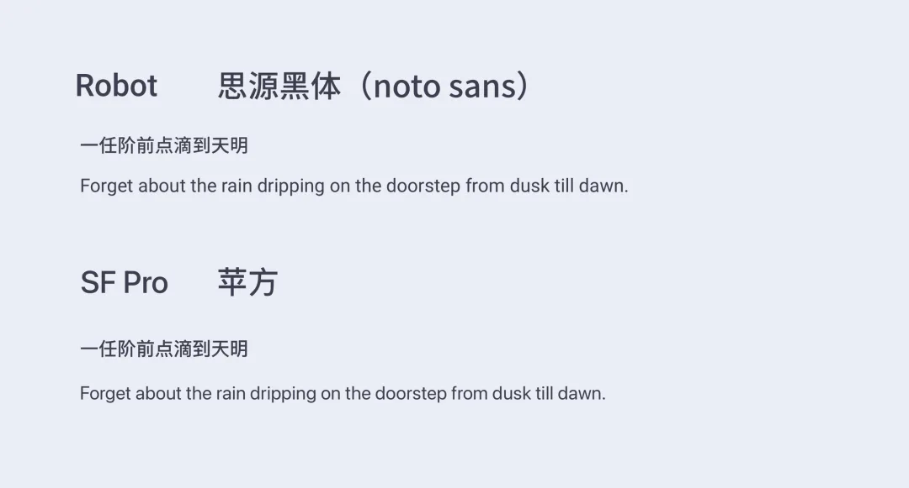

### 3.2 更新内容——字体层级

在 MD 3 中,重新规划了系统文字层级,分为五个层级,分别为:Display,Headline,Title,Body,Label。

- Display 即展示字体,通常为页面的装饰性字体,为页面的最大字体,通常一般 UI 基本用不到
- Headline 一般为页面头条字体,可以想像,一个版面头条即统领页面的标题
- Title 即标题,通常可以理解为划分内容的强调文本
- Body 即正文,内容表现的主力军
- Label 即标签,作为组件内文本,例如标签和按钮

**——字体排版**

此次 md3 也更新了文字排版的一些知识,这次补充了非基线排版样式,并且特地写出了考虑平台影响,使用不同的排版方式。

对于 Web 和 iOS 平台

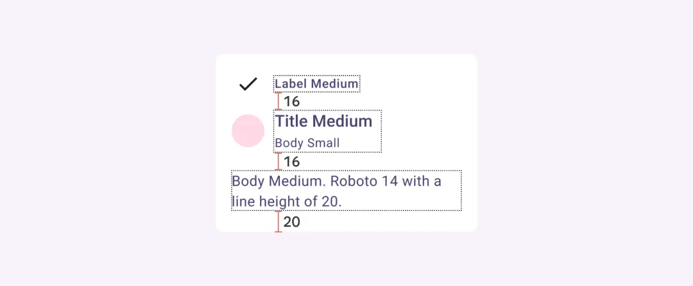

对于 Android 平台

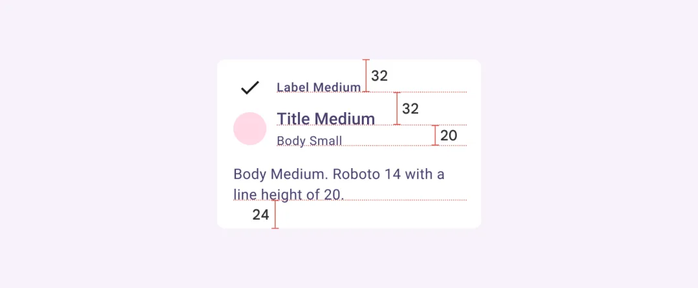

**——行长和行高**

那我们上面也说了排版中行高和行长的规则,这里再补充下 MD 针对英文的规则吧。

在英文中,对于较长的正文,MD 建议行长在 40-60 个字符之间;对于较短的文本,建议行长在 20-40 字符之间。

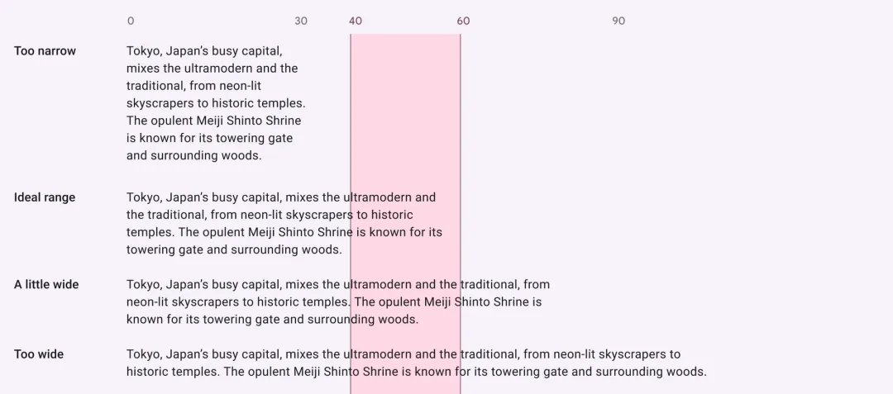

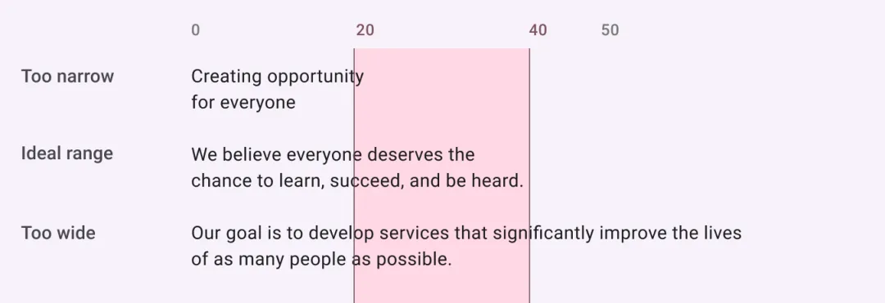

行高和上面讲述一致,对于较大的易读字体,采用 1.2 倍行高,对于正文等字体,采用 1.5 倍行高

**——颜色和对比度**

MD3 特别强调了 Accessibility,关于可访问性专门开辟了一个模块讲述

之后,会跟进可用性部分模块。毕竟研究生阶段专业也和这个相关,总不能放弃曾经的工作～

关于文字的总结就到这里了,这些对 UI 的字体也差不多够用了,不得不说坚持真是一件困难的事,目前这些文章都相当于是 UI 元素的底层工作吧,枯燥乏味,但我仍然相信,只有牢固的底层架构,才能随心所欲替换装饰风格～
