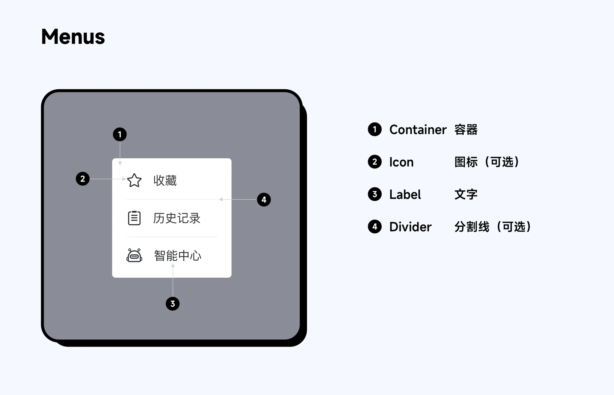
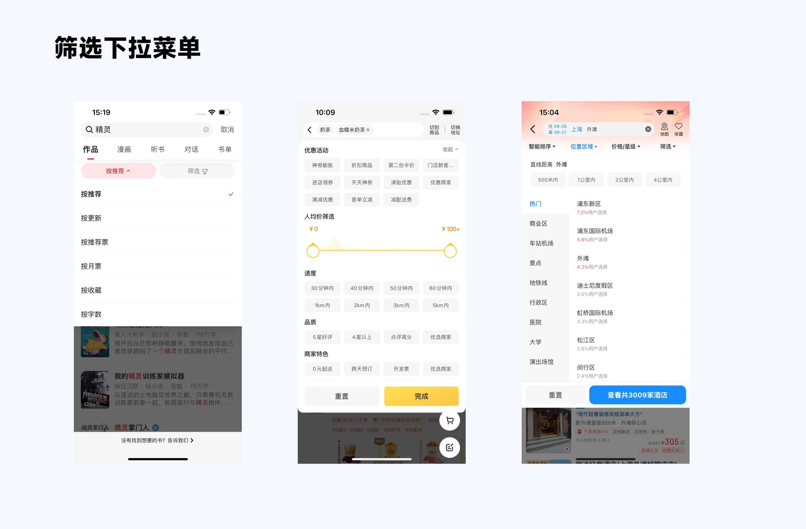

## 1. 什么是下拉菜单

准确来说,在 B 端设计中,下拉菜单应该叫 Dropdown Menus,应用于导航、工具菜单以及部分操作集合和筛选。

Select 是输入,用于一组选项中选择一个或多个数值。

但是,在 C 端设计规范中,许多文章将其归到了一类,就连 Material design 也将其统一为 Menus 菜单。

而在实际使用过程中,Select 逐渐在 C 端被演化成了底部面板的样式选择,又称为 Picker 的变体,因此这篇文章我们只讲 Dropdown Menus。

## 2. 菜单触发条件

常见的触发条件一般是:图标、按钮,在移动端特殊情况下为【长按】等操作

## 3. 结构

## 4. 下拉菜单类型

### 4.1 普通下拉菜单

### 4.2 筛选下拉菜单

## 5. 使用场景

在 APP 设计中,一般传统意义上的下拉菜单用到的形式

参考:

- [下拉菜单设计(优设网)](https://www.uisdc.com/dropdown-menu)
- [行动路径相关章节(Dooock)](https://www.doock.cn/course/13/chapter/443)
- [筛选控件(优设网)](https://www.uisdc.com/filter-control)
- [筛选控件补充(优设网)](https://www.uisdc.com/filter-control-2)
