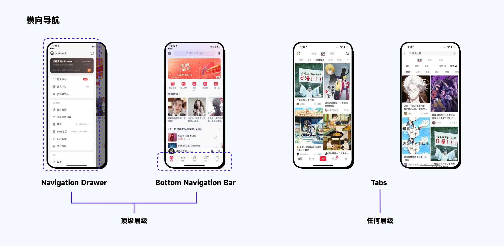
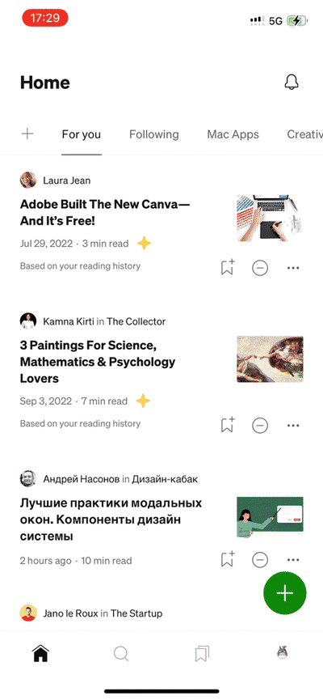
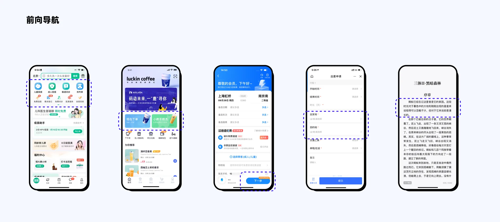
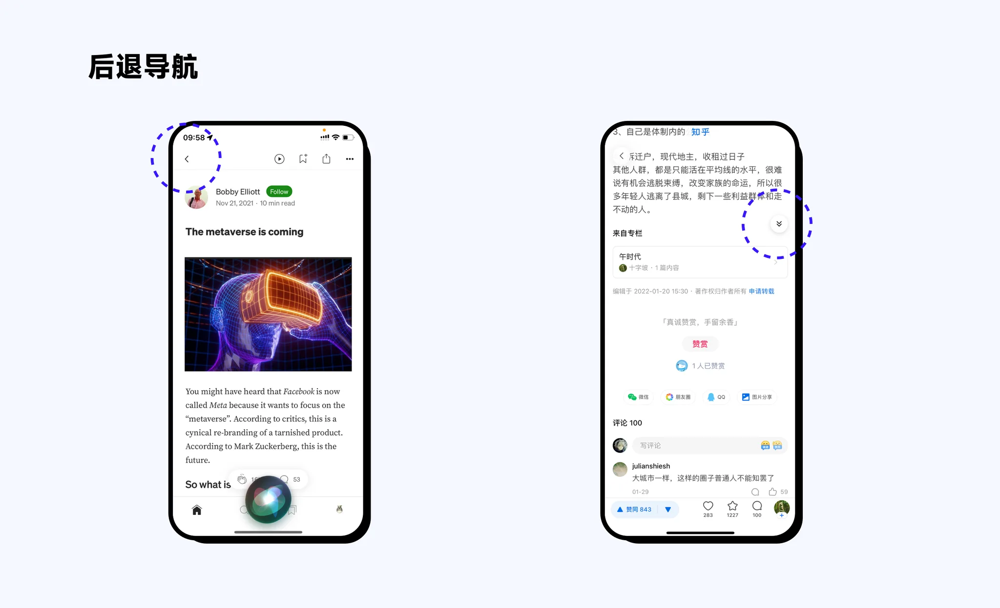
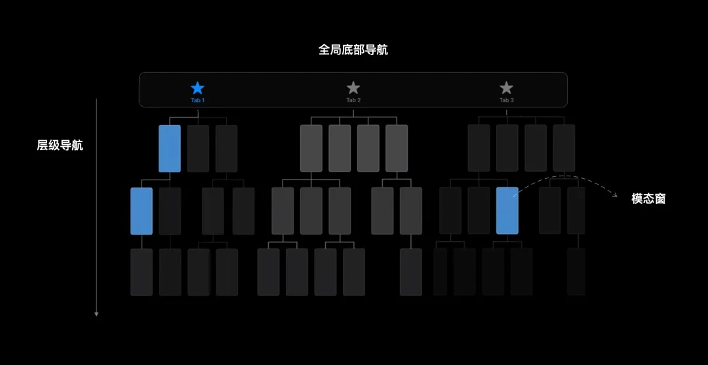
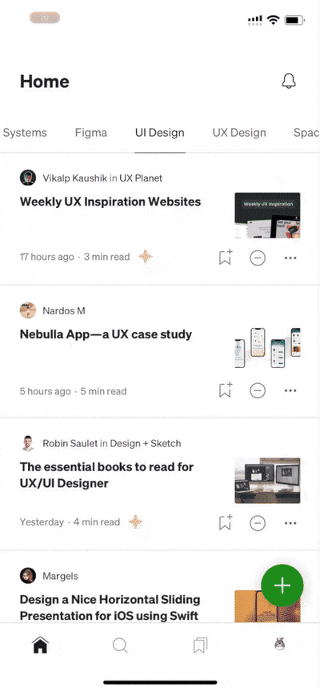
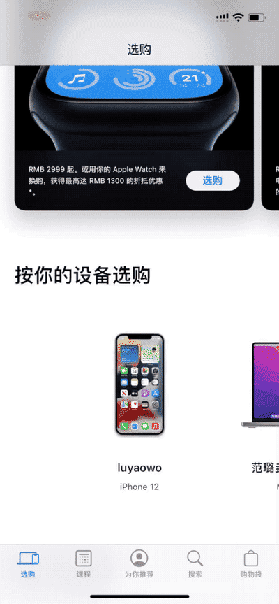

## 1. 什么是导航?

在 WWDC 2022 短片中,Apple 对导航进行了详细说明

当 App 有良好的导航时,用户可以专注于内容和体验。导航包括三点:

- 在 APP 中项目如何呈现
- 如何寻找信息
- 如何实现目的

## 2. 关于 App 导航层级

在 iOS 规范和 Material design 中对导航都有明确的说明

### 2.1 Material design 中导航层级

在 Material design 中,导航分为【横向导航】【前向导航】【后退导航】

【横向导航】,即在同一层级的页面的转换

【前向导航】,从父层级到子层级页面访问,步步深入

【后退导航】,即返回,我们常见的返回箭头和关闭

#### 2.1.1 横向导航

横向导航包括【Navigation Drawer】【Bottom Navigation Bar】【Tabs】,其中前两者处于页面的顶级层级,而【Tabs】在页面任何层级都可以出现

对于顶级层级过渡,采用淡入淡出样式。

除顶级层级外其他层级导航采用侧滑样式

#### 2.1.2 前向导航

MD 中关于前向导航分为三类,其实总结成一句话来说,前向导航就是从父层级页面到子层级页面,APP 页面的大部分组件都是构成前向导航的,帮助我们使用 App 来完成任务。

如下图的品类区、卡片、按钮、表单甚至文字链接,都是属于前向导航～

对于前向导航采用父子过渡方式

#### 2.1.3 后退导航

一般为页面上的返回按钮,旨在访问上一层级页面。

特殊:返回先前的屏幕位置和状态,比如长文章垂直滚动【返回顶部】,也算特殊情况后退导航

### 2.2 iOS 中的导航层级

在 WWDC 2022 中,苹果就导航展示了新的思考视频。苹果就导航分成了三个模块,【Tab Bar】标签栏导航、【Hierarchical Navigation】层级式导航、和【Modal presentations】模态

#### 2.2.1 Tab bar 底部导航栏

Tab bar 底部标签栏,其功能主要有三点

- 反应信息的层次结构
- 功能分布平衡,避免将功能复制到一个选项卡中,也就是首页
- 底部导航栏常驻,仅当模态时隐藏 Tab bar

Tab Bar 是全局顶级导航,仅当【模态交互】时隐藏底部全局导航,常驻于页面底部。【让用户始终能访问 App 的核心区域,帮助用户在不同层次的信息间轻松切换,同时各层级间的关系还能保持清晰】,缺点是在移动端本身屏幕的尺寸下占用位置。

对于国外 APP 来说,其大部分都遵照苹果 APP 规范设计。对于国内 APP 来说,在二级导航及以下层级内隐藏页面导航栏,以节省页面空间。

在 iOS 中,底部导航栏的交互切换方式与安卓相同～

#### 2.2.2 Hierarchical Navigation 层级式导航

- 一屏只做一个决定直到用户到达目的地
- 保持 tab bar 固定在底部
- 使用 Navigation bar 进行返回和当前所在位置指示

可以看出,经典导航栏的使用一般在第二层导航及以下,并且交互方式为推入推出方式

#### 2.2.3 Modal presentations 模态

呈现专门用于展示某个界面中的独立任务,通常表现为从下往上呈现。模态式呈现是打断的设计思路,它强调了用户在完成或者取消当前任务前,不能进行其他操作,所有注意力都应集中在当前任务

在 iOS 中,顶部导航栏为【Navigation bar】,底部导航栏为【Tab bar】;

在 Android 中,顶部导航栏为【Top app bar】,底部导航栏反而为【Navigation bar】。

在 Android 规范中,还有一个 Bottom app bar,很少用到,其大致相当于 iOS 中的 Toolbar
