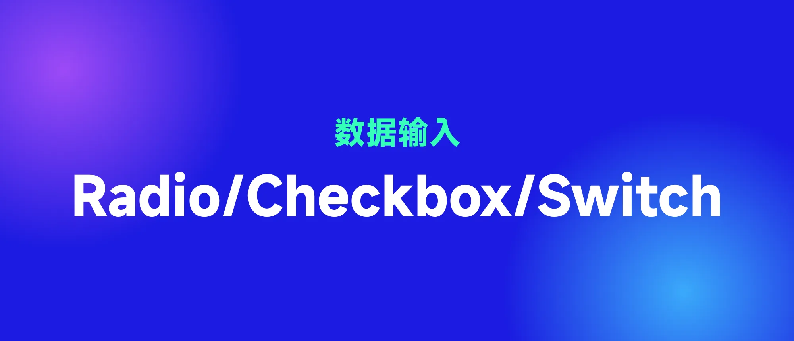
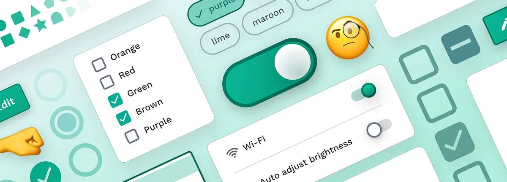
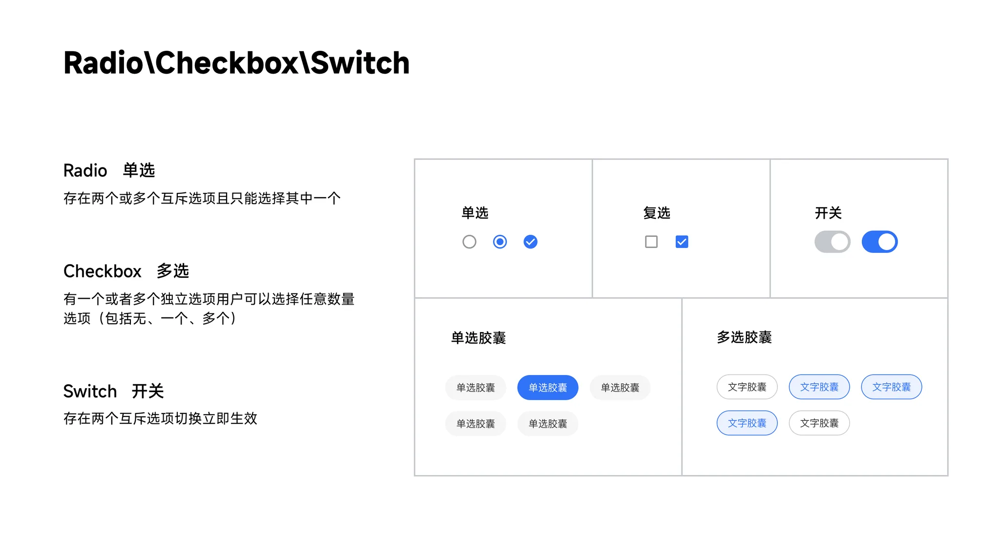
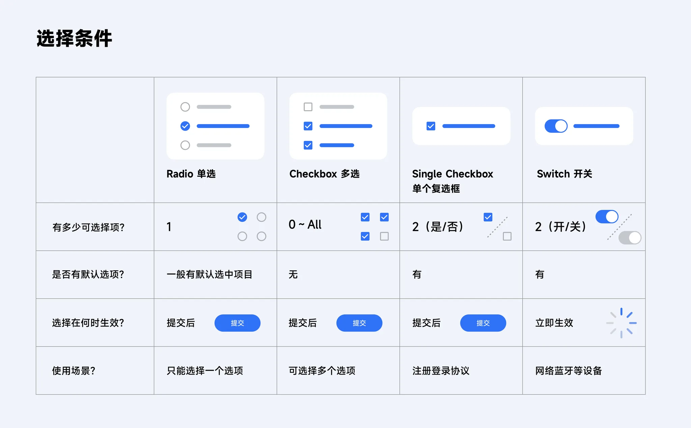
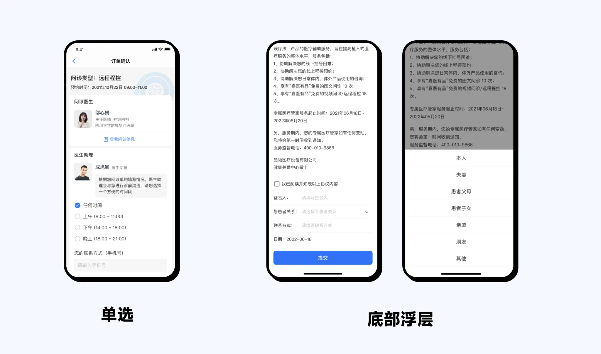
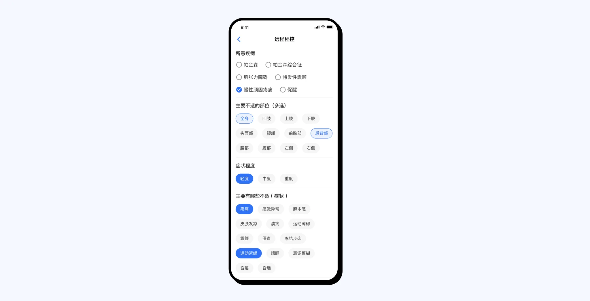
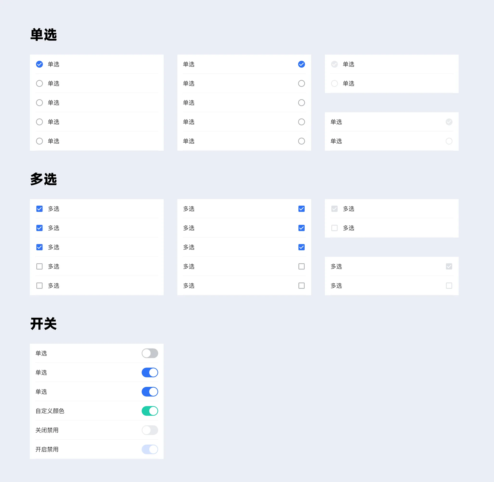
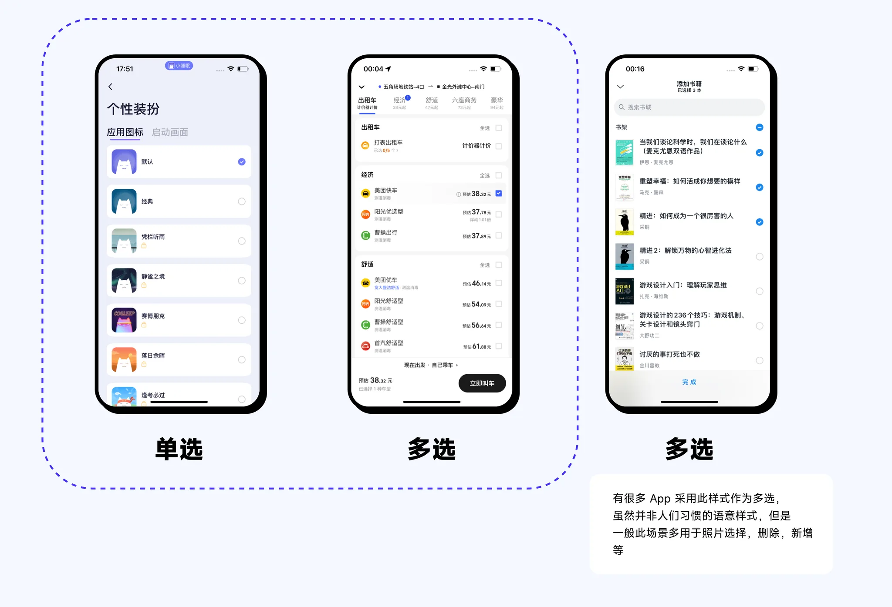
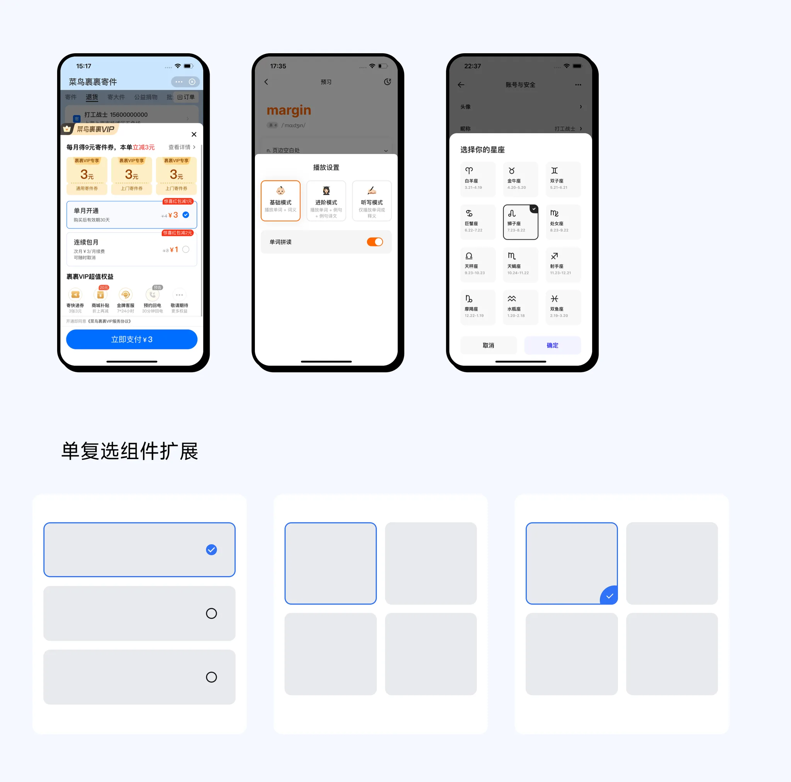

Radio 翻译为收音机,Switch 为开关。

## Radio / Checkbox / Switch

#### Radio button:当存在两个或多个互斥选项的列表且用户只能选择其中一个

#### Checkbox:当有一个或多个独立选项,用户可以选择任意数量的选项,包括(none / one / several)

#### Switch:有两个互斥选项且始终有一个默认数值,切换选择立即生效

## 1. 定义

## 2. 注意事项

- 当选项较少时可以采用单选,当选项较多且空间少的时候,可以采用底部浮层样式

- 当选项较多且空间充裕时,可以用选择胶囊替代单/复选框

## 3. 样式

## 4. 参考

有很多 App 采用此样式作为多选,虽然并非人们习惯的语意样式,但是一般此场景多用于照片选择、删除、新增等

参考:

- [Selection controls(UI component series)](https://uxdesign.cc/selection-controls-ui-component-series)
