搜索是一种导航方法,允许人们通过应用程序快速查找信息。用户在搜索视图的搜索栏或文本字段中输入查询,然后查看相关结果。

搜索流程大体上可分为:【搜索前】【搜索中】【搜索后】

## 1. 搜索前(搜索入口)

- 顶部搜索框:最常见的样式,位置在导航栏上面
- 搜索 icon:提供搜索入口,但搜索不是最必要入口
- Tab bar 搜索标签:搜索功能非常重要,需要开辟一个独立标签栏按钮

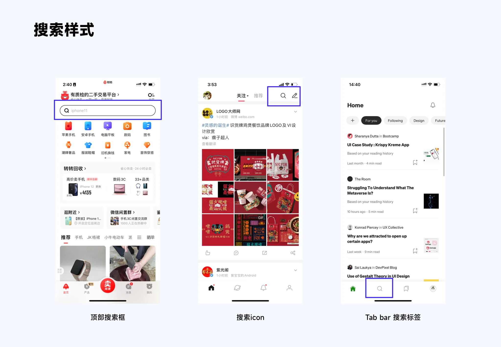

### 搜索框样式

常见的搜索入口结构有:通栏结构、非通栏结构、按钮状态,对于搜索功能的优先层级依次递减。

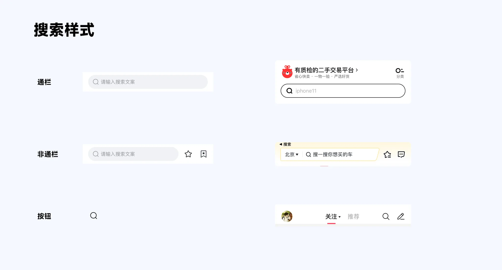

## 2. 搜索中

搜索中有两个阶段的动作,第一个是激活搜索阶段,第二是文本输入阶段

### 2.1 激活搜索阶段

点击搜索框后,搜索框被激活,此时光标出现,输入键盘自动弹起。此时在搜索框下一般会展示【历史记录】,以及根据算法生成的【猜你喜欢】,或者【热点推荐】等。

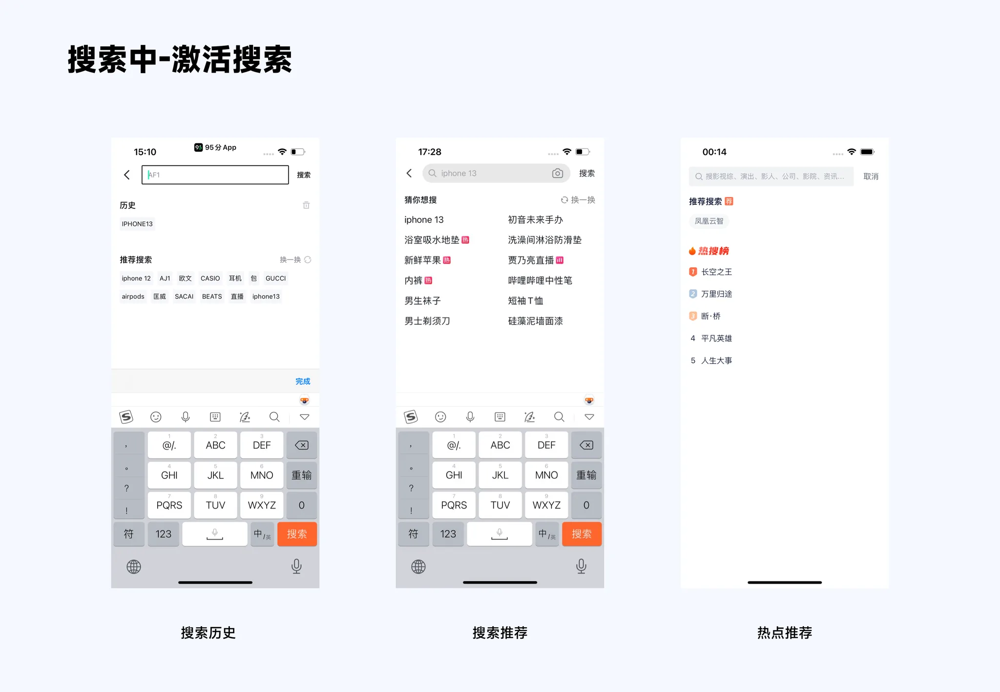

### 2.2 搜索输入阶段

当用户输入文字信息时候,系统会自动将输入的关键词与库内信息进行匹配,并按照某种规则排列展示,这就是搜索输入阶段。

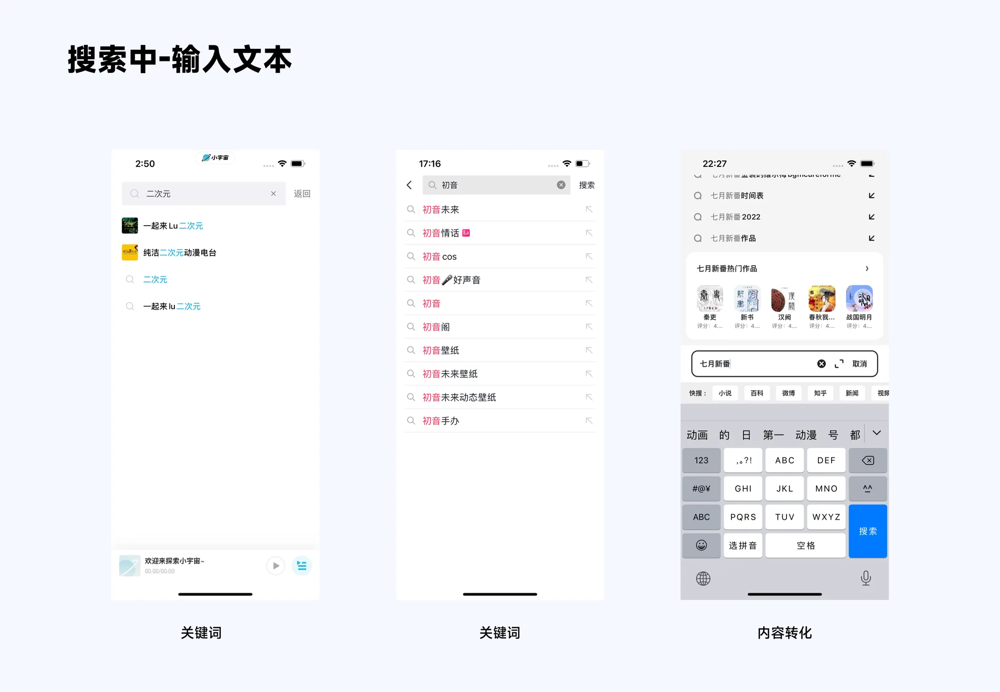

## 3. 搜索后

搜索完成后,一般会显示删除图标,便于一键清除文本,或者有些搜索结果以标签形式展示,并附带删除按钮

### 3.1 搜索结果信息展示

对于同类信息,一般采用统一样式,根据内容多少选择列表或者卡片进行展示

对于多类信息,可以采用多种布局方式展示

对于随机信息展示,一般出现在搜索引擎中,采用卡片式设计用以区分内容

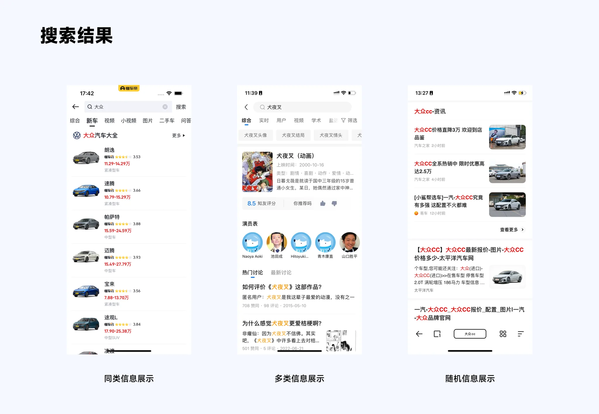

### 3.2 搜索结果体验优化

#### 3.2.1 首位卡片

搜索结果页的头部信息会以特殊设计形式作为处理,在结果页中,首位卡片设计常常能够营造氛围感和官方可信度,并且增加品牌曝光度

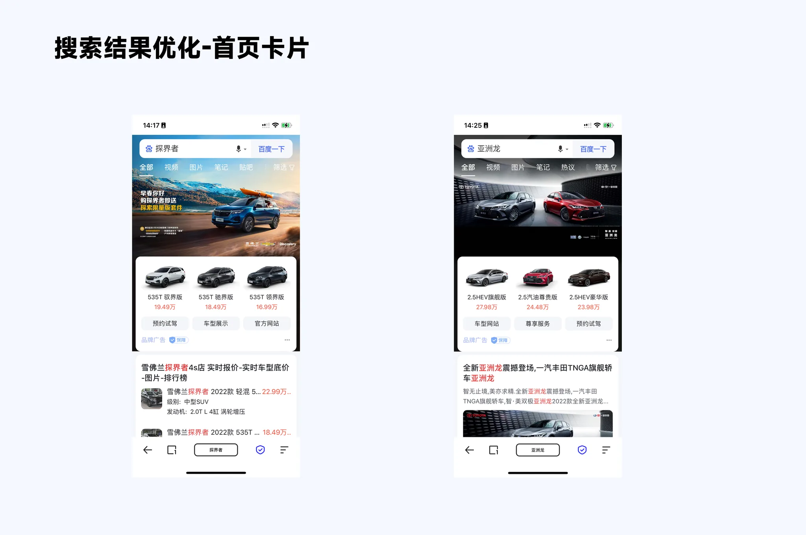

#### 3.2.2 辅助搜索

一般在较为宽泛的话题搜索时,搜索结果页会出现一些筛选模块,辅助用户进行搜索,提高了搜索效率和精准触达。

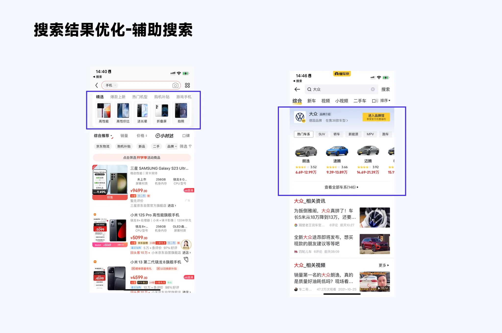

#### 3.2.3 搜索容错处理

搜索场景应当尽可能具备更强的容错处理能力,当用户表述不准确时,加强对用户搜索目标的预测,并且提供搜索结果指引

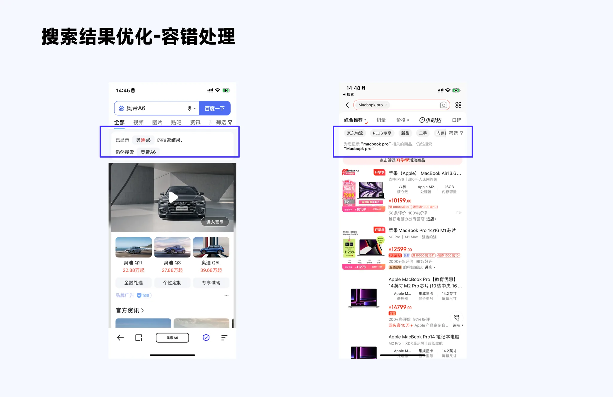

#### 3.2.4 空态页

## 4. 搜索交互

### 4.1 搜索点击过渡

搜索点击过渡有两种,第一种是左侧的平滑过渡;第二种是右侧的推进过渡。

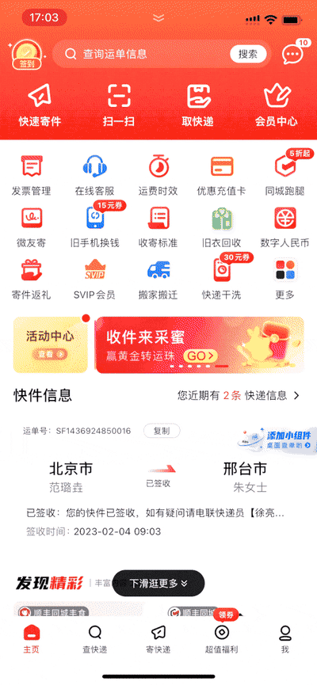

### 4.2 搜索滑动过渡

当页面进行滑动时,搜索栏有两种情况,第一种是固定在页面顶部,第二种是跟随页面活动后固定在页面顶部。

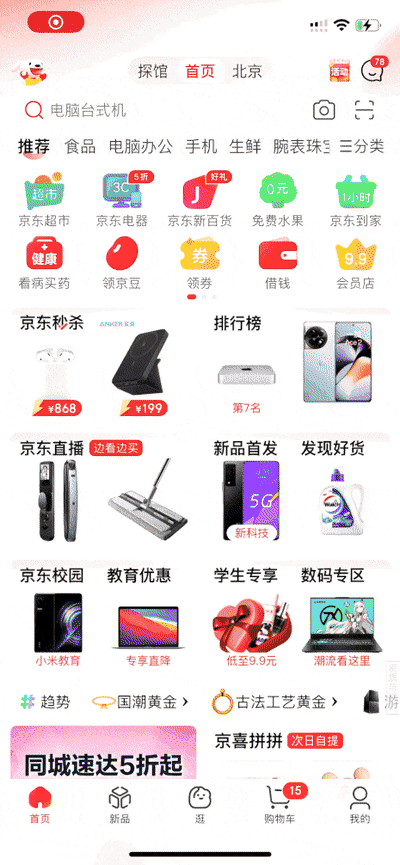

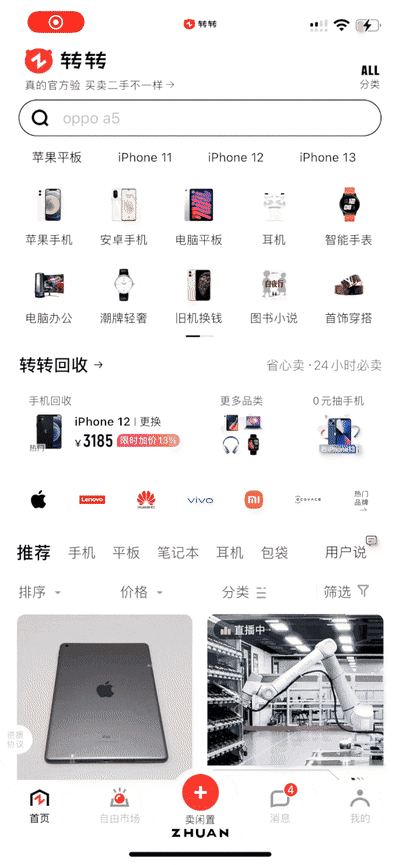

参考:

- [如何设计移动端搜索?来看我总结的这四个部分!(优设网)](https://www.uisdc.com/search-function-design)
- [交互基础小课堂!移动端「搜索功能」设计超全面总结!(优设网)](https://www.uisdc.com/search-function-design-2)
- [如何搞定搜索框的视觉设计?来看这篇总结!(优设网)](https://www.uisdc.com/search-box-visual-design)
- [如何让搜索框的体验更好?我总结了这些设计套路!(优设网)](https://www.uisdc.com/search-box-experience)
- [从结构、类型和状态 3 个方面,帮你掌握搜索框设计(优设网)](https://www.uisdc.com/search-box-design)
