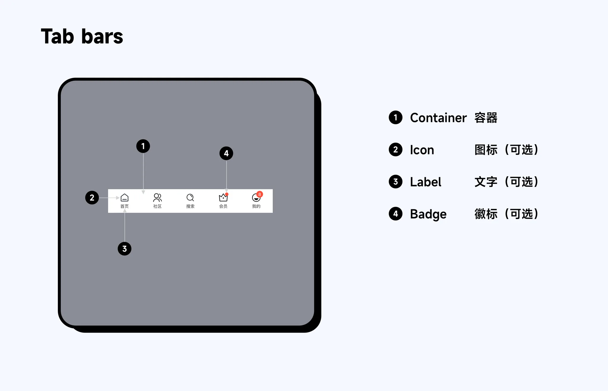
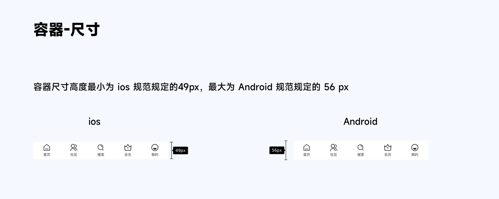
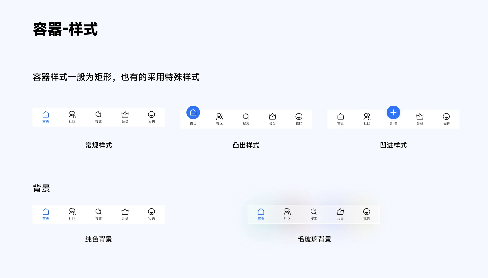
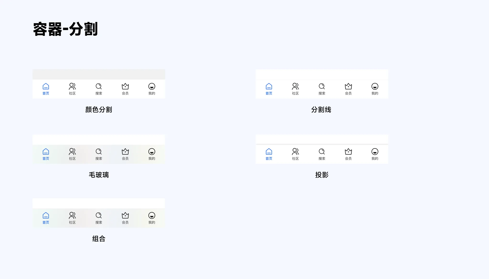
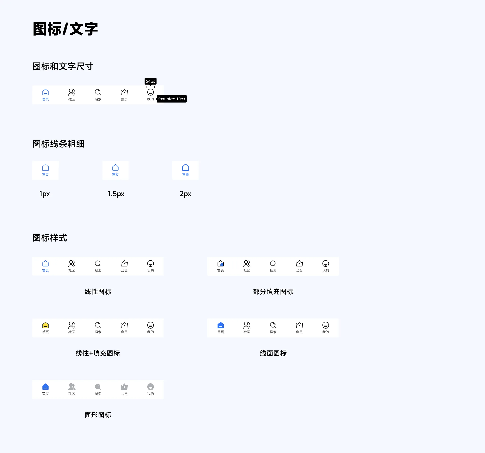
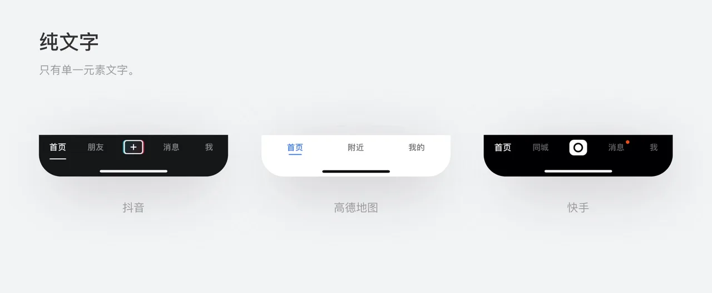
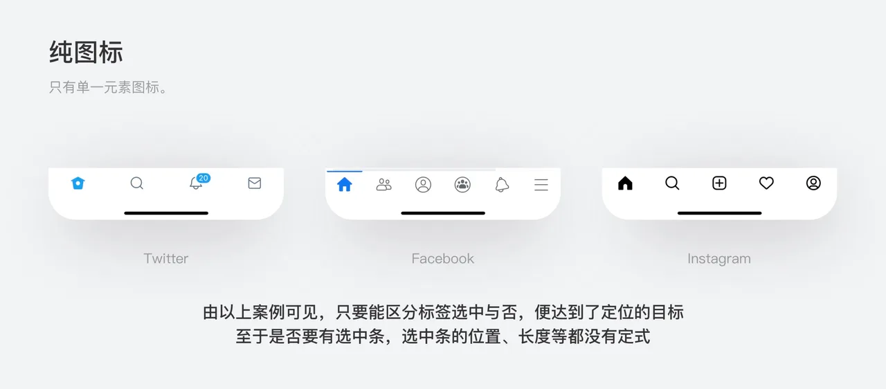
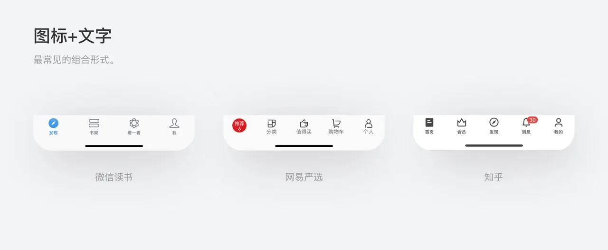

在导航一文中说过,Tab bar 作为顶级导航在首页显示,标签栏不应承载任何操作,如果需要执行操作,应选用工具栏(Tool Bar),标签数量一般在 3-5 个

## 1. Tab bar 作用

### 1.1 定位导航

明确提示用户当前所处位置,当用户想要前往其他一级页面时,只需切换底部标签即可

### 1.2 凸显品牌

标签栏中的视觉元素,包括选中标签的颜色、图标形式、组合样式等反映产品特性

## 2. 解构

Tab bar 包括容器、图标、文字和小红点提示,其中,图标和文字是可选的,可以共存也可以单独存在

### 2.1 容器

#### 2.1.1 容器尺寸

容器尺寸可以自定义,一般设计时按照个规范平台高度即可

#### 2.1.2 容器样式

#### 2.1.3 容器分割

### 2.2 图标/文字

线条粗细:最常用的为 1.5px,如果是极简主义风格,可以选用 1px,如果是厚重风格,可选用 2px

图标样式:由于图标的复杂性,这里仅列出常用的样式。包括线性图标转换;线性和部分填充转换;线性图标和线面结合转换;线面图标转换;面性图标转换

文字:一般使用 10px 文字

可以只有文字或者只有图标或者两者共存

纯文字一般适用于沉浸式内容产品,例如短视频平台,弱化导航

纯图标在国外使用更常见,一般适用于人们习惯的一些操作,而不必增加理解成本,用户群体更年轻化

图标加文字是最常用的组合,最易理解和阅读

## 3. 动效

tab bar 动效是一个复杂的专题

一般动效包括【点击动效】和【滑动页面动效】

参考:

- [Tab bar 结构分析(优设网)](https://www.uisdc.com/tab-bar-analyse)
- [超全面!大厂都在用的 Tab Bar 图标动效设计类型总结(优设网)](https://www.uisdc.com/tab-bar-icon-motion)
