在 iOS 中叫做 Navigation bar,在安卓中被称为 Top app bar

## 1. 顶部导航的作用

- 标题:告知用户所处位置,一级导航还是二级以下导航
- 返回或关闭:返回上一层级(二级及以下导航)
- 操作入口:将操作集成,为用户提供全局操作
- 分类整理:将同层级或者类别页面以 Tab 样式聚合
- 品牌曝光:通过 logo 等方式增加品牌曝光

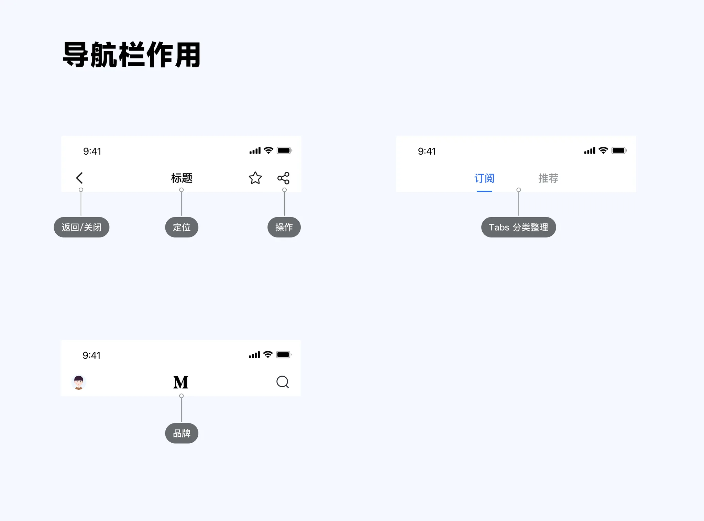

## 2. 导航栏解构

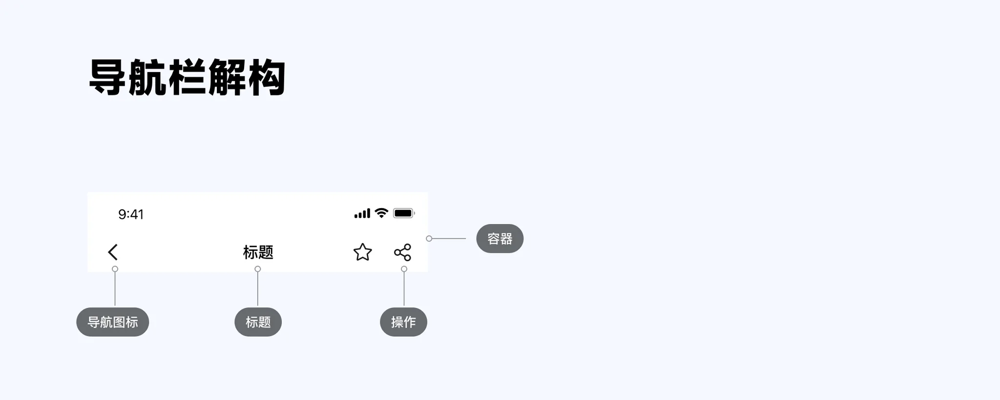

导航栏分为四个部分:容器、导航图标、标题、操作项,下面依次来分析这几个模块

### 2.1 容器

导航栏容器有默认固定高度,一般来说,iOS 导航栏高度为 44px,安卓导航栏高度为 64px。

当然,容器高度也可以随着导航栏内容的变化进行自定义设计

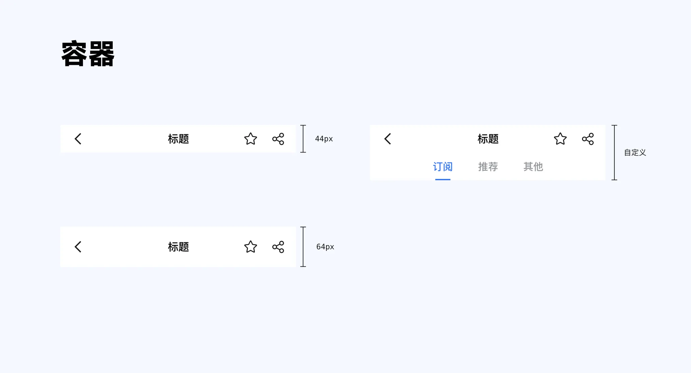

### 2.2 导航图标

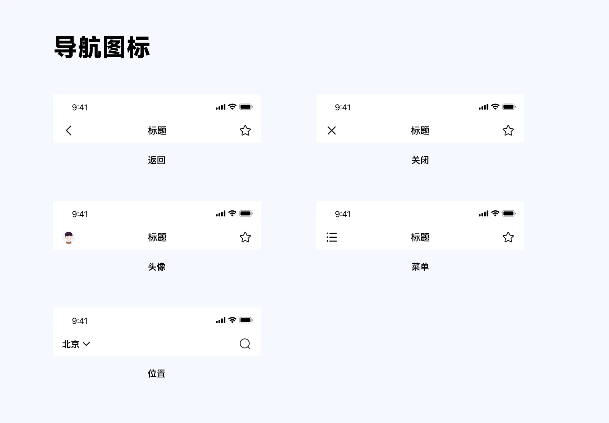

- 返回常用于二级导航及以下
- 关闭常用于 Modal 导航
- 头像和菜单常用于首页导航抽屉
- 地点常用于顶部浮层地址选择

### 2.3 标题

标题可以居中排列,也可以居左排列;并且可以替换为 Tab 标题,同样可以居中或居左

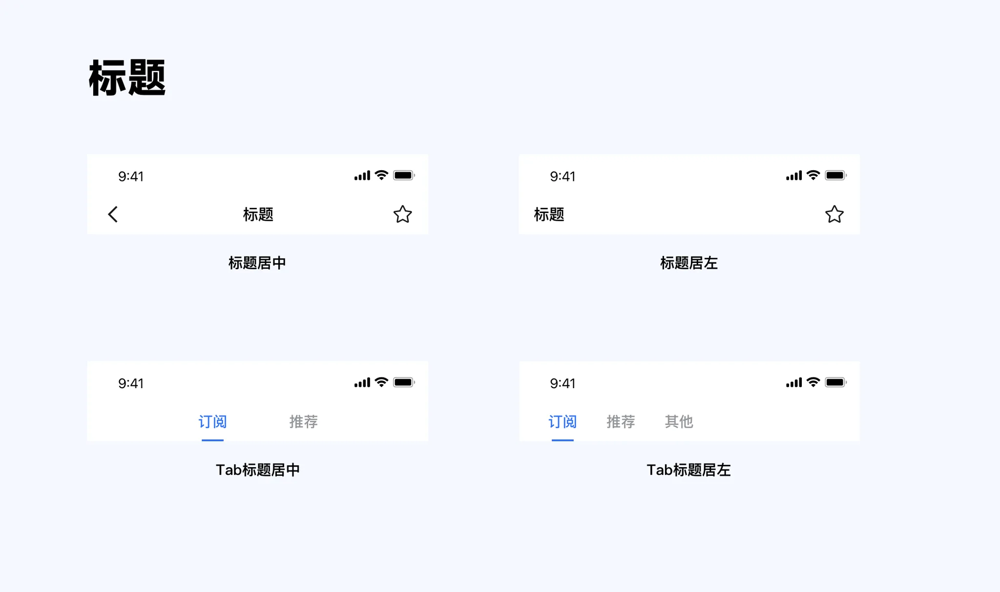

### 2.4 操作项

操作项一般最多放置三个按钮,并且优先级从左至右依次降低。当多于三个按钮后,剩余按钮就可以被放入更多图标中,以节省空间。

此外,除图标按钮外,还可以有文字按钮,或者图标加文字按钮。

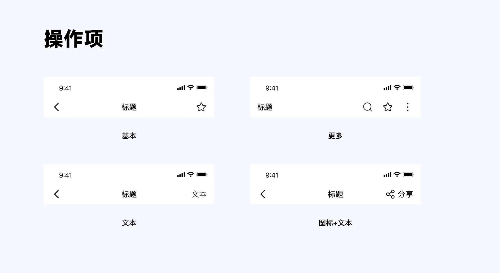

## 3. 导航栏布局

由于导航栏导航图标、标题、操作项和容器都是可选项,所以排列组合形成无数导航栏样式

### 3.1 标题

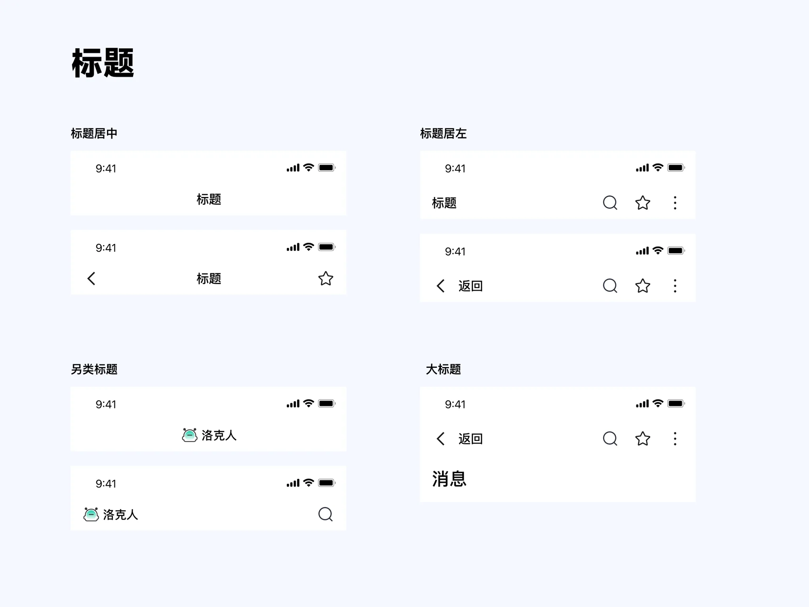

### 3.2 Tab 标题

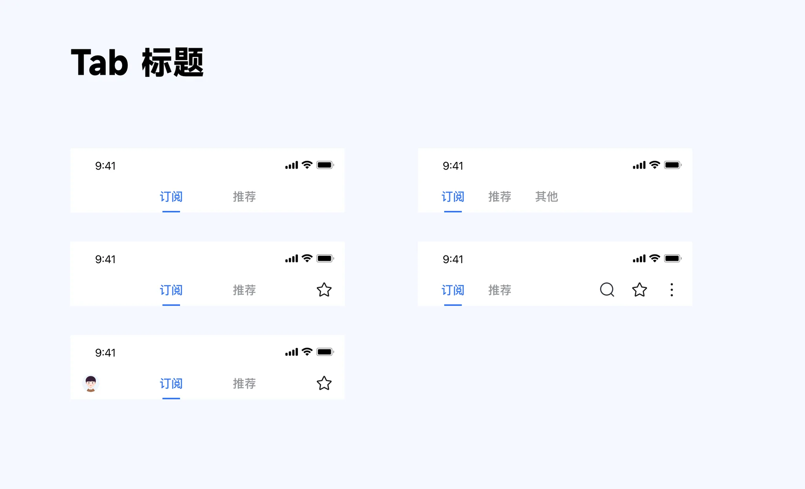

### 3.3 无标题

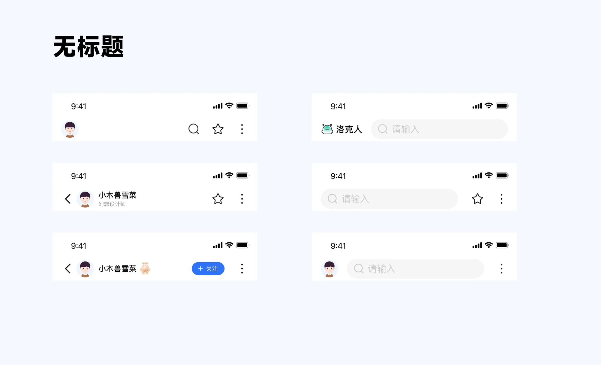

### 3.4 复合

### 3.5 容器样式

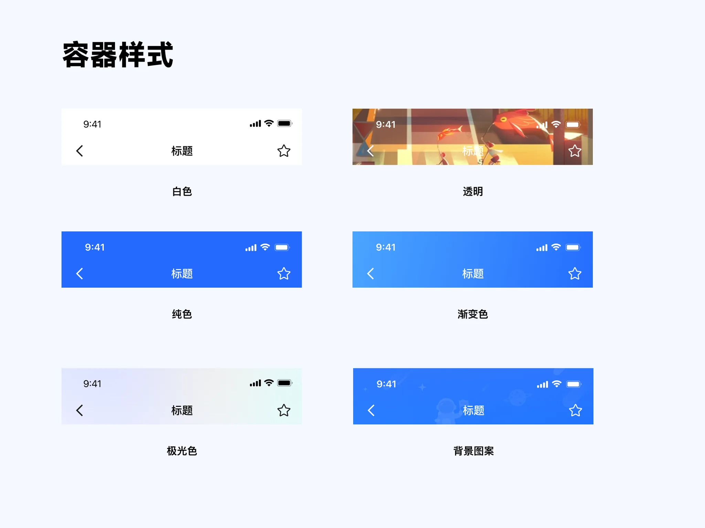

## 4. 导航栏交互

导航栏交互有两种样式。第一种是导航栏不变,向上滑动时保持在页面顶部。另一种是,页面向上滑动,导航栏发生改变。

对于导航栏发生改变情况下,考虑好滑动前和滑动后的样式,并做好交互衔接即可。

## 5. Tabs 标签页

根据上面可以看到 Tabs 有两种情况,一种是位于导航栏顶部,另一种是作为复合导航栏位于下半部分。

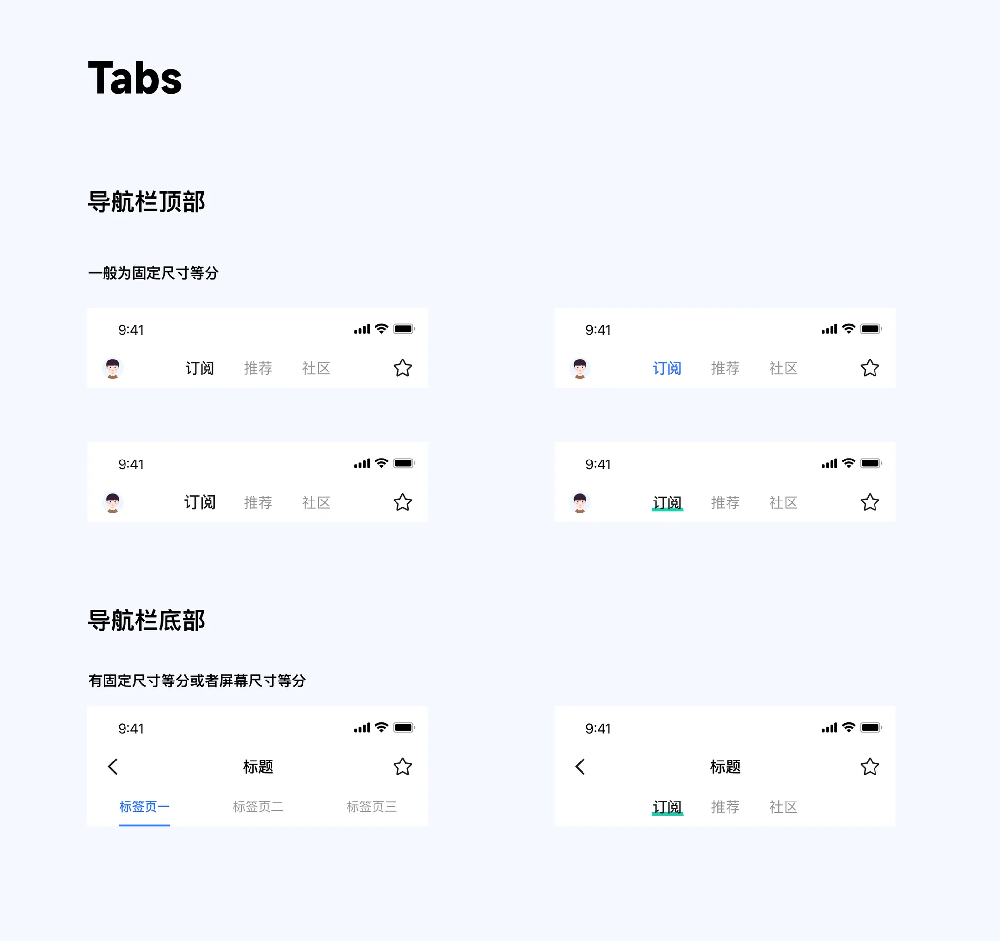

当页面标签数大于等于五个时,标签进行滑动处理

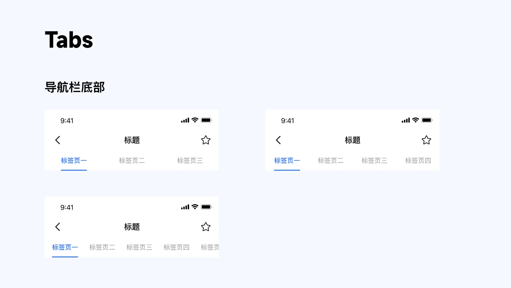

横线长短可分为三种情况,第一种是所有标签横线长度相等;第二种是所有标签横线等于页面宽度均分;第三种是根据字段长度设置横线长度。

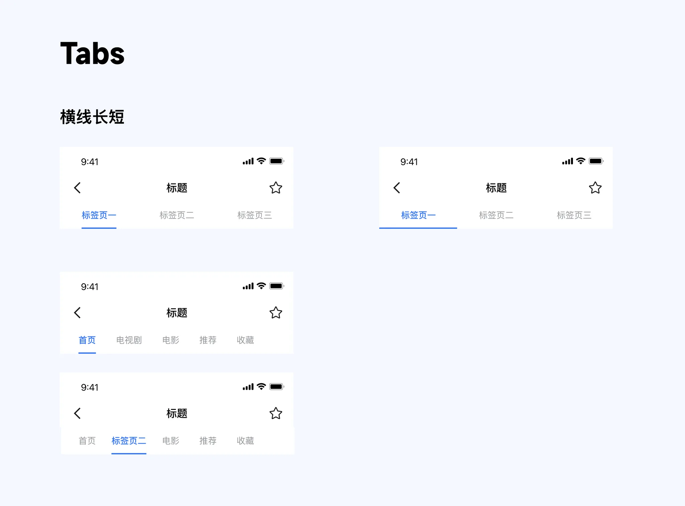

参考:

- [导航栏设计(优设网)](https://www.uisdc.com/navigation-bar-design)
