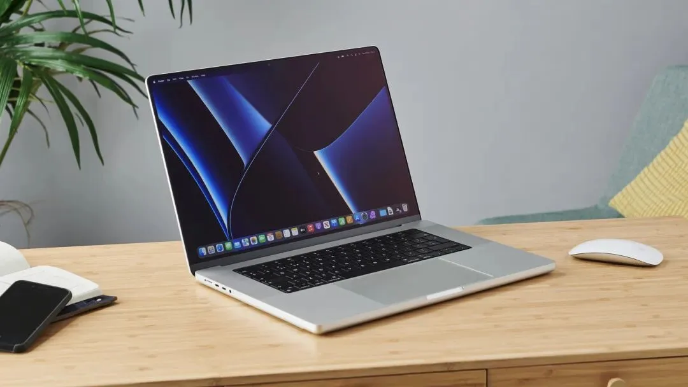

又是一年开学季,高三学子们也都进入大学校园。记得当时我们刚上大学第一件事就是买一个属于自己的笔记本电脑,对于已经工作的人来说,这件事或许没什么稀奇的。但是对于大部分高中毕业生来说,这可能是人生中属于自己的第一台电脑。

14 年时候线上互联网购物还不算很发达,我和大部分同学都是电脑城买的笔记本。毕业后读研又换过一台游戏本,工作后开始使用公司配的笔记本,而后手又换成了自己的笔记本。

18 年写过一篇电脑文章选购指南,虽然电子科技的发展之迅速,里面的硬件性能都已经跟不上时代了,但是文中的理念永远不会过时。

这篇文章不写新的硬件芯片、GPU 等排名了。就简单讲述下我现在使用的笔记本 M1 Pro 的使用体验,并盘点下从大学到现在用过的几款笔记本电脑吧。

## 1. MacBook Pro 16 2021

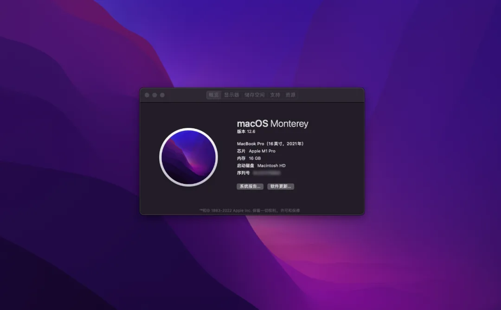

**配置如下:**

- 屏幕:3456 × 2234 分辨率,MiniLED,P3-1600Nit,ProMotion 刷新率
- CPU:M1 Pro,ARM 架构,8 性能核心,2 效能核心
- 显卡:M1 Pro 16 核心显卡
- 内存:16GB DDR5
- 存储:1TB 固态
- 3 个雷电 4 接口,1 个 HDMI,1 个 MagSafe,1 个 SD 卡插槽,1 个耳机孔

### 性能

苹果于 2020 年推出了 M1 芯片,算是开启了 ARM 架构的 PC 芯片风潮,在此之前,高通也基于 ARM 架构做出过应用于 PC 的芯片,只不过性能很弱,上市后没有引起很大的反响。

在 21 年,苹果又推出了基于 M1 架构的 M1 Pro、Max、Ultra,其中,M1 Pro 和 M1 Max 应用于 MacBook Pro 14/16 上,M1 Ultra 应用于 Mac Studio 上,相比于基础 M1,这些芯片性能得到成倍增长。

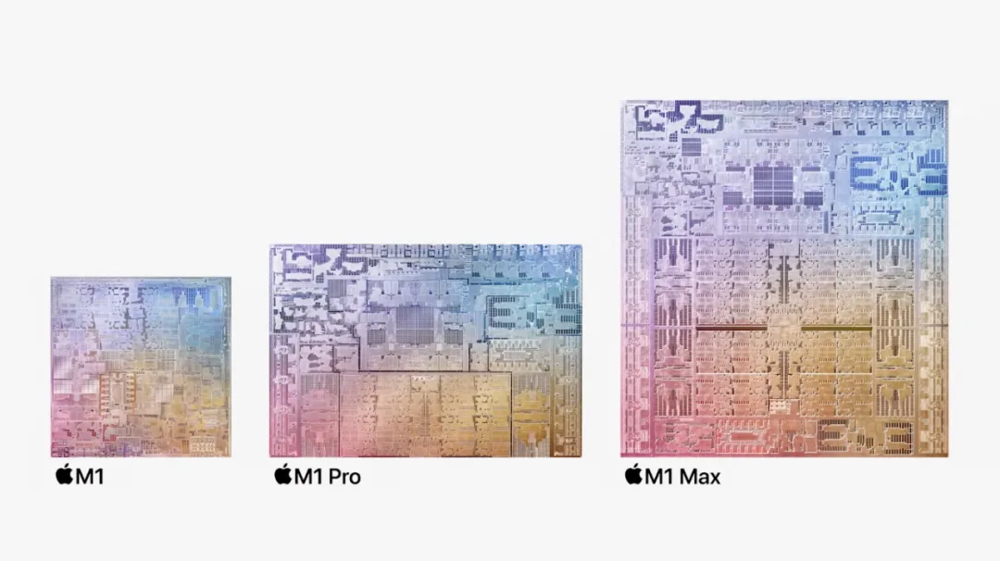

相比于传统的 CPU 和显卡,M1 芯片采用统一内存,将 CPU、GPU 等放在同一个芯片上,实现了更快的通信传输。但是具体性能如何呢?相比于网上有些吹的天花乱坠(堪比 RTX3080)和贬低一文不值的言论,实际跑个分进行比较才有说服力。

### CPU 性能

实测在 Cinebench R23 中,M1 Pro 10 核心的单核跑分为 **1528**,大于 i9-9880H 的 1183,多核跑分为 **12332**,大于 i9-9880H 的 9087。所以相比于上一代 MacBook Pro,CPU 性能提升还是挺大的。

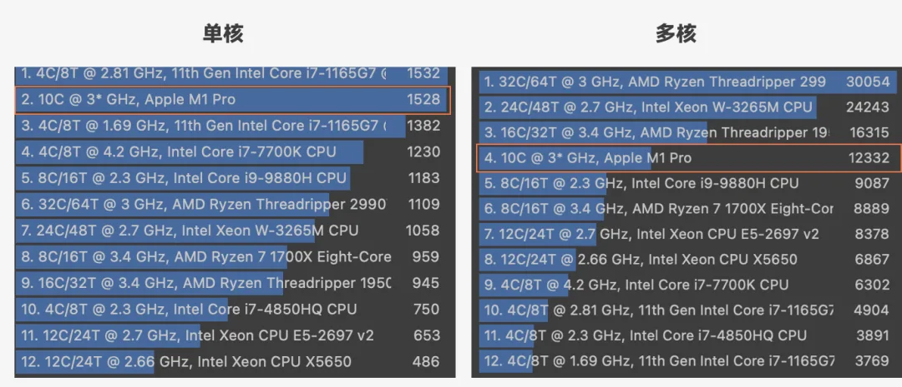

同比于酷睿来说,去网上查询了 i7-11850H 的跑分,单核为 **1502**,多核为 **12215**。可以看到 M1 Pro 的性能基本上就相当于 i7-11850H,相当于上一代游戏本 i7 旗舰芯片。

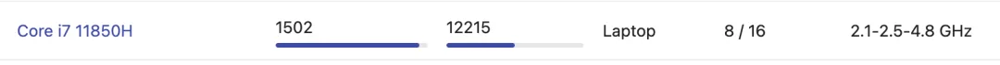

### GPU 性能

在 3DMark Wild Life Extreme 中进行测试,在 Unlimited 下,分数为 **10412**,对比网上所述,差不多相当于 **Nvidia 3050Ti**,不过由于没有光追,我觉得 **GTX1660Ti** 更合适一些。

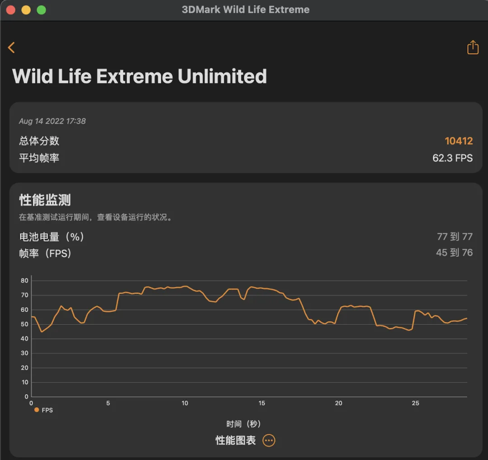

其实相比于 19 款,21 款性能提升上还算不错的,但是其真正的改变是能效比的提升,在使用过程中,基本上听不到风扇运转和发热,即使在安装软件的过程中。

我们来对比一下,M1 Pro 的 TDP 为 30W,i7-11850H TDP 为 45W,GTX 1660Ti 桌面端功耗为 120W,所以实现相同的性能,M1 Pro 的功耗要低了很多。

具体是为啥原因嘞?就是 **先进制程工艺 + 多核心 + 低频率**。

首先,M1 采用的是台积电 5nm 的工艺制程,也就是说在相同尺寸内可以承载更多的晶体管。

其次,采用性能核心加效能核心方式,并且采用较低频率来提升性能的同时降低功耗。其基础频率为 3.2GHz,之所以说较低,相比于动不动可以睿频到 5GHz 以上的 Intel 和 AMD 的 CPU 来说的。

### 屏幕

由于窄边框设计,屏幕比 19 款看起来更大了,并且屏幕材料升级为 miniLED,其优点是屏幕亮度峰值比原来得到很大提高,**由 500nits 提高到 1000nits,峰值 1600nits**。此外,我们知道一般显示器显示黑色并不是纯黑的,这就要涉及到屏幕的发光原理了,由于使用 miniLED 工艺,屏幕在黑色显示更加深邃了,实现更 **极致的亮度和暗部**。其次,M1 Pro 屏幕使用了 ProMotion 技术,屏幕刷新率可以最大提升到 120Hz,浏览的流畅性也提升了不少。屏幕的分辨率也得到提升,不过这点肉眼感觉不是很明显。

缺点当然是人所熟知的刘海儿屏了,苹果将其从手机带到了屏幕上。不过摄像头倒是由原来 720p 升级到 1080P 了。当然,由于 Face ID 模组厚度远大于屏幕厚度,所以诺大的刘海其实只有一个摄像头。

在菜单栏显示中,中间被刘海隔断,导致右侧一些应用图标被隐藏,使用类似 iStat Menus 这类监控软件尤为明显。不过相比于整体的提升而言,这个缺点也是可以接受的。

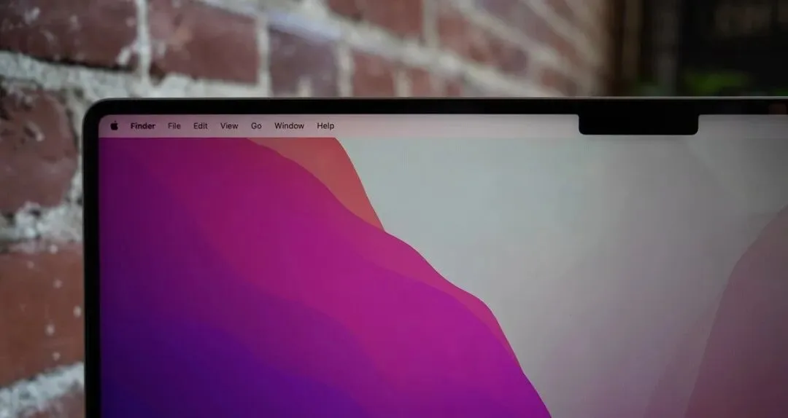

### 存储/电源/键盘

由于使用统一内存,因此相比于原来独显的内存扩展,现在 CPU 和 GPU 只能共用这可怜的 16GB 内存了,好处是统一内存的信息传输效率大大提高,功耗降低,并且可以根据需要来占用内存使用。缺点是现在的 16G,不是原来的 16G 了,原来还加了 4G 的独显内存。当然,这对于需要重度使用者来说,需要更大内存了。

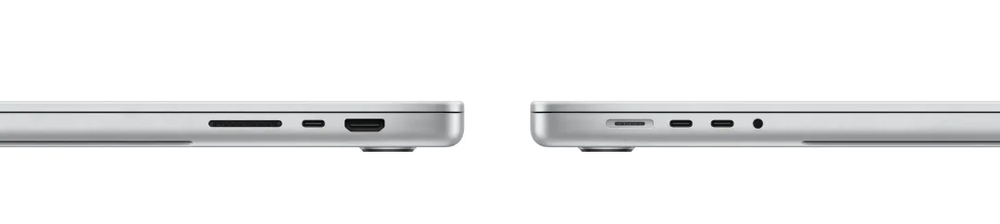

此外由于回归了 MagSafe 磁吸充电口和 HDMI 等其他接口,因此也比原来纯 C 口体验好多了,尤其是磁吸充电器。键盘舍弃了 Touch Bar,个人感觉也是不错的,键盘的其他使用来说,较 19 年款没太多感觉。

### 外观

可以看到,由于回归了接口,苹果舍弃了原来圆弧形设计,整体变得更加方正,类似 iPhone 12 回归到 iPhone 4 时代。上手第一眼,没有 19 款那种精致惊艳的感觉,反而有些笨重的感觉。不过由于外观结构重新设计以及高能效比芯片,这一代散热加强了很多,这可能也是这款模具优点吧。此外,在底面首次加入了 MacBook Pro 的刻蚀字样和四个大圆圈脚垫。整体外观变化非常大,让人更觉得的这不是轻薄本而是个移动小钢炮,重量为 2.2KG,加上 140W 的适配器,比之前的小米游戏本 2.7KG 轻不了多少。

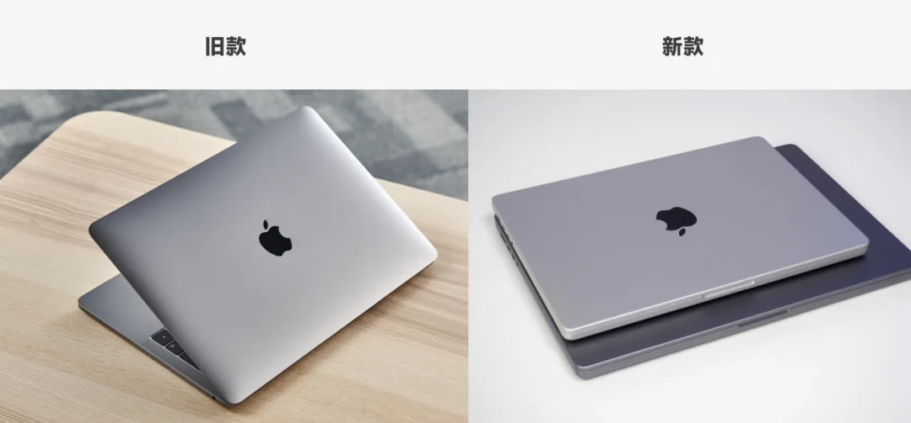

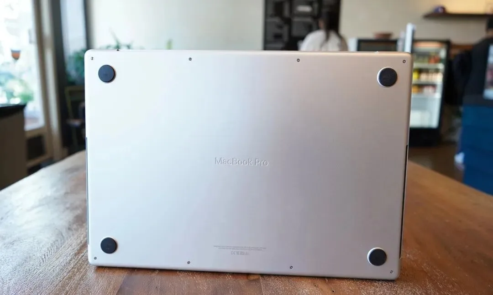

> 图片来源:Google 和 QXDA

### 软件和系统

由于 M1 芯片推出也快两年了,大部分软件也适配了 Apple Silicon,目前软件有三种版本:

- **通用**,软件在编译时候选择的是 Apple Silicon 和 Intel 两个架构,目前大部分软件都是这么做的
- **Apple Silicon 版本**,仅能在 Apple 芯片上运行,这个比如 Notion 和 Blender 都是这么做的
- **Intel 版本**,通过 Apple 自带的 Rosetta 2 进行转译

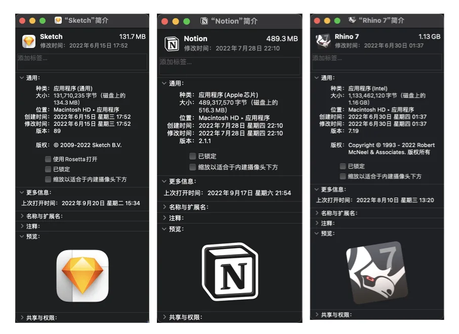

以手上用的电脑为例,大部分软件都选择是通用版本,部分国外软件则单独推出了 Apple Silicon 版本,剩下极少数的是通过 Intel 版本转译运行的,这软件要么是偏工业类应用的,要么是比较老的软件不持续更新的。

对于设计、艺术、媒体这类行业来说,M 芯片兼容性不成问题;但是对于工业类专业来说,还是更偏向于 Windows X86 架构。

### 总结

**优点:**

1. **能效比极高**,M1 Pro 的性能追赶上旗舰酷睿处理器的同时,功耗相比降低了很多,所以日常使用无风扇噪音和发热现象,电池续航比较长
2. **屏幕素质好**,得益于 MiniLED,屏幕颜色饱和度和对比度很高,并且 ProMotion,提升了浏览的流畅性
3. **工业设计依然在线**,虽然没有 19 款给人特别惊艳的感觉,但是这款模具却更符合了 16 寸小钢炮的形象

**缺点:**

1. **价格贵**,统一内存的情况下,32G 确实是最好的选择,但是升级成本非常高
2. **刘海屏**,不算特别大的缺点,因为极窄边框屏幕,苹果想放入一颗 1080p 摄像头,好像没有更好办法,但是希望以后 Face ID 模组可以随技术升级放入刘海。或者没有 Face ID 但是和手机一样打孔屏。
3. **偏重**,其实不算缺点,见仁见智吧。

### 后话

PC 作为我们现代人工作的重要组成部分,也是随着时间和技术的不断进步发生变化。不管什么价位,都有选择的可能。PC 作为工具,不是决定生产力的决定性因素,但是是非常重要的。一种效果或项目也许通过多个软件来实现,但是效率和体验确是不相同的人,而平台和硬件性能会影响这种效率和体验。

虽然说硬件配置与价格有关,但还有一个影响比较大的就是**信息对等性**。

正常情况,比如同价位下的华为 MateBook Pro X 和天选 3,如果作为一个工业设计的从业者,对性能要求比较高,那肯定选天选 3,尽管它重量较重。如果是文学类的从业者,那选 MateBook Pro X 会更好,更轻的重量,更长的续航,更小的噪音。但是由于信息不对等,那可能两个人选择相反从而与实际场景应用相反。

还有少数情况,一般是在线下场景,以次充好,例如拿上一代的产品对标新的产品,比如 i9-9880H,9 代 i9 移动旗舰 CPU 了,但是实际性能远远低于 i5-12500H,因为整整隔了两代工艺。但是对很多不了解的人往往觉得 i9 更强一些,很多线下商家拿库存机进行售卖。这就是信息不对等造成的。

## 2. Lenovo SR 1000

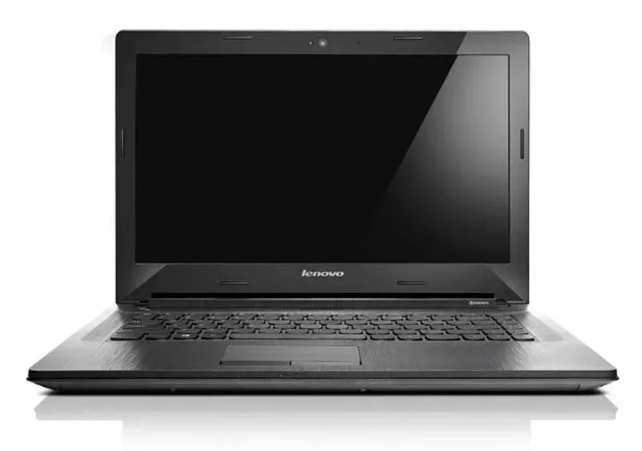

**配置如下:**

- 720P TN 屏幕
- i7-4500U,22nm,双核四线程,4M 三级缓存
- AMD 2G 比核显还弱的独显
- 4G DDR3 内存
- 1TB 希捷机械硬盘
- win7 home basic 系统

这个电脑作为主力机在大学用了四年,期间经历过重装系统,屏幕更换,加装内存。

由于预装 32 位系统,导致 4G 内存系统只能使用 2G,当时就用这 2G 内存一卡一卡地打了半年 LOL。后来预升 win10 失败,重装系统后变为 64 位系统,4G 可用内存。终于体会到还算流畅的游戏。

再后来屏幕出现问题,又从淘宝上淘了个二手友达 IPS 1080P 屏幕,相比于之前蓝白 TN 屏,色域得到很大提升,Rhinoceros 建模预览都好起来了,缺点是屏幕亮度较暗。

内存加装了三星的 4G 内存,加上自带的内存总算来到 8G 了。由于只有机械硬盘,对响应速度提升相对不是很明显,唯一的是可以同时运行更多软件了。

其实在早期,笔记本电脑是没有明确定位的,那时还是电脑城还是销售主力军,没有明确 **轻薄本、全能本、游戏本** 的概念。那时候同学的电脑价位多在 **4K-6K** 之间,例如联想 G50,ThinkPad E,戴尔等学霸机,多是 TN 屏,AMD A 系列处理器和 Intel 低压 U,性能比核显强不了多少的独显。当时游戏本定位也不是很明确,少数同学 6K 以上的笔记本,GTX 850M 级别的显卡已经是高级的存在了。

大致是 16 年到 17 年吧,随着守望先锋和绝地求生游戏出圈后,对电脑高要求的配置也引起了电脑行业的快速迭代,当时国内外各大电脑品牌都相继推出游戏本,不过初代游戏本的缺点很明显,傻大黑粗,质感廉价的塑料外壳,厚重的机身,当然价钱摆在那里。

大约 17 年到 18 年,由于被 AMD 步步紧逼,Intel 8 代处理器不再挤牙膏,经典移动端 i7-8750H 由原来 7700HQ 的四核八线程变为六核十二线程,由于多核心加持,性能也是实打实提高;与此同时,Nvidia 也发布了新的 10 系一代神卡,移动端常用的 GTX 1050Ti 和 1060,尤其是 **1060 6G**,成为一代神卡。

与此同时,各大厂的游戏本也越来越注重设计了,不再杀马特另类,高性能、散热、轻薄都成了宣传卖点。

## 3. 小米游戏本

此时我研究生入学几个月内,电脑系统又出问题了,当时想着新的阶段新的开始,和家里厚着脸皮要了点钱加上毕业设计的奖金,又买了一台电脑,小米游戏本 15.6。

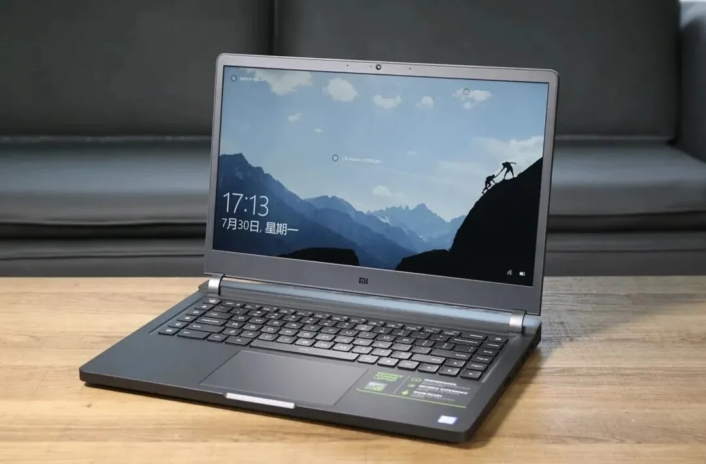

**配置如下:**

- 1080P 72% NTSC IPS 屏幕
- i7-8750H,六核心十二线程,9M 三级缓存
- GTX 1050Ti 4G 独显
- 8G DDR4 内存
- 256G 三星 PM981A 固态加西部数据 1TB 机械硬盘
- win 10 home basic 系统

这个电脑作为研究生主力机,我用的还比较满意。

因为毕竟是学设计的,因此外观和配置同样看重吧。同期可选的有暗影精灵、拯救者 Y7000、戴尔 G13、飞行堡垒(现改为天选,二次元的钱真好挣)、Acer 暗影骑士,那对比来讲小米当时作为游戏本的一个新兴品牌,外观设计比较惊艳的,考虑配置和外观以及价位,最后入手了这款。

从工业设计外观说,整体外观简洁,类似雷蛇。A 面无 LOGO,B 面三面窄边框加一颗摄像头,屏占比较高;C 面无小键盘,触摸板居中设计,并类似苹果留下辅助开合缺口。D 面金属散热孔可以看到里面的结构,类似手机透明探索版的感觉。打开后盖,内部做工也比较整洁,超过了其他大多数电脑,即使到现在看拆机,有很多价格高昂的电脑内部做工也是一塌糊涂,参考 ThinkPad。

研二时期,由于想转型 UI 交互方面,因此尝试装了黑苹果,为此加了十铨 8G 内存,总内存达到 16G,又加了一块三星 860EVO 256G 固态硬盘。这个电脑除了支撑学习,也用这台电脑玩了 LOL,守望先锋,古墓丽影:崛起,赛博朋克 2077 这几个游戏,当然前三个配置完全足够,2077 发售时代,1050Ti 已经支撑不起大型单机游戏了,20 年末都已经进入 Nvidia RTX 系列了,2077 也是 1080p 低特效玩了不多的时长。

## 4. MacBook Pro 13.3 2019

转眼就毕业了,打工的日子开始了,公司配的笔记本是 2019 款的 MacBook Pro 13.3 2019 款电脑,说实话,我要好好吐槽这款电脑,当然苹果的这个系列已经被吐槽的不少了。

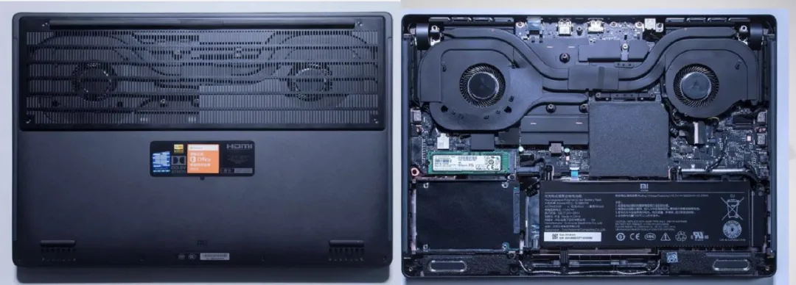

**配置如下:**

- 1080P 72% NTSC IPS 屏幕
- i5 四核八线程
- 英特尔 UHD630 核心显卡
- 8G DDR3 内存
- 256G 固态
- MAC OS Catalina 10.15.7 系统

**优点**

苹果的工业设计我是认得的,行业领跑者,这款电脑外观设计也非常好看,非常轻薄,尤其内部做工,没有比这更优秀的了,每一个设计细节都完美地切合了强迫症福利。包括 Mac OS 的生产力加持,MacBook Pro 的优点有目共睹。

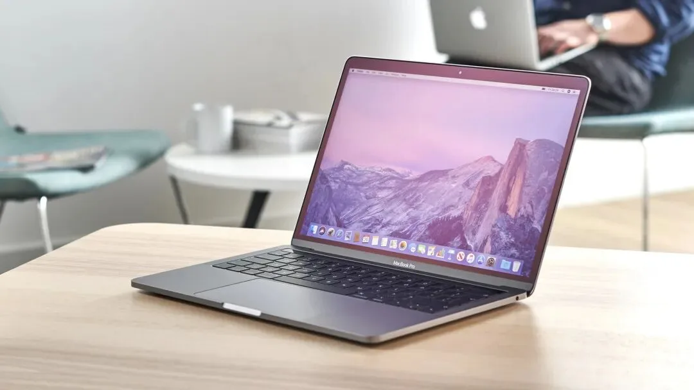

**缺点**

这款电脑对于轻办公的人也许比较合适,但对于中度或者性能要求高的人来说,实在是有点不足了。上面拆解图是高配版 MacBook Pro,我所用的版本是丐版的机器。区别于高配版,**丐版的散热缩水**,只有**单风扇**。由于本身单热管,机身轻薄散热差,再加上 Intel 的高能耗比,在机器长时间运行下,键盘表面和 D 面会非常热,甚至"可以煎鸡蛋了"。

第二,区别于高配版的 2.3GHz 频率,丐版的基础频率只有 1.4GHz,性能上弱了不少。

第三,Touch Bar,由于散热缺陷导致 C 面核心区域温度高,同时 Touch Bar 的触摸区域也比较热,相比于键盘还能通过键帽隔热,Touch Bar 就一言难尽了,而且一般操作也用不到 Touch Bar,真要说常用也大概只有调节音量和屏幕亮度这两个功能。

第四,蝶式键盘,由于蝶式键盘相比于剪刀式键程更短,因此苹果为了使电脑更加轻薄,一度采用蝶式键盘。但是,太难用了,就像在硬桌板上敲字一样,键盘反馈很差,长时间打字,手还特别累,属实是形式大于功能了。

第五,其只有两个 C 口,扩展性很差,除接一个电源线占用一个口以外,剩下无论是显示器,外接硬盘,U 盘,只能另插扩展坞了。

第六,必须说的是,苹果在内存上真是太吝啬了。起步 8G 运存和 256G 内存。就算可以使用虚拟内存,但是 8G 不能变成 16G。当我打开多个 Sketch 文件时,经常会提示内存不足,甚至自动关闭,256G 赶上了手机的存储,一些源文件不得不保存在移动硬盘上。

不过总的来说还是很感谢这台电脑,用它完成了许多工作,也是在职业技能成长上的第一个帮手吧。

## 5. MacBook Pro 16 2019

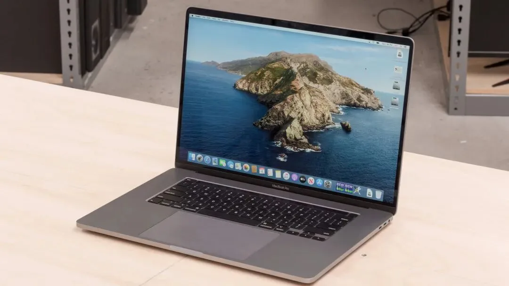

这款是在某东上二手的,使用时间较短,仅仅一个星期左右。但是这并不妨碍我对这款 M 系列前的最后一代 Intel MacBook Pro 16 的体验印象深刻了。

**配置如下:**

- 3,072 × 1,920 分辨率 LED 屏幕,最大亮度 500nits
- i9-9980H,八核十六线程,基础频率 2.3GHz
- 内存 16GB,DDR4,2666MHz
- 核显 UHD630,独显 AMD 5500M Pro,4GB
- 存储 1T 固态
- MAC OS Catalina 10.15.7 系统
- 4 个雷电 3 接口

**优点**

首先外观是真的好看,16 寸加上银白配色,采用一贯的弧边设计,整体上看就是一件工艺品。

其次,音响外放效果很好,16 寸音响单元相比于 13 寸大得多,外放效果也好很多。

在 MacBook Pro 2019 16 寸上,苹果回归了剪刀脚键盘,手感比 13.3 寸的蝶式键盘好很多。

**缺点**

由于是二手的,我查了序列号,这台电脑是官翻机二手销售的,在使用 Sketch 中按 Control C 复制颜色样式时,电脑重启总共出现三次五国语言问题,最后是充电 C 口充电失效情况下,赶紧趁着无理由退换给退了电脑。

传统单热管压 i9 的操作,这款电脑也会发热,其次在安装软件时候,风扇也比较响。

由于独显的问题,电脑睡眠启动的时候会闪一下屏幕。当时去查了网上的解释,说是独显切换导致的,好像是苹果忽略的一个问题吧。

---

以上就是从大学到现在用过的笔记本和正在使用的 M1 Pro 的盘点了。上学时有多想要一台游戏本,现在就多不喜欢游戏本,原因无他,太重了。还是喜欢精于工业设计的笔记本,或者更轻薄的,如果说 Windows 阵营笔记本的话,大概会更喜欢戴尔 XPS、惠普 ENVY、LG gram 这三个系列吧。

以上是一个普通人看待笔记本的视角,可能对于有钱人来说,直接上顶配,毕竟对于电子产品来说,好的不一定贵,贵的一定好。但是,对于普通人来说,在当前阶段内,选择合适的可能才是最好的。

每个人的成长经历、见闻不同,或许都有一套自己对事物评判的标准,而如何使标准更客观合理,就需要去研究、探索……不管何种方式,都是为了更好地认识世界。
