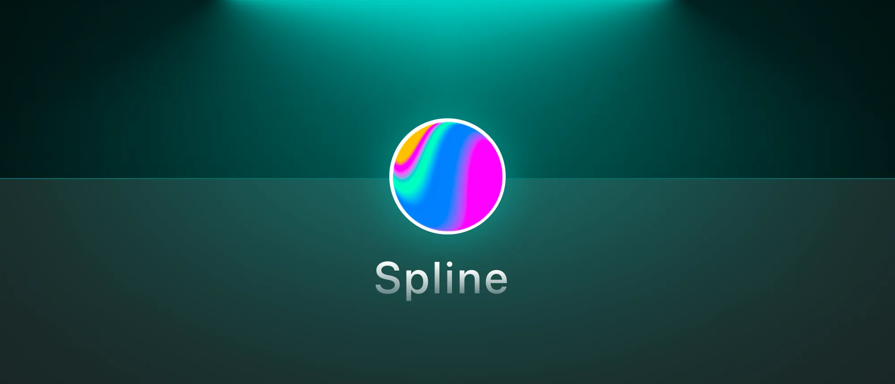

我们知道 3D 软件有很多种,就我知道和接触过的,Rhinoceros,Cero,Alias,Catia,Solidworks,3D max,Maya,C4D,Blender,Sketch up。这些建模软件在工业、影视动画或者建筑装修领域被广泛应用。

在 UI 设计中,不会用到很复杂的 3D 样式,一般是被应用在图标和装饰上,最大也不过是场景 3D,因此更偏向于影视动画软件领域,被人们所熟知的应该就是 C4D 了,不过由于 Blender 的开源属性,近年来大有崛起趋势。

不过这次介绍的是一个超轻量化软件 Spline,相比于上面软件复杂的界面和高昂的学习成本,Spline 界面和功能却相当简单,当然由于功能轻量化所以其可以做的事情范围有限。不过对于 UI 领域来说值得一试。

### 3D 建模

通常,3D 建模通常可以分为两大主要类别:多边形网格建模(Polygon Modeling)和 NURBS 建模(Non-Uniform Rational B-Spline Modeling)。

**多边形网格建模**

多边形建模对象一般由 Vertex(点)、Edge(边)、Face(面)、Element(整体元素-体)构成。两点连成一条边,三条边构成一个面,2 个面构成一个多边形,多个多边形构成一个实体,这是多边形建模的基础原理。

多边形网格建模中一个重要的概念就是:网格拓扑(Topology),其描述三维模型的顶点、边和面片之间的关系和连接方式。网格拓扑决定了模型的形状、结构和变形方式,对于模型的外观、动画和渲染效果具有重要影响。

由于创建和编辑多边形模型需要较少的计算资源,并且其网格拓扑的特性也决定了其进行修改更加灵活,因此被广泛应用于游戏动画影视领域。

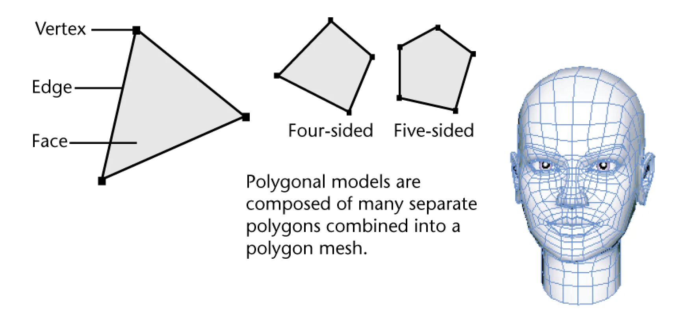

**NURBS 建模**

NURBS 翻译成汉语叫做非均匀有理样条,NURBS 建模又称为曲面建模,是专门做曲面物体的一种造型方法。

NURBS 建模由点组成曲线,曲线组成曲面,再有曲面创建曲面从而组成模型。与多边形网格建模不同,NURBS 建模是由控制点控制模型的变化。NURBS 具有高精度和数学准确性,可以实现 G1、G2 和 G3 甚至更高的曲率连续性,因此能够创造出非常光滑且连续的曲面,非常适用于产品制造中,因此被广泛应用于工业设计和制造领域。

NURBS 曲面的数学表示相对复杂,需要更多的计算资源和存储空间,另外由于控制点并不利于模型的频繁变更修改,因此 NURBS 特点决定了其适合在工业设计产品创意领域。

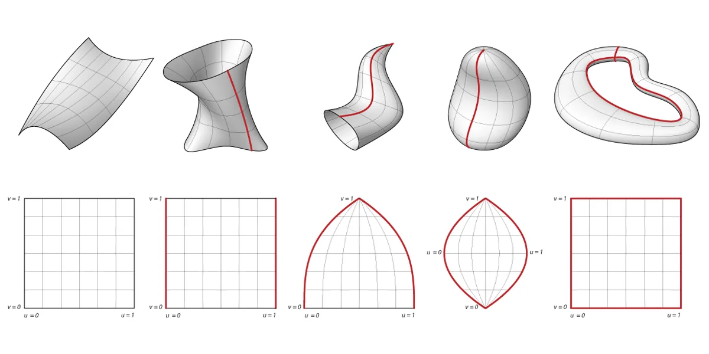

### 2. 打光

建好模型了就准备开始渲染了,渲染前一个最重要的部分就是打光。

#### 2.1 光度

光度简单来讲就是光的强度,我们在摄影中经常会听见曝光过度或者曝光不足的情况,在渲染中,也同样存在这样的情况。

在渲染中有一个说法:当材质的本身颜色,与渲染呈现的颜色一致时,就是比较合适的光强。

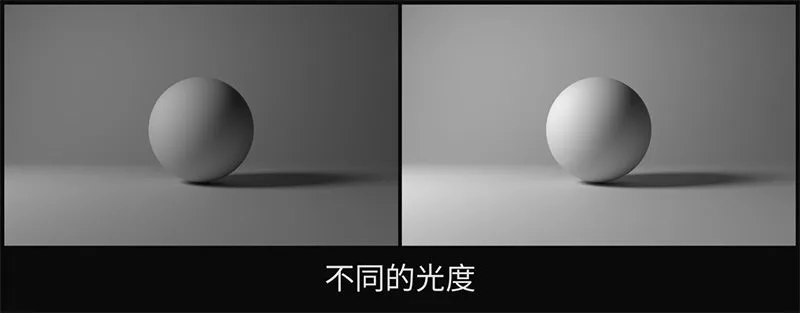

#### 2.2 光位

光位即光源相对于物体的位置,一般有正面光、前侧光、侧光、后测光、逆光、上面光和下面光七种。不同光照对物体外观显示又着不同影响。

在布光中有一个著名的法则叫做【三点布光理论】,是由三盏灯光,分别为主光(key light),辅助光(fill light)和背景光(back light)。

- 主光(key light)是建立照明方案所围绕的光源。它通常是电影场景或拍摄外景地主要照明的提供者,其他灯具(强度和属性)都需"调节"到主光源之下。主光灯可以放在被摄主体周围的任何地方,不过通常是放在摄影机镜头轴线 45°(纵向和横向)位置并处于人的头部以上的高度。
- 辅助光(fill light)是一种用于控制反差的光源。这种光的作用是"填充"往往是由明亮的主光造成的阴影。辅光灯的物理位置通常是在摄影机镜头轴线的 45°(横向),主光灯的相反方向。
- 背景光(back light)是在被摄主体的背后勾勒出轮廓或做出光环效果的光。由于它位于被摄主体的后面(在电影布景中处于摄影机镜头的反方向),提供光线来"勾勒"被摄主体的轮廓,所以背景光用于把物体从背景中分离出来,并在电影画面中增加深度的错觉。

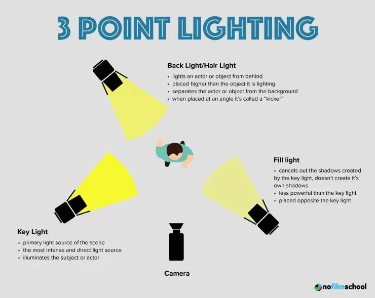

#### 2.3 光源

一般光源在渲染中有 点光源、平行光、聚光灯,分别模拟室内室外的灯光。此外灯光还有硬光和软光,硬光拥有聚的性质,呈现一种方向性,阴影清晰,软光则有散的性质,效果柔和,阴影较虚。在一般渲染中采用软光,在特定场景中采用硬光。

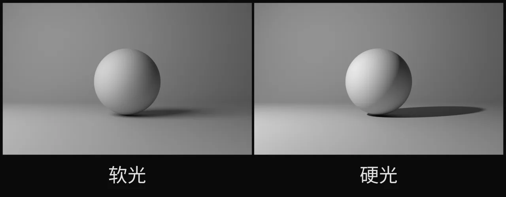

### 3. 渲染

#### 3.1 材质

准备好灯光之后,我们就要对白膜进行材质选取了,在上学时是使用 Keyshot 进行渲染,里面有很方便的材质球,一般都是直接选取材质球然后调整好角度和场景就渲染出图,很少有理解材质的具体内容。而在 Spline 中,材质球是很少的,要想调节出较好的效果,需要自己调整参数得到想要的材质。

首先我们先了解三个概念,材质(Material)、纹理(Texture)和贴图(Texture Map)这几个概念。

- **材质(Material)**:材质是描述物体外观和光照反应的属性集合。它包括了物体的颜色、反射率、折射率、光泽度、粗糙度等信息,用于模拟物体在不同光照条件下的视觉特性。材质定义了物体在光照下如何反应,例如金属会有镜面反射,木材会有漫反射等。材质并不包含具体的图案或纹理,而是描述了物体的物理特性。
- **纹理(Texture)**:纹理是应用在物体表面的图案或图像,以增强外观和细节。它可以包括颜色、图案、纹理、细节等,用于模拟物体表面的细节、花纹、图案等效果。纹理可以用于模拟木纹、砖石、皮肤等物体的表面外观。纹理可以是二维图像,也可以是其他形式的数据。
- **贴图(Texture Map)**:贴图是将纹理应用到物体表面的过程。贴图将纹理通过 UV 坐标映射到物体的几何表面,使得纹理可以沿着物体的表面进行变形和投影。

总的来说,材质描述了物体的物理属性和外观特性,纹理是应用在物体表面的图案或图像,而贴图是将纹理应用到物体表面的过程。在渲染过程中,这三者一起协作,以实现各种不同的视觉效果,从而产生逼真的图像或动画。

这正了我们一直以来的概念,材质的属性,一直以来,在 keyshot 中,材质球其实是包含【材质 Material】和【贴图 Texture map】的。

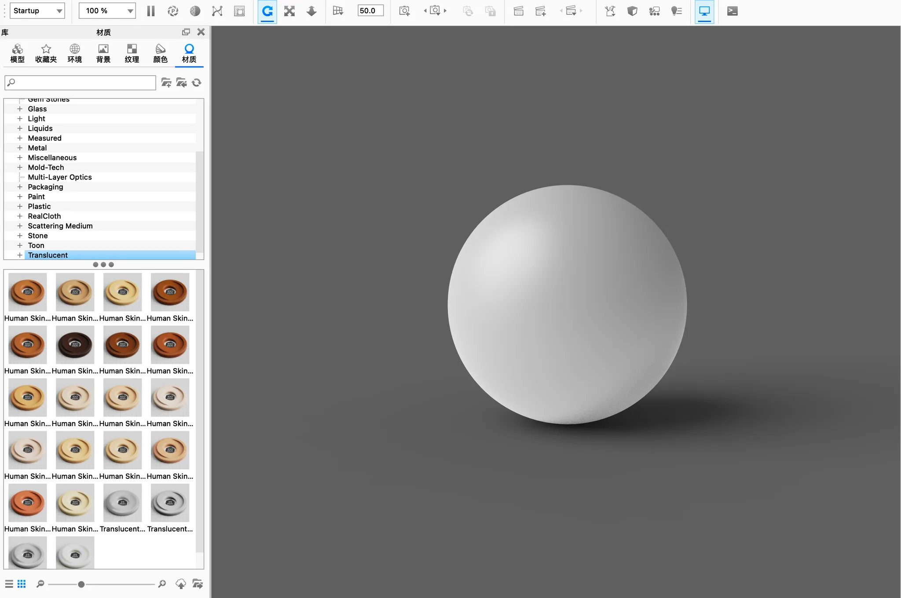

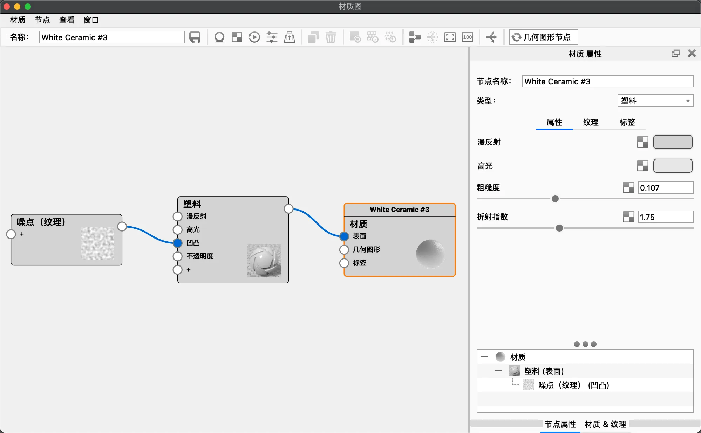

#### 3.2 材质

我们从上面已经知道了材质的定义了。在现实中,一个物体能被我们看到,是因为发生了漫反射、镜面反射以及透射和折射现象。

目前,主流渲染软件中的材质着色器设置通常是以 PBR(Physically Based Rendering,物理渲染)规范为基础的。PBR 是一种渲染方法,旨在模拟物理光线与材质相互作用的过程,以获得更加逼真和真实的渲染结果。PBR 规范包括了一系列的物理属性和参数,用于描述材质的外观、反射性质和光照反应。

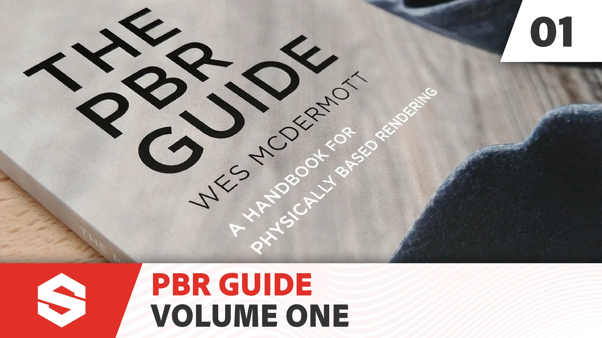

主流渲染软件中的 PBR 材质着色器通常会包括以下参数和属性:

- 基础颜色(Albedo/Color):描述物体表面的基础颜色。
- 金属度(Metallic):控制物体是否为金属,以及金属的程度。
- 粗糙度(Roughness):描述物体表面的粗糙程度,影响光线的散射。
- 高光(Specular):控制物体表面的高光反射强度。
- 法线贴图(Normal Map):用于增加物体表面的细节和凹凸感。
- 环境光遮蔽(Ambient Occlusion):描述光线在物体表面的凹凸部分的遮蔽效应。
- 透明度(Opacity):描述物体的透明度。
- 折射率(Index of Refraction):描述物体的折射率,影响透明材质的折射效果。
- 发光(Emission):控制物体的自发光效果。

PBR 规范的设置使得渲染软件能够更加准确地模拟不同类型的材质,如金属、塑料、玻璃、皮肤等,在不同光照条件下产生更真实的视觉效果。这种基于物理规范的设置方法有助于艺术家和设计师更轻松地创建逼真的渲染结果。

到这里,我们终于把这些原理性东西讲完了,下面就可以进行 Spline 的学习了。

### Spline 的特性

spline 是采用 2D 的方式来进行 3D 设计

一般的 3d 软件是建好模型后进行渲染,而 Spline 没有渲染的说法,更像是和 Sketch / Figma 一样坐好模型后直接添加样式。

我们知道,一个物体,要想能被看到,除了光源本身发光外,就需要反射出光线才能被看到。抛开光源本身来说,一个物体,除了反射光源外,还受到其他环境光的影响,因此才呈现出了自然状态下的物体外观样式。

举一个最简单的例子,如图,白色球体除了受到太阳光照射之外,还受到天空散射的太阳光的蓝光照射,此外还受到旁边物体反射的绿色光影响,因此在自然环境中,一个物体受光情况是非常复杂的。

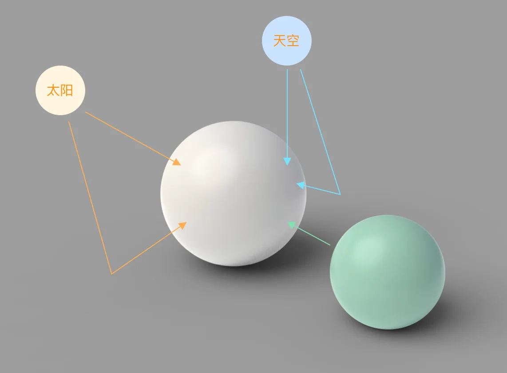

然而在 Spline 中,其反射的光线只有光源的光线,一个物体并不会受到其旁边物体反射光的影响。这是因为其作为一个轻量化软件,没有复杂的物理引擎,因此其更适用于 UI 设计或者动画设计(对现实仿真要求没有那么高的场景)。下图可以看到,除了光源的反射和阴影的遮挡外,物体之间并没有相互影响。

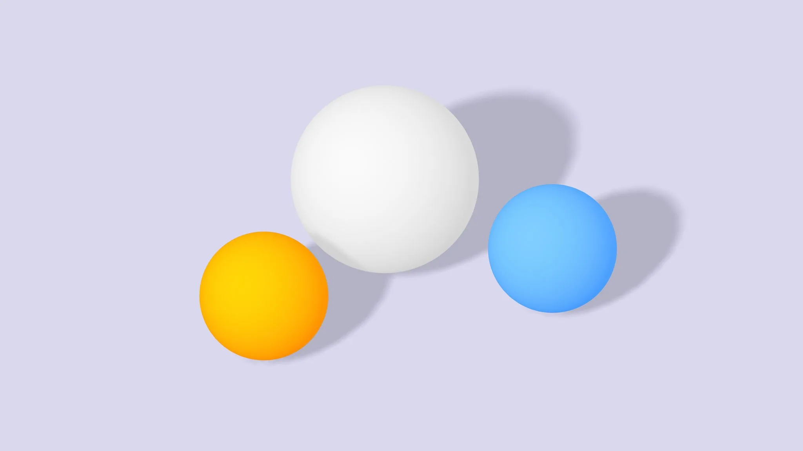

Spline 基于浏览器运行,因此具有协作性(这个类比 Figma 就可以理解了),可进行交互式 3D 设计(可建立交互动作,通过 URL 等方式实现 3D 交互操作)。

### 2. 界面

spline 界面非常简单,简直不像我们平时见过的任何 3D 软件,图层区、建模区、参数设置区、视图切换区以及主界面,很像 sketch 布局。由于其定位轻量化,因此对新手来说上手非常友好。

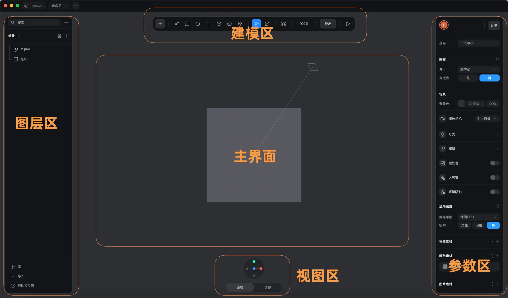

### 3. 具体操作

在 spline 的 Youtube 有很多学习视频,并且在跟随软件不断更新,此外对于国内用户而言,Spline 中文社区也基本上非常详细地介绍了每个功能。

但是,官方的文档是比较琐碎和复杂的,我按照个人的理解,加上自己的实践,总结了下面的关于 Spline 的操作。

#### 3.1 建模

首先,spline 采用的是多边形建模,因此类比于 Blender 的简化版。如果是使用 NURBS 建模的同学,那可能需要简单了解一下网格建模技巧了。

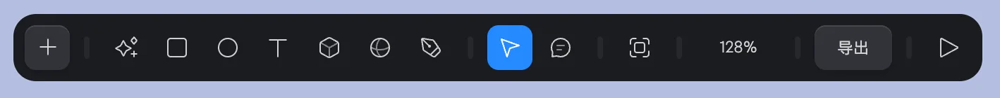

最左侧按钮是所有建模的集合,包含平面,网格以及文本、路径等功能,以及所有灯光;

中间部分是选取了常用的功能,包括平面、圆、立方体、球以及文本和钢笔工具;

在最右侧部分,是页面的一些缩放状态和【预览】【导出】两大功能。

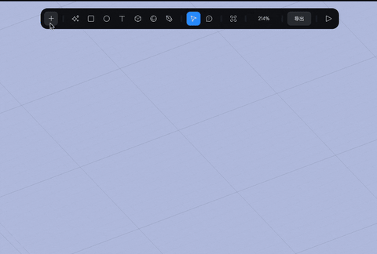

不同于其他软件,spline 建模需要注意一点,以下图为例

左侧模型是由平面挤出,右侧是直接使用立方体和圆柱体。在很多软件中,这两种方法做出的模型是一样的,但在 Spline 中,左侧模型不可进行网格细分,而右侧才可以进行网格细分。

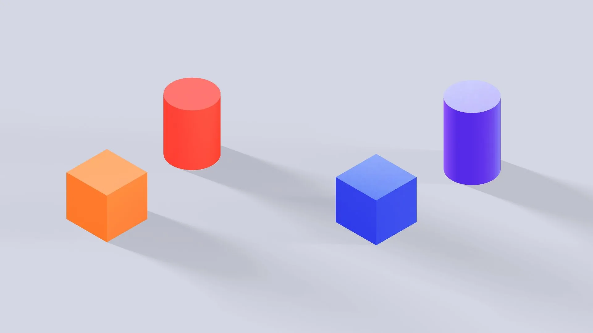

在 Spline 中,挤出模型类似于矢量图形的空间投射,改变矢量图形形状,模型也会跟着改变

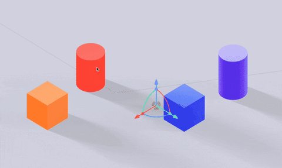

对于网格模型,点击操作区的【编辑网格】按钮后就进入网格编辑页面,此时建模区的工具栏变为网格编辑操作,包括三大部分:

- 点、线和面的选择和编辑
- 挤出、内插面、环切等常用网格编辑操作
- 雕刻以及网格操作参数设置

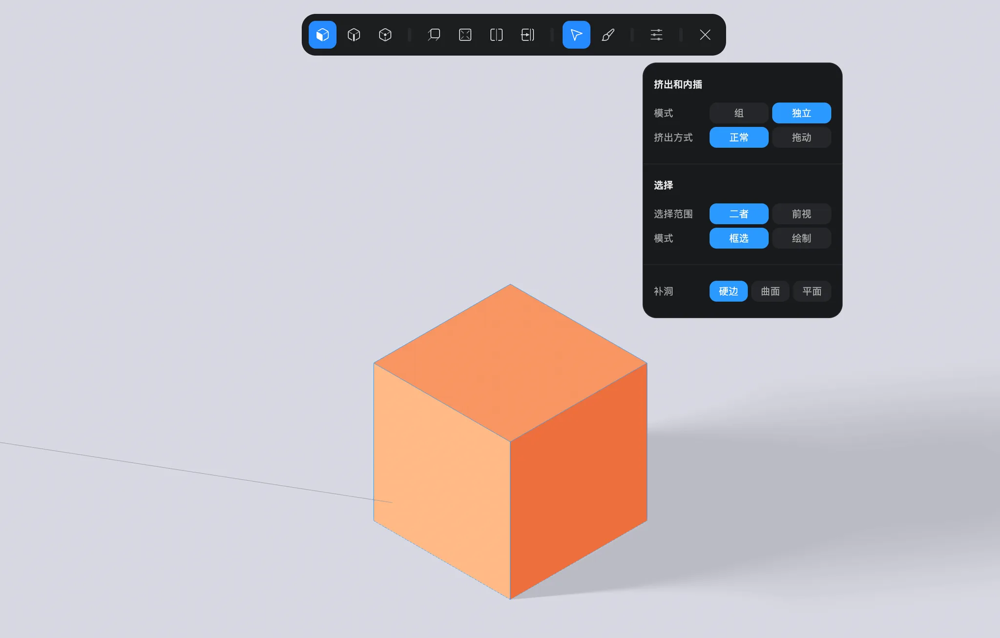

#### 3.2 材质

在 Spline 中建立模型后会有默认材质状态,如下图

其中,灯光是不可删除的元素,灯光的参数大小代表了模型的立体化程度。灯光为零,模型就变成了二维平面,灯光参数越大,模型的立体性越明显。

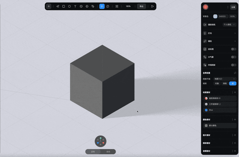

**— 灯光**

灯光一共有四种光照模型,分别是:

- 漫反射 Lambert,模拟【混凝土,沙子】这类具有粗糙表面的材质
- 透光 Phong,添加了一定的镜面反射,例如【塑料、皮肤】等这类材质,透光适合半透明和玻璃材质模拟
- 物理 Physical,镜面反射更强,通常用于模拟【金属、陶瓷】这类材质
- 卡通 Toon,用于模拟卡通化的材质场景

一般透光 Phong 使用最多,应用在模型中效果最好。此外,每个灯光还有调节参数,一般保持默认即可。

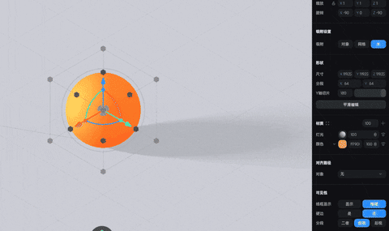

**— 颜色**

颜色即材质本身的颜色,我们以颜色举例,点击可以看到,里面有许多的样式可以选择。我们一个一个来讲。

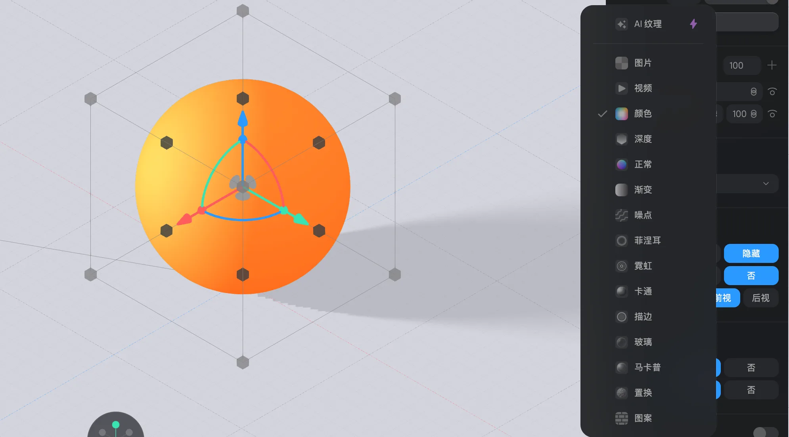

**— 图片**

图片即上面所说的贴图,将纹理通过 UV 坐标映射到物体的几何表面。(使用贴图制作的火星)

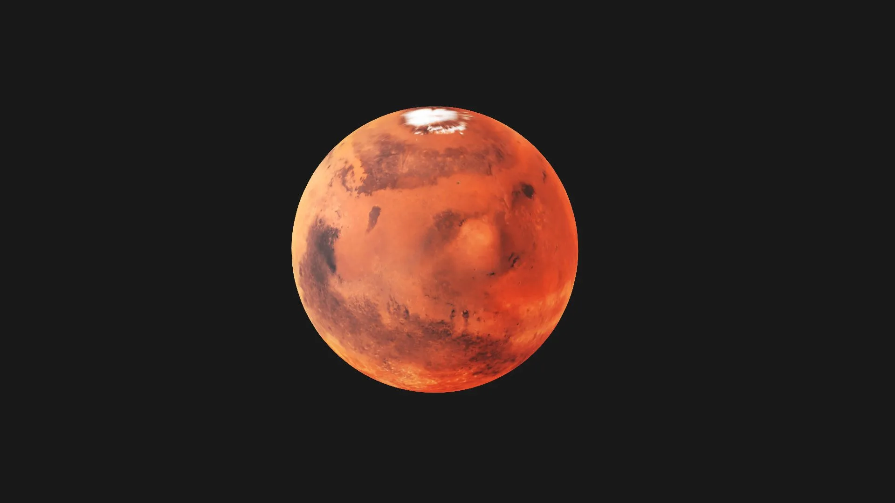

**— 视频**

spline 也可以上传视频,不过需要开通超级版

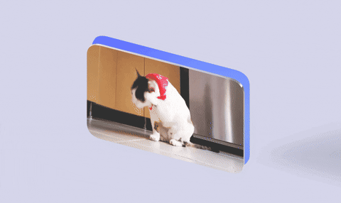

**— 深度和渐变**

渐变和深度其实本质上都是,一个是平面上的渐变,一个是空间上的渐变,在 Spline 中,深度渐变被非常广泛应用,它可以很好地模拟现在流行的有机、玻璃风格(后续在案例中)

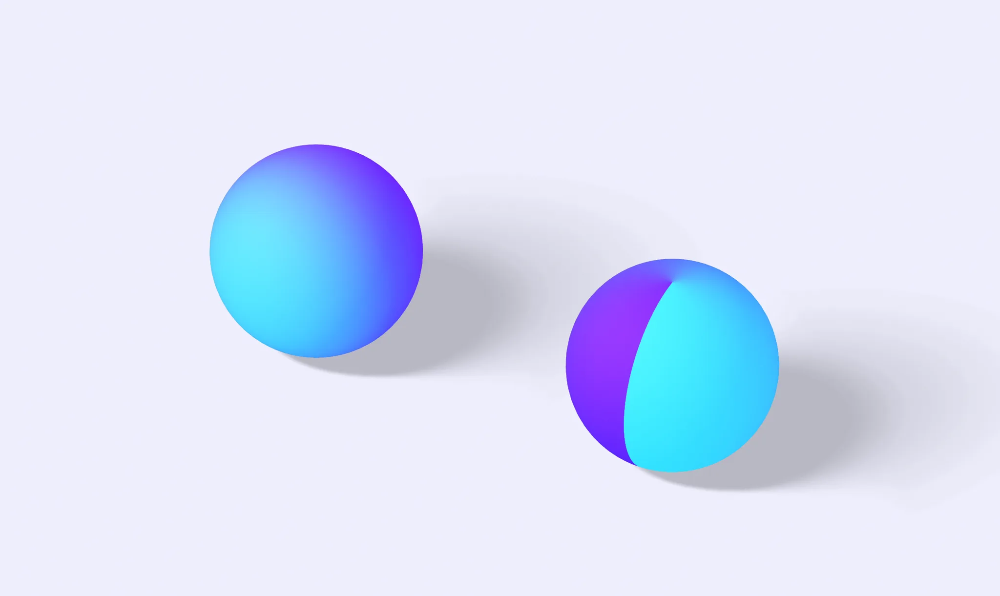

**— 正常(混合模式)**

就是基于 Y(绿色)、X(红色)和 Z(蓝色)的混合,个人暂时没发现怎么使用

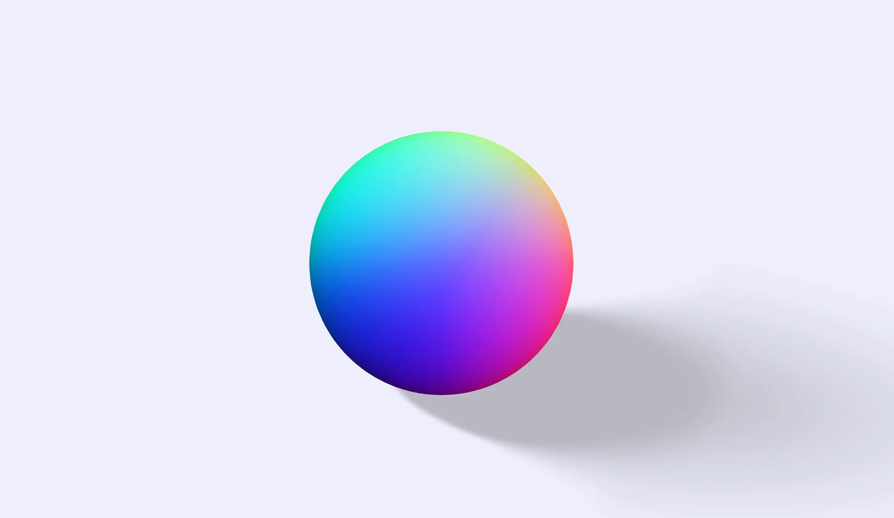

**— 噪点层 Noise**

噪点层,顾名思义,是模拟噪点的图层。说实话,一开始从官方文档上看的是【噪点层是模拟表面有机颜色变化的理想之选】,我以为是模拟有机材料的表面,如下图,有一种有机纹理质感

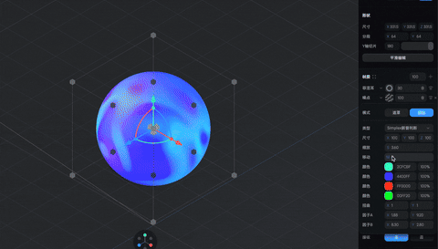

然后去 Chat gpt 上查了里面的参数,发现确实是作为噪点模型:【它们用于生成纹理、噪声、模式和其他视觉效果,以模拟自然的外观和复杂性】,如图,磨砂玻璃上的噪点模拟

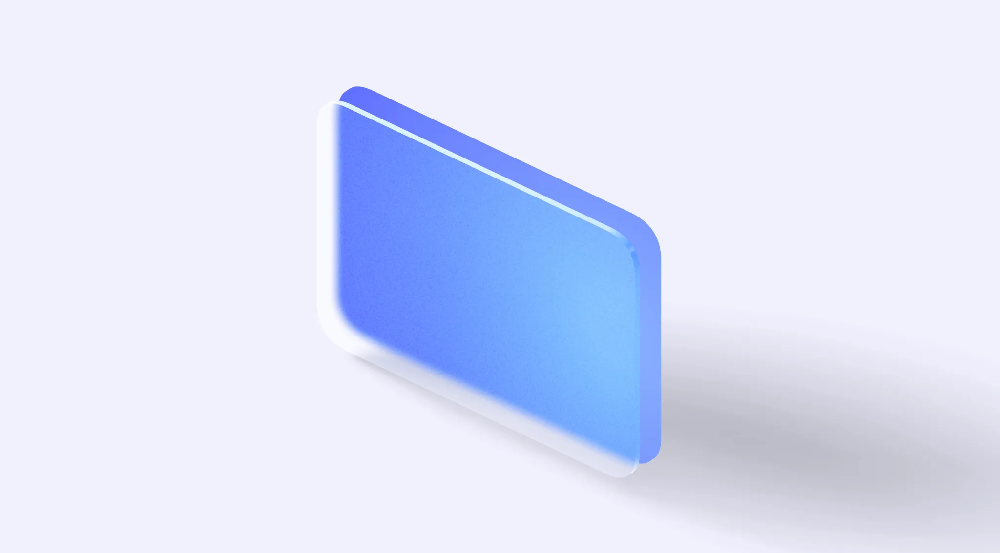

**— 菲涅耳**

菲涅耳效应是 PBR 渲染中一个非常重要的理论,就是视线与物体表面的法线夹角越小,反射越不明显,视线与物体表面的法线夹角越大,反射越明显。

我们平时看水的表面,近处可以看到比较清晰的水底,远处可以看到更明显的天空和远处景色的倒影。

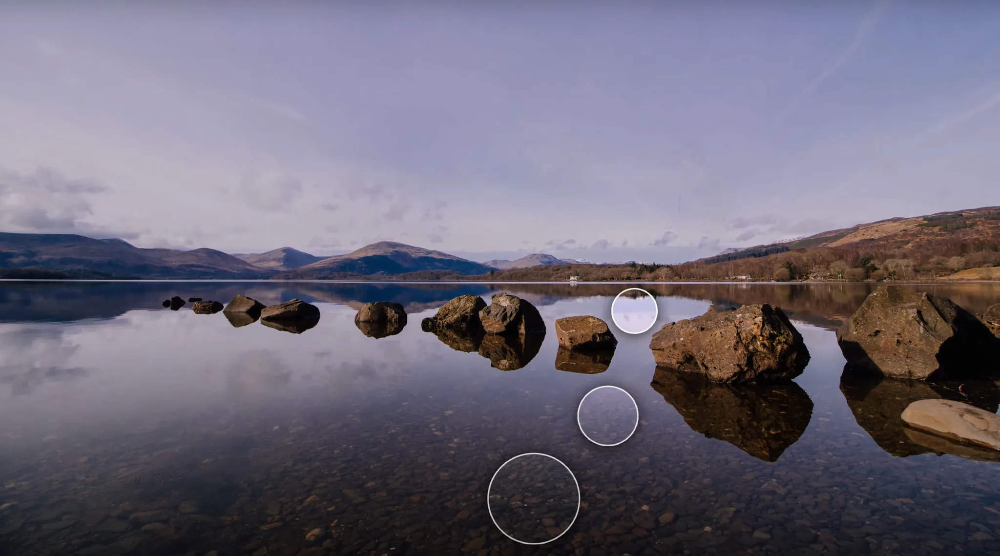

任何材质都有菲涅耳效应,因此在一般的渲染器中,都会选择是否开启菲涅耳参数,而在 Spline 中,将菲涅耳效果作为一个参数,添加在材质的配置中,并且是非物理的,需要自己调节以符合环境。

【光线与物体表面法线角度越小,反射越弱,角度越大,反射越强。任何物体都有菲涅耳效应,但是一般对于金属材料和粗糙材质,菲涅耳效应影响几乎可以忽略。因为金属表面一般发生镜面反射,与入射角度关系不大。粗糙材质表面发生漫反射,因此菲涅耳效应影响也不大。】

所以菲涅耳效应在透明、半透明、塑料这类材质上发生比较明显。由于受菲涅耳效应的影响,物体边缘通常会比中间反射更多的光线。所以边缘常常会表现更亮或者受更多环境光的影响。

左侧是 Spline 的球体,右侧是 Keyshot 中的球体,我在这两个设置了基本上一样的条件,一个平行光源,一个淡灰色的球体,可以看到(仔细对比边缘),左侧没有添加菲涅耳参数,右侧基于 PBR 的渲染引擎自动计算了菲涅耳效应,因此更接近真实的效果。

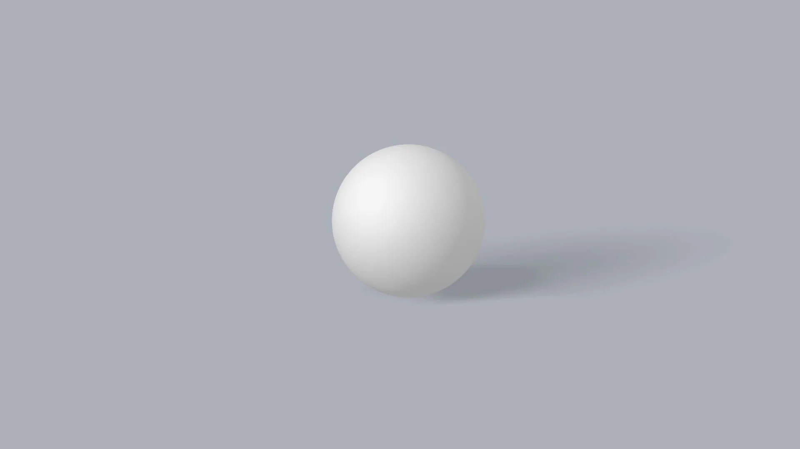

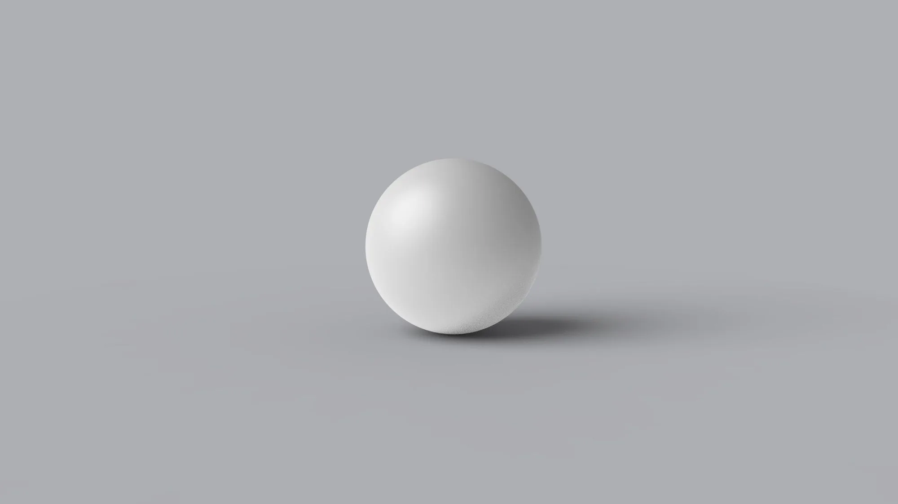

在 Spline 中加入菲涅耳效应,可以看到,效果比原来更通透些了

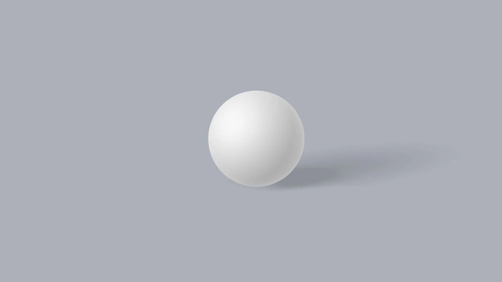

因此我们也可以明白,为什么在 UI 设计中,做轻拟物图标时候,除了遵循素描的明暗变化规则外,还需要给边缘加上白色的内阴影以突出其立体效果。

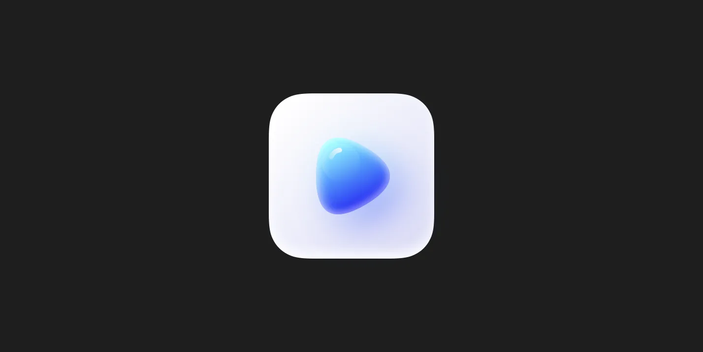

**— 霓虹**

顾名思义,就是模拟霓虹效果,其可以模拟气泡的霓虹效果,或者金属的光影质感

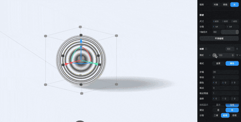

**— 卡通/描边**

卡通和描边模拟模型中的手绘风格,创建 3D 卡通场景

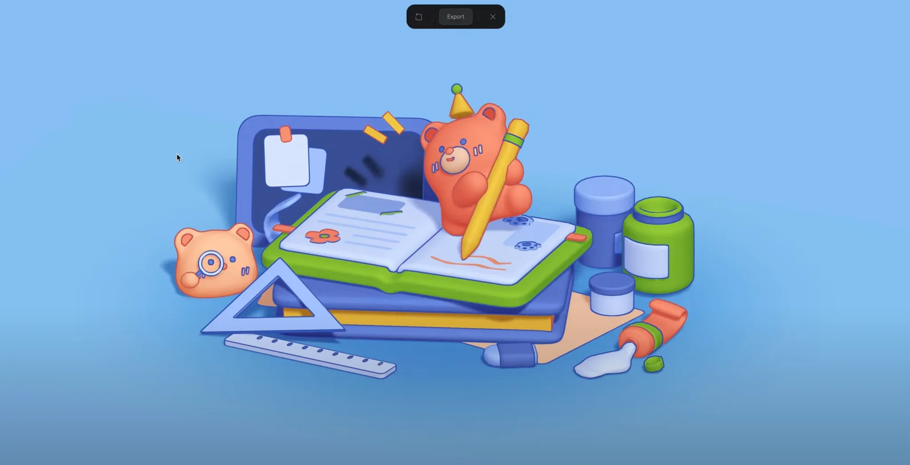

**— 马卡普 MatCap**

马卡普 MatCap 的全称为(Material Capture)是一种用于快速呈现材质和光照效果的渲染技术,说白了,MatCap 就是材质和光照信息的贴图映射。MatCap 不是真实的物理渲染,只是一种伪渲染,不过优点是快速性和简单性,对于要求不高的场景,使用很方便。

因此 MatCap 类似一个具有光照信息的材质。

材质、纹理映射(贴图)、纹理和着色器的关系

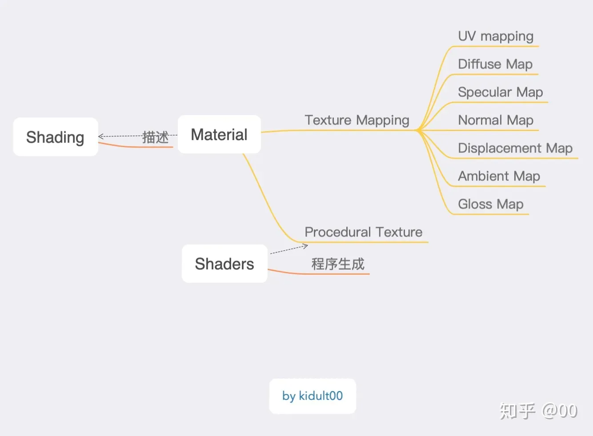

spline 中,没有添加灯光,只添加 MatCap,可以看到此时就是一个光照场景下的材质。Spline 一般不单独使用,一般通过图层混合模式使用

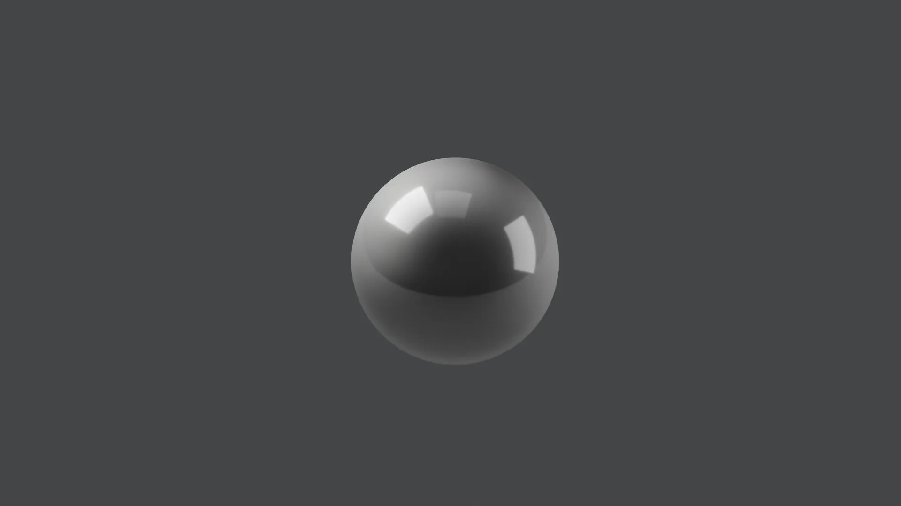

**— 置换**

不同于凹凸贴图和法线贴图,在置换贴图中,每个像素的颜色值不再代表颜色,而是代表该像素在表面上的高度或位移值。(通常,颜色值范围从 0 到 1,0.5 表示表面不发生位移)。通过编码高度信息,从而实际改变物体表面的形状,使其产生凸起和凹陷的效果。

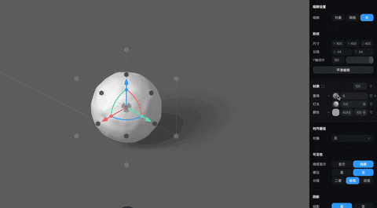

**— 图案**

图案可以生成各种样式,通过图层遮罩实现各种效果

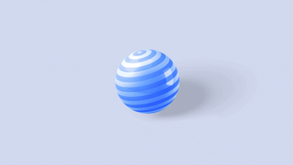

**— 玻璃层**

玻璃可能是 Spline 中使用最多的材质贴图之一了,玻璃材质有三个参数:模糊、厚度和折射率,通过这三个参数的变化,可以模拟不同样式的玻璃。一般玻璃常常会结合菲涅耳贴图和 MatCap 贴图使用,可以制作现在流行的微软 Fluent 风格。

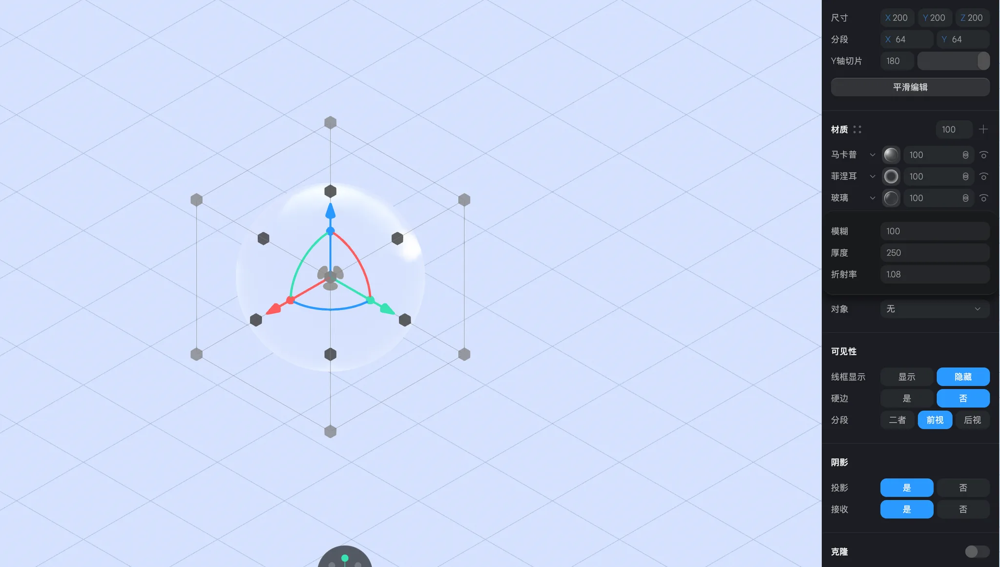

#### 3.3 材质的混合模式

在 Spline 中,图层的混合模式分别有 4 种,分别是【正常、正片叠底、滤色和叠加】

- 叠加模式是效果居中,偏色偏向中间调的一种混合模式;适合中等明度的颜色图层使用
- 正片叠底是效果偏暗,且偏色更偏向于高光的混合模式;适合暗色系的颜色图层使用
- 滤色模式是效果偏亮,且偏色更偏向于暗部的混合模式;适合亮色系 的颜色图层使用

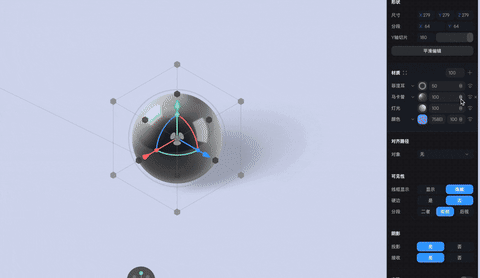

#### 3.4 凹凸贴图和粗糙度贴图以及蒙版

在 spline 灯光选项中,选择透光 Phong 和物理 Physical 过后,会出现凹凸贴图和粗糙度贴图选项。

图层遮罩可以选择性地控制素材中特定区域的可见度或透明度。它包括使用灰度来确定遮罩图层的可见或隐藏部分。越接近白色的部分越可见,越接近黑色的部分越隐藏。

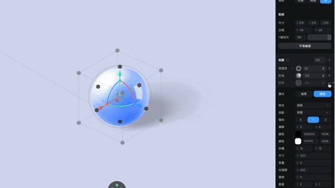

#### 3.5 材质的可见性和阴影

一般在正规 3D 软件中,都会存在多个模式,以 Rhinoceros 为例,最常用到的有框架模式和着色模式,Blender 同理。在 Spline 中,没有将它们作为独立模块,而是放进了可见性中。

- 线框显示即【线框模式】和【着色模式】的切换
- 硬边即【网格】和【光滑】的切换
- 分段即显示物体的那一侧,一般使用默认前侧即可

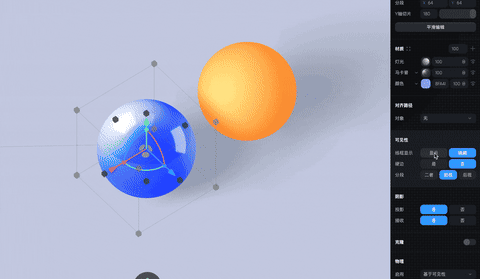

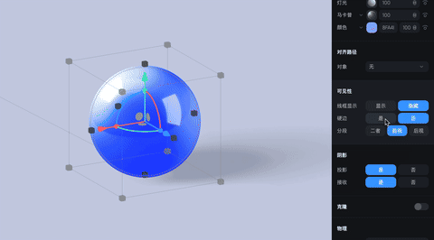

这里的阴影是控制单个物体的阴影显示和是否受其他物体的阴影影响

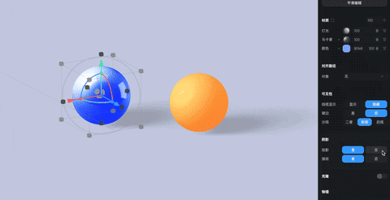

#### 3.6 克隆

Spline 中有一个克隆功能,对于需要大量重复素材的场景是非常有帮助的。

克隆可以以线性、径向、网格和对象克隆,并且可以将克隆后的模型分离实体化。

此外克隆还有一个随机功能,对于随机地图或者场景也很有帮助。

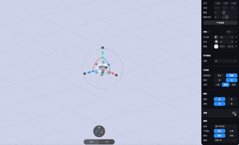

#### 3.7 灯光阴影和环境阴影

除上面单个物体的阴影控制外,对于灯光选项,也有阴影控制。

灯光的阴影开关是控制这个灯光下的阴影效果,不影响其他灯光的阴影效果

下面有两个参数,分别是【模糊】和【柔和】,模糊控制阴影的模糊程度,柔和控制阴影的远近,两个参数配合共同调节才能达到更好的效果。

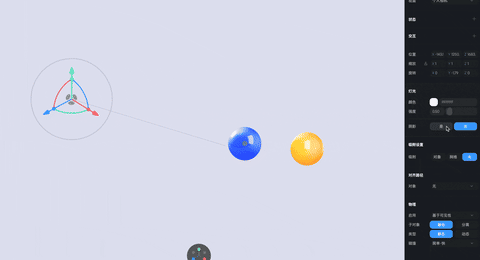

可以看上面阴影,如果是单纯的灯光阴影,物体本身地步感觉缺少了点什么,和地面之间就像没有连接似的,这时候需要【环境阴影】这个参数了。

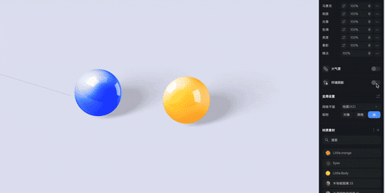

#### 3.8 环境设置

这个参数并不是像其他 3d 一样,对整个环境空间进行设置,而是像特效参数一样,可以给整个视觉添加某种效果。

主要有两大模块,分别是【后处理】【大气雾】。

前者包括【像素、相差、光晕、色调、亮度、晕影、躁点】几个参数

后者主要模仿雾的效果

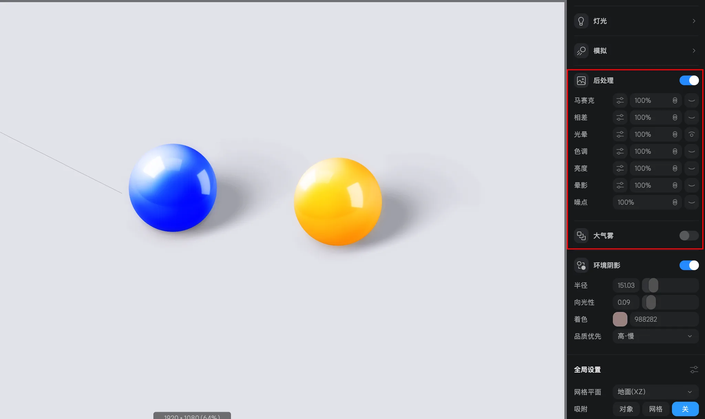

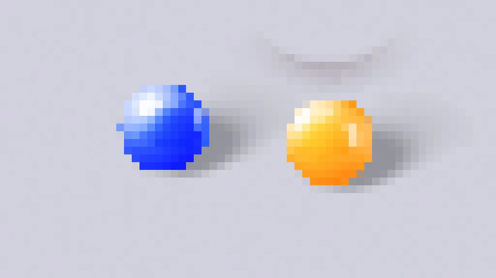

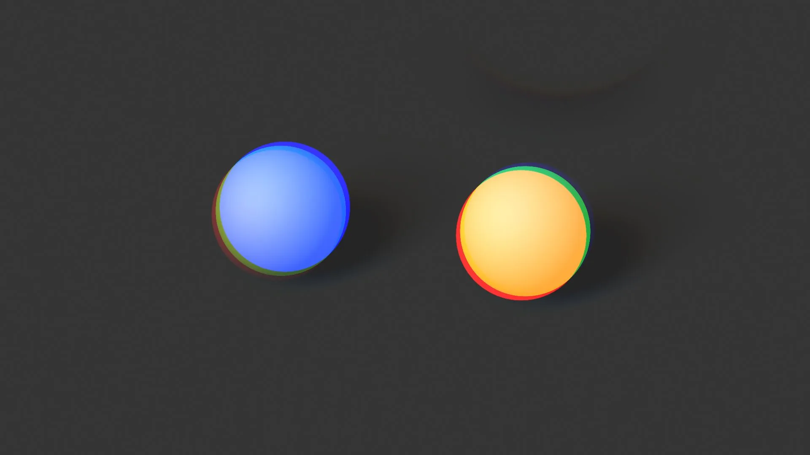

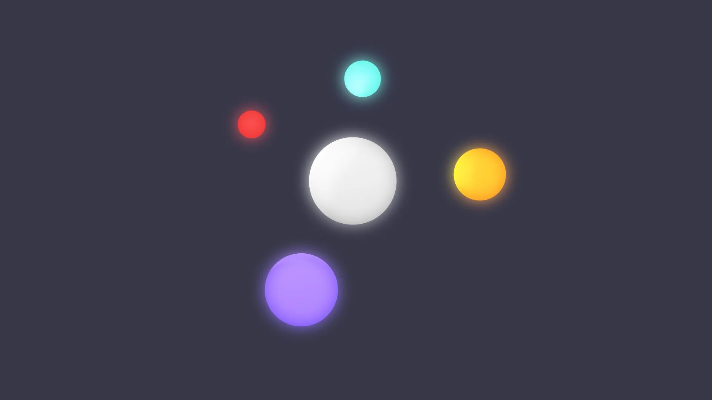

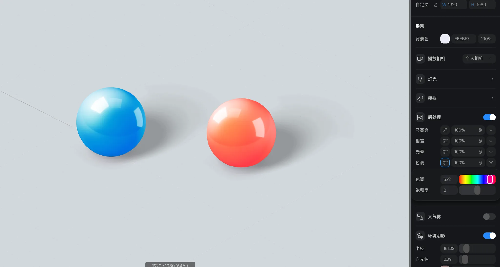

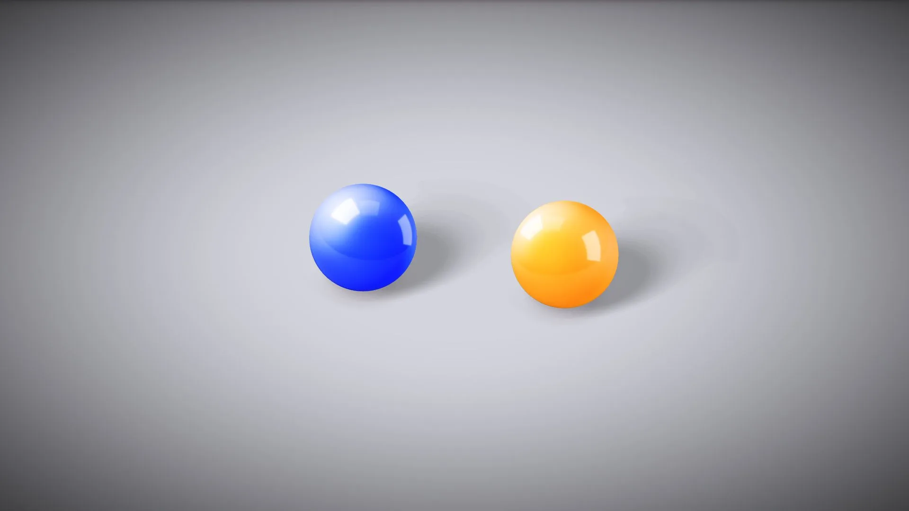

亮度和躁点分别是调节画面亮度和对比度,以及增加噪点效果

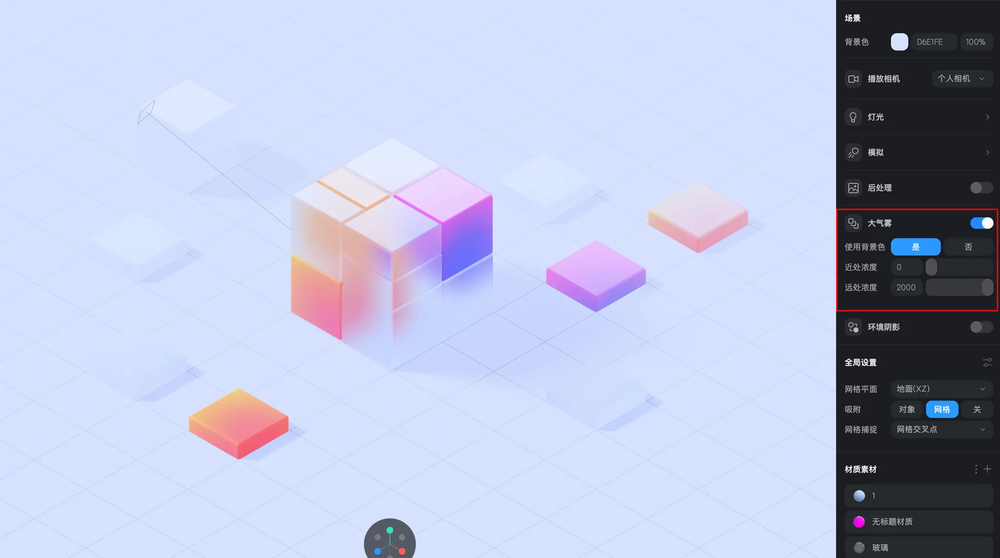

**总结:根据上面的各种参数和环境灯光设置**

工作室照明场景

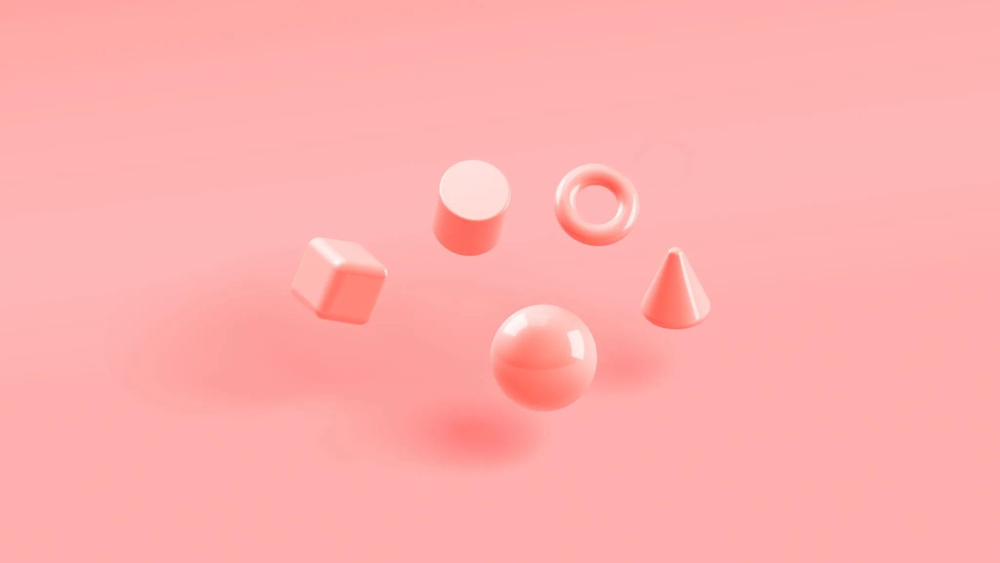

### 4. 3D 交互

spline 中最令人激动的功能就是交互和动画功能了。关于属性都分布在【状态】和【交互】中。

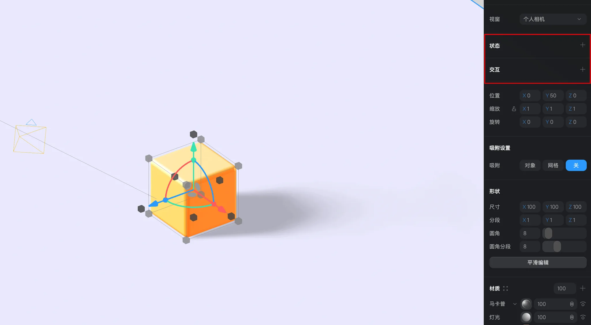

状态,就是动画属性的基础,从状态 1 变为状态 2,spline 官方中列出了目前可以进行状态变化的参数支持

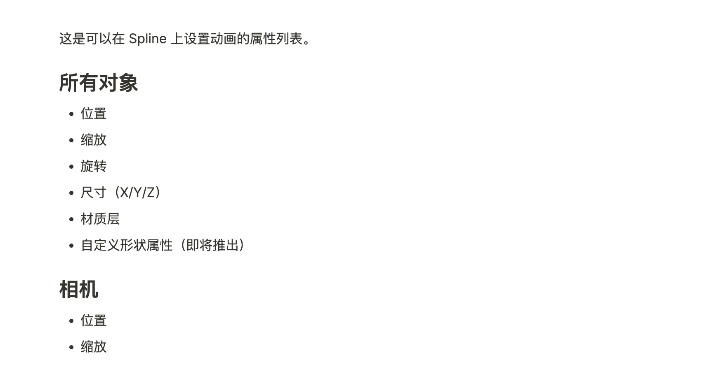

交互这个参数是比较复杂的,内容非常多。

点开交互,可以看到分为两类,分别是【事件】和【动作】,这些功能官方文档讲解的很清晰了,重要的是怎么运用。

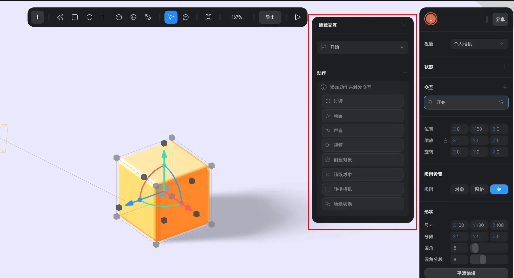

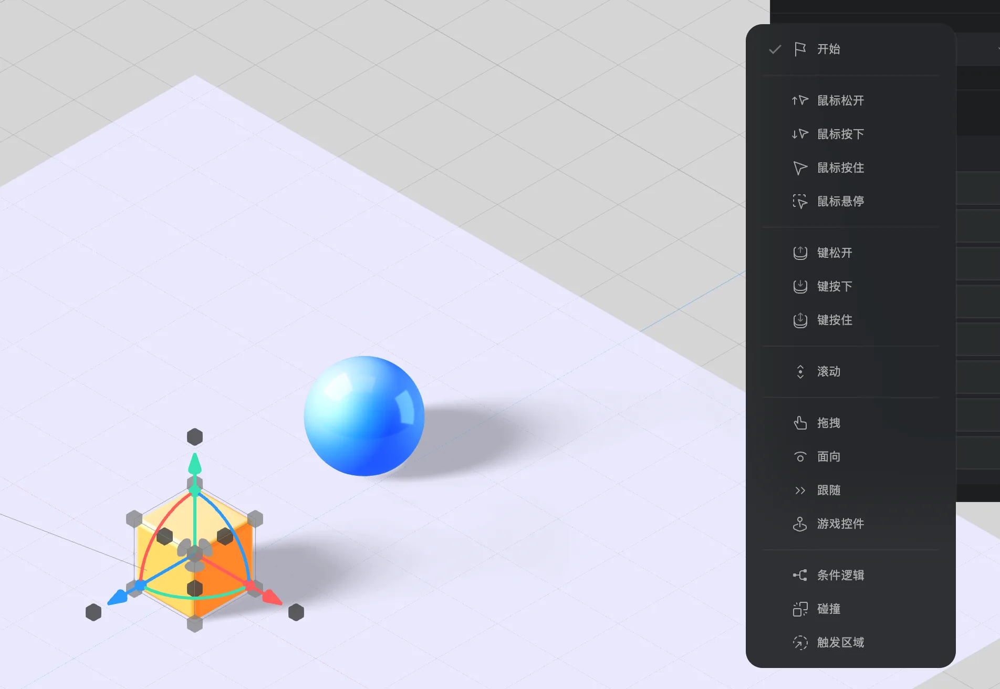

以下是一些常用交互的组合:

#### 1.【旋转】和【循环摆动】

事件:开始 / 动作:过渡 / 动画属性:旋转 / 位置

#### 2.【缩放 / 尺寸】

事件:开始 / 动作:过渡 / 动画属性:缩放 / 尺寸

#### 3.【材质】

事件:开始 / 动作:过渡 / 动画属性:材质变化

#### 4.【相机】

事件:开始 / 动作:过渡 / 动画属性:相机变化

#### 【面向】【跟随】【拖拽】【物理参数】【游戏控件】

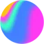

#### 【逻辑交互】

#### 【相机转换】

#### 【场景切换】

#### 【游戏控制】

### 5. 组件功能

Spline 还有 3D 组件的功能,基本上和 Figma 的原理差不多

### 6. 路径

路径可以做多种路径动画。

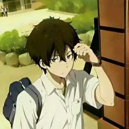

参考:

- [Spline 学习社区](https://cn.spline.design/learning-community)
- [The PBR Guide, Part 1(Substance 3D)](https://docs.substance3d.com/sddoc/the-pbr-guide-part-1-146460217.html)
- [The PBR Guide, Part 2(Substance 3D)](https://docs.substance3d.com/sddoc/the-pbr-guide-part-2-146460219.html)
- [PBR 渲染技术浅谈(知乎)](https://zhuanlan.zhihu.com/p/503369650)
- [《视觉艺术用光》](https://www.cxjdesign.com/?p=3795)
- [噪声与纹理生成(知乎)](https://zhuanlan.zhihu.com/p/572250720)
- [3D 纹理映射(3dstudio)](https://3dstudio.co/3d-texture-mapping/)
- [纹理细节与材质(知乎)](https://zhuanlan.zhihu.com/p/647550128)
