### You have to know the past to understand the present

你必须知道过去才能理解现在

首先我们来熟悉几个概念

- UI:全称 User Interface,即用户界面,用户界面介于人与机器间的维度,它是操作员和设备之间的交互平面
- UI 设计:全称 User Interface Design,用户界面设计是指用户在使用设备时,将设备上的各种元素有意识地组合在一起。用户界面设计的两个主要考虑因素是:最大限度提高可用性(衡量界面的易用性和可学习性)和用户体验(用户与界面交互时的反应)。因为在大多数情况下,这些机器是为人制造的,被人所使用的。
- GUI:全称 Graphical User Interface,即图形用户界面(其实我们所做的 UI 设计全称应该被称为 GUI),GUI 允许用户通过二次交互与计算机进行互动,例如图标和输入框,而不是学习 Command-line Interfaces 命令行界面,这才为更多普通人提供了更简单实用学习计算机的机会。
- HCI:全称 Human-computer Interaction,即人机交互,它将计算机作为一种复杂工具和其他简单工具区分开来,例如斧子或钳子,大多数情况下简单工具只有一个预期功能,而任何计算机互动式,会进行多功能交流对话。
- HF&E:全称 Human Factors and Ergonomics,即人机工程学,它更侧重于产品或系统的设计,以及使用这些产品和系统的人,人机工程学试图改善人类福祉和整体系统性能。这个概念非常重要,因为在今天社会,计算机或者设备更容易被视为人体的延伸。

无论是通过艺术还是社会,每一次新的发展都是对前一次运动的回应。计算能力的自然扩展也不例外。

#### 1760–1869:第一次工业革命

在 19 世纪下半叶,许多欧美国家经历了一次重大工业革命,大规模生产系统在英国、西欧和美国东北部得到了发展。铁路系统、蒸汽船、公路的引入,为社会带来了新的互联互通方式,从而发展出更快、更高效的通信模式。铁路建设催生了电报,电报又催生了第一部电话。这些都是 Stephen Kern 所描述的"距离的毁灭"的第一个突出例子。

#### 1870–1914:第二次工业革命

第二次工业革命是一个极端的时期:在电气化,机械化方面取得了重大发展,工业机械化程度的提高,提高了工厂的生产率,社会生产出巨大的财富、带来新的机遇和工业生产标准化。但是与此同时,普通工人工作条件恶劣,工资微薄,社会财富差距巨大。但为了谋生,技术技能变得至关重要。

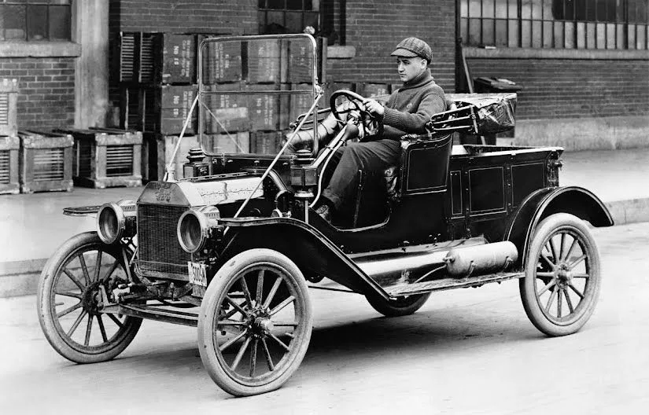

#### 1911:泰勒主义

20 世纪初,随着工厂劳工兴起,Frederick Taylor 提出一套思想,后被称为"泰勒主义",其中包括了他对组织领导里的四大标准:

- 为每位工人的工作要素制定一套科学的方法,取代过去的经验法则
- 科学选择工人,然后对其进行培训,教导,取代过去工人自我培训
- 与工人合作,确保所有工作都是按照科学原则进行
- 管理层接管比工人个合适的工作,取代过去几乎所有工作和大部分责任由工人承担

泰勒的意图是简化工厂机构的运作,提高工人的生产率。泰罗的科学管理思想在当时历史条件下是具有伟大的进步意义的。然而,将人比做无情的机器,或者将劳动者机器化,导致人们渴望先进的技术帮助提升工人的地位。

#### 1945:Vannevar Bush 的文章《我们可以这样想》

1945 年,Vannevar Bush 在《我们可能想到的》一文中总结了自己对未来科技的看法。在此之前,大多数科学家都专注于改进于战争有关的技术,战争即将结束,因此他开始萌生这样的想法:科技不仅要推动人类的体力,更要推动人类的心智发展。

在文章中,布什提到了摄影、信息的组织和存储、信息的传播、电视、声音合成器等话题,但其中最引人注目的是关于 Memex 的思考:

> 考虑一下未来个人使用的设备,这是一种机械化的个人文件档案和图书馆,它需要一个名字,随便起一个,"memex"就可以了。

Memex 是一个可以存储个人的所有数据、记录和通讯的设备,而且它是机械化的,可以以超乎寻常的速度和灵活性进行查阅,这是对人记忆的扩大和补充。这种说法是对个人计算机原型的第一个书面描述。

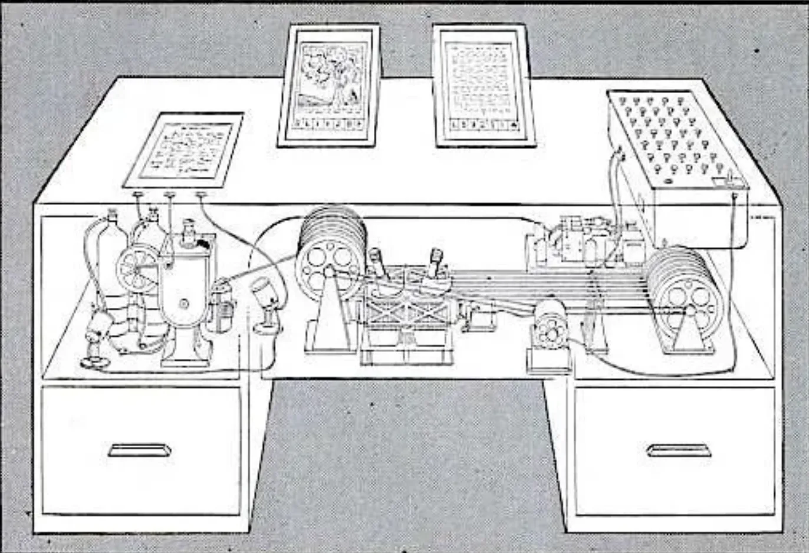

#### 1945–1959:ENIAC 第一台通用计算机

1946 年在美国宾夕法尼亚大学诞生的埃尼阿克(ENIAC)是世界上第一台通用计算机(这个在小学微机课),埃尼阿克占地面积约 170 平方米,重达 30 吨的庞然大物,造价不菲,每秒可以进行 5000 次运算,从此开启了计算机时代。

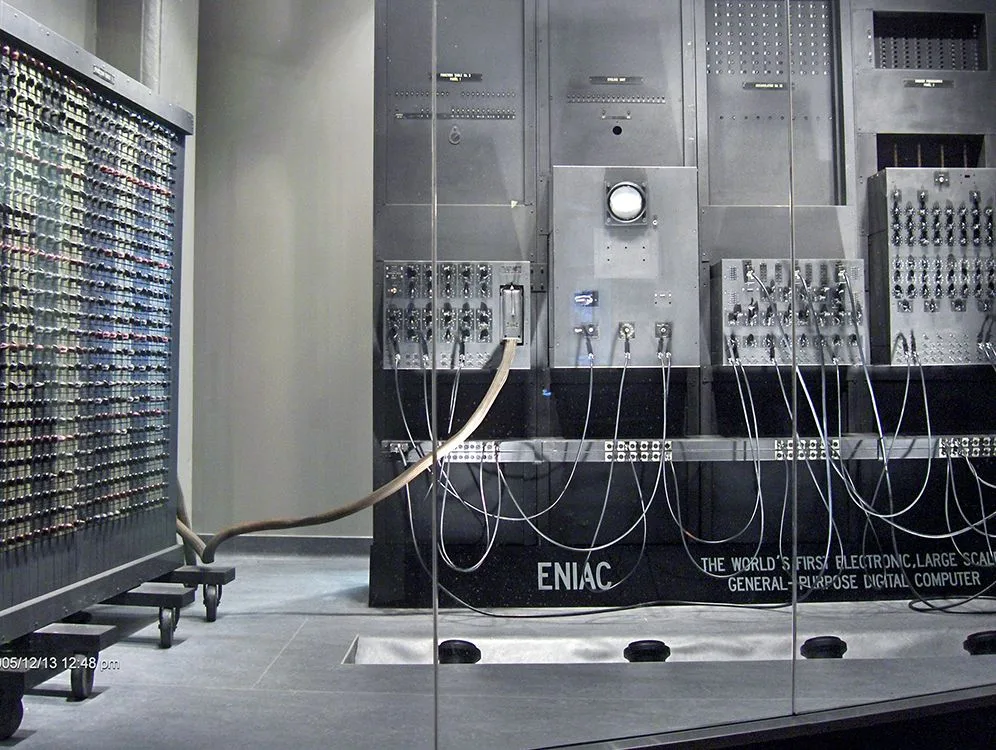

#### 1955:亨利·德雷福斯"为人而设计"

亨利·德莱福斯(Henry Dreyfuss)是一位美国工业设计师,也是《为人而设计》一书的作者,在这本书中,他提出了关于人和机器关系的想法,即"让机器适应人,而不是让人适应机器"。德莱福斯的写作和蒂利的绘图导致了通用设计运动、人性化计划的出现,以及专注于人体工程学设计的新实践者的兴起。这些新的人体工学设计师开始将人与机器相遇的空间描述为"界面"。德莱福斯的工作已经扩展到我们现在所说的交互设计。

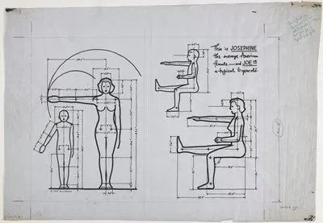

#### 1963:道格拉斯·恩格尔巴特和第一只鼠标的发明

道格拉斯·恩格尔巴特(Douglas Engelbart)在计算机诞生期间长大,当时计算机仍然很大,以至于最小的计算机占据了整个房间。二战期间,作为一名雷达技术员,恩格尔巴特在菲律宾的一家图书馆偶然发现了一篇文章,这让他震惊不已。这篇文章是万尼瓦尔·布什(Vannevar Bush)所著的《正如我们所想》(As We May Think),其中描述了 Memex,这一想法促使恩格尔巴特开始了他一生中最有影响力的工作:电脑鼠标。

恩格尔巴特设想了在计算机显示屏上移动光标的各种方法——这在当时还没有人掌握。最终他开发了一个原型。鼠标使用户和技术人员能够与菜单和其他界面工具进行交互,而无需编写所有代码。现在,人们可以与计算机屏幕进对话了。

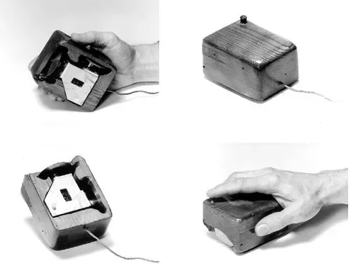

恩格尔巴特天生具有远见卓识,除了他的突破性发明之外,他还提出了其他前瞻性的想法。1960 年,在费城举行的固态电路会议上,恩格尔巴特提出了他的理论,即通过不可避免的技术更新,计算机将开始缩小,并持续缩小,直至无法在物理上取得进步。五年后,这一观点演变成了"摩尔定律",它不是以恩格尔巴特的名字命名的,而是以英特尔公司创始人之一戈登·摩尔的名字命名的。

#### 1965–1969:第一台触摸屏

触摸屏技术由 E.A. Johnson 在《触摸显示屏——计算机的新型输入/输出设备》中首次提出,对人类与计算机屏幕的交互方式产生了巨大影响。

他描述了一种触摸屏,它利用人体皮肤中的电荷来闭合电路,从而实现通信过程。并于 1969 年为这一想法申请了专利,后来于 1973 年将其开发为英国皇家雷达机构使用的雷达屏幕。

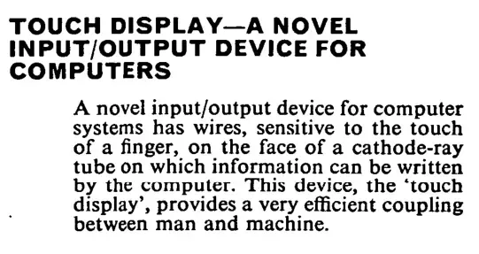

虽然我们现在的大多数智能手机都是采用的电容式触摸屏,但是其实最开始电容式触控屏并没有"一举成名"而被投入大规模生产和使用,由于技术和成本的限制,反而电阻屏后来者居上,在之后的多年实践被广泛应用。例如我们早期的带触控笔的手机,都是电阻屏。反而在 2007 年,第一台全触摸屏控制的智能手机 iPhone 问世,这个小巧的手机交互给人们留下了深刻的印象,从此电容触摸屏在移动设备被广泛应用。

#### 1973:施乐 Alto 和首个 GUI

1973 年,一群科学家在位于帕洛阿尔托研究中心(PARC)制造的一台实验性机器,旨在探索用户界面设计的新思路,这台机器就是 Alto,不过虽然 Alto 并没有进行商业化并且是实验性质的,但是可以说是第一台个人计算机(尽管一些历史学家认为它是一台小型计算机)

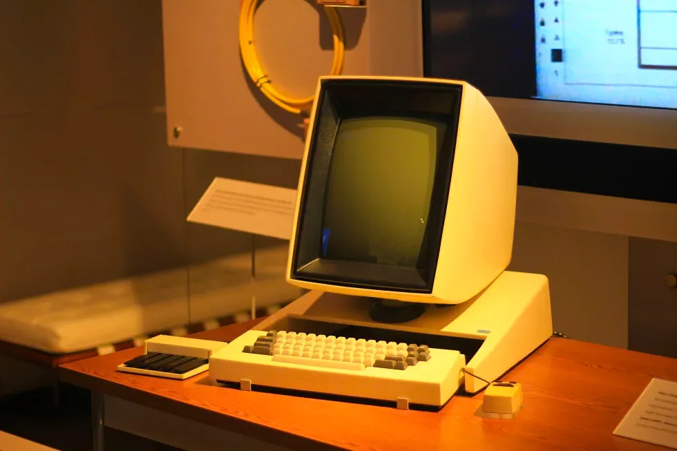

Alto 彻底改变了我们对计算机的理解。凭借清晰的流程,用户可以准确打印出他们在屏幕上看到的内容。它还提供了可移动数据存储和电子邮件等功能,以前所未有的方式将人们联系在一起。

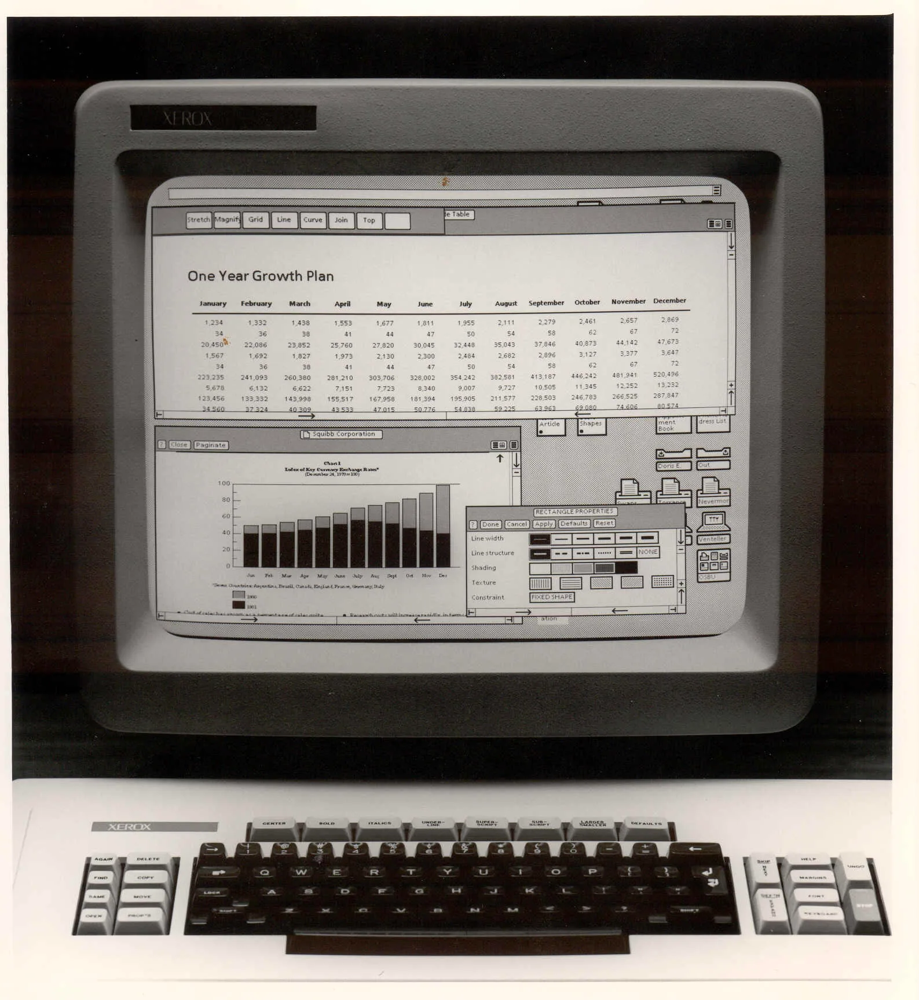

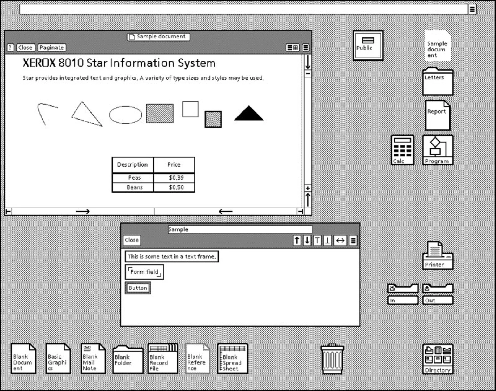

为了将 Alto 变成真正的商业产品,施乐于 1981 年推出了"施乐之星"(Xerox Star),它在桌面上引入了通用的图形界面,文件、文件夹、打印机等图标。然而,由于客观原因限制,PARC 开创的这种方法只有在早期个人计算机行业更开放、水平、竞争的市场中才能真正蓬勃发展,成功需要一个更大的社区,因此接力棒就交给了苹果和微软公司。其实 IBM 曾经也是行业领域中叱咤风云的佼佼者,曾经大名顶顶的 IBM PC,即后来被联想收购的 Thinkpad 也久负盛名,只不过我们重点不是讨论计算机,是 GUI,随意下面就不介绍 IBM 电脑发展了。

#### 1979:比尔·莫格里奇(Bill Moggridge)第一台笔记本电脑原型

1979 年,比尔·莫格里奇受 GRiD Systems Corporation 委托创建一种新型便携式计算机。两年后,原型机发布:GRiD Compass。它的生产成本异常昂贵,因此与许多重大技术发明一样,它最初是为政府、上流社会机构和太空探索项目保留的。这个人和电脑你可能都没听过,不过没关系,莫格里奇后来与他人共同创立了设计公司 IDEO,IDEO 只要是设计专业的应该都不陌生。

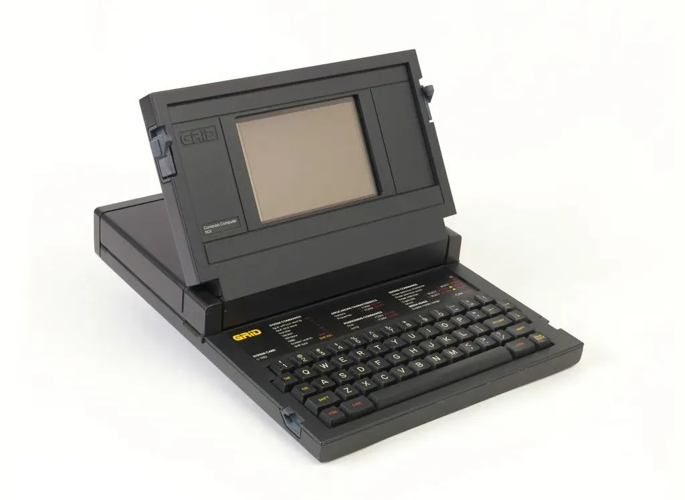

#### 1984:Macintosh 1.0

1979 年,史蒂夫·乔布斯(Steve Jobs)和苹果公司的整个团队参观了帕洛阿尔托研究中心,当看到 Alto 的图形用户界面后,乔布斯认识到图形界面的重要性,因此与施乐公司达成一项协议,用其公司价值 100 万美元的股票交换施乐的 GUI 原型技术。与此同时,许多帕洛阿尔托研究中心的研究人员也加入了苹果公司,开始图形用户界面设计。就这样,在 1984 年,影响深远的 Macintosh 诞生了,屏幕上标志性的"hello",与当时的 slogan(很快世上会只有两种人,用电脑的,和用苹果的),表现出苹果希望用自己的个性征服世界。

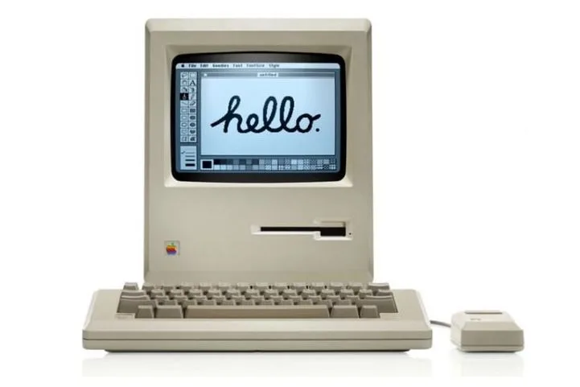

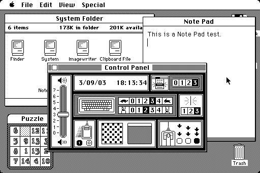

#### 1985:Windows 1.0

作为一切的开端,在 1985 年,微软正式发布了 Windows 操作系统的开山之作——Windows 1.0。严格来说,这并不是微软的首个操作系统,因为早在 1981 年,微软就发布了操作系统 MS-DOS(Microsoft Disk Operating System)。只不过 dos 系统是命令符的,Windows 1.0 将 GUI(图形操作界面)引入到自己的操作系统中。

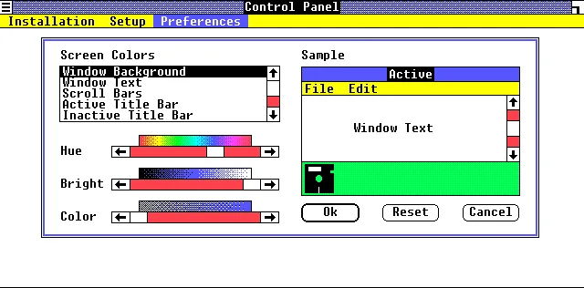

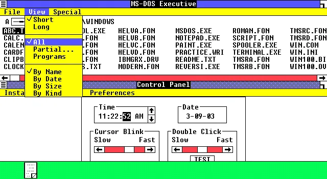

#### 1995 年:唐纳德·诺曼和阿兰·库珀

唐·诺曼(Don Norman)在苹果公司工作了近五年。在任职期间,诺曼创建了第一个"用户体验架构师"职位。诺曼强调需要以人为本的设计,并有足够熟练技术的支持来高效制造。诺曼首次使用了用户体验一词,并解释了他自己对用户体验的定义:

> 这是你体验世界的方式,这是你体验生活的方式,这是你体验服务的方式。

对用户体验的关注,将持续推动创造者将技术与我们人类的能力和需求保持一致。

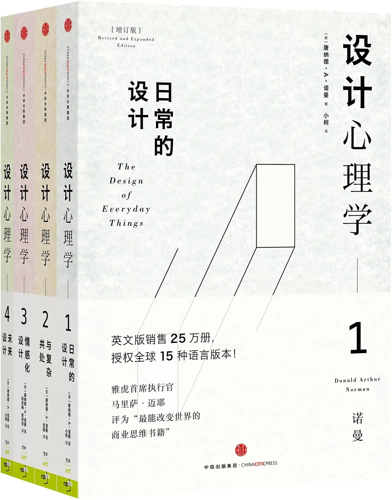

与此同时,有意思的是,交互设计上另一个有影响力的人阿兰·库珀(Alan Cooper),此时却在为微软公司服务。阿兰·库珀(Alan Cooper)是一位美国软件设计师和程序员,被广泛认为是"Visual Basic",也就是 VB 之父。

早在 1992 年,为了应对软件行业的快速整合,Cooper 开始向其他公司提供咨询,帮助他们设计更加用户友好的应用程序。几年之内,艾伦·库珀开始阐明他的一些基本设计原则。在与客户的不断交流中,不断形成了他的想法,并在之后出版了两本书籍,推动了用户体验和交互设计的发展。于是在 1995 年,我们熟知的《About face》这本书 1.0 出版,随着后续版本的迭代,到现在《About face 交互设计指南 4.0》这本书,已经被认为是专业交互设计师的基础参考资料了。

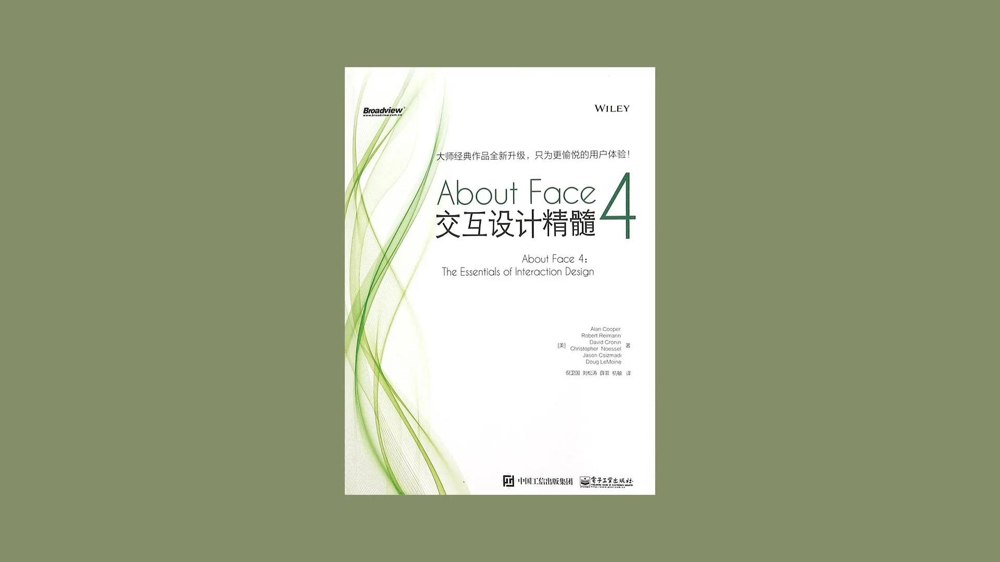

#### 1995:Windows 95 发布

1995 年 8 月 24 日,微软推出的操作系统不再延续前面 1.0、2.0 的命名方式,将推出的操作系统命名为 Windows 95。相比于 Mac os 来说,Windows 95 对于大部分 90 后应该是不陌生的,记得小学二年时微机课上课就是 Windows 95 操作系统。标志性的"开始"按钮和 IE 浏览器都是在 Windows 95 时代首次问世的。

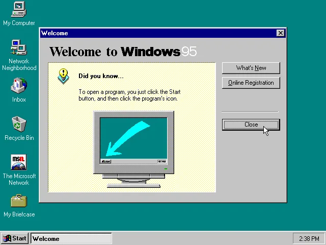

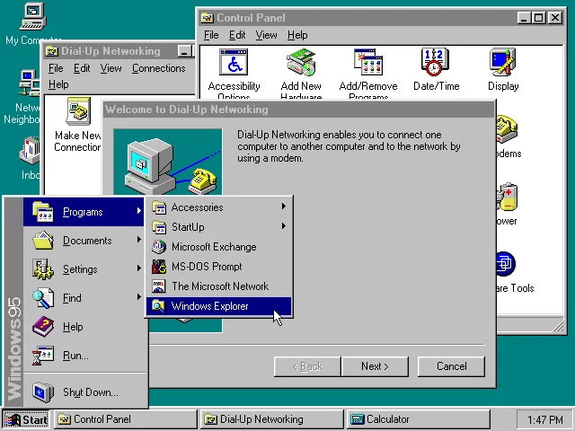

#### 2000 年:早期拍照手机

随着生产商继续将额外的功能塞进小产品中,手机成为下一个热门商品,抛弃了曾经大哥大砖型的外观,手机变得越来越小并具有更大的屏幕,包含了更多的功能。2000 年 9 月 1 日,诺基亚 3310 手机发布了,并迅速成为有史以来最成功的手机之一。记得小时候家里许多诺基亚手机,都是 3310 的变体。虽然下面的照片有点滑稽,但它说明了科技生产商竞相将产品变的更小更轻更薄。

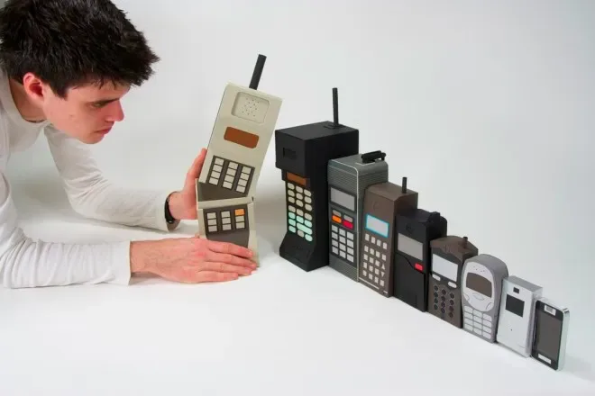

#### 2001 年:微软 Windows XP 和苹果 Mac OS X

终于,在世纪之交时候,苹果和微软为其产品发布了两款新的操作系统升级版:苹果的 Mac OS X 和微软的 Windows XP,这些设计将成为当今操作系统升级的基础。并且两款系统的操作路径和访问信息有着本质不同,从此也将普通个人电脑二元化了,是 Windows 阵营,抑或 Mac os 阵营?

Mac OS X 具有一套全新设计的,被称作 Aqua 的用户界面。Aqua 界面非常漂亮,拥有如水流般的平滑动感,设计精美的图标、菜单和停靠栏等等。Mac OS X 一公开露面就获得了人们的一片惊叹声,从那时开始直到现在 Mac OS X 的 Aqua 用户界面一直是人们心目中的最佳。

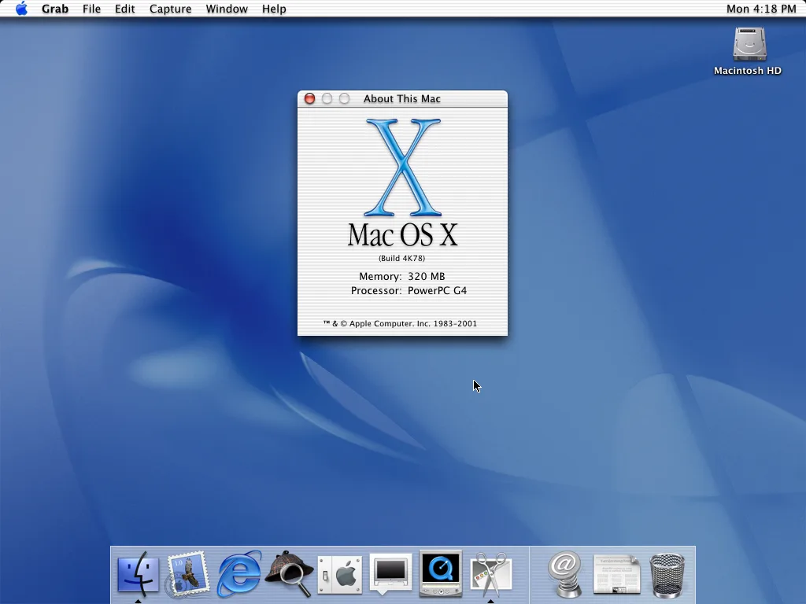

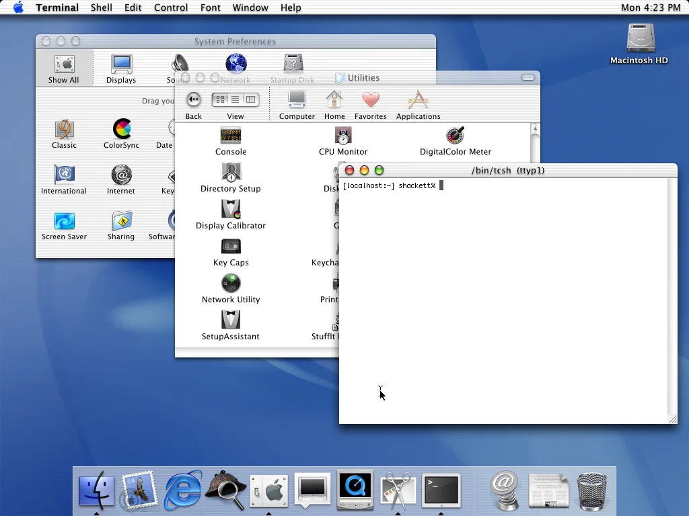

XP 时代微软图标设计更加美观友好、易懂,加以精美的窗口、按钮设计和多功能的开始菜单,和蓝天白云为主题的设计风格,这让 XP 更被大众所接受。XP 经历了个人电脑的普及、多媒体的普及,它的 UI 设计无疑起了至关重要的推进作用。XP 在刚刚发布时,崭新的用户界面绝对会让当时的用户痴迷。

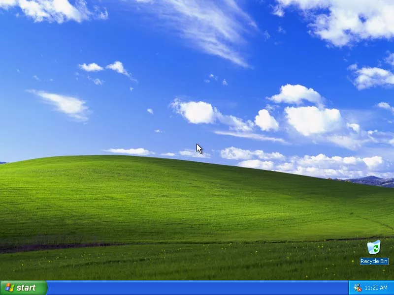

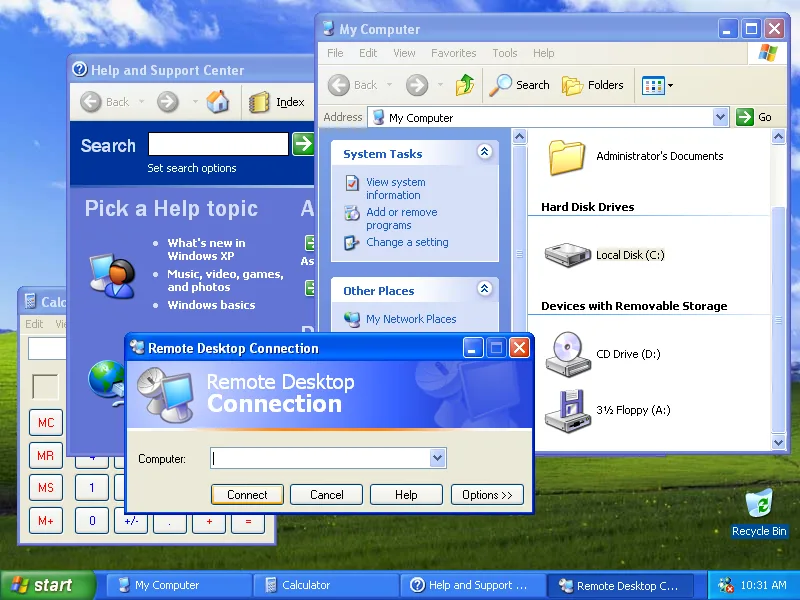

#### 2007:iPhone 发布

2007 年 1 月 9 日,乔布斯站在加利福尼亚州圣弗朗西斯科的 Macworld 博览会的舞台上,首次向世界推出了 iPhone。这部手机在当时采用了极具未来主义的设计,没有物理键盘,有一个 3.5 英寸的多点触摸 LCD 显示屏,拥有 200 万像素的摄像头,搭载 iPhoneOS 移动操作系统,采用铝和塑料制成的机身。这款产品深刻地改变了手机行业,并且对人机交互领域也造成了深远的影响。

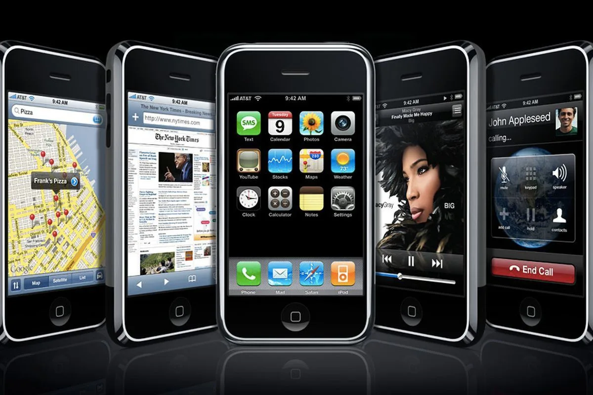

#### 2007-2009:Windows Vista 和 Windows 7

我们现在可能大部分人接触毛玻璃效果,可能是从 iphone 或者 Mac 上体验到的,其实,最早的毛玻璃视觉效果可以追溯到 2007 年微软发售的 Windows Vista,Vista 采用了全新的 Aero(毛玻璃)效果,界面美轮美奂,开启了 Windows 全新的界面视觉时代,但是 Vista 并没有流行起来,因为当时的个人电脑硬件水平还停留在 XP 阶段,没有多少设备能撑得起 Vista 高精美界面对硬件资源的消耗,以及在 XP 时代大幅扩增用户数后,微软并没有很好地调教 Vista 新 NT 内核对旧设备、旧软件的兼容,因此也因"兼容差、系统卡"等当时的缺点而被诟病至今,可以说 Windows Vista 是一个失败的商业产品。但从另一个角度看,Windows Vista 中加入的 Aero 特效确实奠定了日后微软操作系统的美术风格。而在随后的 Windows 7 上,Aero 更是迎来了巅峰。

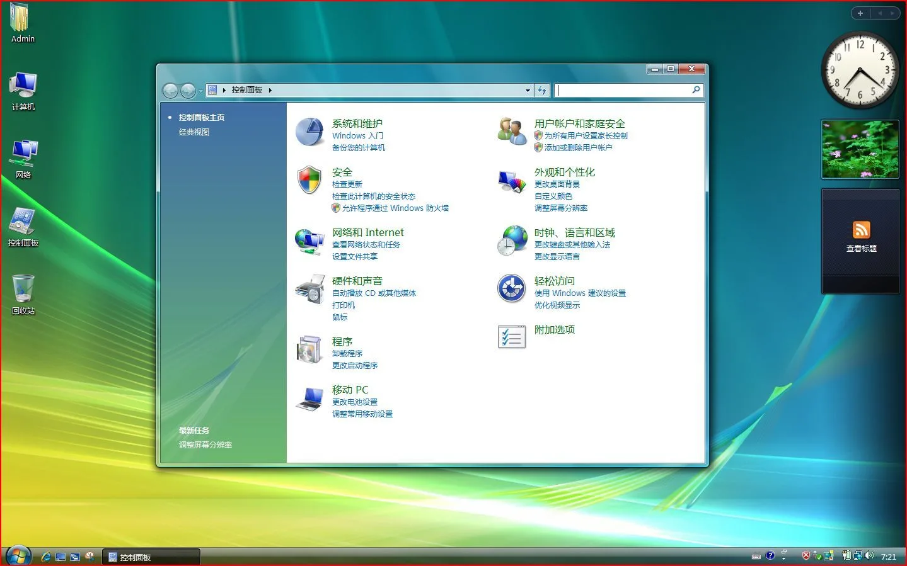

在 2009 年,微软精心打磨过的 Windows 7 上市了,UI 设计比起 Vista 由蓝绿色主题变为蓝色主题,任务栏更加简洁大方,同时传承了 Vista 的窗口设计和开始菜单设计。在我上大学时候还是一直用的 windows 7 系统,即使当时 win10 已经发布,但是 win7 口碑依然坚挺。经常有一个疑问,既然 win7 也有 Aero(毛玻璃)效果,为什么当时没体会到呢,我看过一个说法,是微软当时针对发展中国家的 win 7 家庭基础版没有这个效果。而当时普通人用的基本上都是 home basic 版本,因此也就不足为怪了。

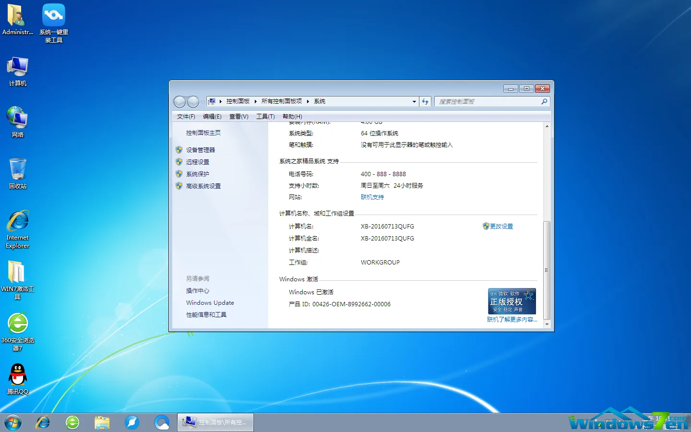

相反,苹果早期 UI 界面使用拉丁语中的「水」一词来命名,也就是 Aqua 风格,从控制窗口开关的按钮到滚动条,似乎都是用晶莹剔透的水滴制作而成,并且被头顶的光源给充分地照耀着,呈现出强烈水晶质感。在 2013 年发布的 iOS 7 系统和 2014 年发布的 OS X 10.10 Yosemite 中再次使用了毛玻璃效果。

#### 2010:Retina 屏幕

在 iphone 4 的发布会上,乔布斯提出了 Retina 屏幕的概念,所谓 Retina 即视网膜屏幕是一种高分辨率液晶显示屏技术,工作原理是在给定的显示面积上增加更多的像素。这使得显示屏上的每个像素非常小,因此在相同尺寸的屏幕上,视网膜屏幕可以提供更高的分辨率。此外它采用了高对比度技术,使得黑色更加深沉、白色更加明亮,从而增加了图像的清晰度和鲜艳度。此外,它还具有广色域,能够呈现更丰富的色彩,使得图像看起来更加真实。Retina 屏幕不仅应用在 iphone 上,也在 ipad 和 mac 上被使用。

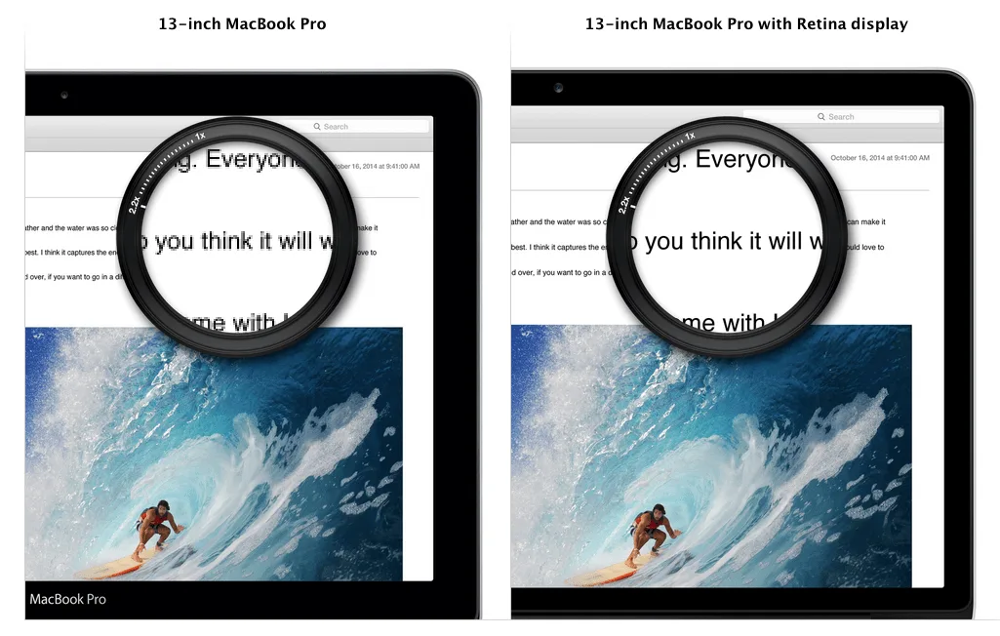

#### 2016-2017 全面屏

去搜索全面屏这个概念是谁提出的,可以看到网上有一堆争吵的不可开交的。有人说是三星 S8,有人说是夏普 AquosCrystal,大部分人说是小米 MIX,也有少部分人说是 iPhone X。我也理解,他们在他们各自角度的去看,也是按照各自不同的维度去评判这个概念。

从我的角度看,全面屏确实是夏普最早有的,早在 2014 年,夏普 AquosCrystal 机型推出,就符合三面窄边框的样式了,但是夏普也没有明确说手机是全面屏,并且这个手机影响力有限,也没有带动手机市场的改变。其次在 2016 年,小米发布了 mix 1,请来了大名鼎鼎的斯塔克做设计,并且明确说明了"全面屏"这个概念,得到了大家认可。然后 2017 年,苹果发布了 iPhone X,并且推出了手势交互规则,而后全面屏被各大手机厂商采纳并研制出各种异形屏,刘海屏,水滴屏,挖孔屏等等。

其实不必纠结谁是先行者,独木不成林,科技的发展是众多行业的合作结果。我们知道超高屏占比,也就是所谓的全面屏,带来了新的交互方式,并且影响了电脑、平板等等其他设备的屏幕。

#### 2020–现在:Windows 11、Mac os Ventura

从 Windows 11 的界面上看,微软显然是想走「多平台大一统」的方向。硬件层面,Windows 11 可以在平板电脑、电脑甚至是 IoT 设备上运行,让不同硬件都能共享同一个应用生态。交互上,Windows 11 可以根据硬件的形态自由在平板或桌面之间切换,让不同硬件都能有最好的用户体验。

多屏统一的路线微软过去走过一次,但失败了。而此次的 Windows 11 在我看来完全算得上是微软多屏统一的重要里程碑。在 Windows 11 上,微软终于明白了用户需要、想要怎样的系统。

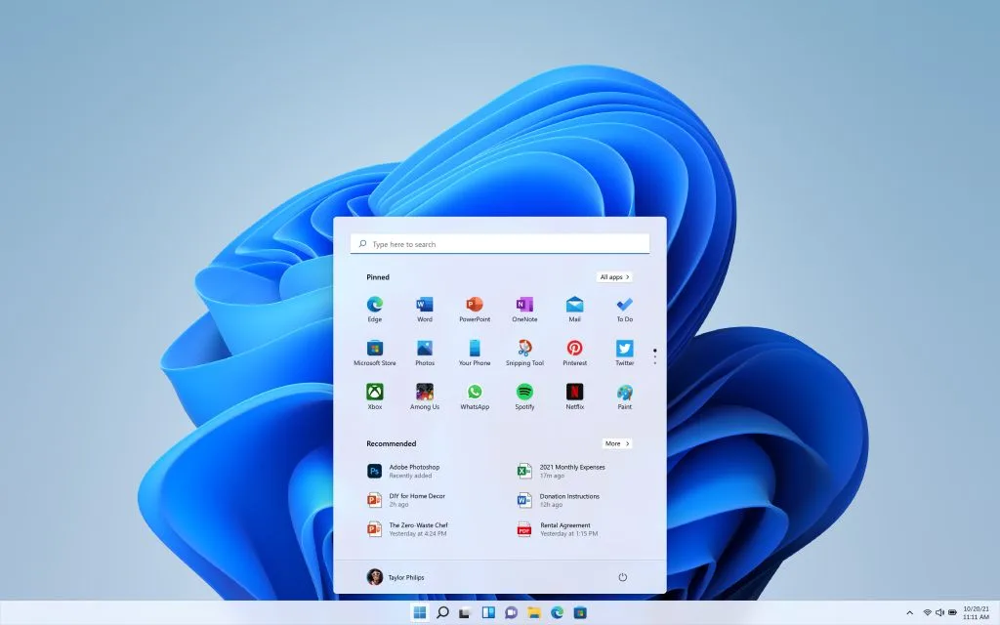

由于苹果的设备不仅包括电脑,还有手机、平板和手表,此外苹果系统的封闭性和掌控力,因此苹果很早就开始做设备协同了,不过在 Mac os Ventura 中体现更加明显,Ventura 除了引入"台前调度"这个新的交互概念,其将系统设置界面改成和 ipad、iphone 样式都保持了接近一致。

可以看到,未来平台统一趋势已经势不可挡,GUI 的设计不单单只考虑一个设备,还要考虑不同平台的适配和设计。与此同时,在经过扁平化风格的潮流后,后扁平化风格来临。在扁平化的基础上,GUI 加入了阴影、透明、玻璃等等轻拟物质感,GUI 变得有机、质感,充满未来感。

#### 2023:苹果 Vision Pro

2023 年 6 月 5 日,苹果在 WWDC 上正式发布 Vision Pro。

Vision Pro 采用苹果的 M2 芯片,以及一颗名为 R1 的协同处理器,用于进行实时的传感器集成。实际佩戴的时候,Vision Pro 系统内部有一个数字表冠,可以控制虚拟背景在用户视野中的比重,占比最少的时候会营造出混合现实的效果,应用程序界面和媒体会在用户周围的现实环境中漂浮,占比最多的时候用户的周围环境会隐藏。Vision Pro 还有一个名为 EyeSight 的外部显示屏,用于展示系统用户头像中的眼睛部分,代表用户的沉浸程度:在 AR 模式下,EyeSight 的眼睛会显得黯淡,而在完全沉浸的模式下,眼睛会完全消失,表明用户已经完全沉浸在 Vision Pro 的环境中。当其他人靠近,或者与佩戴者搭讪的时候,EyeSight 会正常展示佩戴者眼睛,即便佩戴者已经完全沉浸其中,这种情况下佩戴者可以看到其他人。

Apple Vision Pro 采用 VisionOS 系统,核心框架主要派生自 iOS,另外还有用于注视点渲染和实时交互的扩展现实专用框架。visionOS 系统采用 3D 用户界面,导航方式为手指侦测、眼动追踪和语音识别。其中点击操作为注视某个元素,或是两指捏合,移动操作为两指捏合后拨动,滚动操作为挥手。在 visionOS 系统中,应用程序以在 3D 空间中排列浮动窗口形式展现。除此之外,系统还设有用于文字输入的虚拟键盘、Siri 虚拟助手,可以连接妙控键盘、妙控板及游戏手柄等蓝牙外设使用。

参考:

- [The History of User Interfaces](https://history.user-interface.io/)
- [An Abridged History of UI](https://www.uisdc.com/abridged-history-of-ui)
- [50 Years Later, We're Still Living in the Xerox Alto's World](https://spectrum.ieee.org/xerox-alto)
