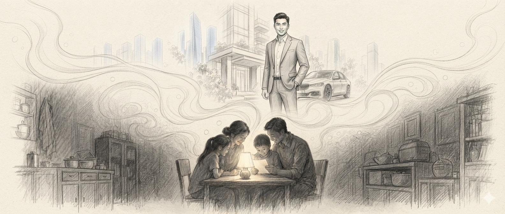
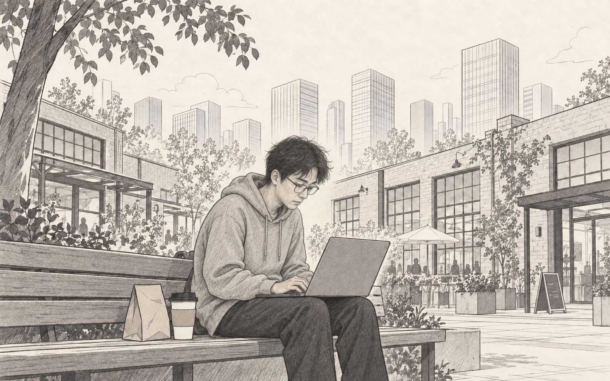
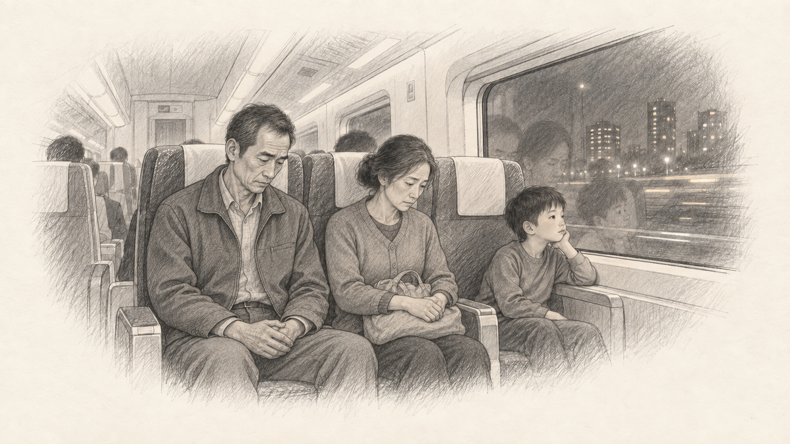

我的叔叔于勒，是一个工业设计研究生。

我小时候，家里的经济条件很拮据。母亲买菜总是斤斤计较，哪家的青菜便宜五毛钱，她都恨不得多走两条街；父亲也常常为了房租、柴米油盐发愁。但是，我们全家始终有一个共同的盼头，也是我们家唯一值得向亲戚朋友炫耀的事情——那就是我的叔叔于勒。

于勒叔叔本来也只是一个普通本科生，但后来他突然发奋图强，日夜苦读，竟然以极其优异的成绩考上了一所985大学的工业设计研究生。这在我们那个小县城里，简直是一件轰动一时的大事。接到录取通知书的那天，父亲高兴得简直要发疯了。他逢人便说：“我弟弟于勒，那可是要成大器的！工业设计你懂不懂？那是工业和艺术的结合，是制造业皇冠上的明珠！从汽车、家电到智能硬件，哪个离得开设计？等他一毕业，就是高级设计师，进大厂、拿大奖、年薪几十万，前途无量！”

从那以后，于勒叔叔便成了我们全家的希望。

叔叔读研期间，偶尔会往家里寄一封信，或者在家族群里发几张工作室的照片。有时是凌晨三点的模型间，桌上堆满泡沫板、亚克力板和3D打印件；有时是他对着电脑屏幕上的Rhino、KeyShot和SolidWorks截图发呆；还有时候，他满手白乳胶，站在一个奇形怪状的装置旁边。每当这时候，父亲总要郑重其事地把照片转发给亲戚朋友，再配上一句：“最近在做基于独居青年情感陪伴需求的模块化智能家具系统，导师很器重他，经常让他熬夜改用户旅程和CMF方案，连模型比例都要精确到毫米级。”

其实父亲根本不知道什么叫用户旅程，也分不清CMF和毫米精度到底有什么关系。但越是听不懂，他越觉得高级。每次念完叔叔发来的消息，他都激动地挥舞着手，重复那句已经说过无数遍的话：“瞧见没有？研究生就是研究生。等于勒毕业了，我们家的好日子就来了。到时候他不仅自己能在大城市买大平层，咱们家也能跟着沾光！”母亲也常常满脸笑容地附和：“那可不是嘛，名牌大学的工业设计研究生，以后肯定是坐在宽敞办公室里画设计图、做产品方案，给大公司搞创新的体面人。”

盼啊盼，终于盼到了于勒叔叔毕业的那一年。家里决定奢侈一次，去叔叔所在的那座大城市旅游，顺便庆祝他正式步入所谓的“金领阶层”。

那天，我们逛到了城市边缘的一处创意园区。园区装修得十分气派，红砖墙、巨大落地窗、共享办公区和精品咖啡店随处可见，写字楼门口则挂着“数字科技”“智能创新”“未来体验”“人工智能”等让父亲肃然起敬的牌子。年轻人抱着电脑匆匆走过，几乎人人都穿着黑色T恤或者卫衣，脸色苍白，眼神疲惫，好像刚从一场没有尽头的会议里逃出来。父亲却看得十分羡慕：“这种地方，于勒肯定就在里面上班。”

母亲嫌弃地扇了扇风，正准备拉着我们离开，忽然注意到路边坐着一个人。那个人穿着一件皱巴巴的黑色卫衣，头发乱糟糟的，脸上挂着浓重的黑眼圈，手边放着一杯已经化了冰的美式，膝盖上架着一台电脑。屏幕上密密麻麻全是界面框、流程线和一堆看不懂的英文。他一边盯着电脑，一边嘴里念叨着：“这个按钮昨天不是说放左边吗……怎么今天又要放右边……算了，先改一版吧。”

母亲满是同情地叹了一口气：“唉，你们看那个人，年纪轻轻累成这样，肯定小时候没好好读书，才只能坐在路边改这种乱七八糟的东西。咱们孩子将来可不能像他，得考个好大学，学个正经专业。”

父亲顺着母亲的手指看过去，脸上的笑容却一点一点消失了。他死死盯着那个人，脸色越来越白。那个人这时刚好把页面上的一个按钮从左边拖到了右边，停顿了几秒，手机突然亮了一下。他低头看了一眼消息，又默默地把那个按钮从右边拖回了左边。

父亲的手开始微微发抖。

“怎么了？”母亲奇怪地问。

父亲结结巴巴地说：“那……那个坐在路边改页面的人，长得……长得怎么有点像咱们于勒？”

母亲吓了一跳：“你疯了吗？于勒是工业设计研究生！他懂产品造型，懂人机工程，懂用户体验，是高级人才！怎么可能坐在路边改软件界面？你肯定看错了！”

可是父亲怎么也不放心。他悄悄走过去，向旁边一个像是那人同事的年轻人递了一根烟，低声问道：“师傅，请问一下，那个坐在那边改界面的人是谁啊？”

那人看了一眼，随口答道：“哦，他啊，叫于勒。工业设计研究生毕业的，后来没做工业设计，转行做软件界面了，现在是我们组的UX设计师。”

父亲的身体明显晃了一下。

那人还在继续说：“学历倒是挺高，可惜工业设计岗位不好找，硬件公司也少，后来就进互联网厂画界面。刚开始做App改版，后来公司转AI，他又跟着做AI产品。现在天天研究大模型、智能助手、Agent、AI工作流什么的，听起来挺高级，其实就是不停画页面、改流程、写体验报告，被产品经理和算法工程师两头催。”

父亲咽了一口唾沫，声音颤抖着问：“那……他工资应该很高吧？研究AI的，一个月不得三五万？”

那人摇摇头：“哪有那么高。税前两万出头，五险一金一扣，到手一万多。这城市房租六千，再加上吃饭、通勤，基本月光。而且AI这玩意儿现在名字一天一个样，今天项目叫智能中台，明天叫AI工作流，后天又改成大模型交互体验优化。上午改需求，下午改原型，晚上改高保真。领导天天说AI是未来，可未来还没来，人已经快被改稿改没了。”

父亲脸色煞白地走了回来，神情惶张，仿佛刚刚亲眼看到了什么可怕的瘟疫。

“怎么样？”母亲急切地问。

“是他，真的是他。”父亲压低声音，绝望地说道，“工业设计研究生，工业设计没做成，跑去做UX；UX还没干几年，又跑去研究AI。说是研究人工智能，到手一万多，去掉房租所剩无几。以后说不定还得找我们接济。”

母亲脸上的表情瞬间变了。先前的骄傲、羡慕和憧憬，全都变成了愤怒和恐惧。她咬牙切齿地说道：“我就知道！什么工业设计、用户体验、AI产品，名字一个比一个高级，干到最后不还是天天改东西！工业设计找不到工作，UX又要被AI抢饭碗，研究来研究去，连自己都养不活。”

我们一家人像做贼一样，赶紧绕开了那个咖啡店，谁也没敢再看于勒叔叔一眼。

回家的高铁上，父亲一言不发。他靠着窗户，看着外面飞速后退的城市，仿佛在几个小时之内突然老了十岁。母亲则一直死死地盯着我，过了很久，她终于严肃地说道：“你给我听好了。以后填高考志愿，要是敢报工业设计、交互设计、用户体验、人工智能产品，任何一个沾边的专业，我就打断你的腿！”

我小声问：“那我报什么？”

母亲愣了一下。

她似乎也不知道。

窗外，一栋栋写字楼迅速消失在夜色中。楼里面亮着无数盏灯，也不知道还有多少工业设计师、UX设计师、产品经理和AI从业者，正在电脑前改着不知道第多少版方案。

他们当中的很多人，也许都曾经相信自己学的是一个“有未来”的专业。父母觉得他们会设计改变世界的产品，老师告诉他们要以用户为中心，领导告诉他们AI是下一个时代。

后来他们才慢慢明白，所谓未来，有时候不过是——

**上一代人以为你在改变世界，而你自己知道，今晚十二点之前，还得把那个按钮再往右挪两像素。**

从那以后，我们家再也没有人提起过我的工业设计研究生叔叔于勒。
