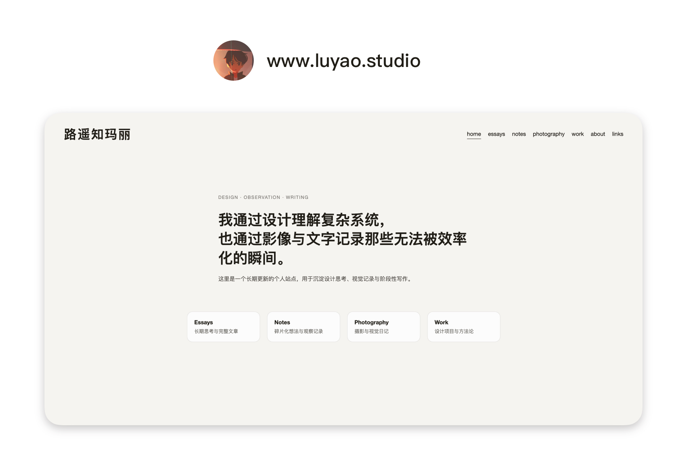
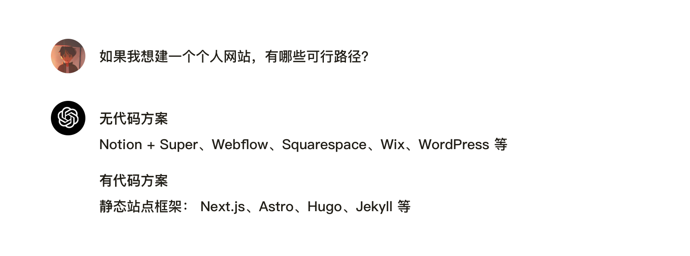
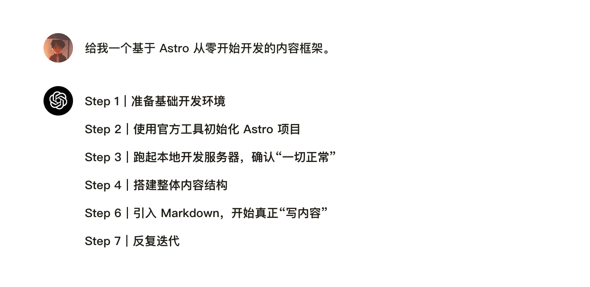
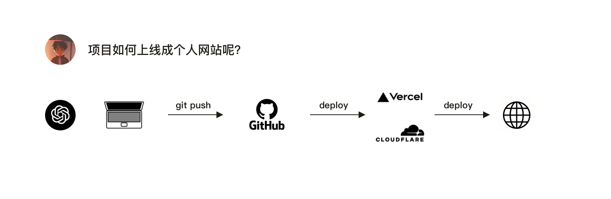
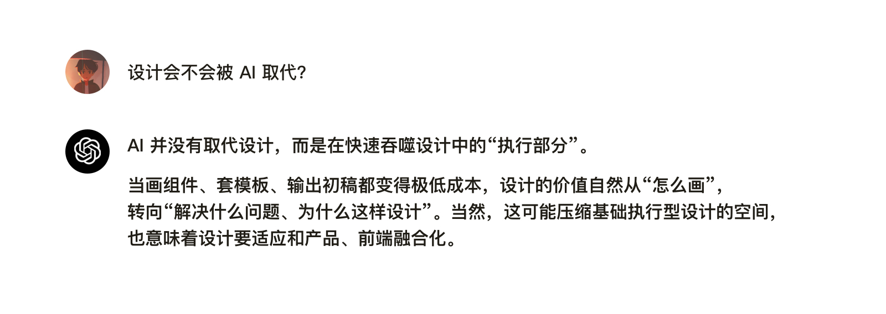

一个不懂代码的人，在 AI 的协助下，用了差不多两周时间，从零搭建了一个属于自己的个人网站。

它不算复杂，也谈不上完美，但这是我第一次真切地感受到——

一个人，可以不依附平台，完整地掌控自己的表达空间。

---

# 01｜为什么要建站呢？

说得直白一点：是为了找工作也好，为了表达自己也好，网页始终是一种非常有力量的载体。

从早期博客时代，到摄影师个人网站，再到现在的独立站，**一个网站只需要一个域名，就能长期承载你的作品、思考与审美，而且不受平台规则限制，可以完全按照自己的方式去构建**。对我来说，这本身就是一个非常好的产品形态。

但很长一段时间里，我并不认为“自由构建个人网站”这件事，是我可以做得到的。我不是程序员，也没有系统学过前端开发。之前尝试过 Html、CSS、JavaScript，但最终都放弃了。不是不努力学习，而是真的发现自己没时间也学不会。

在前几年时候，我尝试用过开源框架做过个人网站，也尝试用 Notion 做过个人网站。它们都能用，但总归受限于既定结构：想加点自己的设计、想实现更细的交互和排版，往往就要妥协，很多想法只能停在“差不多”。

直到 AI 的出现，这件事才第一次真正变得可行。

**Vibe Coding** 这个概念本质上很简单：你用自然语言描述需求，AI 帮你生成代码、补齐细节、调试修复；而你要做的，是把控方向与关键决策——做成什么、为什么这么做、结构怎么组织、呈现风格是什么。

不懂代码，没有关系，不懂设计，没有关系～ 只要你有想法，那么，在 AI 协助下，一步步来，就可以建成自己的网站。

---

# 02｜开始之前的准备

>**如果我想搭建一个个人网站，有哪些可行路径？**

AI 给出的答案，大致分成两类：

**第一类是无代码方案**

这是我曾经考虑过的方式，比如用 Squarespace 这类平台，通过模板和拖拽就能完成一个观感不错的网站，几乎没有学习成本，所见即所得。

但问题也很现实：这类服务大多是海外平台，订阅费用通常在每月二三十美元，价格昂贵，长期成本偏高。

**第二类是有代码方案**

使用成熟的静态站点框架，自由度更高，但需要一定学习成本，比如 Next.js、Astro、Hugo、Jekyll 等。

如果放在以前，这条路对我来说几乎是不可选的。但在 Vibe Coding 出现之后，情况发生了变化。

>**我想使用静态站 + Markdown 方式，推荐哪种？**

在排除了偏博客向、或者过于老旧的框架后，AI 最终给我推荐了两个选择：Astro 和 Next.js。Ai 给我解释了这两个框架的优缺点，综合对比后，我选择了 Astro。理由也很简单：轻量、结构清晰，非常适合设计师或摄影师构建个人网站。

---

# 03｜实际做了哪些事

在确定使用 Astro 之后，真正动手的过程，其实比想象中要简单得多。整个开发过程可以拆成几个清晰的阶段，而每一个阶段，不需要关注“怎么写代码”，而是要做成什么样子。

>**请给了我一个基于 Astro 从零开始开发的内容框架。**

第一次在终端里跑起本地服务器时，我其实并不完全理解每一行命令在做什么，但页面真的在浏览器里出现了。那一刻的感受是：Ai 编程并没有想象中那么难。

整个过程基本上就是按照 AI 指引，先完成环境安装和项目初始化，再在 IDE 里把本地服务跑起来。接着让 AI 帮我搭网站的基础结构——比如导航、页面框架和每个页面的初始文案。最后把内容整理成 Markdown，放进网站的文章模块里，一个能用、能看的个人网站就成型了。

整个过程中，我主要用到的工具并不复杂：

**原型工具：**

通过图形化方式和 AI 沟通网站想法。不管是 Sketch / Figma ，或者是截图（上文说的 Webflow、Squarespace、Wix 模板截图）。都可以作为参考输入给 AI。

我主要参考了几位摄影师的网站，同时也让 AI 给我生成了一些设计参考。Marisashimamoto / KatchanPhotographer / Timjamieson / Adrien sanguinetti 的网站样式，有兴趣，你们也可以搜一下。

**集成开发环境 / 简称 IDE：**

IDE 是一种为程序开发提供完整环境的应用程序，把代码编写、调试、运行、打包等功能集成在一个界面里

可选的工具其实很多，比较常见的有 Visual Studio Code、Cursor、Antigravity、Kiro、Trae 等，大多内置或可接入 Agent，能调用 GPT、Claude 等主流模型，以及各种插件。

综合价格，我选择 VS Code，而且 Github Copilot 也便宜，才 10 刀一个月，当然，你也可以选择 Cursor，公认的好用，就是价格太贵了，程序员的话我觉得会很合适，像我这种偶尔写写代码，免费的或者轻量方案就够了。

**AI Agent：**

需要一个编程 Agent 辅助写代码，甚至可以把大部分代码工作直接交给它完成。常见的选择有Codex，Claude Code 、Cline 、Kilo，以及 Github Copilot等等。

我用的是 Codex，一方面是已经在用 GPT Plus，直接上手成本最低；另一方面它在这类项目里已经完全够用。Copilot 做一些轻量补全也还可以，Cline 体验也不错。至于 Claude Code，虽然公认写代码能力很强，但是 Anthropic 这家公司所作所为，emm，就没有再折腾了（在 AI 还没出圈的时候我就试过注册 Claude，账号直接被封。

**终端：**

终端更适合用 CLI 处理复杂任务，不过在这个项目里，我基本只用它来启动本地服务、清缓存这些基础操作。

---

# 04｜部署上线

当网站在本地跌通之后，接下来就是把它真正变成一个可以被访问的网站。

>**项目如何上线成个人网站呢？**

AI 给了三个上线步骤，第一通过 Github 桌面端将项目发布到仓库，第二步，使用Vercel / Cloudflare 进行自动部署，第三步配置域名、SEO 和基础元信息。

>**Vercel 和 Cloudflare 有什么区别？**

在 Ai 推荐下，我选择 Vercel 作为部署平台，主要原因是它对 Astro 的支持非常成熟，而且对个人开发者足够友好。

绑定个人域名：阿里云、腾讯云、GoDaddy、Namecheap、Cloudflare等，购买域名，并且解析绑定即可，这步建议选择阿里云，然后绑定国内 DNS（这一步很重要），不然国内无法访问。

在 Ai 协助下，将 Github 仓库和 Vercel 连接，至此在 VS Code 中修改代码，通过 GitHub 同步Vercel 自动完成部署更新——整个链路非常顺畅。

>**SEO / Metadata 是什么？**

在 Ai 协助下，修改了 Astro SEO，然后在 Notion 中尝试了一下，卡片显示效果非常好～

至此，从最初的技术选型，到实际动手开发，再到部署上线与域名绑定，一个完整的个人网站从 0 到 1 的过程基本走完。

整个过程中，我并没有把重心放在“学会多少代码”，而是更多地借助 AI 工具，去理解每一步在做什么、为什么要这样做，并逐步完成关键决策。

当我第一次通过域名访问到这个网站时，那种感觉和“把东西发到平台上”完全不同。**这是一个可以持续迭代、完全由自己掌控的空间。**

---

# 05｜关于 AI、设计，以及我最近的一点想法

最近在一些开发者社区和设计论坛里，经常能看到一个讨论：

>**设计会不会被 AI 取代？**

我的感受是：

### 1. Ai 没有取代设计，但是工作方式发生改变

我刚入行的时候，互联网行业（更准确说是软件设计行业）还处在上升期。虽然不如最狂野的那几年，但机会依然很多，只要肯做、肯学，就总能往前走。直到半年前做作品集时，我依然把自己定位为交互视觉设计师。尽管在工作中也参与过一些产品层面的决策，但从能力结构和产出方式来看，我依然更偏向设计端。

**变化，其实已经发生了**

当我经常沉浸在 AI 社区论坛后发现，前后端的变革，已经在快速发生；而设计的变化，相对慢了一拍。但这并不意味着 UI 组件不重要了，也不是说像素、风格、视觉表达不需要了——这些依然是设计的基本功。

**从“反复执行”，到“做出判断”**

过去我们做一个功能，往往要准备五六套方案，反复结合业务语境去打磨交互细节；还要研究组件规则、整理使用场景、建立 Library，把大量时间花在「如何把事情做对」。

而现在，AI 可以协助完成这些基础规则的建立。当你理解了这些规则之后，AI 甚至还能给出多套可行方案，帮你分析优劣、提供优化建议，你只需要选择一种最合适业务的方案就可以了。

**要做的，反而变成了：**

在具体限制条件下，选择哪一个方案最合适，以及为什么是它。

### 2. 执行成本下降，思考反而更重要
正如 Reddit 里面所说， 设计越来越和产品、前端融合了， 但并不是说不需要设计了，总是有人要思考这个界面要做成什么样。工作流程正在改变，但设计并没有消失。

AI 确实在自动化大量重复性工作——写代码、补样式、生成结构、输出初稿。但“做什么”和“为什么这样做”，依然需要人来判断。当执行成本不断降低，真正重要的，反而是问题的拆解能力、结构思考，以及决策本身。

### 3. 被工具裹挟，但是要学会使用工具

想起来当初 元宇宙 火的时候，Facebook 将其名称都改成了 Meta，然而元宇宙目前终究是成为了一个概念，随着Ai 发展的浪潮，人工智能和制造，成为了发展的领航，随着前段时间 Meta 裁掉了元宇宙部门，慌不择路收购某 Agent 看，未来 Ai 的拼杀更加激烈。

相比于元宇宙的概念化和迟迟未能落地，AI 相反这两年火的了很大的进步，不论是聊天、编程、图形等领域，都已经落地并促进生产力的发展，而这些进步又翻过推动了 AI 的发展。

如果仔细深究，会发现数不清的各种 AI 工具，如果沉迷于为了工具而工具，那就本末倒置。

与其焦虑被取代，不如问一句：我能不能借助它，做以前做不到的事？

**当工具为你所用，才能放大自己的价值。**

# 06｜写在最后

这个网站不算成熟，谈不上复杂，但这也是算是一次真切地感受到：有些事，只要愿意去尝试，也真的可以做到～