「拜年计划」是患者服务团队持续十年的新年关怀活动。项目包含 AI 福卡和节日互动 H5，通过个性化祝福、轻互动、分享及礼品领取等形式，增强用户参与和节日关怀，并探索 AIGC 在患者服务活动中的应用。

**项目职责**

1. 对接业务方，明确活动目标、参与范围及合规边界，梳理 AI 福卡生成、活动分享、礼品领取和服务权益核销等业务规则与异常场景；设计用户参与主流程（登录、AI 福卡生成、分享/领取礼品），规划后台礼品清单和服务权益核销等支撑能力，输出活动需求文档与交互设计方案。

2. 负责活动主视觉、核心页面及动效设计，运用 Midjourney 生成角色与插画素材，结合 Photoshop、数位板合成优化，使用 AE 完成动效并输出 GIF、Sprite 精灵图等多格式素材，兼顾视觉效果与加载性能；在保持统一视觉风格的前提下，大幅提升内容的个性化程度与物料产出效率。

3. 跟进前端开发与测试，协调需求调整与线上问题，上线期间配合业务答疑，保障活动顺利运行；在患者服务活动中首次系统性引入 AI 生成能力，验证其在真实业务场景中的可行性，活动期间页面访问量与注册转化率显著提升，并沉淀 AI 生成流程、活动产品方案与关键词/视觉模板，为后续节日活动提供可复用参考。

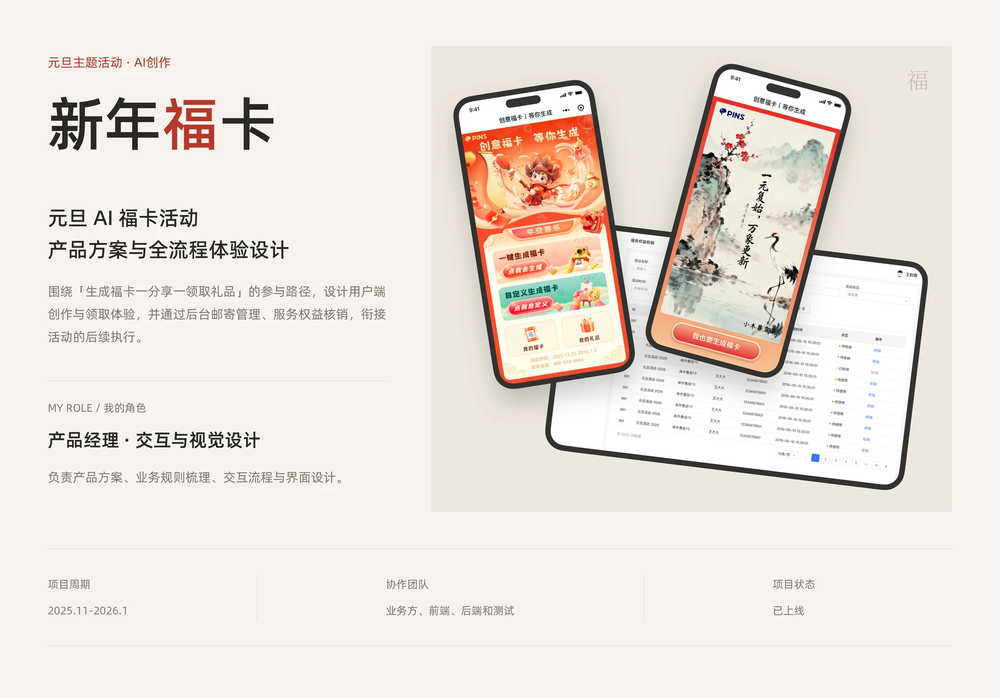

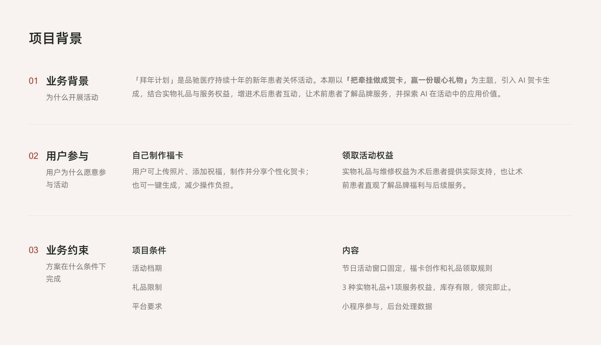

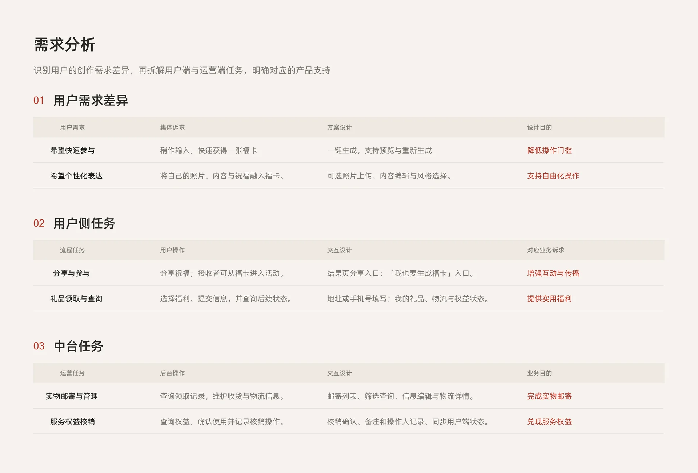

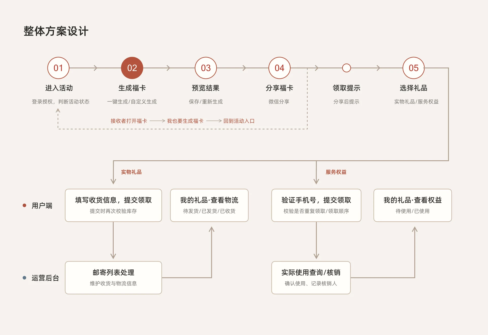

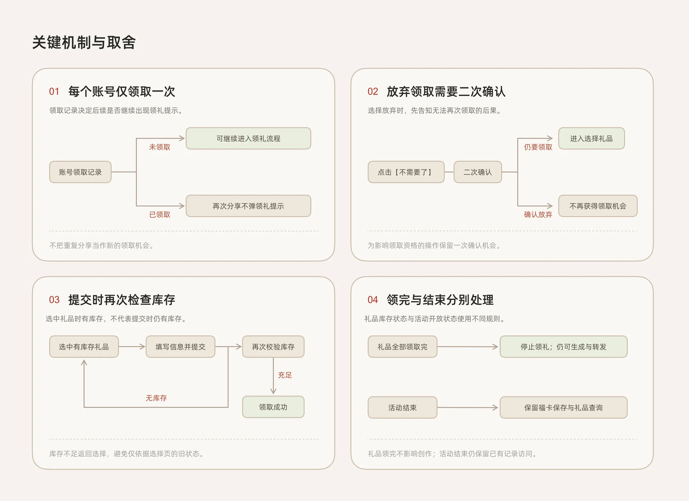

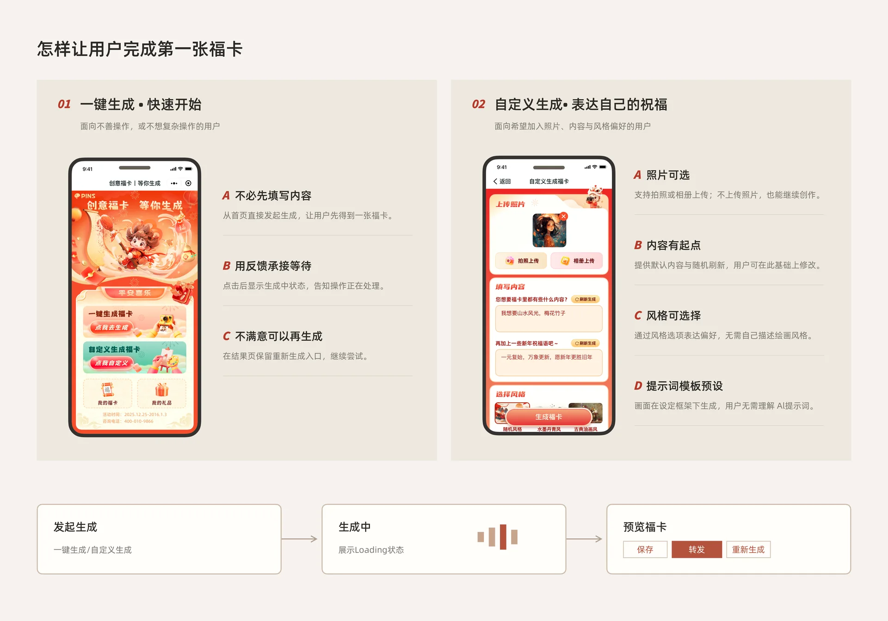

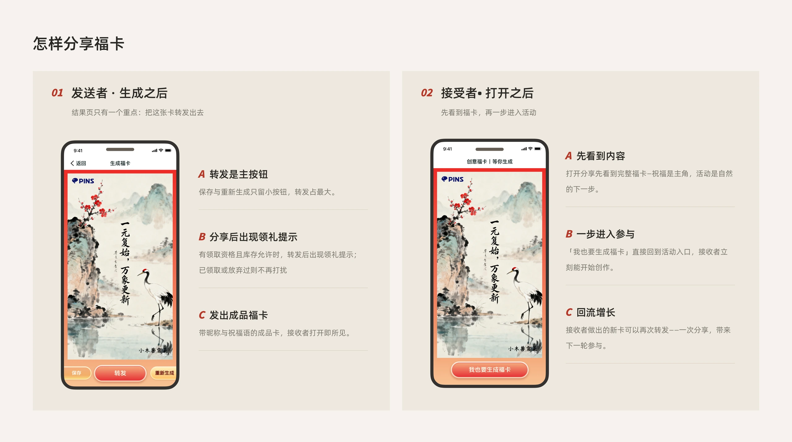

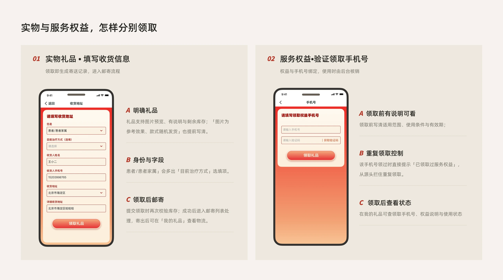

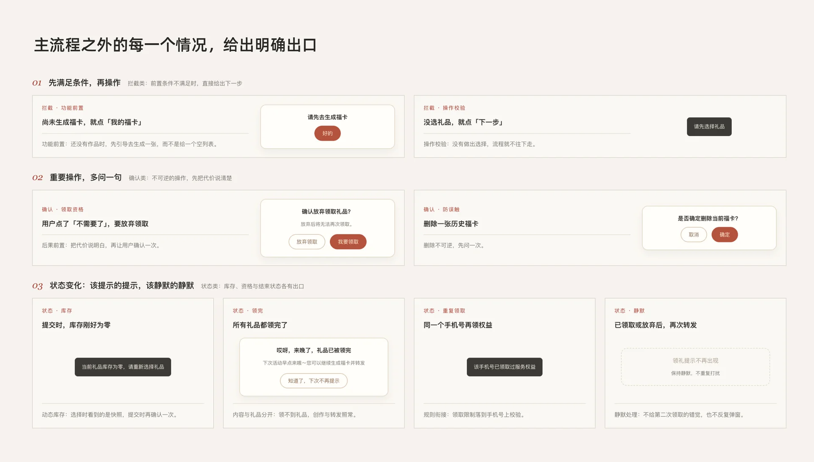

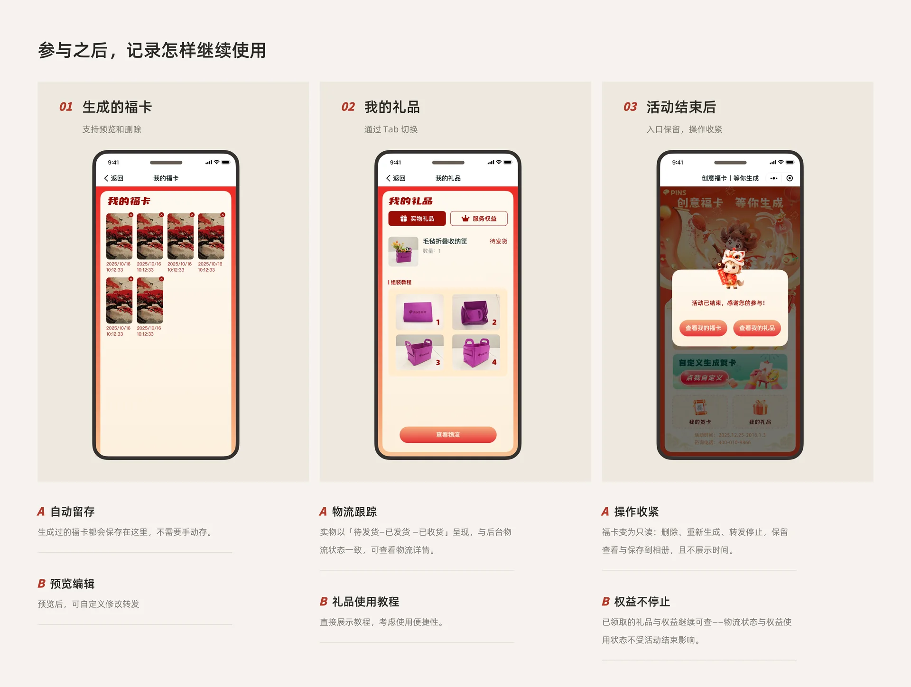

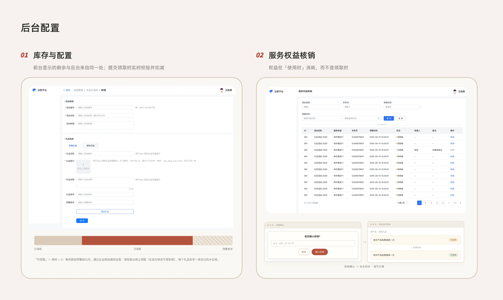

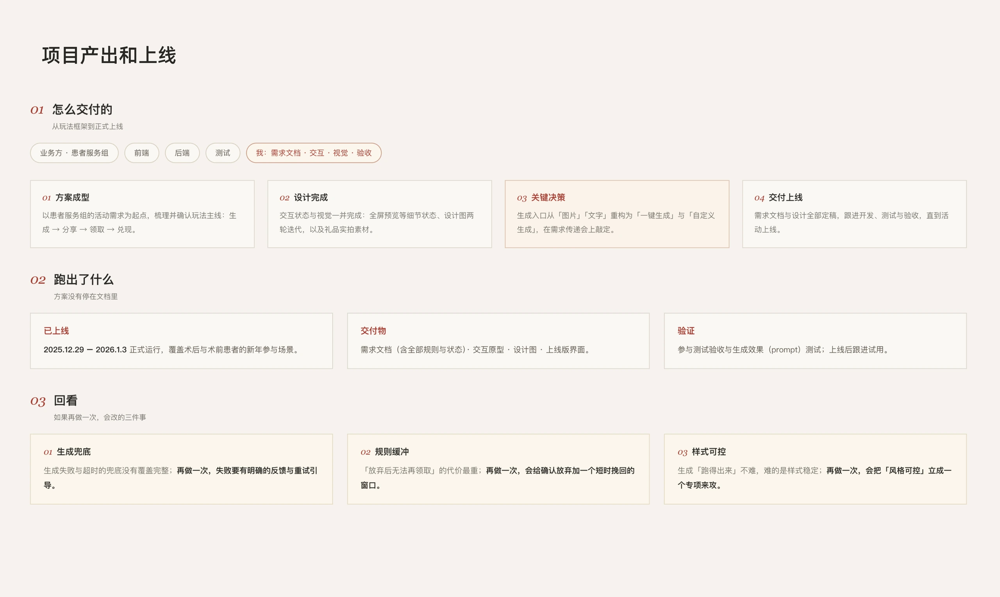

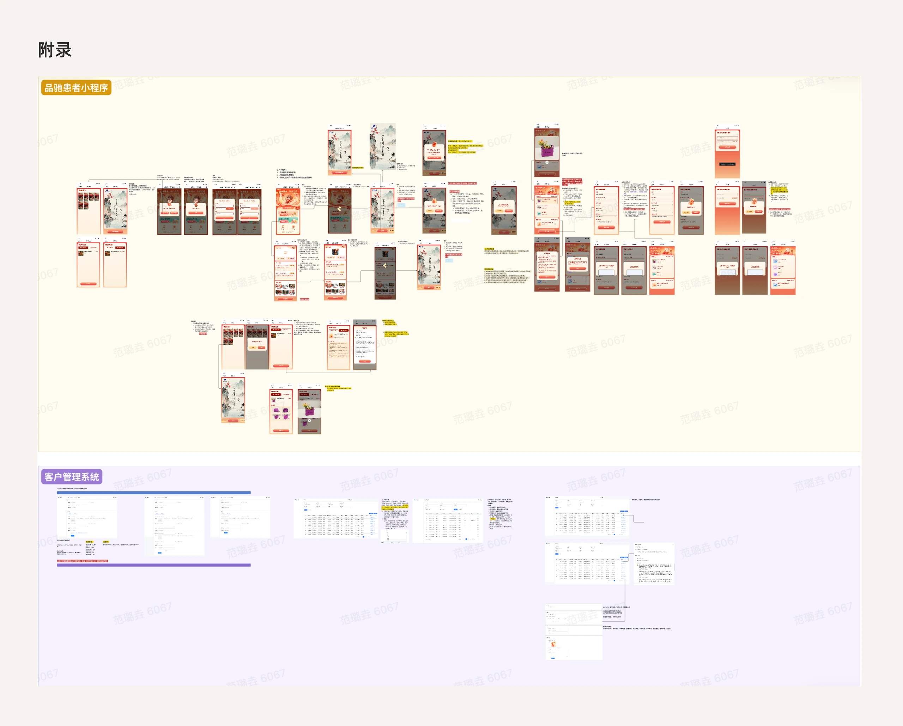
